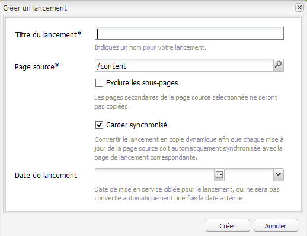
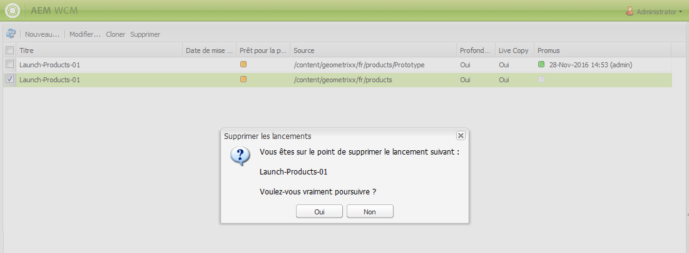

# Création de lancements{#creating-launches}

>[!CAUTION]
>
>AEM 6.4 a atteint la fin de la prise en charge étendue et cette documentation n’est plus mise à jour. Pour plus d’informations, voir notre [période de support technique](https://helpx.adobe.com/fr/support/programs/eol-matrix.html). Rechercher les versions prises en charge [here](https://experienceleague.adobe.com/docs/?lang=fr).

Créez un lancement pour permettre la mise à jour d’une nouvelle version des pages web existantes en vue d’une activation future. Lors de la création d’un lancement, vous devez spécifier un titre et la page source :

* Le titre apparaît dans le **sidekick**, où les auteurs peuvent y accéder en vue de les traiter.
* Les pages enfants de la page source sont incluses par défaut dans le lancement. Si vous le souhaitez, vous pouvez n’utiliser que la page source.
* Par défaut, [Live Copy](/help/sites-administering/msm.md) met automatiquement à jour les pages de lancement à mesure que les pages source changent. Vous pouvez spécifier qu’une copie statique soit créée afin d’empêcher les modifications automatiques.

Vous pouvez éventuellement indiquer la **date de lancement** (et l’heure) pour définir le moment auquel les pages de lancement doivent être promues et activées. Toutefois, la **date de lancement** fonctionne uniquement en conjonction avec l’indicateur **Prêt pour la production** (voir [Modification d’une configuration de lancement](/help/sites-classic-ui-authoring/classic-launches-editing.md#editing-a-launch-configuration)). Pour que les actions se produisent automatiquement, les deux doivent être définis.

## Création d’un lancement {#creating-a-launch}

La procédure suivante crée un lancement.

1. Ouvrez la page d’administration de site web ([http://localhost:4502/siteadmin](http://localhost:4502/siteadmin)).
1. Cliquez sur **Nouveau...** then **Nouveau lancement...**.
1. Dans le **Créer un lancement** spécifiez les valeurs des propriétés suivantes :

   * **Titre du lancement** : nom du lancement. Le nom doit avoir un sens pour les auteurs.
   * **Page source**: Chemin d’accès à la page pour laquelle créer le lancement. Par défaut, toutes les pages enfants sont incluses.
   * **Exclure les sous-pages**: Sélectionnez cette option pour créer le lancement uniquement pour la page source et non pour les pages enfants. Par défaut, cette option n’est pas sélectionnée.
   * **Garder synchronisé** : sélectionnez cette option pour mettre à jour automatiquement le contenu des pages de lancement lors de la modification des pages source. Pour ce faire, il suffit de lancer une [Live Copy](/help/sites-administering/msm.md).
   * **Date de lancement** : date et heure d’activation de la copie de lancement (selon l’indicateur **Prêt pour l’exploitation** ; consultez [Lancements – Ordre des événements](/help/sites-authoring/launches.md#launches-the-order-of-events)).

   

1. Cliquez sur **Créer**.

## Suppression d’un lancement {#deleting-a-launch}

Vous pouvez également supprimer un lancement. 

1. Sélectionnez le lancement souhaité dans la [console des lancements](/help/sites-classic-ui-authoring/classic-launches.md).
1. Cliquez sur **Supprimer**. Une confirmation est demandée : 

   

   >[!CAUTION]
   >
   >Lorsque vous supprimez des lancements imbriqués, vous devriez supprimer d’abord les niveaux inférieurs.
