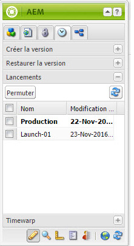
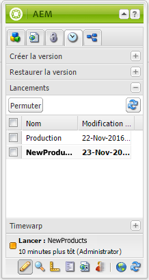

# Modification de lancements{#editing-launches}

>[!CAUTION]
>
>AEM 6.4 a atteint la fin de la prise en charge étendue et cette documentation n’est plus mise à jour. Pour plus d’informations, voir notre [période de support technique](https://helpx.adobe.com/fr/support/programs/eol-matrix.html). Rechercher les versions prises en charge [here](https://experienceleague.adobe.com/docs/?lang=fr).

## Modification de pages de lancement {#editing-launch-pages}

Après avoir créé un lancement pour une page (ou un jeu de pages), vous pouvez modifier le contenu dans la copie de lancement correspondante.

1. Ouvrez la page à modifier.
1. Dans le sidekick, sélectionnez la variable **Contrôle de version** puis développez l’onglet **Lancements** groupe. Le titre du lancement en cours de modification utilise une police en gras.

   

1. Sélectionnez le lancement sur lequel vous souhaitez travailler, puis cliquez sur **Basculer**.
1. Commencez la modification.

   >[!NOTE]
   >
   >Vous pouvez utiliser l’onglet **Page** du sidekick pour effectuer des actions telles que **Créer une page enfant**, entre autres. 

## Modification d’une configuration de lancement {#editing-a-launch-configuration}

Après avoir créé un lancement, vous pouvez en modifier le nom et la date. Vous pouvez également spécifier une image à associer au lancement.

1. Ouvrez la page d’administration des lancements ([http://localhost:4502/libs/launches/content/admin.html](http://localhost:4502/libs/launches/content/admin.html)).

1. Sélectionnez le lancement requis, puis cliquez sur **Modifier** pour ouvrir la boîte de dialogue :

   * Dans le **Général** vous pouvez modifier les éléments suivants :

      * **Titre**
      * **Date de mise en service** : équivaut à la date de lancement.
      * **Prêt pour l’exploitation**

      Voir [Lancements - Ordre des événements](/help/sites-authoring/launches.md#launches-the-order-of-events) pour plus d’informations sur l’objectif et l’interaction de ces champs.

   * Dans le **Image** vous pouvez télécharger un fichier image.

1. Cliquez sur **Enregistrer**.

## Identification du statut de lancement d’une page {#discovering-the-launch-status-of-a-page}

Lorsque vous modifiez le lancement d’une page, les informations sur le lancement s’affichent au bas de la **Contrôle de version** de Sidekick :

* Nom du lancement.
* Temps écoulé depuis la dernière modification.
* L’utilisateur qui a effectué la dernière modification.
* Le statut de l’indicateur **Prêt pour l’exploitation** (orange=non défini ; vert=défini).

