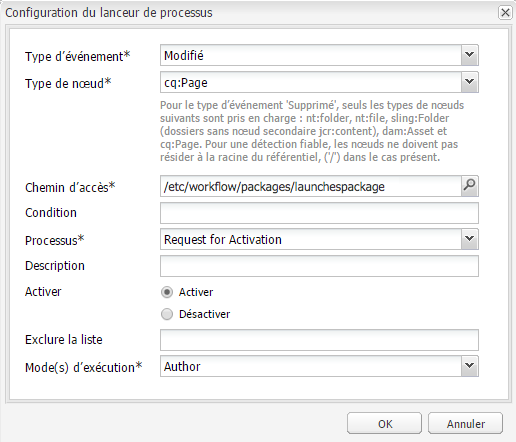

# Promotion de lancements{#promoting-launches}

>[!CAUTION]
>
>AEM 6.4 a atteint la fin de la prise en charge étendue et cette documentation n’est plus mise à jour. Pour plus d’informations, voir notre [période de support technique](https://helpx.adobe.com/fr/support/programs/eol-matrix.html). Rechercher les versions prises en charge [here](https://experienceleague.adobe.com/docs/?lang=fr).

Vous devez convertir des pages de lancement pour que le contenu soit à nouveau déplacé dans la source (production) avant de le publier. Lorsqu’une page de lancement est convertie, la page correspondante des pages sources est remplacée par la page convertie. Les options suivantes sont disponibles lors de la promotion d’une page de lancement :

* Indique s’il faut convertir uniquement la page active ou l’intégralité du lancement.
* Indique s’il faut convertir les pages enfants de la page active.
* Faut-il convertir l’intégralité du lancement ou uniquement des pages qui ont été modifiées ?

## Promotion de pages de lancement {#promoting-launch-pages}

Pour convertir des pages, procédez comme suit lors de la modification de la page de lancement à convertir :

1. Sur le **Page** dans le sidekick, cliquez sur **Convertir le lancement**.
1. Spécifiez les pages à convertir :

   * (Par défaut) Pour ne convertir que la page en cours, sélectionnez **Convertir les changements de page en version d’exploitation**.
   * Pour promouvoir également les pages enfants de la page active, sélectionnez **Inclure les sous-pages**.
   * Pour promouvoir toutes les pages du lancement, sélectionnez **Convertir Le Lancement Complet En Version De Production**.

1. Pour ajouter des pages de production à un module de workflow, sélectionnez **Ajouter au module de processus** puis sélectionnez le module de workflow.
1. Cliquez sur **Convertir**.

## Traitement de pages converties à l’aide du workflow AEM {#processing-promoted-pages-using-aem-workflow}

Utilisez des modèles de workflow pour effectuer le traitement en bloc des pages de lancements promues :

1. Créez un module de workflow.
1. Lorsque les auteurs convertissent des pages Launch, ils les stockent dans le module de workflow.
1. Démarrez un modèle de workflow en utilisant le module comme charge utile.

Pour démarrer automatiquement un workflow lors de la conversion de pages, [configuration d’un lanceur de workflow](/help/sites-administering/workflows-starting.md#workflows-launchers) pour le noeud de package.

Par exemple, vous pouvez générer automatiquement des demandes d’activation de page lorsque les auteurs convertissent des pages de lancement. Configurez un lanceur de workflow pour démarrer le workflow Demander l’activation lorsque le noeud de module est modifié.

