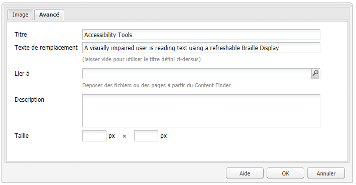
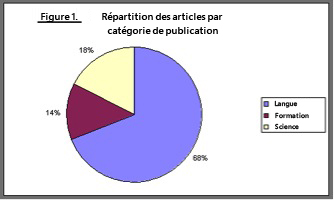
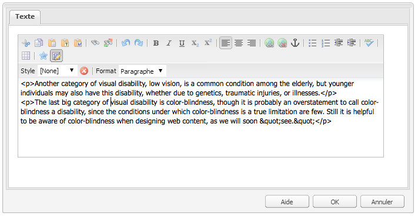
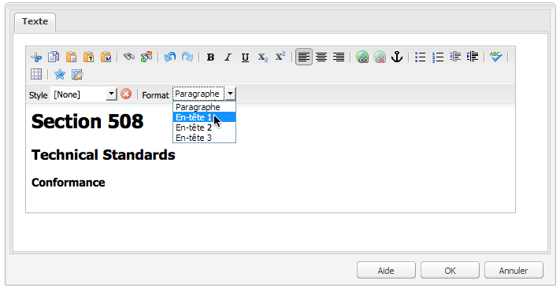
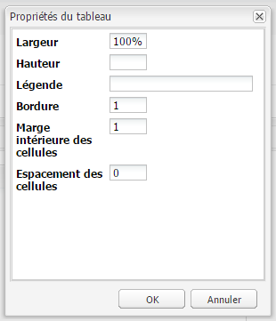
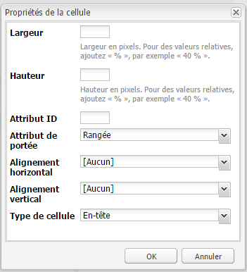
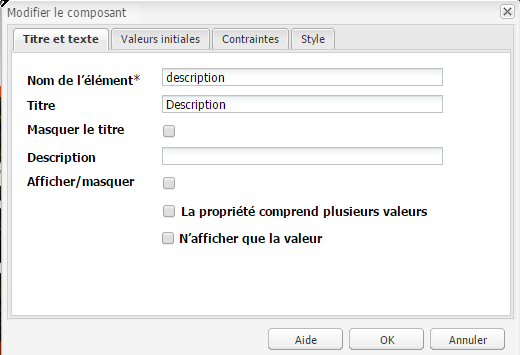
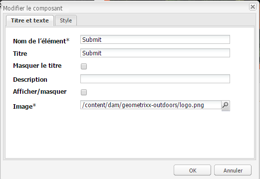
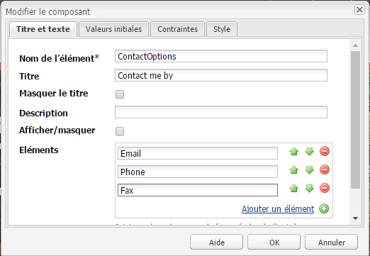
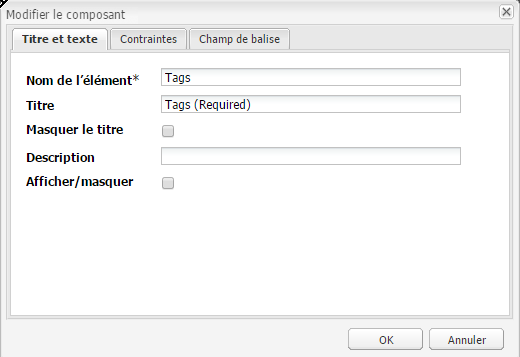

# Création d’un contenu accessible (conformité au WCAG 2.0){#creating-accessible-content-wcag-conformance}

>[!CAUTION]
>
>AEM 6.4 a atteint la fin de la prise en charge étendue et cette documentation n’est plus mise à jour. Pour plus d’informations, voir notre [période de support technique](https://helpx.adobe.com/fr/support/programs/eol-matrix.html). Rechercher les versions prises en charge [here](https://experienceleague.adobe.com/docs/?lang=fr).

Le WCAG 2.0 regroupe un ensemble de consignes et de critères de réussite qui ne sont pas associés à une technologie particulière et visant à rendre les contenus web plus accessibles aux personnes en situation de handicap.

>[!NOTE]
>
>Voir également :
>
>* our [Guide rapide relatif à WCAG 2.0](/help/managing/qg-wcag.md) pour plus de détails
>* [Configuration de l’éditeur de texte enrichi pour produire du contenu accessible](/help/sites-administering/rte-accessible-content.md)
>


Les contenus sont classés selon trois niveaux de conformité : niveau A (le plus bas), niveau AA et niveau AAA (le plus élevé). Brièvement, les niveaux se définissent comme suit :

* **Niveau A :** votre site atteint un niveau minimum d’accessibilité. Pour atteindre ce niveau, tous les critères de réussite de niveau A sont satisfaits.
* **Niveau AA :** il s’agit d’un idéal d’accessibilité à atteindre : votre site est accessible par la plupart des personnes dans la plupart des situations à l’aide de la plupart des technologies. Pour atteindre ce niveau, tous les critères de réussite des niveaux A et AA doivent être satisfaits.
* **Niveau AAA :** votre site atteint un très haut niveau d’accessibilité. Pour atteindre ce niveau, tous les critères de réussite des niveaux A, AA et AAA sont satisfaits.

Lors de la création de votre site, vous devez déterminer à quel niveau général il doit se conformer.

La section suivante présente les [règles du WCAG 2.0](https://www.w3.org/TR/WCAG20/#guidelines) ainsi que les critères de réussite associés aux [niveaux de conformité](https://www.w3.org/TR/UNDERSTANDING-WCAG20/conformance.html) A et AA.

>[!NOTE]
>
>Comme il n’est pas possible de satisfaire tous les critères de réussite de niveau AAA pour certains types de contenu, il n’est pas recommandé que ce niveau de conformité soit requis comme politique générale.

>[!NOTE]
>
>Dans ce document, nous utilisons :
>
>* les noms courts des [règles WCAG 2.0](https://www.w3.org/TR/WCAG20/#guidelines) ;
>* la numérotation utilisée dans les [règles WCAG 2.0](https://www.w3.org/TR/WCAG20/#guidelines) afin de simplifier les références croisées avec le site web WCAG.
>


## Principe 1 : perceptible  {#principle-perceivable}

[Principe 1 : perceptible – Les informations et les composants de l’interface utilisateur doivent être présentés aux utilisateurs sous des formes qu’ils peuvent percevoir.](https://www.w3.org/TR/WCAG20/#perceivable)

### Équivalents textuels (1.1) {#text-alternatives}

[Règle 1.1 – Les équivalents textuels : proposer des équivalents textuels à tout contenu non textuel qui pourra alors être présenté sous d’autres formes selon les besoins de l’utilisateur : grands caractères, braille, synthèse vocale, symboles ou langage simplifié.](https://www.w3.org/TR/WCAG20/#text-equiv)

### Contenu non textuel (1.1.1) {#non-text-content}

* Critère de réussite 1.1.1
* Niveau A
* Contenu non textuel : tout contenu non textuel présenté à l’utilisateur possède un texte secondaire qui remplit une fonction équivalente sauf dans les situations énumérées ci-dessous.

#### Objectif – Contenu non textuel (1.1.1) {#purpose-non-text-content}

Les informations d’une page web peuvent être fournies dans différents formats non textuels, tels que des images, des vidéos, des animations, des graphiques et des graphiques. Les personnes aveugles ou ayant de graves déficiences visuelles ne peuvent pas voir le contenu non textuel, mais elles peuvent accéder au contenu textuel en le faisant lire par un lecteur d’écran ou en le présentant sous forme tactile par un dispositif d’affichage en braille. Ainsi, en proposant des équivalents textuels au contenu au format graphique, les personnes qui ne peuvent pas voir le contenu graphique peuvent accéder à une version équivalente de l’information fournie par le contenu.

Un autre avantage utile est que les équivalents textuels permettent l’indexation du contenu non textuel par la technologie des moteurs de recherche.

#### Comment procéder – Contenu non textuel (1.1.1) {#how-to-meet-non-text-content}

Pour les images statiques, la règle de base consiste à fournir un équivalent textuel, appelé texte secondaire. Vous pouvez pour ce faire utiliser le champ **Texte secondaire** :

>[!NOTE]
>
>Certains composants prêts à l’emploi, tels que **Carrousel** et **Diaporama**, ne permettent pas d’ajouter des descriptions d’images sous forme de texte de remplacement. Lors de l’implémentation de ces versions pour votre instance AEM, votre équipe de développement devra configurer ces composants pour prendre en charge l’attribut `alt` afin que les auteurs puissent l’ajouter au contenu (consultez [Ajout de la prise en charge d’éléments et d’attributs HTML supplémentaires](/help/sites-administering/rte-accessible-content.md#adding-support-for-additional-html-elements-and-attributes)).

Le champ **Texte de remplacement** est disponible dans l’onglet des **Propriétés d’image avancées** de la boîte de dialogue du composant **Image** :



Par défaut, AEM ajoute un **texte de remplacement** à vos images. Dans l’interface utilisateur classique, il existe deux scénarios de création de l’attribut par défaut (bien que la valeur par défaut puisse ne pas être suffisante comme équivalent et devra être modifiée dans l’onglet des **Propriétés d’image avancées**) :

* File :

   une image est téléchargée à partir du disque dur de l’utilisateur. Si vous ajoutez un composant d’image à une page, puis choisissez une image sur votre disque dur ou une autre source, la valeur par défaut pour le **Texte de remplacement** est `file`. Cette valeur doit être modifiée dans l’onglet des **Propriétés d’image avancées**. Cette valeur n’est pas affichée dans le champ **Texte de remplacement** mais lorsque la valeur est modifiée, la nouvelle valeur s’affiche dans le champ.

* Asset :

   une image est ajoutée à partir du référentiel de ressources numériques. Si vous faites glisser une image du référentiel des ressources numériques vers une page web, les valeurs **Titre** et **Texte de remplacement** pour cette image sont récupérées dans ses métadonnées.

>[!NOTE]
>
>Dans les deux scénarios ci-dessus, la valeur **Texte de remplacement** par défaut n’est pas visible dans l’onglet des **Propriétés d’image avancées**. Pour modifier la valeur par défaut, il vous suffit d’entrer une nouvelle valeur dans le champ **Texte de remplacement**.

>[!NOTE]
>
>Si votre image est purement décorative (consultez [Création d’un texte secondaire adapté](#creating-good-text-alternatives)), vous pouvez saisir un espace dans le champ **Texte de remplacement** à l’aide de la barre d’espace. Vous créez ainsi un attribut `alt` vide qui invite les lecteurs d’écran à ignorer l’image.

#### Création d’un texte secondaire adapté {#creating-good-text-alternatives}

Il existe diverses formes de contenu non textuel. Par conséquent, la valeur du texte secondaire dépend du rôle du graphique dans la page web. Voici quelques-unes des règles de base à respecter :

* Les textes secondaires doivent être succincts, tout en communiquant clairement l’information essentielle du contenu non textuel.
* Il est préférable d’éviter les descriptions trop longues (plus de 100 caractères). Si un texte secondaire doit être plus détaillé :

   * donnez une brève description dans le texte secondaire ;
   * proposez une description plus longue dans le texte ailleurs sur la même page ou dans une page web distincte. Renvoyez vers cette description individuelle en transformant l’image en lien ou en plaçant un lien textuel près de l’image.

* Le texte secondaire ne doit pas répliquer le contenu fourni sous forme de texte à proximité sur la même page. N’oubliez pas que nombre d’images sont des illustrations de points déjà traités dans le texte d’une page ; il existe peut-être déjà un texte secondaire.
* Si le contenu non textuel est un lien vers une autre page ou un autre document et qu’il n’existe pas de texte faisant partie dudit lien, le texte secondaire de l’image doit indiquer la destination du lien, et non décrire l’image.
* Si le contenu non textuel est contenu dans un bouton et qu’il n’existe pas de texte faisant partie dudit bouton, le texte secondaire de l’image doit indiquer la fonction du bouton, et non décrire l’image.
* Il est tout à fait acceptable de spécifier un texte secondaire vide (nul) pour une image, à condition toutefois que l’image n’ait pas besoin de texte secondaire (s’il s’agit par exemple d’une image purement décorative) ou si le texte secondaire figure déjà dans le texte de la page.

L’ébauche du document [W3C: HTML5 Techniques for providing useful text alternatives](https://dev.w3.org/html5/alt-techniques/) (techniques pour spécifier des équivalents textuels utiles ; en anglais) répertorie des détails et des exemples de textes secondaires appropriés pour différents types d’images.

Voici quelques-uns des types spécifiques de contenu non textuel auquel un texte secondaire doit être associé :

* Photos d’illustration :

   des images de personnes, d’objets ou de lieux. Pensez au rôle de la photo sur la page ; un texte approprié sera probablement *Photo de l’[objet]*, mais cela peut dépendre du texte environnant.

* Icônes :

   il s’agit de petits pictogrammes (objets graphiques) avec des informations spécifiques. Ils doivent être utilisés de manière cohérente sur une page et un site. Toutes les instances de l’icône sur une page ou un site doivent avoir le même équivalent textuel court et succinct, sauf si cela entraîne une duplication inutile du texte adjacent.

* Tableaux et graphiques :

   ces éléments présentent généralement des données numériques. Il est également possible de fournir un texte alternatif en fournissant un bref résumé des principales tendances affichées dans le diagramme ou le graphique. Si nécessaire, fournissez également une description plus détaillée dans le texte à l’aide du champ **Description** dans l’onglet **Propriétés d’image avancées**. En outre, vous pouvez fournir les données source sous forme tabulaire ailleurs dans la page ou le site.

   

   Pour spécifier un équivalent textuel pour cet exemple de graphique, ajoutez un texte `alt` concis à l’image, puis un équivalent textuel complet juste après l’image.

   ```xml
   <p></p>
   <p> Figure 1. Distribution of Articles by Journal Category.
   Pie chart: Language=68%, Education=14% and Science=18%.</p>
   ```

   >[!NOTE]
   >
   >Le fragment de code ci-dessus n’est utilisé qu’à titre d’exemple pour la commande. Il est recommandé d’utiliser le composant **Image** (plutôt que la référence `img src` utilisée ci-dessus).

   Dans AEM, ce résultat peut être obtenu à l’aide d’une combinaison des champs **Texte de remplacement** et **Description** de la boîte de dialogue de configuration de l’image, comme dans [Compatibilité - Contenu non textuel (1.1.1)](#how-to-meet-non-text-content).

* Cartes, diagrammes, organigrammes :

   pour les diagrammes fournissant des données spatiales (par exemple, pour prendre en charge la description des relations entre des objets ou un processus), assurez-vous que le message clé est fourni au format texte. Dans le cas des cartes, il est probable que l’utilisation d’un texte de remplacement intégral ne soit pas pratique. Toutefois, si la carte est fournie pour aider les gens à trouver leur chemin vers un emplacement donné, le texte de remplacement de l’image de carte peut indiquer brièvement *Carte de X*, puis donner des indications vers cet emplacement dans le texte à un autre endroit, dans la page ou dans le champ **Description** de l’onglet **Avancé** du composant **Image**.

* CAPTCHAs :

   un CAPTCHA signifie *Completely Automated Public Turing test to tell Computers and Humans Apart* (Test de Turing public complètement automatisé pour faire la différence entre les ordinateurs et les humains). Il s’agit d’un contrôle de sécurité utilisé sur les pages web pour distinguer les humains des logiciels malveillants, mais qui peut causer des problèmes en matière d’accessibilité. Il s’agit d’images qui demandent aux utilisateurs de décrire ce qu’ils voient pour réussir un test de sécurité. Il n’est évidemment pas possible de fournir un texte de remplacement à l’image. Vous devrez donc envisager d’autres solutions non graphiques.

   Le W3C propose un certain nombre de suggestions, telles que les suivantes. Chacune de ces approches présente ses avantages et ses inconvénients.

   * Puzzles logiques
   * Utilisation de la sortie son au lieu des images
   * Comptes d’utilisateur limités et filtres de courrier indésirable

* Images d’arrière-plan :

   Pour ce faire, utilisez des feuilles de style en cascade (CSS) plutôt qu’en HTML. Cela signifie qu’il n’est pas possible de spécifier un texte de remplacement. Par conséquent, les images d’arrière-plan ne doivent pas fournir d’informations textuelles importantes. Si elles le font, ces informations doivent également être fournies dans le texte de la page.

   Cependant, il est important qu’un arrière-plan alternatif s’affiche lorsque l’image ne peut pas être affichée.

   >[!NOTE]
   >
   >Le niveau de contraste entre l’arrière-plan et le texte au premier plan doit être suffisant. Cela est décrit de manière plus détaillée à la section [Contraste (minimum) (1.4.3)](#contrast-minimum).

#### En savoir plus – Contenu non textuel (1.1.1) {#more-information-non-text-content}

* [Compréhension du critère de réussite 1.1.1](https://www.w3.org/TR/UNDERSTANDING-WCAG20/text-equiv-all.html)
* [Comment remplir le critère de réussite 1.1.1](https://www.w3.org/WAI/WCAG20/quickref/#text-equiv)
* [W3C: HTML5 Techniques for providing useful text alternatives (techniques pour spécifier des équivalents textuels utiles ; ébauche, en anglais)](https://dev.w3.org/html5/alt-techniques/)
* [Explication des CAPTCHA et alternatives par le W3C](https://www.w3.org/TR/turingtest/)

### Média temporel (1.2) {#time-based-media}

[Règle 1.2 – Média temporel : propose des versions de remplacement aux médias temporels.](https://www.w3.org/TR/WCAG20/#text-equiv)

Il s’agit du contenu web qui est *en fonction du temps*. Cela concerne le contenu que l’utilisateur peut lire (contenu vidéo, audio et animé, par exemple) et qui peut être pré-enregistré ou en direct.

### Contenu seulement audio ou vidéo (pré-enregistré) (1.2.1)  {#audio-only-and-video-only-pre-recorded}

* Critère de réussite 1.2.1
* Niveau A
* Contenu seulement audio ou vidéo (pré-enregistré) : Pour les médias pré-enregistrés audio uniquement et pré-enregistrés vidéo uniquement, les faits suivants sont vrais, sauf lorsque l’audio ou la vidéo est un média de remplacement pour le texte et est clairement étiqueté comme tel :

   * Contenu audio pré-enregistré uniquement : Une alternative pour les médias temporels est fournie, qui présente des informations équivalentes pour le contenu audio pré-enregistré uniquement.
   * Vidéo pré-enregistrée uniquement : Une alternative pour les médias temporels ou une piste audio est fournie qui présente des informations équivalentes pour le contenu vidéo pré-enregistré uniquement.

#### Objectif – Contenu seulement audio ou vidéo (pré-enregistré) (1.2.1)  {#purpose-audio-only-and-video-only-pre-recorded}

Les problèmes d’accessibilité pour la vidéo et l’audio peuvent être rencontrés par :

* Les personnes malvoyantes lorsqu’il n’y a pas de bande sonore, ou que la bande sonore n’est pas suffisante pour les informer de ce qui se passe dans la vidéo ou l’animation ;
* les personnes malentendantes ou sourdes, qui ne peuvent pas entendre la bande sonore ;
* Les personnes qui peuvent entendre la bande sonore, mais ne comprennent pas ce qui est parlé (par exemple, parce qu&#39;elle est dans une langue qu&#39;elles ne comprennent pas).

Les utilisateurs de navigateurs ou d’appareils qui ne prennent pas en charge la lecture de contenu dans des formats multimédias spécifiques, tels que le Flash des Adobes, peuvent également ne pas avoir accès aux vidéos ou au contenu audio.

Fournir ces informations dans un format différent, tel que du texte (ou de l’audio pour une vidéo sans audio), peut les rendre accessibles aux personnes qui ne peuvent pas accéder au contenu d’origine.

#### Comment procéder – Contenu seulement audio ou vidéo (pré-enregistré) (1.2.1)  {#how-to-meet-audio-only-and-video-only-pre-recorded}

* Si le contenu est un contenu audio pré-enregistré sans vidéo (podcast par exemple) :

   * fournissez un lien juste avant ou après le contenu vers une transcription textuelle du contenu audio ;

      La transcription doit être une page HTML avec un équivalent textuel de tout le contenu non parlé important et parlé, et indiquer en outre qui parle, avec les expressions vocales et une description du décor et de tout autre contenu audio significatif.

* Si le contenu est une animation ou une vidéo pré-enregistrée sans audio :

   * Fournissez un lien juste avant ou après le contenu vers une description textuelle équivalente des informations fournies par la vidéo.
   * Ou une audio-description équivalente dans un format audio couramment utilisé, tel que MP3.

>[!NOTE]
>
>Si le contenu audio ou vidéo est fourni comme alternative au contenu existant déjà dans un autre format sur une page web, il n’est pas nécessaire de respecter les exigences ci-dessus. Par exemple, si une vidéo illustre une liste d’instructions textuelles, cette vidéo ne nécessite pas d’alternative, car les instructions textuelles agissent déjà comme une alternative à la vidéo.

L’insertion de contenu multimédia, en particulier de contenu de Flash, dans vos pages web AEM est similaire à l’insertion d’une image. Cependant, le contenu multimédia étant plus complexe qu’une image fixe, de nombreux paramètres et options sont nécessaires pour contrôler sa lecture.

>[!NOTE]
>
>Si vous utilisez un contenu multimédia informatif, vous devez également créer des liens vers les équivalents. Par exemple, pour inclure une transcription textuelle, créez une page HTML où afficher la transcription, puis ajoutez un lien en regard ou en dessous du contenu audio.

#### En savoir plus – Contenu seulement audio ou vidéo (pré-enregistré) (1.2.1) {#more-information-audio-only-and-video-only-pre-recorded}

* [Compréhension du critère de réussite 1.2.1](https://www.w3.org/TR/UNDERSTANDING-WCAG20/media-equiv-av-only-alt.html)
* [Comment remplir le critère de réussite 1.2.1](https://www.w3.org/WAI/WCAG20/quickref/#media-equiv)

### Sous-titres (pré-enregistrés) (1.2.2)  {#captions-pre-recorded}

* Critère de réussite 1.2.2
* Niveau A
* Sous-titres (pré-enregistrés) : fournir des sous-titres pour tout contenu audio pré-enregistré dans un média synchronisé, excepté lorsque le média est un média de remplacement pour un texte et qu’il est clairement identifié comme tel.

#### Objectif – Sous-titres (pré-enregistrés) (1.2.2)  {#purpose-captions-pre-recorded}

Les personnes sourdes ou malentendantes ne pourront pas accéder au contenu audio ou auront de grandes difficultés à y accéder. Les sous-titres sont des équivalents textuels pour un son parlé ou non, qui s’affiche à l’écran au moment approprié pendant la vidéo. Ils permettent aux gens qui ne peuvent pas entendre le son de comprendre ce qui se passe.

>[!NOTE]
>
>Les sous-titres ne sont pas requis lorsque du texte ou des équivalents non textuels appropriés (qui fournissent des informations directement équivalentes) sont disponibles sur la même page que la vidéo ou l’animation.

#### Comment procéder – Sous-titres (pré-enregistrés) (1.2.2)  {#how-to-meet-captions-pre-recorded}

Les sous-titres peuvent être :

* intégrés : toujours visibles pendant la lecture de la vidéo ;)
* non intégrés : activés ou désactivés par l’utilisateur.

Ajoutez des sous-titres non intégrés chaque fois que cela est possible, car les utilisateurs peuvent ainsi décider s’ils souhaitent les afficher.

Pour les sous-titres non intégrés, vous devez créer et fournir un fichier de sous-titrage synchronisé dans un format approprié ([SMIL](https://www.w3.org/AudioVideo/) par exemple) avec le fichier vidéo (la procédure à suivre pour ce faire ne fait pas l’objet de ce guide, mais vous trouverez des liens vers des didacticiels sous [En savoir plus – Sous-titres (pré-enregistrés) (1.2.2)](#more-information-captions-pre-recorded)). Pensez à inclure une note avisant les utilisateurs que des sous-titres sont disponibles pour la vidéo.

Si vous devez utiliser des sous-titres intégrés, incorporez le texte à la piste vidéo. Pour ce faire, utilisez des applications de montage vidéo qui permettent de superposer du texte sur la vidéo.

#### En savoir plus – Sous-titres (pré-enregistrés) (1.2.2)  {#more-information-captions-pre-recorded}

* [Compréhension du critère de réussite 1.2.2](https://www.w3.org/TR/UNDERSTANDING-WCAG20/media-equiv-captions.html) :
* [Comment remplir le critère de réussite 1.2.2](https://www.w3.org/WAI/WCAG20/quickref/#media-equiv)
* [W3C: Synchronized Multimedia (Multimédia synchronisé ; en anglais)](https://www.w3.org/AudioVideo/)
* [Captions, Transcripts, and Audio Descriptions (Sous-titres, transcriptions et descriptions audio), par WebAIM (en anglais)](https://webaim.org/techniques/captions/)

### Audio-description ou version de remplacement pour un média temporel (pré-enregistré) (1.2.3)  {#audio-description-or-media-alternative-pre-recorded}

* Critère de réussite 1.2.3
* Niveau A
* Audio-description ou version de remplacement pour un média temporel (pré-enregistré) : Une alternative pour un média temporel ou une audio-description du contenu vidéo pré-enregistré est fournie pour un média synchronisé, sauf lorsque le média est un média de remplacement pour un texte et qu’il est clairement étiqueté comme tel.

#### Objectif – Audio-description ou version de remplacement pour un média temporel (pré-enregistré) (1.2.3)  {#purpose-audio-description-or-media-alternative-pre-recorded}

Les personnes aveugles ou malvoyantes ne pourront pas accéder au contenu si les informations dans une vidéo ou une animation sont fournies sous forme visuelle seulement ou si la piste audio ne fournit pas suffisamment d’informations pour comprendre ce qui se passe visuellement.

#### Comment procéder – Audio-description ou version de remplacement pour un média temporel (pré-enregistré) (1.2.3)  {#how-to-meet-audio-description-or-media-alternative-pre-recorded}

Deux méthodes peuvent être adoptées pour remplir ce critère de réussite. N’importe lequel est acceptable :

1. Incluez une audio-description supplémentaire pour le contenu vidéo. Cela peut se faire de trois façons :

   * Pendant les pauses dans la boîte de dialogue existante, fournissez des informations sur les modifications de la scène qui ne sont pas présentées dans le cadre de la piste audio existante ;
   * Fournissez une nouvelle piste audio supplémentaire et facultative contenant la piste audio originale, mais aussi des informations audio supplémentaires sur les modifications dans la scène.

      * Les utilisateurs peuvent ainsi permuter entre la piste audio existante (qui ne contient *pas* de description audio) et la nouvelle piste audio (qui *comprend* une description audio).
      * Cela évite toute perturbation des utilisateurs qui n’ont pas besoin de la description supplémentaire.
   * Créez une deuxième version du contenu vidéo pour permettre des descriptions audio étendues. Cela permet de réduire les difficultés liées à la fourniture de descriptions audio détaillées dans les espaces entre les dialogues existants, en mettant temporairement le contenu audio et vidéo en pause aux moments appropriés. Par conséquent, une audio-description beaucoup plus longue peut être fournie avant que l’action ne recommence. Comme dans l’exemple précédent, il est préférable de le fournir en tant que piste audio supplémentaire en option afin d’éviter toute perturbation des utilisateurs qui n’ont pas besoin de la description supplémentaire.


1. Fournissez une transcription textuelle formant un équivalent textuel adapté des éléments audio et visuels de la vidéo ou de l’animation. Cela devrait inclure, le cas échéant, une indication sur qui parle, une description du décor, des expressions vocales. Selon sa durée, vous pouvez placer la transcription sur la même page que la vidéo ou l’animation, ou sur une autre page ; dans le deuxième cas, fournissez un lien vers la transcription à proximité de la vidéo ou de l’animation.

Les détails exacts de la création de vidéos avec description audio ne sont pas compris dans ce guide. La création de descriptions vidéo et audio peut prendre du temps, mais d’autres produits Adobe peuvent vous aider à accomplir ces tâches. Si vous créez du contenu dans Adobe Flash Professional, vous devez également créer un script pour inviter l’utilisateur à télécharger le plug-in approprié et fournir un texte secondaire via l’élément `<noscript>`.

#### En savoir plus – Audio-description ou version de remplacement pour un média temporel (pré-enregistré) (1.2.3) {#more-information-audio-description-or-media-alternative-pre-recorded}

* [Compréhension du critère de réussite 1.2.3](https://www.w3.org/TR/UNDERSTANDING-WCAG20/media-equiv-audio-desc.html) :
* [Comment remplir le critère de réussite 1.2.3](https://www.w3.org/WAI/WCAG20/quickref/#qr-media-equiv-audio-desc)
* [Adobe Encore CS5](https://www.adobe.com/fr/products/premiere/encore/)

### Sous-titres (en direct) (1.2.4)    {#captions-live}

* Critère de réussite 1.2.4
* Niveau AA
* Sous-titres (en direct) : fournir des sous-titres pour tout contenu audio en direct, sous forme de média synchronisé.

#### Objectif – Sous-titres (en direct) (1.2.4) {#purpose-captions-live}

Ce critère de réussite est identique aux [Sous-titres (pré-enregistrés)](#captions-pre-recorded), du fait qu’il résout les obstacles à l’accessibilité pour les personnes sourdes ou malentendantes ; toutefois, ce critère de réussite traite des présentations en direct du type webcasts.

#### Comment procéder – Sous-titres (en direct) (1.2.4) {#how-to-meet-captions-live}

Suivez les instructions de la section [Sous-titres (pré-enregistrés)](#captions-pre-recorded) ci-dessus. Toutefois, en raison de la nature du média (direct), les sous-titres doivent être créés aussi rapidement que possible, en fonction de ce qui se passe dans la vidéo. Par conséquent, envisagez d’utiliser des outils de sous-titrage en temps réel ou de transcription voix-texte.

Ce document ne vise pas à fournir des instructions détaillées à ce sujet, mais vous trouverez des renseignements utiles en suivant les liens ci-après :

* [WebAIM : Real Time Captioning (sous-titrage en temps réel ; en anglais)](https://www.webaim.org/techniques/captions/realtime.php)
* [AccessIT (University of Washington) : Est-il possible de générer des sous-titres automatiquement à l’aide de la reconnaissance vocale ?](https://www.washington.edu/accessit/articles?1209)

#### En savoir plus – Sous-titres (en direct) (1.2.4)  {#more-information-captions-live}

* [Compréhension du critère de réussite 1.2.4](https://www.w3.org/TR/UNDERSTANDING-WCAG20/media-equiv-real-time-captions.html)
* [Comment remplir le critère de réussite 1.2.4](https://www.w3.org/WAI/WCAG20/quickref/#qr-media-equiv-real-time-captions)

### Audio-description (pré-enregistrée) (1.2.5)    {#audio-description-pre-recorded}

* Critère de réussite 1.2.5
* Niveau AA
* Audio-description (pré-enregistrée) : Une description audio est fournie pour tout le contenu vidéo pré-enregistré dans les médias synchronisés.

#### Objectif – Audio-description (pré-enregistrée) (1.2.5)  {#purpose-audio-description-pre-recorded}

Ce critère de réussite est identique au critère [Audio-description ou version de remplacement pour un média temporel (pré-enregistré)](#audio-description-or-media-alternative-pre-recorded), excepté que les auteurs doivent fournir une audio-description beaucoup plus détaillée, conforme au niveau AA.

#### Comment procéder – Audio-description (pré-enregistrée) (1.2.5)  {#how-to-meet-audio-description-pre-recorded}

Suivez les instructions de la section [Audio-description ou version de remplacement pour un média temporel (pré-enregistré)](#audio-description-or-media-alternative-pre-recorded).

#### En savoir plus – Audio-description (pré-enregistrée) (1.2.5)  {#more-information-audio-description-pre-recorded}

* [Compréhension du critère de réussite 1.2.5](https://www.w3.org/TR/UNDERSTANDING-WCAG20/media-equiv-audio-desc-only.html)
* [Comment remplir le critère de réussite 1.2.5](https://www.w3.org/WAI/WCAG20/quickref/#qr-media-equiv-audio-desc-only)

### Adaptable (1.3) {#adaptable}

[Règle 1.3 - Adaptable : Créez un contenu qui peut être présenté de différentes manières (par exemple de manière plus simple) sans perdre d’informations ni de structure.](https://www.w3.org/TR/WCAG20/#content-structure-separation)

Cette ligne directrice couvre les exigences nécessaires pour soutenir les personnes qui :

* peuvent ne pas être en mesure d’accéder aux informations présentées par un auteur dans une mise en page web colorée, à plusieurs colonnes et bidimensionnelle standard ;

* utilisent peut-être un contenu audio uniquement ou un affichage visuel de remplacement, par exemple un contraste élevé ou une grande taille de texte.

### Informations et relations (1.3.1)    {#info-and-relationships}

* Critère de réussite 1.3.1
* Niveau A
* Informations et relations : Les informations, la structure et les relations véhiculées par la présentation peuvent être déterminées par programmation ou sont disponibles dans le texte.

#### Objectif – Informations et relations (1.3.1) {#purpose-info-and-relationships}

De nombreuses technologies d’assistance utilisées par les personnes en situation de handicap reposent sur des informations structurelles pour afficher ou générer efficacement du contenu. Ces informations structurelles peuvent se présenter sous forme de titres de page, de titres de lignes et de colonnes de tableau et de types de liste. Par exemple, un utilisateur peut recourir à un lecteur d’écran pour parcourir une page d’un titre à un autre. Cependant, si le contenu d’une page semble s’appuyer exclusivement sur une structure de style visuel plutôt que sur le code HTML sous-jacent, aucune information structurelle n’est disponible pour les technologies d’assistance, ce qui limite leur capacité à faciliter la navigation.

Ce critère de réussite vise à s’assurer que ces informations structurelles sont fournies par HTML, de sorte que les navigateurs et les technologies d’assistance puissent accéder à ces informations et les exploiter.

#### Comment procéder – Informations et relations (1.3.1)  {#how-to-meet-info-and-relationships}

AEM facilite la construction de pages web à l’aide des éléments de HTML appropriés. Ouvrez le contenu de votre page dans l’éditeur de texte enrichi (un composant Texte) et utilisez la variable **Format** pour spécifier l’élément structurel approprié (paragraphe, en-tête, etc.).

L’image suivante présente du texte stylisé en tant que texte de paragraphe. l’affichage du code source utilisé indique qu’il a ouvert et fermé correctement. &lt;p> et &lt;/p> balises.



Veillez à ce que vos pages web aient la structure appropriée comme suit :

* **Utilisation de titres :**   

   Tant que les fonctions d’accessibilité de l’éditeur de texte enrichi sont activées (consultez [AEM et accessibilité](/help/sites-administering/rte-accessible-content.md)), AEM propose trois niveaux de titre de page. Utilisez-les pour identifier les sections et les sous-sections du contenu. Titre 1 est le niveau de titre le plus élevé, Titre 3 le plus bas. L’administrateur système peut configurer le système afin de permettre l’utilisation d’autres niveaux de titre.

   L’image suivante illustre un exemple des différents types de titres.

   

* **Texte mis en évidence** :

   Mettez le texte en évidence à l’aide des éléments &lt;strong> ou &lt;em>. N’utilisez pas de titres au sein des paragraphes.

   * Surlignez le texte à mettre en évidence.
   * Cliquez sur l’icône **B** (pour &lt;strong>) ou **I** (pour &lt;em>) du panneau **Propriétés** (HTML doit être sélectionné).

   >[!NOTE]
   >
   >Dans une installation AEM standard, l’éditeur de texte enrichi est configuré pour utiliser :
   >
   >* &lt;b> pour &lt;strong>
   * &lt;i> pour &lt;em>

   Ils sont effectivement identiques, mais et sont préférables, car il s’agit de code HTML sémantiquement correct. Votre équipe de développement peut configurer l’éditeur de texte enrichi pour qu’il utilise et (au lieu de et ) lors du développement de votre instance de projet.

* **Utiliser les listes** : vous pouvez spécifier trois différents types de listes en HTML :

   * L’élément `<ul>` est utilisé pour les listes *non triées* (à puces). Les éléments de liste individuels sont identifiés à l’aide de l’élément `<li>`. 

      Dans l’éditeur de texte enrichi, cliquez sur l’icône **Liste à puces**.

   * L’élément `<ol>` est utilisé pour les listes *numérotées*. Les éléments de liste individuels sont identifiés à l’aide de l’élément `<li>`.

      Dans l’éditeur de texte enrichi, cliquez sur l’icône **Liste numérotée**.
   Pour modifier le contenu existant d’un type de liste particulier, surlignez le texte concerné puis sélectionnez le type de liste approprié. Comme dans l’exemple précédent illustrant comment est entré le texte du paragraphe, les éléments de liste appropriés sont automatiquement ajoutés au fichier HTML, mais vous pouvez l’afficher en mode d’édition de la source.

   >[!NOTE]
   `<dl>` n’est pas pris en charge par l’éditeur de texte enrichi.

* **Utilisation de tableaux**:

   Les tableaux de données doivent être identifiés à l’aide d’éléments de tableau de HTML :

   * un élément `<table>` ;
   * un élément `<tr>` pour chaque ligne du tableau ;
   * un élément `<th>` pour chaque en-tête de ligne et de colonne ;
   * un élément `<td>` pour chaque cellule de données.

   >[!NOTE]
   Les tableaux doivent être créés avec le composant **Tableau**. Bien qu’il soit possible de les créer dans le composant Texte, cela n’est pas recommandé.

   En outre, les tableaux accessibles utilisent les éléments et attributs suivants :

   * L’élément `<caption>` sert à fournir une légende visible pour le tableau. Les légendes apparaissent par défaut centrées au-dessus du tableau, mais peuvent être positionnées de manière appropriée à l’aide de CSS. La légende est associée au tableau par programmation, ce qui en fait une méthode utile pour fournir une introduction au contenu.
   * L’élément `<h3 class="summary">` aide les utilisateurs non voyants à comprendre plus facilement les informations présentées dans un tableau, en fournissant une synthèse de ce qu’un utilisateur voyant peut voir. Cela s’avère particulièrement utile lorsque des mises en page de tableau complexes ou non conventionnelles sont utilisées (cet attribut n’est pas affiché dans le navigateur, il est uniquement lu pour les technologies d’assistance).
   * L’attribut `scope` de l’élément `<th>` sert à indiquer si une cellule représente un en-tête pour une ligne ou une colonne particulière. Une approche similaire consiste à utiliser les attributs header et id dans des tableaux complexes, où les cellules de données peuvent être associées à un ou plusieurs en-têtes.

   >[!NOTE]
   Par défaut, ces éléments et attributs ne sont pas directement disponibles, mais l’administrateur du système peut ajouter la prise en charge de ces valeurs dans la boîte de dialogue **Propriétés du tableau** (voir [Ajout de la prise en charge des éléments et attributs HTML supplémentaires](/help/sites-administering/rte-accessible-content.md#adding-support-for-additional-html-elements-and-attributes)).

   Lors de l’ajout d’une **Tableau** vous pouvez configurer **Propriétés du tableau** à l’aide de la boîte de dialogue .

   * un **Légende**.
   * Idéalement, supprimez toutes les valeurs par défaut pour **Largeur**, **Hauteur**, **Bordure**, **Marge intérieure des cellules** et **Espacement des cellules**. En effet, ces propriétés peuvent être définies dans une feuille de style globale.

   

   Vous pouvez ensuite utiliser la variable **Propriétés des cellules** pour choisir si la cellule est une cellule de données ou d’en-tête et, si une cellule d’en-tête est liée à une ligne ou à une colonne, ou les deux :

   

* **Tableaux de données complexes :** 

   Dans certains cas, en présence de tableaux complexes avec plusieurs niveaux d’en-têtes, les Propriétés du tableau de base peuvent ne pas suffire pour fournir toutes les informations structurelles nécessaires. Pour ces types de tableaux complexes, il convient de créer des relations directes entre les en-têtes et leurs cellules associées à l’aide des attributs **header** et **id**. Par exemple, dans le tableau ci-dessous, les attributs header et id sont associés afin de créer une association de programmation à l’intention des utilisateurs de technologies d’assistance.

   >[!NOTE]
   L’attribut id n’est pas disponible dans une installation prête à l’emploi. Il peut être activé en configurant les règles HTML et le sérialiseur dans l’éditeur de texte enrichi.

   >[!NOTE]
   Les tableaux doivent être créés avec le composant **Tableau**. Bien qu’il soit possible de les créer dans le composant Texte, cela n’est pas recommandé.

   ```xml
   <table>
      <tr>
        <th rowspan="2" id="h">Homework</th>
        <th colspan="3" id="e">Exams</th>
        <th colspan="3" id="p">Projects</th>
      </tr>
      <tr>
        <th id="e1" headers="e">1</th>
        <th id="e2" headers="e">2</th>
        <th id="ef" headers="e">Final</th>
        <th id="p1" headers="p">1</th>
        <th id="p2" headers="p">2</th>
        <th id="pf" headers="p">Final</th>
      </tr>
      <tr>
       <td headers="h">15%</td>
       <td headers="e e1">15%</td>
       <td headers="e e2">15%</td>
       <td headers="e ef">20%</td>
       <td headers="p p1">10%</td>
       <td headers="p p2">10%</td>
       <td headers="p pf">15%</td>
      </tr>
     </table>
   ```

   Pour ce faire dans AEM, vous devez ajouter les balises directement à l’aide du mode d’édition de la source.

   >[!NOTE]
   Cette fonctionnalité n’est pas disponible immédiatement dans une installation standard. Elle nécessite la configuration de l’éditeur de texte enrichi ; Règles de HTML et sérialiseur.

#### En savoir plus – Informations et relations (1.3.1) {#more-information-info-and-relationships}

* [Compréhension du critère de réussite 1.3.1](https://www.w3.org/TR/UNDERSTANDING-WCAG20/content-structure-separation-programmatic.html)
* [Comment remplir le critère de réussite 1.3.1](https://www.w3.org/WAI/WCAG20/quickref/#qr-content-structure-separation-programmatic)

### Caractéristiques sensorielles (1.3.3)    {#sensory-characteristics}

* Critère de réussite 1.3.3
* Niveau A
* Caractéristiques sensorielles : les instructions données pour la compréhension et l’utilisation du contenu ne doivent pas reposer uniquement sur les caractéristiques sensorielles des éléments comme la forme, la taille, l’emplacement visuel, l’orientation ou le son.

#### Objectif – Caractéristiques sensorielles (1.3.3) {#purpose-sensory-characteristics}

Les concepteurs concentrent généralement leurs efforts sur le côté visuel (couleur, forme, style du texte, ou position absolue ou relative d’un élément du contenu) de la présentation des informations. Il peut s’agir de techniques de conception très puissantes pour véhiculer l’information, mais les personnes aveugles ou malvoyantes peuvent ne pas être en mesure d’accéder à l’information qui nécessite l’identification visuelle d’attributs tels que la position, la couleur ou la forme.

De même, les informations qui impliquent de distinguer différents sons (contenu verbalisé par un homme ou une femme, par exemple) présentent un obstacle à l’accessibilité pour les personnes malentendantes si elles ne sont pas reproduites dans un équivalent textuel du contenu audio.

>[!NOTE]
Pour connaître les conditions requises en rapport avec les alternatives aux couleurs, voir [Utilisation de la couleur](#use-of-color).

#### Comment procéder – Caractéristiques sensorielles (1.3.3) {#how-to-meet-sensory-characteristics}

Assurez-vous que toutes les informations qui reposent sur les caractéristiques visuelles du contenu de la page sont également présentées dans un autre format.

* Ne vous fiez pas à la position visuelle pour donner des informations. Par exemple, si vous souhaitez renvoyer les utilisateurs vers un menu sur le côté droit de la page pour accéder à des informations supplémentaires, ne reportez-vous pas à la section *le menu de droite ;*; au lieu de cela, nommez le menu (par exemple au moyen d’un en-tête) et faites référence à ce nom dans le texte.
* Ne vous fiez pas au style du texte (par exemple, le texte en gras ou en italique) comme seul moyen de transmettre des informations.

>[!NOTE]
L’utilisation de termes descriptifs est acceptable s’ils ont une signification dans un contexte non visuel. Par exemple, en utilisant *above* et *below* serait généralement acceptable, car ils impliquent respectivement du contenu avant et après un élément de contenu particulier ; cela aurait encore du sens lorsque le contenu est parlé à haute voix.

#### En savoir plus – Caractéristiques sensorielles (1.3.3) {#more-information-sensory-characteristics}

* [Compréhension du critère de réussite 1.3.3](https://www.w3.org/TR/UNDERSTANDING-WCAG20/content-structure-separation-understanding.html)
* [Comment remplir le critère de réussite 1.3.3](https://www.w3.org/WAI/WCAG20/quickref/#qr-content-structure-separation-understanding)

### Perceptible (1.4) {#distinguishable}

[Règle 1.4 – Perceptible : faciliter la perception visuelle et auditive du contenu par l’utilisateur, notamment en séparant le premier plan de l’arrière-plan.](https://www.w3.org/TR/WCAG20/#visual-audio-contrast)

### Utilisation de la couleur (1.4.1)  {#use-of-color}

* Critère de réussite 1.4.1
* Niveau A
* Utilisation de la couleur : La couleur n’est pas utilisée comme seul moyen visuel de transmettre des informations, d’indiquer une action, de demander une réponse ou de distinguer un élément visuel.

>[!NOTE]
Ce critère de réussite traite spécifiquement de la perception des couleurs. Les autres formes de perception sont traitées à la règle [Adaptable (1.3)](#adaptable), comme l’accès à la couleur par programme informatique et les autres formes de codage de la présentation visuelle.

#### Objectif – Utilisation de la couleur (1.4.1) {#purpose-use-of-color}

La couleur est évidemment un moyen efficace d&#39;améliorer l&#39;aspect esthétique des pages web et est aussi utile pour véhiculer l&#39;information. Cependant, il existe une gamme de déficiences visuelles, de la cécité à la déficience visuelle en matière de couleurs, ce qui signifie que certaines personnes sont incapables de distinguer certaines couleurs. Cela fait du codage par couleur un moyen peu fiable de fournir des informations.

Par exemple, une personne ayant une déficience visuelle de couleur rouge-vert ne pourra pas distinguer les nuances de vert et les nuances de rouge. Elles peuvent voir les deux couleurs comme une troisième couleur (marron, par exemple), auquel cas elles ne pourront pas distinguer le rouge, le vert et le marron.

En outre, les personnes qui utilisent des navigateurs exclusivement textuels, des appareils d’affichage monochromes ou qui visualisent une impression en noir et blanc de la page ne peuvent pas percevoir les couleurs.

#### Comment procéder – Utilisation de la couleur (1.4.1)  {#how-to-meet-use-of-color}

Si la couleur sert à véhiculer l’information, veillez à ce que cette information soit accessible sans recourir à la couleur.

Par exemple, assurez-vous que les informations fournies par couleur sont également fournies explicitement dans le texte. L’illustration ci-dessous montre comment la couleur et le texte indiquent tous deux la disponibilité de sièges pour une représentation :

<table> 
 <tbody> 
  <tr> 
   <td><p><strong>Performances</strong></p> </td> 
   <td><p><strong>Disponibilité</strong></p> </td> 
  </tr> 
  <tr> 
   <td><p>Mardi 16 mars<sup>th</sup></p> </td> 
   <td><p>SIÈGES DISPONIBLES</p> </td> 
  </tr> 
  <tr> 
   <td><p>Mercredi 17 mars</p> </td> 
   <td><p>SIÈGES DISPONIBLES</p> </td> 
  </tr> 
  <tr> 
   <td><p>Jeudi 18 mars<sup>th</sup></p> </td> 
   <td><p>VENDU</p> </td> 
  </tr> 
 </tbody> 
</table>

Si la couleur est utilisée comme indice pour fournir des informations, vous devez fournir un indice visuel supplémentaire, tel que la modification du style (gras ou italique, par exemple) ou de la police. Cela aide les personnes malvoyantes ou ne percevant pas bien les couleurs à identifier l’information. Cependant, elle ne peut pas être entièrement fiable, car elle n’aidera pas les personnes qui ne peuvent pas voir la page du tout.

#### En savoir plus – Utilisation de la couleur (1.4.1) {#more-information-use-of-color}

* [Compréhension du critère de réussite 1.4.1](https://www.w3.org/TR/2008/NOTE-WCAG20-TECHS-20081211/working-examples/G183/link-contrast.html)
* [Comment remplir le critère de réussite 1.4.1](https://www.w3.org/TR/2008/NOTE-WCAG20-TECHS-20081211/working-examples/G183/link-contrast.html)
* [Conseils pour obtenir un rapport de contraste de 3:1, avec une liste de couleurs adaptées au web](https://www.w3.org/TR/2008/NOTE-WCAG20-TECHS-20081211/working-examples/G183/link-contrast.html)

### Contraste (minimum) (1.4.3) {#contrast-minimum}

* Critère de réussite 1.4.3
* Niveau AA
* Contraste (minimum) : La présentation visuelle du texte et des images du texte présente un rapport de contraste d’au moins 4,5:1, sauf pour ce qui suit :

   * Texte grand format : Le texte à grande échelle et les images de texte à grande échelle ont un rapport de contraste d’au moins 3:1.
   * Texte décoratif : aucune exigence de contraste pour le texte ou le texte sous forme d’image intégré à un composant d’interface utilisateur inactif. Il s’agit d’un élément purement décoratif, invisible de tous ou intégré à une partie d’une image contenant un autre contenu significatif.
   * Logotypes : aucune exigence de contraste pour le texte faisant partie d’un logo ou d’un nom de marque.

#### Objectif – Contraste (minimum) (1.4.3)  {#purpose-contrast-minimum}

Les personnes avec certaines déficiences visuelles peuvent ne pas être en mesure de distinguer certaines paires de couleurs à faible contraste. Elles peuvent être confrontées à des obstacles à l’accessibilité si :

* Le texte est faiblement contrasté avec sa couleur d’arrière-plan.
* Le codage colorimétrique du texte (tel que le texte du lien et le texte hors lien) est important pour distinguer les informations.

>[!NOTE]
Le texte utilisé uniquement à des fins décoratives est exclu de ce critère de réussite.

#### Comment procéder – Contraste (minimum) (1.4.3) {#how-to-meet-contrast-minimum}

Veillez à ce que le texte soit suffisamment contrasté par rapport à son arrière-plan. Les rapports de contraste dépendent de la taille et du style du texte en question :

* Pour le texte de moins de 18 points (ou 14 points en gras), le rapport de contraste entre le texte/les images de texte et l’arrière-plan doit être d’au moins 4.5:1.
* Pour le texte d’au moins 18 points (ou 14 points en gras), le rapport de contraste doit être d’au moins 3:1.
* Si un arrière-plan a un motif, l’arrière-plan autour du texte doit être ombré, de sorte que le rapport de 4.5:1 ou 3:1 soit préservé.

Pour vérifier les rapports de contraste, utilisez un outil de contraste des couleurs, tel que l’[analyseur de contraste des couleurs du groupe Paciello](https://www.paciellogroup.com/resources/contrast-analyser.html) ou l’[outil de vérification du contraste des couleurs de WebAIM](https://www.webaim.org/resources/contrastchecker/), afin de vérifier les paires de couleurs et de signaler les éventuels problèmes de contraste.

Si vous êtes moins intéressé par l’aspect de votre page, vous pouvez également choisir de ne pas spécifier de couleurs de texte d’arrière-plan et de premier plan. Aucune vérification du contraste n’est requise, car le navigateur de l’utilisateur détermine les couleurs du texte et de l’arrière-plan.

S’il n’est pas possible de respecter les niveaux de contraste recommandés, vous devrez fournir un lien vers une version équivalente alternative de la page (qui ne présente aucun problème de contraste des couleurs) ou permettre à l’utilisateur d’ajuster le contraste du modèle de couleurs de la page à ses propres besoins.

#### En savoir plus – Contraste (minimum) (1.4.3) {#more-information-contrast-minimum}

* [Compréhension du critère de réussite 1.4.3](https://www.w3.org/TR/UNDERSTANDING-WCAG20/visual-audio-contrast-contrast.html)
* [Comment remplir le critère de réussite 1.4.3](https://www.w3.org/WAI/WCAG20/quickref/#qr-visual-audio-contrast-contrast)

### Texte sous forme d’image (1.4.5)  {#images-of-text}

* Critère de réussite 1.4.5
* Niveau AA
* Texte sous forme d’image : si les technologies utilisées peuvent réaliser la présentation visuelle, du texte est utilisé pour véhiculer l’information plutôt que du texte sous forme d’image sauf dans les cas suivants :

   * Personnalisable : L’image du texte peut être visuellement personnalisée en fonction des besoins de l’utilisateur.
   * Essentiel : Une présentation particulière du texte est essentielle à la transmission de l&#39;information.

>[!NOTE]
Les logotypes (texte faisant partie d’un logo ou d’un nom de marque) sont considérés comme essentiels.

#### Objectif – Texte sous forme d’image (1.4.5) {#purpose-images-of-text}

Le texte sous forme d’image est souvent utilisé lorsqu’un style particulier de texte est nécessaire, tel un logotype ou si le texte a été généré à partir d’une autre source (par exemple la copie numérisée d’un document papier). Toutefois, par rapport au texte présenté en code HTML ou stylisé à l’aide d’une feuille de style CSS, il n’est pas possible de modifier la taille ou l’aspect du texte sous forme d’image, ce qui peut être nécessaire pour les personnes malvoyantes ou ayant des difficultés de lecture.

#### Comment procéder – Texte sous forme d’image (1.4.5) {#how-to-meet-images-of-text}

Si des images de texte doivent être utilisées, utilisez CSS pour remplacer les images de texte par du texte équivalent en HTML afin que le texte soit disponible de manière personnalisable. Pour un exemple sur la manière d’y parvenir, reportez-vous à [C30: Using CSS to replace text with images of text and providing user interface controls to switch](https://www.w3.org/TR/2008/NOTE-WCAG20-TECHS-20081211/C30).

#### En savoir plus – Texte sous forme d’image (1.4.5) {#more-information-images-of-text}

* [Compréhension du critère de réussite 1.4.5](https://www.w3.org/TR/UNDERSTANDING-WCAG20/visual-audio-contrast-text-presentation.html)
* [Comment remplir le critère de réussite 1.4.5](https://www.w3.org/WAI/WCAG20/quickref/#qr-visual-audio-contrast-text-presentation)

## Principe 2 : utilisable {#principle-operable}

[Principe 2 : utilisable – Les composants de l’interface utilisateur et de navigation doivent être utilisables.](https://www.w3.org/TR/WCAG20/#operable)

### Mettre en pause, arrêter, masquer (2.2.2)    {#pause-stop-hide}

* Critère de réussite 2.2.2
* Niveau A
* Mettre en pause, arrêter, masquer : pour toute information en mouvement, clignotante, défilante ou mise à jour automatiquement, tous les points suivants sont vrais :

   * Déplacement, clignotement, défilement : Pour toute information en mouvement, clignotante ou défilante qui (a) démarre automatiquement, (b) dure plus de cinq secondes, et (c) est présentée en parallèle à d’autres contenus, il existe un mécanisme permettant à l’utilisateur de la suspendre, de l’arrêter ou de la masquer à moins que le mouvement, la clignotante ou le défilement ne fassent partie d’une activité où il est essentiel ;
   * Mise à jour automatique : Pour toute information mise à jour automatiquement qui (a) démarre automatiquement et (b) est présentée en parallèle avec d’autres contenus, il existe un mécanisme permettant à l’utilisateur de la mettre en pause, de l’arrêter ou de la masquer, ou de contrôler la fréquence de la mise à jour, sauf si la mise à jour automatique fait partie d’une activité où elle est essentielle.

Les points à noter sont les suivants :

1. Pour les exigences relatives au contenu scintillant ou flashant, se référer à la règle [Ne pas concevoir de contenu susceptible de provoquer des crises (2.3)](#seizures).
1. Puisque tout contenu ne satisfaisant pas ce critère de réussite peut interférer avec la capacité de l’utilisateur à exploiter la page entière, tout le contenu présent dans la page web (qu’il soit utilisé pour satisfaire d’autres critères de réussite ou non) doit satisfaire ce critère de réussite. Voir [Exigence de conformité 5 : Non-interférence](https://www.w3.org/TR/WCAG20/#cc5).
1. Le contenu mis à jour régulièrement par un logiciel ou diffusé en continu à l’agent utilisateur n’est pas nécessaire pour conserver ou présenter des informations générées ou reçues entre le lancement de la mise en pause et la reprise de la présentation, car cela peut ne pas être techniquement possible et dans de nombreuses situations peut induire en erreur.
1. Une animation qui se produit dans le cadre d’une phase de préchargement ou d’une situation similaire peut être considérée comme essentielle si l’interaction ne peut pas se produire au cours de cette phase pour tous les utilisateurs et si ne pas indiquer la progression, cela peut dérouter les utilisateurs ou les faire croire que le contenu a été figé ou cassé.

#### Objectif – Mettre en pause, arrêter, masquer (2.2.2) {#purpose-pause-stop-hide}

Certains utilisateurs peuvent être distraits par le contenu en mouvement et avoir du mal à se concentrer sur d’autres parties de la page. En outre, un tel contenu peut s’avérer difficile à lire par les personnes qui ont du mal à suivre le texte en mouvement.

#### Comment procéder – Mettre en pause, arrêter, masquer (2.2.2)  {#how-to-meet-pause-stop-hide}

Selon la nature du contenu, appliquez une ou plusieurs des suggestions ci-après lorsque vous créez des pages web qui contiennent du mouvement, flashant ou clignotant :

* Fournissez un moyen de mettre en pause le contenu défilant afin que l’utilisateur dispose de suffisamment de temps pour le lire. Par exemple, des téléscripteurs de nouvelles ou du texte automatiquement mis à jour.
* Veillez à ce que le contenu qui clignote s’arrête de clignoter après cinq secondes.
* Utilisez des technologies appropriées pour afficher le contenu clignotant pouvant être désactivé par le navigateur. Par exemple, des fichiers GIF (Graphics Interchange Format) ou APNG (Animated Portable Network Graphics).
* Fournissez un contrôle de formulaire sur la page web pour permettre à l’utilisateur de désactiver tout le contenu clignotant sur la page.
* Si l’une des options ci-dessus n’est pas possible, fournissez un lien vers une page contenant tout le contenu, mais sans clignotement.

#### En savoir plus – Mettre en pause, arrêter, masquer (2.2.2)  {#more-information-pause-stop-hide}

* [Compréhension du critère de réussite 2.2.2](https://www.w3.org/TR/UNDERSTANDING-WCAG20/time-limits-pause.html)
* [Comment remplir le critère de réussite 2.2.2](https://www.w3.org/WAI/WCAG20/quickref/#qr-time-limits-pause)

### Crises (2.3)      {#seizures}

[Règle 2.3 – Crises : ne pas concevoir de contenu susceptible de provoquer des crises.](https://www.w3.org/TR/WCAG20/#seizure)

### Pas plus de trois flashs ou sous le seuil critique (2.3.1)  {#three-flashes-or-below-threshold}

* Critère de réussite 2.3.1
* Niveau A
* Pas plus de trois flashs ou sous le seuil critique : une page web doit être exempte de tout élément qui flashe plus de trois fois dans n’importe quel intervalle d’une seconde ou ce flash doit se situer sous le seuil de flash générique et le seuil de flash rouge.

>[!NOTE]
Puisque tout contenu ne satisfaisant pas ce critère de réussite peut interférer avec la capacité de l’utilisateur à exploiter la page entière, tout le contenu présent dans la page web (qu’il soit utilisé pour satisfaire d’autres critères de réussite ou non) doit satisfaire ce critère de réussite. Voir [Exigence de conformité 5 : Non-interférence](https://www.w3.org/TR/WCAG20/#cc5).

#### Objectif – Pas plus de trois flashs ou sous le seuil critique (2.3.1) {#purpose-three-flashes-or-below-threshold}

Il arrive que le contenu qui flashe provoque des crises de photosensibilité. En appliquant ce critère de réussite, les utilisateurs concernés peuvent accéder au contenu et en prendre connaissance sans inquiétude quant au contenu qui flashe.

#### Comment procéder – Pas plus de trois flashs ou sous le seuil critique (2.3.1) {#how-to-meet-three-flashes-or-below-threshold}

Vous devez prendre des mesures pour vous assurer que les techniques suivantes sont appliquées :

* Assurez-vous que les composants ne clignotent pas plus de trois fois au cours d’une période d’une seconde ;
* S’il n’est pas possible de remplir la condition ci-dessus, présentez le contenu qui clignote dans un *petit espace sécurisé* en pixels à l’écran. Cet espace est calculé selon une formule complexe, abordée dans la section [G176: Keeping the flashing area small enough](https://www.w3.org/TR/2008/NOTE-WCAG20-TECHS-20081211/G176) (faire en sorte que la zone qui clignote soit suffisamment petite ; en anglais). Cette technique doit être appliquée uniquement si le contenu qui clignote est *absolument* nécessaire.

#### En savoir plus – Pas plus de trois flashs ou sous le seuil critique (2.3.1) {#more-information-three-flashes-or-below-threshold}

* [Compréhension du critère de réussite 2.3.1](https://www.w3.org/TR/UNDERSTANDING-WCAG20/seizure-does-not-violate.html)
* [Comment remplir le critère de réussite 2.3.1](https://www.w3.org/WAI/WCAG20/quickref/#seizure)

### Titre de page (2.4.2)    {#page-titled}

* Critère de réussite 2.4.2
* Niveau A
* Titre de page : Les pages web comportent des titres qui décrivent la rubrique ou l’objectif.

#### Objectif – Titre de page (2.4.2) {#purpose-page-titled}

Ce critère de réussite aide quiconque, en situation de handicap ou non, à identifier rapidement le contenu d’une page web sans avoir à lire la page entière. Cela s’avère particulièrement utile lorsque plusieurs pages web sont ouvertes dans des onglets de navigateur, puisque le titre de la page s’affiche dans l’onglet et est donc facile à trouver.

#### Comment procéder – Titre de page (2.4.2) {#how-to-meet-page-titled}

Si une page HTML est créée dans AEM, vous pouvez en spécifier le titre. Veillez à ce qu’il décrive adéquatement le contenu de la page, de sorte que les visiteurs puissent rapidement identifier si le contenu est réellement adapté à leurs besoins.

Vous pouvez également changer le titre d’une page que vous modifiez en sélectionnant : **Sidekick** - Onglet **Page** - **Propriétés de la page…**

#### En savoir plus – Titre de page (2.4.2) {#more-information-page-titled}

* [Compréhension du critère de réussite 2.4.2](https://www.w3.org/TR/UNDERSTANDING-WCAG20/navigation-mechanisms-title.html)
* [Comment remplir le critère de réussite 2.4.2](https://www.w3.org/WAI/WCAG20/quickref/#qr-navigation-mechanisms-title)

### Fonction du lien (selon le contexte) (2.4.4)    {#link-purpose-in-context}

* Critère de réussite 2.4.4
* Niveau A
* Fonction du lien (selon le contexte) : la fonction de chaque lien est déterminée par le texte du lien seul ou par le texte du lien associé à un contexte du lien déterminé par un programme informatique, sauf si la fonction du lien est ambiguë pour tout utilisateur.

#### Objectif – Fonction du lien (selon le contexte) (2.4.4) {#purpose-link-purpose-in-context}

Pour tous les utilisateurs, en situation de handicap ou non, il est essentiel d’indiquer clairement la destination d’un lien par l’intermédiaire d’un texte de lien approprié. Les utilisateurs peuvent ainsi décider s’ils souhaitent suivre ce lien. Pour les utilisateurs voyants, un texte de lien significatif est extrêmement utile s’il existe plusieurs liens sur une page (en particulier si la page contient énormément de texte), car il indique clairement la fonctionnalité de la page cible. D’un autre côté, les utilisateurs de technologies d’assistance peuvent générer une liste de tous les liens sur une seule page, et ainsi comprendre plus facilement le texte du lien hors contexte.

#### Comment procéder – Fonction du lien (selon le contexte) (2.4.4)  {#how-to-meet-link-purpose-in-context}

Avant tout, veillez à ce que l’objectif d’un lien soit clairement décrit dans le texte du lien.

* Mauvais exemple :

   * Texte : Pour plus de détails sur nos cours du soir de l’automne 2010, cliquez ici.
   * Motif : le lien est ambigu et n’indique pas clairement sa destination.

* Bon exemple :

   * Texte : Cours du soir de l’automne 2010 – Détails.
   * Motif : il est possible d’améliorer le texte du lien en adaptant légèrement le texte et sa position.

Les liens doivent être formulés de manière cohérente sur toutes les pages, en particulier pour les barres de navigation. Si, par exemple, un lien vers une page spécifique est nommé **Publications** sur une page, il doit être nommé de la même façon sur toutes les autres pages.

Cependant, au moment de la rédaction de cet article, l&#39;utilisation des titres pose certains problèmes :

* Le texte contenu dans l’attribut title est généralement disponible uniquement pour les utilisateurs de souris sous la forme d’une info-bulle contextuelle. Il n’est pas accessible à l’aide du clavier.
* Les lecteurs d’écran peuvent lire les attributs de titre, mais cette fonctionnalité peut ne pas être activée par défaut. par conséquent, les utilisateurs peuvent ne pas connaître l’existence d’un attribut de titre.
* Il est difficile de changer l&#39;aspect du texte du titre, ce qui signifie qu&#39;il peut être difficile ou impossible à lire pour certaines personnes.

Ainsi, bien que l’attribut de titre puisse être utilisé pour fournir un contexte supplémentaire à un lien, gardez à l’esprit ses limites et ne l’utilisez pas comme alternative au texte du lien approprié.

Si le lien est composé d’une image, veillez à ce que le texte secondaire de l’image décrive la destination du lien. Si, par exemple, une image de bibliothèque est définie comme lien vers les publications d’une personne, le texte secondaire doit indiquer **Publications de Jean Dupont** et non **Bibliothèque**.

Si l’ancre de lien contient du texte qui décrit l’objet du lien en plus de l’élément image (et donc que le texte apparaît à côté de l’image), utilisez un attribut alt vide pour l’image :

```xml
<a href="publications.html">

John Smith’s publications
</a>
```

>[!NOTE]
Le fragment de code ci-dessus est une illustration. Il est recommandé d’utiliser la variable **Image** composant.

Il est conseillé de spécifier un texte du lien qui identifie l’objet du lien sans avoir besoin de contexte supplémentaire ; toutefois, cela n’est pas toujours possible. Des liens sans contexte peuvent être utilisés dans les cas suivants (vous trouverez des exemples HTML dans la section [Comment remplir le critère de réussite 2.4.4](https://www.w3.org/WAI/WCAG20/quickref/#qr-navigation-mechanisms-refs)) :

* Si le texte du lien fait partie d’une liste de liens étroitement liés et si l’élément de liste encadrant le lien fournit suffisamment de contexte.
* Si l’objet d’un lien peut être clairement identifié dans le texte du paragraphe *précédent* (et non suivant).
* Lorsque le lien est contenu dans un tableau de données, l’objectif peut donc être clairement identifié à partir des en-têtes associés.
* Lorsqu’une liste de liens est contenue dans un ensemble d’en-têtes et que l’en-tête lui-même fournit un contexte approprié.
* Lorsqu’une liste de liens est contenue dans un lien imbriqué et que l’élément de liste parent situé au-dessus du lien imbriqué fournit un contexte approprié.

Dans certains cas, lorsqu’il existe plusieurs liens sur une page (chacun d’eux fournit la direction d’un lien avec des détails complexes mais nécessaires), il peut être judicieux de fournir une version alternative de la page web qui affiche exactement le même contenu, mais lorsque le texte du lien n’est pas aussi détaillé.

Toutefois, il est possible d’utiliser des scripts de sorte qu’un texte minimal soit fourni avec le lien lui-même, mais, à l’activation d’une commande appropriée placée vers le haut de la page, que le texte du lien soit *développé* afin d’afficher davantage de détails. Une approche similaire consiste à utiliser une feuille de style CSS afin de *masquer* le lien complet pour les utilisateurs voyants, tout en l’affichant dans son intégralité pour les utilisateurs d’un lecteur d’écran. Cela ne fait pas partie du sujet de ce document ; toutefois, vous en apprendrez davantage dans la section [En savoir plus – Fonction du lien (selon le contexte) (2.4.4)](#more-information-link-purpose-in-context).

#### En savoir plus – Fonction du lien (selon le contexte) (2.4.4) {#more-information-link-purpose-in-context}

* [Compréhension du critère de réussite 2.4.4](https://www.w3.org/TR/UNDERSTANDING-WCAG20/navigation-mechanisms-refs.html)
* [Comment remplir le critère de réussite 2.4.4](https://www.w3.org/WAI/WCAG20/quickref/#qr-navigation-mechanisms-refs)
* [C7 : Utilisation d’une feuille de style CSS pour masquer une portion du texte du lien](https://www.w3.org/TR/2008/NOTE-WCAG20-TECHS-20081211/C7)

## Principe 3 : compréhensible  {#principle-understandable}

[Principe 3 : compréhensible – Les informations et l’utilisation de l’interface utilisateur doivent être compréhensibles.](https://www.w3.org/TR/WCAG20/#understandable)

### Rendre le contenu textuel lisible et compréhensible (3.1) {#make-text-content-readable-and-understandable}

[Règle 3.1 – Lisible : rendre le contenu textuel lisible et compréhensible](https://www.w3.org/TR/WCAG20/#meaning)

### Langue de la page (3.1.1) {#language-of-page}

* Critère de réussite 3.1.1
* Niveau A
* Langue de la page : La langue humaine par défaut de chaque page web peut être déterminée par programmation.

#### Objectif – Langue de la page (3.1.1) {#purpose-language-of-page}

Ce critère de réussite garantit que ce texte et tout autre contenu linguistique est correctement restitué. Pour les utilisateurs de lecteur d’écran, il garantit que le contenu est correctement prononcé, tandis que les navigateurs visuels sont plus susceptibles d’afficher correctement certains jeux de caractères.

#### Comment procéder – Langue de la page (3.1.1) {#how-to-meet-language-of-page}

Pour que ce critère de réussite soit satisfait, la langue par défaut d’une page web peut être identifiée à l’aide de l’attribut `lang` dans l’élément `<html>` en haut de la page. Par exemple :

* Si une page est écrite en anglais (Royaume-Uni), l’élément `<html>` doit être :

   `<html lang = “en-gb”>`

* En revanche, pour une page à restituer en anglais (États-Unis), l’attribut doit être défini comme suit :

   `<html lang = “en-us”>`

Dans AEM, la langue par défaut de la page est définie lors de sa création, mais peut également être modifiée lors de son édition, en sélectionnant : **Sidekick** - onglet **Page** - **Propriétés de la page…** - onglet **Avancé**.

#### En savoir plus – Langue de la page (3.1.1) {#more-information-language-of-page}

* [Compréhension du critère de réussite 3.1.1](https://www.w3.org/TR/UNDERSTANDING-WCAG20/meaning-doc-lang-id.html)
* [Comment remplir le critère de réussite 3.1.1](https://www.w3.org/WAI/WCAG20/quickref/#qr-meaning-doc-lang-id)
* Les codes reposent sur la norme ISO 639-1. Vous trouverez une liste de codes plus complète pour chaque langue sur le site [W3Schools.com](https://www.w3schools.com/tags/ref_language_codes.asp).

### Langue d’un passage (3.1.2)  {#language-of-parts}

* Critère de réussite 3.1.2
* Niveau AA
* Langue d’un passage : la langue de chaque passage ou expression du contenu peut être déterminée par un programme informatique sauf pour un nom propre, pour un terme technique, pour un mot dont la langue est indéterminée ou pour un mot ou une expression faisant partie du langage courant de la langue utilisée dans le contexte immédiat.

#### Objectif – Langue d’un passage (3.1.2) {#purpose-language-of-parts}

L’objectif de ce critère de réussite est similaire au critère de réussite. [Langue de la page](#language-of-page), sauf qu’il s’applique aux pages web comportant du contenu dans plusieurs langues sur une seule page (en raison, par exemple, de citations ou de mots empruntés peu courants).

Les pages appliquant ce critère de réussite permettent :

* Logiciel de transition en braille pour insérer des caractères accentués.
* Les lecteurs d’écran peuvent prononcer correctement les mots qui ne sont pas dans la langue par défaut.
* Les outils de traduction du type Google Translate peuvent correctement traduire les mots d’une langue à une autre.

#### Comment procéder – Langue d’un passage (3.1.2) {#how-to-meet-language-of-parts}

L’attribut `lang` peut être utilisé pour identifier les modifications dans la langue du contenu. Par exemple, une citation en allemand (code ISO 639-1 &quot;de&quot;) peut s’afficher comme suit :

```xml
<blockquote cite = "John F. Kennedy" lang = "de"> 
     <p>Ich bin ein Berliner</p>
 </blockquote>
```

>[!NOTE]
Les attributs blockquote ne sont pas pris en charge dans une instance prête à l’emploi. Il est toutefois possible de développer un composant personnalisé pour prendre cette fonction en charge.

De même, le navigateur peut restituer correctement un mot ou une expression emprunté peu courant si l’élément `span` est utilisé comme suit :

```xml
<p>The only French phrase I know is <span lang = “fr”>je ne sais quoi</span>.</p>
```

>[!NOTE]
Il n’est pas nécessaire d’adhérer à ce critère de réussite pour les noms ou villes dans différentes langues ou lors de l’utilisation de mots ou d’expressions empruntés qui sont devenus courants dans la langue par défaut (tel que *diktat* en français).

Pour ajouter l’élément span, avec un langage approprié, vous pouvez modifier manuellement votre balisage HTML en mode d’édition source de l’éditeur de texte enrichi afin qu’il se lise comme ci-dessus. Vous pouvez également inclure l’attribut `lang` dans l’éditeur de texte enrichi par un administrateur système (voir [Ajout de la prise en charge d’éléments et d’attributs HTML supplémentaires](/help/sites-administering/rte-accessible-content.md#adding-support-for-additional-html-elements-and-attributes)).

#### En savoir plus – Langue d’un passage (3.1.2) {#more-information-language-of-parts}

* [Compréhension du critère de réussite 3.1.2](https://www.w3.org/TR/UNDERSTANDING-WCAG20/meaning-other-lang-id.html)
* [Comment remplir le critère de réussite 3.1.2](https://www.w3.org/WAI/WCAG20/quickref/#qr-meaning-other-lang-id)

### Aider l’utilisateur à éviter et à corriger les erreurs de saisie (3.3)  {#help-users-avoid-and-correct-mistakes}

[Règle 3.3 – Assistance à la saisie : aider l’utilisateur à éviter et à corriger les erreurs de saisie.](https://www.w3.org/TR/WCAG20/#minimize-error)

### Étiquettes ou instructions (3.3.2)  {#labels-or-instructions}

* Critère de réussite 3.3.2
* Niveau A
* Étiquettes ou instructions : Des libellés ou des instructions sont fournis lorsque le contenu nécessite une saisie de l’utilisateur.

#### Objectif – Étiquettes ou instructions (3.3.2) {#purpose-labels-or-instructions}

L’ajout d’instructions pour aider les utilisateurs à remplir des formulaires est l’un des éléments essentiels afin de rendre une interface conviviale. Cela s’avère particulièrement utile pour les personnes ayant des déficiences visuelles ou cognitives qui risquent autrement d’avoir du mal à comprendre la mise en page d’un formulaire et le type de données à fournir dans un champ particulier du formulaire.

Dans AEM, un libellé par défaut est ajouté lorsque vous ajoutez un composant de formulaire, tel qu’un **Champ de texte**, sur la page . Ce titre par défaut dépend du type de composant. Vous pouvez ajouter votre propre titre dans l’onglet **Titre et Texte** de la boîte de dialogue de modification de ce champ. Il est important de s’assurer que les étiquettes aident les utilisateurs à comprendre les données associées à chaque composant de formulaire.



Utilisez ce champ **Titre** pour les éléments de champ, car il fournit une étiquette accessible par les technologies d’assistance. Le simple fait d’écrire une étiquette dans le texte en regard du champ ne suffit pas.

Pour certains composants, il est également possible de masquer visuellement les étiquettes en cochant la case **Masquer le titre**. Les étiquettes masquées de cette façon restent accessibles aux technologies d’assistance, mais ne s’affichent pas à l’écran. Si cette approche est adaptée à certaines situations, il est généralement préférable d’inclure une étiquette visuelle chaque fois que cela est possible, car certains utilisateurs qui ne regardent qu’une très petite portion de l’écran (un champ à la fois) ont besoin des étiquettes pour identifier correctement le champ.

#### Boutons Image {#image-buttons}

Lorsque des boutons d’image sont utilisés (par exemple, le composant **Bouton Image**), le champ **Titre** de l’onglet **Titre et texte** de la boîte de dialogue Modifier fournit en fait le texte secondaire de l’image, plutôt que le libellé. Ainsi, dans l’exemple ci-dessous, l’image avec le texte `Submit` comporte le texte secondaire `Submit`, ajouté à l’aide du champ **Titre** dans la boîte de dialogue de modification.



#### Groupes de champs de formulaire {#groups-of-form-fields}

Lorsqu’il existe un groupe de commandes associées, comme **Groupe de cases d’option**, il peut être nécessaire de donner un titre au groupe, ainsi qu’aux commandes individuelles. Lors de l’ajout d’un jeu de cases d’option dans AEM, le champ **Titre** fournit le titre de ce groupe et des titres individuels sont spécifiés alors que les cases d’option (**Éléments**) sont créées.



Cependant, il n’existe aucune association par programmation entre le titre du groupe et les boutons radio eux-mêmes. Les éditeurs de modèles doivent placer le titre dans les balises `fieldset` et `legend` nécessaires afin de créer cette association. Pour ce faire, il suffit de modifier le code source de la page. Un administrateur système peut également ajouter la prise en charge de ces éléments afin qu’ils apparaissent dans la boîte de dialogue **Propriétés du champ** (voir [Ajout de la prise en charge d’éléments et d’attributs HTML supplémentaires](/help/sites-administering/rte-accessible-content.md#adding-support-for-additional-html-elements-and-attributes)).

#### Considérations supplémentaires pour les formulaires {#additional-considerations-for-forms}

Si les données doivent être saisies dans un format spécifique, précisez-le dans le texte du libellé. Par exemple, si une date doit être saisie au format `DD-MM-YYYY`, indiquez-le spécifiquement dans le libellé. Cela signifie que lorsque les utilisateurs de lecteurs d’écran rencontrent le champ, le libellé est automatiquement annoncé, ainsi que les informations supplémentaires sur le format.

Si la saisie d’un champ de formulaire est obligatoire, indiquez-le en utilisant le mot « obligatoire » dans le libellé. AEM ajoute un astérisque lorsqu’un champ est obligatoire, mais il serait idéal d’inclure le mot `required` dans le libellé lui-même (dans le champ **Titre** de la boîte de dialogue de modification).



Le positionnement des libellés est également important, car ils permettent de localiser les champs appropriés. Cela est tout particulièrement important lorsque l’utilisateur est confronté à un formulaire complexe. Suivez les conventions ci-dessous :

* Cases à cocher ou boutons radio :

   Les libellés sont positionnés immédiatement à droite du champ.

* Tous les autres composants de formulaire (zones de texte, zones de liste modifiable, par exemple) :

   Les libellés sont positionnés immédiatement au-dessus ou à gauche du champ.

Dans les formulaires simples avec des fonctionnalités très limitées, un bouton `Submit` approprié peut servir de libellé pour le champ adjacent (par exemple `Search`). Cela s’avère utile dans les cas où il peut être difficile de trouver de l’espace pour le texte du libellé.

#### En savoir plus – Étiquettes ou instructions (3.3.2) {#more-information-labels-or-instructions}

* [Compréhension du critère de réussite 3.3.2](https://www.w3.org/TR/UNDERSTANDING-WCAG20/minimize-error-cues.html)
* [Comment remplir le critère de réussite 3.3.2](https://www.w3.org/WAI/WCAG20/quickref/#qr-minimize-error-cues)
