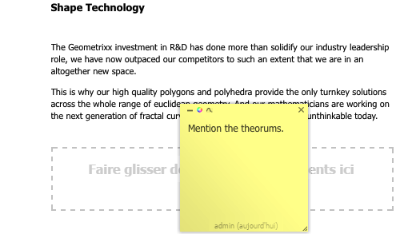

# Annotations lors de la modification d’une page{#annotations-when-editing-a-page}

>[!CAUTION]
>
>AEM 6.4 a atteint la fin de la prise en charge étendue et cette documentation n’est plus mise à jour. Pour plus d’informations, voir notre [période de support technique](https://helpx.adobe.com/fr/support/programs/eol-matrix.html). Rechercher les versions prises en charge [here](https://experienceleague.adobe.com/docs/?lang=fr).

L’ajout de contenu aux pages de votre site web est souvent l’objet de discussions avant la publication réelle. Pour faciliter cette opération, de nombreux composants directement liés au contenu (par opposition, à la mise en page, par exemple) vous permettent d’ajouter une annotation.

Une annotation place une note autocollante colorée sur la page. L’annotation vous permet (ainsi qu’aux autres utilisateurs) de laisser des commentaires ou des questions à l’intention d’autres auteurs ou réviseurs.

>[!NOTE]
>
>La définition d’un type de composant individuel détermine s’il est possible d’ajouter une annotation sur des instances de ce composant.

>[!NOTE]
>
>Les annotations créées dans l’IU classique s’affichent également dans l’IU optimisée pour les écrans tactiles. Toutefois, les esquisses sont spécifiques à l’interface utilisateur et ne s’affichent que dans l’interface dans laquelle elles ont été créées.

>[!CAUTION]
>
>Si vous supprimez une ressource (par ex. un paragraphe), toutes les annotations et tous les schémas associés sont également supprimés, quelle que soit leur position sur la page dans son ensemble.

>[!NOTE]
>
>Selon vos besoins, vous pouvez également développer un workflow pour envoyer des notifications lorsque celles-ci sont ajoutées, mises à jour ou supprimées.

## Annotations {#annotations}

Selon la conception du paragraphe, l’annotation est disponible sous la forme d’une option dans le menu contextuel (généralement le bouton droit de la souris lorsqu’il est placé sur le paragraphe requis) ou d’un bouton dans la barre d’édition du paragraphe.

Dans les deux cas, sélectionnez **Annoter**. Une annotation autocollante colorée est appliquée au paragraphe. Vous êtes immédiatement en mode d’ édition , ce qui vous permet d’ajouter directement du texte :

Vous pouvez déplacer l’annotation vers un nouvel emplacement sur la page. Cliquez sur la zone de bordure supérieure, puis maintenez la touche enfoncée et faites glisser simultanément l’annotation sur la nouvelle position. Cela peut être n’importe où sur la page, bien qu’il soit généralement utile de le garder connecté au paragraphe d’une manière ou d’une autre.

Les annotations (y compris les schémas associés) sont également incluses dans toute action de copie, de découpe ou de suppression effectuée sur le paragraphe auquel elles sont jointes ; pour les actions de copie ou de découpe, la position de l’annotation (et des schémas associés) conserve leur position par rapport au paragraphe d’origine.

La taille de l’annotation peut également être augmentée ou réduite, en faisant glisser le coin droit inférieur.

À des fins de suivi, la ligne de pied de page indique l’utilisateur qui a créé l’annotation et la date. Les auteurs suivants peuvent modifier la même annotation (le pied de page sera mis à jour) ou créer une annotation pour le même paragraphe.

Une confirmation est demandée lorsque vous choisissez de supprimer l’annotation (la suppression d’une annotation supprime également les schémas qui y sont associés).

Les trois icônes dans la partie supérieure gauche vous permettent de minimiser l’annotation (ainsi que tout schéma qui lui est associé), de changer la couleur et d’ajouter des schémas.

>[!NOTE]
>
>Les annotations ne sont visibles que dans le mode d’édition de l’environnement de l’auteur.
>
>Elles ne sont pas visibles dans un environnement de publication, ni dans les modes Aperçu ou Conception dans un environnement de création.

>[!NOTE]
>
>Les annotations ne peuvent pas être ajoutées à une page verrouillée par un autre utilisateur.

## Esquisses d’annotation {#annotation-sketches}

>[!NOTE]
>
>Les esquisses ne sont pas disponibles dans Internet Explorer :
>
>* l’icône ne s’affiche pas.
>* les schémas existants, créés dans un autre navigateur, ne s’affichent pas.
>

Les esquisses sont une fonction des annotations qui vous permet de créer des graphiques en courbes simples n’importe où dans la fenêtre du navigateur (partie visible) :

* Le curseur prend la forme d’un fil croisé lorsque vous êtes en mode d’esquisse. Vous pouvez tracer plusieurs lignes distinctes.
* La ligne d’esquisse reflète la couleur de l’annotation et peut être :

   * freehand

      le mode par défaut ; terminez en relâchant le bouton de la souris.

   * droite :

      maintenez la touche `ALT` enfoncée et cliquez sur les points de début et de fin ; terminez par un double-clic.

* Après avoir quitté le mode de schéma, vous pouvez cliquer sur une ligne de schéma pour sélectionner cette dernière.
* Déplacez une esquisse en la sélectionnant, puis en la faisant glisser à l’emplacement souhaité.
* Une esquisse superpose le contenu. Cela signifie que dans les 4 coins du schéma, vous ne pouvez pas cliquer sur le paragraphe sous-jacent. par exemple, si vous devez modifier un lien ou y accéder. Si cela pose problème (par exemple, si vous disposez d’un schéma couvrant une grande partie de la page), réduisez l’annotation appropriée, car cela réduit également tous les schémas associés, ce qui vous donne accès à la zone sous-jacente.
* Pour supprimer une esquisse individuelle, sélectionnez-la, puis appuyez sur la touche **Supprimer** clé (**fn**-**backspace** sur MAC).

* Si vous déplacez ou copiez un paragraphe, toutes les annotations associées et leurs schémas sont également déplacés ou copiés. leur position par rapport au paragraphe reste la même.
* Si vous supprimez une annotation, tous les schémas qui y sont associés seront également supprimés.
