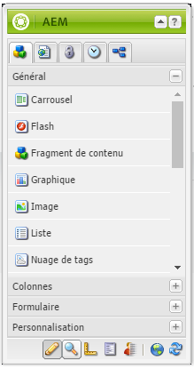
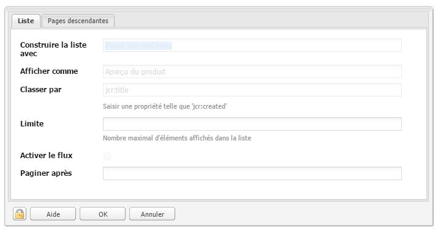
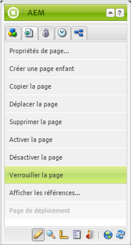

# Modification du contenu de la page{#editing-page-content}

>[!CAUTION]
>
>AEM 6.4 a atteint la fin de la prise en charge étendue et cette documentation n’est plus mise à jour. Pour plus d’informations, voir notre [période de support technique](https://helpx.adobe.com/fr/support/programs/eol-matrix.html). Rechercher les versions prises en charge [here](https://experienceleague.adobe.com/docs/?lang=fr).

Une fois la page créée (une nouvelle page ou dans le cadre d’un lancement ou d’une Live Copy), vous pouvez modifier le contenu pour effectuer toute mise à jour dont vous avez besoin.

Le contenu est ajouté à l’aide de composants (appropriés au type de contenu) qui peuvent être déplacés sur la page. Ils peuvent ensuite être modifiés sur place, déplacés ou supprimés.

>[!NOTE]
>
>Votre compte a besoin de la fonction [droits d’accès appropriés](/help/sites-administering/security.md) et [permissions](/help/sites-administering/security.md#permissions) pour modifier des pages ; par exemple, ajout, modification ou suppression de composants, annotation, déverrouillage.
>
>En cas de problème, contactez votre administrateur système.

## Sidekick {#sidekick}

Le sidekick est un outil clé lors de la création de pages. Elle est flottante lors de la création d’une page. Elle est donc toujours visible.

Plusieurs onglets et icônes sont disponibles, notamment :

* Composants
* Page
* Informations
* Contrôle de version
* Workflow
* Modes
* Génération de modèles automatique
* ClientContext
* Sites Web

Donne accès à diverses fonctionnalités, par exemple :

* [la sélection de composants ;](/help/sites-classic-ui-authoring/classic-page-author-env-tools.md#sidekick)
* [l’affichage des références ;](/help/sites-classic-ui-authoring/classic-page-author-env-tools.md#showing-references)
* [l’accès au journal d’audit ;](/help/sites-classic-ui-authoring/classic-page-author-env-tools.md#audit-log)
* [le changement de mode ;](/help/sites-classic-ui-authoring/classic-page-author-env-tools.md#page-modes)
* la [création](/help/sites-classic-ui-authoring/classic-page-author-work-with-versions.md#creating-a-new-version), la [restauration](/help/sites-classic-ui-authoring/classic-page-author-work-with-versions.md#restoring-a-page-version-from-sidekick) et la [comparaison](/help/sites-classic-ui-authoring/classic-page-author-work-with-versions.md#comparing-with-a-previous-version) des versions ;

* la [publication](/help/sites-classic-ui-authoring/classic-page-author-publish-pages.md#publishing-a-page) et la [dépublication](/help/sites-classic-ui-authoring/classic-page-author-publish-pages.md#unpublishing-a-page) d’une page ;

* [la modification des propriétés de page ;](/help/sites-classic-ui-authoring/classic-page-author-edit-page-properties.md)

* [la génération de modèles automatique ;](/help/sites-authoring/scaffolding.md)

* [le contexte client.](/help/sites-administering/client-context.md)

## Insertion d’un composant {#inserting-a-component}

### Insertion d’un composant {#inserting-a-component-1}

Après avoir ouvert la page, vous pouvez commencer à ajouter du contenu. Pour ce faire, ajoutez des composants (également appelés paragraphes).

Pour insérer un nouveau composant :

1. Plusieurs méthodes permettent de sélectionner le type de paragraphe à insérer :

   * Double-cliquez sur la zone intitulée **Faites glisser des composants ou des ressources ici...** - le **Insérer un nouveau composant** s’ouvre. Sélectionnez un composant, puis cliquez sur **OK**.
   * Faites glisser un composant depuis la barre d’outils flottante (appelée sidekick) pour insérer un nouveau paragraphe.
   * Cliquez avec le bouton droit de la souris sur un paragraphe existant, puis sélectionnez **Nouveau...** - La barre d’outils Insérer un nouveau composant s’ouvre. Sélectionnez un composant, puis cliquez sur **OK**.

   

1. La liste des composants (types de paragraphe) disponibles est affichée dans le sidekick et dans la barre d’outils **Insérer un nouveau composant**. Elles peuvent être divisées en différentes sections (par exemple, Général, Colonnes, etc.), qui peuvent être développées selon les besoins.

   Ces choix peuvent varier en fonction de votre environnement de production. Pour plus d’informations sur les composants, voir [Composants par défaut](/help/sites-classic-ui-authoring/classic-page-author-default-components.md).

1. Insérez le composant de votre choix sur la page. Double-cliquez ensuite sur le paragraphe. Une fenêtre s’ouvre alors pour vous permettre de configurer votre paragraphe et d’ajouter du contenu.

### Insertion d’un composant à l’aide de l’outil de recherche de contenu {#inserting-a-component-using-the-content-finder}

Vous pouvez également ajouter un nouveau composant à la page en faisant glisser une ressource depuis l’ [Outil de recherche de contenu](/help/sites-classic-ui-authoring/classic-page-author-env-tools.md#the-content-finder). Cela crée automatiquement un nouveau composant du type approprié contenant la ressource.

Cette procédure est valide pour les types de ressources suivants (certains dépendent du système de pages/paragraphes) :

| Type de ressource | Type de composant résultant |
|---|---|
| Image | Image |
| Document | Télécharger |
| Produit | Produit |
| Vidéo | Flash |

>[!NOTE]
>
>Ce comportement peut être configuré pour votre installation. Voir [Configuration d’un système de paragraphes pour que le glissement d’une ressource crée une instance de composant](/help/sites-developing/developing-components.md#configuring-a-paragraph-system-so-that-dragging-an-asset-creates-a-component-instance) pour plus de détails.

Pour créer un composant en faisant glisser l’un des types de ressources ci-dessus, suivez ces étapes :

1. Assurez-vous que votre page est en mode [**Modifier**](/help/sites-classic-ui-authoring/classic-page-author-env-tools.md#page-modes).
1. Ouvrez le [Outil de recherche de contenu](/help/sites-classic-ui-authoring/classic-page-author-env-tools.md#the-content-finder).
1. Faites glisser la ressource vers la position requise. Le [espace réservé du composant](#componentplaceholder) vous indique où le composant sera positionné.

   Un composant, adapté au type de ressource, est créé à l’emplacement requis ; il contient la ressource sélectionnée.

1. [Modifier](#editmovecopypastedelete) le composant si nécessaire.

## Modification d’un composant (contenu et propriétés) {#editing-a-component-content-and-properties}

Pour modifier un paragraphe existant, effectuez l’une des opérations suivantes :

* **Double-cliquez** le paragraphe pour l’ouvrir. Vous voyez la même fenêtre que lorsque vous avez créé le paragraphe avec le contenu existant. Apportez vos modifications et cliquez sur **OK**.

* **Clic droit** le paragraphe et cliquez sur **Modifier**.

* **Cliquez sur** deux fois sur le paragraphe (double-clic lent) pour passer en mode de modification statique. Vous pourrez modifier directement le texte sur la page, plutôt que dans une fenêtre de boîte de dialogue. Dans ce mode, une barre d’outils s’affiche en haut de la page. Il vous suffit d’apporter vos modifications ; elles seront automatiquement enregistrées.

## Déplacement d’un composant {#moving-a-component}

Pour déplacer un paragraphe :

>[!NOTE]
>
>Vous pouvez également utiliser un [couper/coller](#cut-copy-paste-a-component) pour déplacer un composant.

1. Sélectionnez le paragraphe à déplacer :

   

1. Faites glisser le paragraphe vers son nouvel emplacement : AEM indique où le paragraphe peut être déplacé avec une coche verte. Déposez-le à l’emplacement de votre choix.
1. Votre paragraphe est déplacé :

   

## Supprimer un composant {#deleting-a-component}

Pour supprimer un paragraphe :

1. Sélectionnez le paragraphe et **clic droit**:

   

1. Sélectionner **Supprimer** dans le menu. AEM WCM vous invite à confirmer la suppression du paragraphe, car cette action ne peut pas être annulée.
1. Cliquez sur **OK**.

>[!NOTE]
>
>Si vous avez défini vos [Propriétés de l’utilisateur pour afficher la barre d’outils d’édition globale](/help/sites-classic-ui-authoring/author-env-user-props.md), vous pouvez également réaliser certaines actions sur les paragraphes à l’aide des boutons **Copier**, **Couper**, **Coller** et **Supprimer** disponibles.\
>Divers [raccourcis clavier](/help/sites-classic-ui-authoring/classic-page-author-keyboard-shortcuts.md) sont également disponibles.

## Couper/Copier/Coller un composant {#cut-copy-paste-a-component}

Comme pour la [Suppression d’un composant](#deleting-a-component), vous pouvez copier, couper et coller un composant à l’aide du menu contextuel.

>[!NOTE]
>
>Si vous avez défini vos [Propriétés de l’utilisateur pour afficher la barre d’outils d’édition globale](/help/sites-classic-ui-authoring/author-env-user-props.md), vous pouvez également réaliser certaines actions sur les paragraphes à l’aide des boutons **Copier**, **Couper**, **Coller** et **Supprimer** disponibles.
>
>Divers [raccourcis clavier](/help/sites-classic-ui-authoring/classic-page-author-keyboard-shortcuts.md) sont également disponibles.

>[!NOTE]
>
>Le découpage, la copie et le collage de contenu ne sont pris en charge que sur la même page. 

## Composants hérités {#inherited-components}

Les composants hérités peuvent être le produit de divers scénarios :

* [Gestion de plusieurs sites](/help/sites-administering/msm.md); également en combinaison avec [scaffolding](/help/sites-classic-ui-authoring/classic-feature-scaffolding.md#scaffolding-with-msm-inheritance).

* Des [lancements](/help/sites-classic-ui-authoring/classic-launches.md) (quand basés sur une live copy)
* Des composants spécifiques, par exemple le système de paragraphes hérité dans Geometrixx

Vous pouvez annuler (puis réactiver) l’héritage. Selon le composant, vous pouvez y accéder à partir des éléments suivants :

1. **Live Copy**

   Si un composant fait partie d’une live copy ou d’un lancement, il est signalé par une icône de cadenas. Vous pouvez cliquer sur le cadenas pour annuler l’héritage.

   * L’icône de cadenas s’affiche lorsque le composant est sélectionné, par exemple :

   

   * Le cadenas s’affiche également dans la boîte de dialogue des composants, par exemple :

   

1. **Un système de paragraphes hérité**

   Boîte de dialogue de configuration. Par exemple, comme avec le système de paragraphes hérité dans Geometrixx :

   

## Ajout d’annotations {#adding-annotations}

[Annotations](/help/sites-classic-ui-authoring/classic-page-author-annotations.md) autorisez d’autres auteurs à fournir des commentaires sur votre contenu. Il est souvent utilisé à des fins de révision et de validation.

## Aperçu des pages {#previewing-pages}

Deux icônes sont importantes pour la prévisualisation des pages dans la bordure inférieure du sidekick :

* L’icône en forme de crayon indique que vous êtes actuellement en mode d’édition où vous pouvez ajouter, modifier, déplacer ou supprimer du contenu.

   

* L’icône en forme de loupe permet de sélectionner le mode d’aperçu où la page s’affiche telle qu’elle sera dans l’environnement de publication (une actualisation de page est parfois nécessaire) :

   

   En mode d’aperçu, le sidekick est réduit. Cliquez sur l’icône de flèche bas pour revenir au mode d’édition :

   

## Rechercher et remplacer {#find-replace}

Pour des modifications à plus grande échelle de la même expression, une **[Chercher et Remplacer](/help/sites-classic-ui-authoring/author-env-search.md#find-and-replace)** l’option de menu vous permet de rechercher et de remplacer plusieurs instances d’une chaîne dans une section du site web.

## Verrouillage d’une page {#locking-a-page}

AEM vous permet de verrouiller une page, de sorte que personne d’autre ne puisse en modifier le contenu. Cela s’avère utile lorsque vous apportez de nombreuses modifications à une page spécifique ou lorsque vous devez figer une page pendant quelque temps.

>[!CAUTION]
>
>Le verrouillage d’une page doit être utilisé avec précaution, car la seule personne pouvant déverrouiller une page est la personne qui l’a verrouillée (ou un compte disposant de droits d’administrateur).

Pour verrouiller une page :

1. Dans le **Sites web** , sélectionnez la page à verrouiller.
1. Double-cliquez sur la page pour l’ouvrir et la modifier.
1. Dans le **Page** onglet du sidekick, sélectionnez **Verrouiller la page**:

   

   Un message indique aux autres utilisateurs que la page est verrouillée. De plus, dans le volet de droite de la console **Sites web**, la gestion de contenu Web AEM indique que la page est verrouillée et quel utilisateur l’a verrouillée.

   

## Déverrouillage d’une page {#unlocking-a-page}

Pour déverrouiller une page :

1. Dans le **Sites web** , sélectionnez la page à déverrouiller.
1. Double-cliquez sur la page pour l’ouvrir.
1. Dans le **Page** onglet du sidekick, sélectionnez **Déverrouiller la page**.

## Annulation et rétablissement des modifications de page {#undoing-and-redoing-page-edits}

Utilisez les raccourcis clavier suivants lorsque le cadre de contenu de la page est ciblé :

* Annuler : Ctrl+Z (Windows) ou Cmd+Z (Mac)
* Rétablir : Ctrl+Y (Windows) ou Cmd+Y (Mac)

Lorsque vous annulez ou rétablissez une opération de suppression, d’ajout ou de déplacement, le ou les paragraphes concernés sont signalés par une mise en surbrillance clignotante (comportement par défaut).

>[!NOTE]
>
>Consultez [Annulation et rétablissement des modifications de page : la théorie](#undoing-and-redoing-page-edits-the-theory) pour en savoir plus sur ce qu’il est possible de faire lorsque vous annulez ou rétablissez des modifications de page.

## Annulation et rétablissement des modifications de page : la théorie {#undoing-and-redoing-page-edits-the-theory}

>[!NOTE]
>
>L’administrateur système peut [configurer divers aspects des fonctions Annuler/Rétablir](/help/sites-administering/config-undo.md) en fonction des exigences de votre instance.

AEM stocke un historique des actions que vous réalisez et la séquence selon laquelle vous les réalisez. Ainsi, vous annulez plusieurs actions dans l’ordre dans lequel vous les avez effectuées. Vous pouvez ensuite utiliser l’option Rétablir pour appliquer à nouveau une ou plusieurs des actions.

Si un élément de la page de contenu est sélectionné, les commandes Annuler et Rétablir s’appliquent à l’élément sélectionné, par exemple un composant de texte.

Le comportement des commandes Annuler et Rétablir est similaire à celui des autres programmes logiciels. Utilisez les commandes pour restaurer l’état récent de votre page web lorsque vous prenez des décisions sur le contenu. Par exemple, si vous repositionnez un paragraphe de texte sur la page, vous pouvez utiliser la commande Annuler pour le remettre à son emplacement initial. Si vous décidez ensuite de déplacer à nouveau le paragraphe, utilisez la commande Rétablir .

>[!NOTE]
>
>Vous pouvez :
>
>* rétablir les actions tant que vous n’avez pas modifié de page depuis que vous avez utilisé la commande annuler.
>* annulez un maximum de 20 actions de modification (paramètre par défaut).
>* également utiliser [Raccourcis clavier](/help/sites-classic-ui-authoring/classic-page-author-keyboard-shortcuts.md) pour annuler et rétablir.
>

Vous pouvez utiliser les options Annuler et Rétablir pour les types de modifications de page suivants :

* Ajout, modification, suppression et déplacement de paragraphes
* Modification statique du contenu des paragraphes
* Copie, découpe et collage d’éléments dans une page
* Copie, découpe et collage d’éléments entre plusieurs pages
* Ajout, suppression et modification de fichiers et d’images
* Ajout, suppression et modification d’annotations et d’esquisses
* Modifications apportées à Scaffold
* Ajout et suppression de références
* Modification des valeurs de propriété dans les boîtes de dialogue de composant.

Les champs de formulaire dont le rendu des composants de formulaire est effectué ne sont pas censés contenir de valeurs spécifiées lors de la création de pages. Les commandes Annuler et Rétablir n’affectent donc pas les modifications que vous apportez aux valeurs des composants de ce type. Par exemple, vous ne pouvez pas annuler la sélection d’une valeur dans une liste déroulante.

>[!NOTE]
>
>Des autorisations spéciales sont nécessaires pour annuler et rétablir des modifications affectant des fichiers et des images. En outre, l’historique des annulations des modifications apportées aux fichiers et aux images dure un minimum d’heures. Au-delà de cette période, l’annulation des modifications n’est toutefois pas garantie. Votre administrateur peut fournir des autorisations et modifier la durée par défaut de dix heures.
