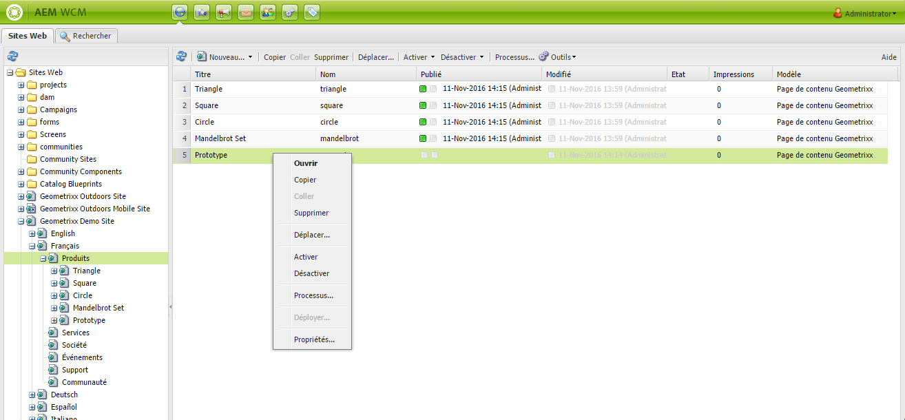
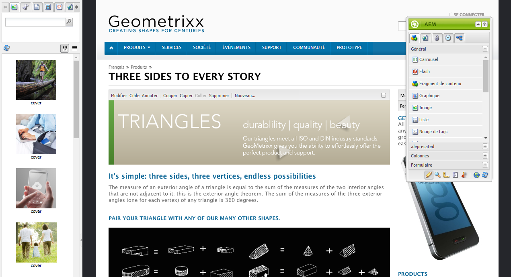
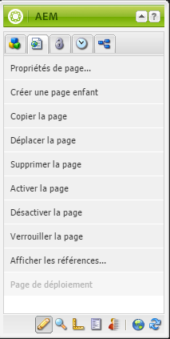
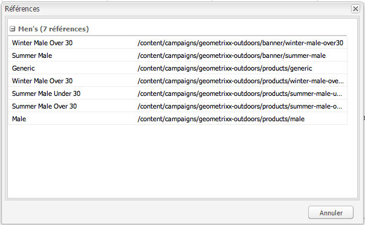
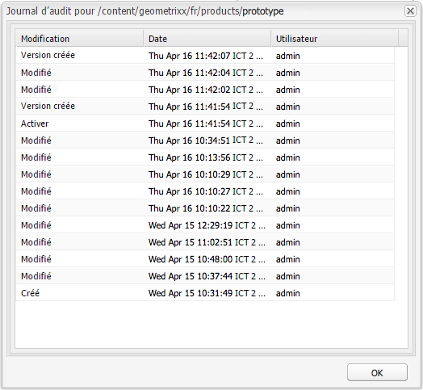

# Création – Environnement et outils{#authoring-the-environment-and-tools}

>[!CAUTION]
>
>AEM 6.4 a atteint la fin de la prise en charge étendue et cette documentation n’est plus mise à jour. Pour plus d’informations, voir notre [période de support technique](https://helpx.adobe.com/fr/support/programs/eol-matrix.html). Rechercher les versions prises en charge [here](https://experienceleague.adobe.com/docs/?lang=fr).

L’environnement de création d’AEM comprend divers mécanismes permettant d’organiser et de modifier votre contenu. Les outils fournis sont accessibles dans plusieurs consoles et éditeurs de page.

## Administration de sites {#site-administration}

Le **Sites web** La console vous permet de gérer et de parcourir votre site web. La structure de votre site web peut être développée à l’aide des deux volets et des actions peuvent être entreprises sur l’élément requis :

## Modification du contenu de votre page {#editing-your-page-content}

L’IU classique comporte un éditeur de page distinct, qui utilise l’outil de recherche de contenu et le sidekick :

`http://localhost:4502/cf#/content/geometrixx/en/products/triangle.html`

## Accès à l’Aide {#accessing-help}

Divers **Aide** Les ressources sont directement accessibles depuis AEM :

Outre les [barres d’outils de la console](/help/sites-classic-ui-authoring/author-env-basic-handling.md#accessing-help), vous pouvez également accéder à l’aide à partir du sidekick (à l’aide de ) lors de la modification d’une page :

Ou en utilisant la variable **Aide** dans la boîte de dialogue de modification de composants spécifiques ; l’aide contextuelle s’affiche.

## Sidekick {#sidekick}

Dans l’onglet **Composants** du sidekick, vous pouvez parcourir les composants pouvant être ajoutés à la page active. Le groupe requis peut être développé, puis un composant déplacé vers l’emplacement requis sur la page.

## Outil de recherche de contenu {#the-content-finder}

L’outil de recherche de contenu est un moyen simple et rapide de rechercher des ressources et/ou du contenu dans le référentiel lors de la modification d’une page.

Utilisez l’outil de recherche de contenu pour localiser une plage de ressources. Le cas échéant, vous pouvez faire glisser un élément et le déposer dans un paragraphe de la page :

* [Images](#finding-images)
* [Documents](#finding-documents)
* [Films](#finding-movies)
* [Explorateur Dynamic Media](/help/sites-administering/scene7.md#scene7contentbrowser)
* [Pages](/help/sites-classic-ui-authoring/classic-page-author-env-tools.md#finding-pages)
* [Paragraphes](#referencing-paragraphs-from-other-pages)
* [Produits](/help/sites-classic-ui-authoring/classic-page-author-env-tools.md#products)
* Ou pour [parcourir le site Web par structure de référentiel](#the-content-finder)

Avec toutes les options, vous pouvez [recherche d’éléments spécifiques ;](#the-content-finder).

### Recherche d’images {#finding-images}

Cet onglet répertorie toutes les images du référentiel.

Après avoir créé un paragraphe Image sur votre page, vous pouvez faire glisser un élément et le déposer dans le paragraphe.

### Recherche de documents {#finding-documents}

Cet onglet répertorie tous les documents du référentiel.

Après avoir créé un paragraphe Télécharger sur votre page, vous pouvez faire glisser un élément et le déposer dans le paragraphe.

### Recherche de films {#finding-movies}

Cet onglet répertorie tous les films (par exemple, les éléments de Flash) du référentiel.

Après avoir créé un paragraphe approprié (par exemple, Flash) sur votre page, vous pouvez faire glisser un élément et le déposer dans le paragraphe.

### Produits {#products}

Cet onglet répertorie tous les produits. Après avoir créé un paragraphe approprié (par exemple, Produit) sur votre page, vous pouvez faire glisser un élément et le déposer dans le paragraphe.

### Trouver des pages {#finding-pages}

Cet onglet présente toutes les pages. Double-cliquez sur une page pour l’ouvrir à des fins d’édition.

### Référencement de paragraphes à partir d’autres pages {#referencing-paragraphs-from-other-pages}

Cet onglet vous permet de rechercher une autre page. Tous les paragraphes de cette page sont répertoriés. Vous pouvez ensuite faire glisser un paragraphe sur la page active, ce qui crée une référence au paragraphe d’origine.

### Utilisation de la vue de référentiel complète {#using-the-full-repository-view}

Cet onglet affiche toutes les ressources du référentiel.

### Utilisation de la recherche avec l’explorateur de contenu {#using-search-with-the-content-browser}

Vous pouvez rechercher des éléments spécifiques pour toutes les options. Toutes les balises et ressources correspondant au modèle de recherche sont répertoriées :

Vous pouvez également utiliser des caractères génériques pour la recherche. Les caractères génériques pris en charge sont les suivants :

* `*` - Correspond à une suite de zéro ou de plusieurs caractères.

* `?` - Correspond à un seul caractère.

>[!NOTE]
>
>Un « nom » de propriété pseudo doit être utilisé pour effectuer une recherche de caractères génériques.

Par exemple, si une image porte le nom suivant :

`ad-nmvtis.jpg`

les schémas de recherche suivants la trouvent (ainsi que toute autre image correspondant au schéma) :

* `name:*nmv*`
* `name:AD*` - La correspondance de caractères n’est *pas* sensible à la casse.
* `name:ad?nm??is.*` - Vous pouvez utiliser un nombre indéfini de caractères génériques dans une requête.

>[!NOTE]
>
>Vous pouvez également utiliser la recherche [SQL2](https://helpx.adobe.com/experience-manager/6-4/sites/developing/using/reference-materials/javadoc/org/apache/jackrabbit/commons/query/sql2/package-summary.html).

## Affichage des références {#showing-references}

AEM vous permet de voir quelles pages sont liées à la page sur laquelle vous travaillez actuellement.

Pour afficher les références de page directes :

1. Dans le sidekick, sélectionnez la variable **Page** icône de tabulation.

   

1. Sélectionnez **Afficher les références...** AEM ouvre la fenêtre Références et affiche les pages qui font référence à la page sélectionnée, y compris leurs chemins d’accès.

   

Dans certains cas, le sidekick permet d’exécuter d’autres actions, notamment :

* [Lancements](/help/sites-classic-ui-authoring/classic-launches.md)
* [Live Copies](/help/sites-administering/msm.md)

* [Plan directeur](/help/sites-administering/msm-best-practices.md)

Autre [les relations interpages sont visibles dans la console Sites web .](/help/sites-classic-ui-authoring/author-env-basic-handling.md#page-information-on-the-websites-console).

## Journal d’audit {#audit-log}

Le **journal d’audit** est accessible depuis l’onglet **Informations** du sidekick. Il répertorie les actions récentes ayant eu lieu sur la page active ; par exemple :

## Informations sur la page {#page-information}

La console Sites Web [fournit également des informations sur le statut actuel de la page](/help/sites-classic-ui-authoring/author-env-basic-handling.md#page-information-on-the-websites-console) ; par exemple, publication, modification, verrouillage, Live Copy, etc.

## Modes de page {#page-modes}

Lors de la modification d’une page dans l’IU classique, plusieurs modes sont accessibles à l’aide des icônes au bas du sidekick :

La rangée d’icônes située au bas du sidekick permet de changer de mode pour le traitement des pages :

* [Modifier](/help/sites-classic-ui-authoring/classic-page-author-edit-mode.md)

   Il s’agit du mode par défaut qui vous permet de modifier la page, d’ajouter ou de supprimer des composants et d’effectuer d’autres modifications.

* [Aperçu](/help/sites-classic-ui-authoring/classic-page-author-edit-content.md#previewing-pages)

   Ce mode vous permet de prévisualiser la page comme si elle apparaissait sur votre site web sous sa forme définitive.

* [Conception](/help/sites-classic-ui-authoring/classic-page-author-design-mode.md#main-pars-procedure-0)

   Dans ce mode, vous avez la possibilité de modifier la conception de la page en configurant les composants accessibles.

>[!NOTE]
>
>D’autres options sont également disponibles :
>
>* [Génération de modèles automatique](/help/sites-classic-ui-authoring/classic-feature-scaffolding.md)
>* [ClientContext](/help/sites-administering/client-context.md)
>* Sites web : ouvre la console Sites web .
>* Recharger - Actualise la page.

## Raccourcis clavier {#keyboard-shortcuts}

Divers [raccourcis clavier](/help/sites-classic-ui-authoring/classic-page-author-keyboard-shortcuts.md) sont disponibles.
