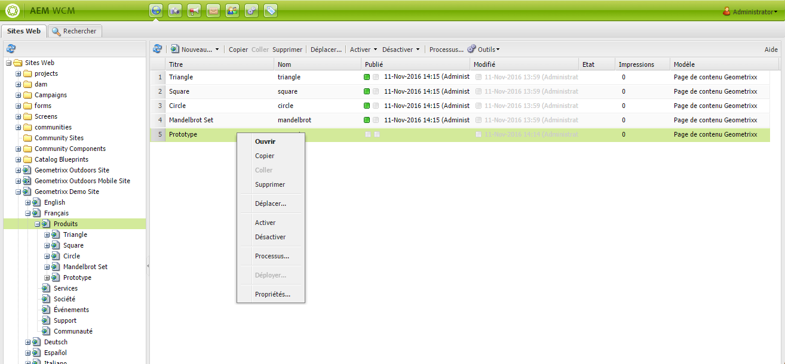
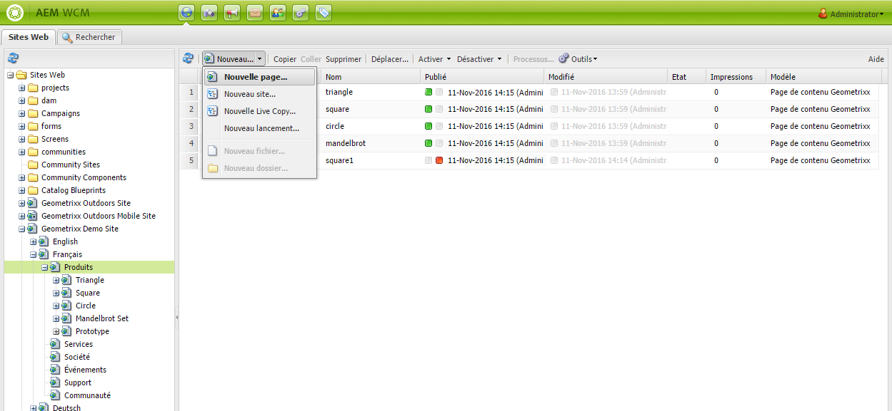
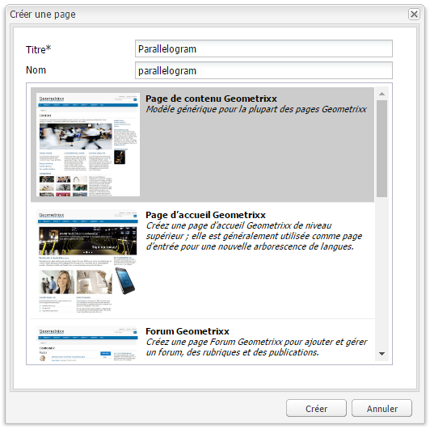
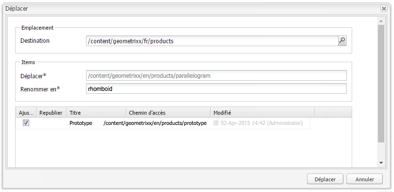

# Création et organisation des pages{#creating-and-organizing-pages}

Cette section décrit comment créer et gérer des pages avec Adobe Experience Manager (AEM) pour pouvoir ensuite [créer du contenu](/help/sites-classic-ui-authoring/classic-page-author-edit-content.md) sur ces pages.

>[!NOTE]
>
>Vous devez disposer des [droits d’accès](/help/sites-administering/security.md) et [des autorisations appropriés](/help/sites-administering/security.md#permissions) sur votre compte pour agir sur les pages, notamment pour créer, copier, déplacer, modifier et supprimer du contenu.
>
>En cas de problèmes, contactez votre administrateur système.

## Organisation du site web {#organizing-your-website}

En tant qu’auteur, vous devez organiser votre site web dans AEM. Ceci implique de créer et de nommer vos pages de contenu afin que vous puissiez faire ce qui suit :

* les trouver facilement dans l’environnement de création ;
* les visiteurs sur votre site peuvent facilement les parcourir dans l’environnement de publication.

Vous pouvez également vous aider de [dossiers](#creating-a-new-folder) pour organiser votre contenu.

La structure d’un site web peut être comparée à celle d’un *arbre* qui soutient vos pages de contenu. Les noms de ces pages de contenu sont utilisés pour former des URL qui indiquent les titres lorsque le contenu des pages est affiché.

Vous trouverez ci-dessous un extrait du site Geometrixx ; par exemple, où est accessible la page `Triangle` :

* Environnement d’auteur

   `http://localhost:4502/cf#/content/geometrixx/en/products/triangle.html`

* Environnement de publication

   `http://localhost:4503/content/geometrixx/en/products/triangle.html`

   Depending on the configuration of your instance, use of `/content` might be optional on the publish environment.

```xml
  /content
    /geometrixx
      /en
        /toolbar...
        /products
          /triangle
            /overview 
            /features
          /square...
          /circle...
          /...
        /...
      /fr...
      /de...
      /es...
      /...
    /...
```

This structure can be viewed from the Websites console, which you can use to [navigate through the tree structure](/help/sites-classic-ui-authoring/author-env-basic-handling.md#main-pars-text-15).



### Page Naming Conventions {#page-naming-conventions}

Lors de la création d’une page, il y a deux champs clés :

* **[Titre](#title)**:

   * Il s’affiche pour l’utilisateur dans la console et dans la partie supérieure du contenu de la page lors de la modification. 
   * Ce champ est obligatoire.

* **[Nom](#name)**:

   * Il est utilisé pour générer l’URI.
   * L’entrée utilisateur pour ce champ est facultative. Si le nom n’est pas spécifié, il est dérivé du titre.

When creating a new page, AEM will [validate the page name according to the conventions](/help/sites-developing/naming-conventions.md) imposed by AEM and JCR.

L’implémentation et la liste des caractères autorisés diffèrent légèrement selon l’interface utilisateur (elle est plus étendue pour l’interface utilisateur tactile), mais le minimum autorisé est :

* « a » à « z »
* « A » à « Z »
* « 0 » à « 9 »
* _ (trait de soulignement)
* `-` (tiret/signe moins)

N’utilisez que ces caractères pour vous assurer qu’ils sont acceptés/utilisés (pour plus d’informations sur tous les caractères autorisés, reportez-vous à la section [Conventions de dénomination](/help/sites-developing/naming-conventions.md)).

#### Titre {#title}

Si vous fournissez uniquement un **titre** de page lors de la création d’une nouvelle page, AEM déduira le **nom**[ de page de cette chaîne et validera le nom conformément aux conventions imposées par AEM et JCR. ](/help/sites-developing/naming-conventions.md) Dans les deux types d’interfaces utilisateur (IU), le champ **Titre** contenant des caractères non valides est accepté, mais le nom est modifié en remplaçant les caractères non valides. Par exemple :

| Titre | Nom dérivé |
|---|---|
| Schön | schoen.html |
| SC%&amp;&amp;ast;ç+ | sc---c-.html |

#### Nom {#name}

Si vous indiquez un **nom** de page lors de la création d’une page, AEM [valide le nom en fonction des conventions](/help/sites-developing/naming-conventions.md) imposées par AEM et JCR.

In the Classic UI you **cannot enter invalid characters** in the **Name** field.

>[!NOTE]
>In the touch-enabled UI you **cannot submit invalid characters** in the **Name** field. Lorsque AEM détecte des caractères non valides, le champ est mis en surbrillance et un message d’explication s’affiche et indique les caractères à supprimer/remplacer.

>[!NOTE]
>
>Évitez d’utiliser un code à deux lettres, tel que défini par la norme ISO-639-1, sauf s’il s’agit d’une racine de langue.
>
>Pour plus d’informations, voir [Préparation du contenu pour la traduction](/help/sites-administering/tc-prep.md).

### Modèles {#templates}

Dans AEM, un modèle spécifie un type de page spécialisé. Un modèle sera utilisé comme base pour n’importe quelle page créée.

Le modèle définit la structure d’une page, notamment une miniature ainsi que d’autres propriétés. Par exemple, vous pouvez avoir des modèles distincts pour les pages de produits, les plans de sites et les informations de contact. Les modèles sont constitués de [composants](#components).

AEM comporte plusieurs modèles prêts à l’emploi. Les modèles proposés dépendent du site web individuel et des informations qui doivent être fournies (lors de la création d’une page) de l’interface utilisée. Les champs clés sont les suivants :

* **Titre**
Titre affiché sur la page web obtenue.

* **Nom**
Utilisé lors de l’attribution du nom de la page.

* **Modèle**
Liste des modèles utilisables lors de la génération de la nouvelle page.

### Composants {#components}

Les composants sont les éléments fournis par AEM afin que vous puissiez ajouter des types de contenu spécifiques. AEM est fourni avec une gamme de composants prêts à l’emploi qui fournissent des fonctionnalités complètes ; il s’agit notamment des suivantes :

* Texte
* Image
* Diaporama
* Vidéo
* etc.

Once you have created and opened a page you can [add content using the components](/help/sites-classic-ui-authoring/classic-page-author-edit-content.md#insertinganewparagraph), available from the [sidekick](/help/sites-classic-ui-authoring/classic-page-author-env-tools.md#sidekick).

## Gestion des pages {#managing-pages}

### Création d’une page {#creating-a-new-page}

Vous devez créer une page avant de pouvoir commencer à créer du contenu, sauf si toutes les pages ont été créées au préalable :

1. Dans la console **Sites web**, sélectionnez le niveau auquel créer une page.

   Dans l’exemple suivant, vous créez une page sous le niveau **Produits**, affiché dans le volet de gauche ; le volet de droite présente les pages qui existent déjà au niveau situé sous **Produits**.

   

1. Dans le menu **Nouveau...** (cliquez sur la flèche en regard de **Nouveau...**), puis sélectionnez **Nouvelle page...** La fenêtre **Créer une page** s’ouvre.

   Le fait de cliquer directement sur **Nouveau...** fait office de raccourci vers l’option **Nouvelle page...**.

1. La boîte de dialogue **Créer une page** vous permet d’effectuer les opérations suivantes :

   * Fournir un **Titre** ; celui-ci est présenté à l’utilisateur.
   * Fournir un **Nom** ; celui-ci est utilisé pour générer l’URI. Si le nom n’est pas spécifié, il est dérivé du titre.

      * Si vous indiquez le **nom** d’une page lors de la création d’une page, AEM [valide le nom en fonction des conventions](/help/sites-developing/naming-conventions.md) imposées par AEM et JCR.
      * Dans l’IU classique, vous **ne pouvez pas entrer de caractères non valides** dans le champ **Nom**.
   * Cliquez sur le modèle que vous souhaitez utiliser pour créer la page.

      Le modèle sert de base à la nouvelle page ; pour déterminer, par exemple, la disposition de base d’une page de contenu.
   >[!NOTE]
   >
   >Voir [Conventions de dénomination des pages](#page-naming-conventions).

   Pour créer une page, vous devez disposer au moins du **titre** et du modèle nécessaire.

   

   >[!NOTE]
   >
   >Si vous souhaitez utiliser des caractères Unicode dans les URL, définissez la propriété d’alias (`sling:alias`) ([propriétés de page](/help/sites-classic-ui-authoring/classic-page-author-edit-page-properties.md)).

1. Cliquez sur **Créer** pour créer la page. Vous revenez alors à la console **Sites web** dans laquelle apparaît une entrée pour la nouvelle page.

   Cette console donne des informations sur la page (la date de la dernière modification et la personne responsable, par exemple), lesquelles sont mises à jour suivant les besoins.

   >[!NOTE]
   >
   >Vous pouvez également créer une page lorsque vous modifiez une page existante. Using **Create Child Page **from the **Page** tab of the sidekick, will create a new page directly under the page being edited.

### Ouverture d’une page pour la modifier {#opening-a-page-for-editing}

Vous pouvez ouvrir la page à [modifier](/help/sites-classic-ui-authoring/classic-page-author-edit-content.md#editing-a-component-content-and-properties) de l’une des façons suivantes :

* Dans la console **Sites web**, **double-cliquez** sur l’entrée de la page pour l’ouvrir en vue de la modifier.

* Dans la console **Sites Web**, **cliquez avec le bouton droit** (menu contextuel) sur l’élément de page, puis sélectionnez **Ouvrir** dans le menu.

* Après avoir ouvert une page, vous pouvez accéder à d’autres pages du site (en vue de les modifier) en cliquant sur des liens hypertexte.

### Copie et collage d’une page {#copying-and-pasting-a-page}

Vous pouvez copier, au choix :

* une seule page,
* une page ainsi que toutes ses pages secondaires.

1. Dans la console **Sites web**, sélectionnez la page à copier.

   >[!NOTE]
   >
   >A ce stade, le fait que vous copiez une seule page ou les sous-pages sous-jacentes n’a pas d’importance.

1. Cliquez sur **Copier**.

1. Accédez au nouvel emplacement et cliquez ensuite sur :

   * **Coller** pour coller la page, ainsi que toutes les sous pages.
   * **Maj + Coller** pour coller uniquement la page sélectionnée.
   La ou les pages sont collées au nouvel emplacement.

   >[!NOTE]
   >
   >Il se peut que le nom de la page soit modifié automatiquement si une page existante porte déjà le même nom.

   >[!NOTE]
   >
   >Utilisez l’option **Copier la page** dans l’onglet **Page** du sidekick. Dans la boîte de dialogue qui s’ouvre, vous pouvez spécifier la destination, etc.

### Déplacer ou renommer une page {#moving-or-renaming-page}

>[!NOTE]
>
>L’attribution d’un nouveau nom à une page doit elle aussi respecter les [conventions de dénomination des pages](#page-naming-conventions) lors de la spécification du nouveau nom de la page.

La procédure de déplacement d’une page ou de modification du nom est identique. Effectuez la même opération pour :

* déplacer une page vers un nouvel emplacement ;
* renommer une page au même emplacement ;
* déplacer une page vers un nouvel emplacement et la renommer en même temps.

AEM vous offre la possibilité de mettre à jour des liens internes vers la page dont la modification ou le changement de nom est en cours. Vous pouvez procéder page par page afin de bénéficier d’un confort d’utilisation optimal.

Pour déplacer ou renommer une page :

1. Plusieurs méthodes permettent de déclencher un déplacement :

   * Dans la console **Sites Web**, cliquez sur la page pour la sélectionner, puis sélectionnez **Déplacer**.
   * Dans la console **Sites web**, vous pouvez également sélectionner l’élément de page, puis **cliquer avec le bouton droit** et sélectionner **Déplacer**.
   * Lors de la modification d’une page, sélectionnez **Déplacer la page** dans l’onglet **Page** du sidekick.

1. La fenêtre **Déplacer** s’ouvre ; vous pouvez saisir un nouvel emplacement, un nouveau nom pour la page, ou les deux.

   

   Cette fenêtre répertorie également les pages qui font référence à celle en cours de déplacement. En fonction de l’état de la page de référence, vous pourrez peut-être régler ces liens et/ou republier les pages.

1. Complétez les champs suivants, selon le cas :

   * **Destination**

      Utilisez le sitemap (disponible dans la liste déroulante) pour sélectionner la destination de la page.

      Si vous souhaitez simplement renommer la page, ignorez ce champ.

   * **Déplacer**

      Indiquez la page à déplacer , ce champ est généralement complété par défaut, selon la méthode de déplacement utilisée et l’endroit où vous avez lancé l’opération.

   * **Renommer en**

      Le libellé de page en cours s’affiche par défaut. Indiquez le nouveau libellé de page, s’il y a lieu.

   * **Régler**

      Met à jour les liens de la page qui pointent vers la page déplacée : par exemple, si la page A contient des liens vers la page B, AEM ajuste les liens de la page A en cas de déplacement de la page B.

      Cette option peut être sélectionnée / désélectionnée pour chaque page de référence.

   * **Republier**

      Publie à nouveau la page de référence ; ici encore, cette option peut être sélectionnée pour chaque page.
   >[!NOTE]
   >
   >Si la page a déjà été activée, le fait de la déplacer la désactivera automatiquement. Par défaut, elle sera réactivée une fois le déplacement terminé. Vous pouvez toutefois changer ce comportement en désélectionnant l’option **Republier** pour la page dans la fenêtre **Déplacer.**

1. Cliquez sur **Déplacer**, puis sur **OK** pour confirmer l’opération.

   >[!NOTE]
   >
   >Le titre de la page n’est pas mis à jour.

### Suppression d’une page {#deleting-a-page}

1. Vous pouvez supprimer une page à partir de différents emplacements :

   * Dans la console **Sites web**, cliquez sur la page pour la sélectionner, puis cliquez avec le bouton droit et sélectionnez **Supprimer** dans le menu contextuel.
   * Dans la console **Sites web**, cliquez sur la page pour la sélectionner, puis sélectionnez **Supprimer** dans le menu de la barre d’outils.
   * Dans le sidekick, utilisez l’onglet **Page** pour sélectionner **Supprimer la page** ; la page ouverte est alors supprimée.

1. Après avoir choisi de supprimer une page, vous devez confirmer la demande (dans la mesure où l’opération est irréversible).

   >[!NOTE]
   >
   >Une fois la suppression effectuée, si la page a été publiée, vous pouvez restaurer la dernière version (ou une version spécifique). Notez cependant que le contenu peut être légèrement différent de votre dernière version si d’autres modifications ont été apportées. Pour plus d’informations, reportez-vous à la section [Restauration de pages](/help/sites-classic-ui-authoring/classic-page-author-work-with-versions.md#restoringpages).

>[!NOTE]
>
>Si une page est déjà activée, elle est automatiquement désactivée avant d’être supprimée.

### Verrouillage d’une page {#locking-a-page}

Vous pouvez [verrouiller ou déverrouiller une page](/help/sites-classic-ui-authoring/classic-page-author-edit-content.md#locking-a-page) à partir d’une console ou lorsque vous modifiez une page. Les deux environnements indiquent également si une page est ou non verrouillée.

### Création d’un dossier {#creating-a-new-folder}

>[!NOTE]
>
>Les dossiers doivent eux aussi respecter les [conventions de dénomination des pages](#page-naming-conventions) lors de la spécification du nouveau nom du dossier.

1. Ouvrez la console **Sites web**, puis accédez à l’emplacement requis.
1. Dans le menu **Nouveau** (cliquez sur la flèche en regard de l’option **Nouveau**), sélectionnez **Nouveau dossier**.
1. La boîte de dialogue **Créer un dossier** s’affiche. Vous pouvez saisir un **nom** et un **titre** :

   

1. Pour créer le dossier, sélectionnez **Créer**.

