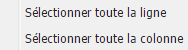

# Éditeur de texte enrichi{#rich-text-editor}

>[!CAUTION]
>
>AEM 6.4 a atteint la fin de la prise en charge étendue et cette documentation n’est plus mise à jour. Pour plus d’informations, voir notre [période de support technique](https://helpx.adobe.com/fr/support/programs/eol-matrix.html). Rechercher les versions prises en charge [here](https://experienceleague.adobe.com/docs/?lang=fr).

L’éditeur de texte enrichi est un élément de base de la saisie de contenu texte dans AEM. Il constitue la base de divers composants, notamment :

* Texte
* Texte Image
* Tableau

## Éditeur de texte enrichi {#rich-text-editor-2}

La boîte de dialogue de modification WYSIWYG offre un large éventail de fonctionnalités :

>[!NOTE]
>
>Les fonctions disponibles peuvent être configurées pour chaque projet ; elles peuvent donc varier pour votre installation.

## Édition statique {#in-place-editing}

Outre le mode d’édition de texte enrichi basé sur une boîte de dialogue, AEM fournit également le mode d’édition statique, qui permet de modifier directement le texte tel qu’il est affiché dans la mise en page.

Cliquez deux fois sur un paragraphe (double-clic lent) pour passer en mode d’édition statique (la bordure du composant devient orange).

Vous pourrez modifier directement le texte sur la page, plutôt que dans une fenêtre de boîte de dialogue. Il vous suffit d’apporter vos modifications ; elles seront automatiquement enregistrées.

>[!NOTE]
>
>Si l’outil de recherche de contenu est ouvert, une barre d’outils avec les options de mise en forme de l’éditeur de texte enrichi s’affiche en haut de l’onglet (comme ci-dessus).
>
>Si l’outil de recherche de contenu n’est pas ouvert, la barre d’outils ne s’affiche pas.

Actuellement, le mode d’édition statique est activé pour les éléments de page générés par la variable **Texte** et **Titre** composants.

>[!NOTE]
>
>Le **Titre** est conçu pour contenir un texte court sans sauts de ligne. Lorsque vous modifiez un titre en mode d’édition statique, la saisie d’un saut de ligne ouvre une nouvelle **Texte** sous le titre.

## Fonctions de l’éditeur de texte enrichi {#features-of-the-rich-text-editor}

L’éditeur de texte enrichi fournit diverses fonctions, [selon la configuration](/help/sites-administering/rich-text-editor.md) du composant. Ces fonctions sont disponibles dans les deux interfaces utilisateur (classique et optimisée pour les écrans tactiles).

### Formats de caractères de base {#basic-character-formats}

Vous pouvez y appliquer une mise en forme aux caractères que vous avez sélectionnés (mis en surbrillance). certaines options comportent également des touches de raccourci :

* Gras (Ctrl+B)
* Italique (Ctrl+I)
* Souligné (Ctrl-U)
* Indice
* Exposant

Tous fonctionnent comme un bouton d’activation/désactivation. La résélection supprime donc le format.

### Styles et formats prédéfinis {#predefined-styles-and-formats}

Votre installation peut inclure des styles et des formats prédéfinis. Ils sont disponibles avec les **Style** et **Format** liste déroulante et peut être appliqué au texte que vous avez sélectionné.

Un style peut être appliqué à une chaîne spécifique (un style correspond à CSS) :

Tandis qu’une disposition est appliquée à l’intégralité d’un paragraphe texte (une mise en forme est basée sur le langage HTML) :

Un format spécifique ne peut être modifié que (la valeur par défaut est **Paragraphe**).

Un style peut être supprimé. placez le curseur dans le texte auquel le style a été appliqué, puis cliquez sur l’icône Supprimer :

>[!CAUTION]
>
>Ne sélectionnez pas à nouveau le texte auquel le style a été appliqué ou l’icône sera désactivée.

### Couper, Copier, Coller {#cut-copy-paste}

Les fonctions standard de **Couper** et **Copier** sont disponibles. Plusieurs versions de **Coller** sont fournis pour prendre en charge différents formats.

* Couper (**Ctrl+X**)
* Copier (**Ctrl+C**)
* Coller

   Il s’agit du mécanisme de collage par défaut (**Ctrl+V**) pour le composant ; lorsqu’il est installé prêt à l’emploi, il est configuré pour être &quot;Coller à partir de Word&quot;.

* Coller en tant que texte

   Supprime tous les styles et la mise en forme pour coller uniquement le texte brut.

* Coller à partir de Word

   Le contenu est collé en tant que HTML (avec le reformatage nécessaire).

### Annuler, Rétablir {#undo-redo}

AEM conserve un historique de vos 50 dernières actions dans le composant actuel, dans l’ordre chronologique. Si nécessaire, ces actions peuvent être annulées (puis rétablies) dans un ordre strict.

>[!CAUTION]
>
>L’historique n’est conservé que pour la session de modification actuelle. Il est redémarré chaque fois que vous ouvrez le composant en vue de le modifier.

>[!NOTE]
>
>Cinquante est le nombre de tâches par défaut. Il peut s’agir d’une opération différente pour votre installation.

### Alignement {#alignment}

Votre texte peut être aligné à gauche, au centre ou à droite.

### Indentation {#indentation}

La mise en retrait d’un paragraphe peut être augmentée ou réduite. Le paragraphe sélectionné est mis en retrait, tout nouveau texte saisi conserve le niveau de mise en retrait actuel.

### Listes {#lists}

Vous pouvez créer des listes à puces et numérotées dans votre texte. Sélectionnez le type de liste et commencez à saisir ou mettez en surbrillance le texte à convertir. Dans les deux cas, un flux de ligne lance un nouvel élément de liste.

Vous pouvez créer des listes imbriquées en mettant en retrait un ou plusieurs éléments de liste.

Vous pouvez modifier le style d’une liste en positionnant simplement le curseur dans la liste, puis en sélectionnant l’autre style. Une sous-liste peut également avoir un style différent de la liste contenante. Vous pouvez l’appliquer une fois la sous-liste créée (par mise en retrait).

### Liens {#links}

Un lien vers une URL (que ce soit dans votre site web ou un emplacement externe) est généré en mettant en surbrillance le texte requis, puis en cliquant sur l’icône **Lien hypertexte** icon :

Une boîte de dialogue vous permet de spécifier l’URL cible, ainsi que de déterminer si elle doit s’ouvrir dans une nouvelle fenêtre.

Vous pouvez :

* saisir directement un URI ;
* utiliser la carte du site pour sélectionner une page dans votre site web ;
* saisissez l’URI, puis ajoutez l’ancre cible ; Par exemple : `www.TargetUri.org#AnchorName`
* saisir une ancre uniquement (pour faire référence à &quot;la page en cours&quot;) ; Par exemple : `#anchor`
* recherchez une page dans l’outil de recherche de contenu, puis faites glisser et déposez l’icône de page dans la boîte de dialogue Lien hypertexte .

>[!NOTE]
>
>Vous pouvez faire précéder l’URI de l’un des protocoles configurés pour votre installation. Dans une installation standard, ces protocoles sont `https://`, `ftp://` et `mailto:`. Les protocoles non configurés pour votre installation seront rejetés et marqués comme non valides.

Pour rompre le lien, placez le curseur n’importe où dans le texte du lien et cliquez sur le bouton **Dissocier** icon :

### Ancre {#anchors}

Une ancre peut être créée n’importe où dans le texte en positionnant le curseur ou en sélectionnant du texte. Cliquez ensuite sur le bouton **Ancre** pour ouvrir la boîte de dialogue.

Saisissez le nom de l’ancre, puis cliquez sur **OK** pour enregistrer.

L’ancre s’affiche lorsque le composant est en cours d’édition ; elle peut désormais être utilisée dans une cible pour les liens.

### Rechercher et remplacer {#find-and-replace}

AEM fournit à la fois une **Rechercher** et un **Remplacer** (rechercher et remplacer).

Les deux ont une **Rechercher suivant** pour rechercher le texte spécifié dans le composant ouvert. Vous pouvez également indiquer si la casse (supérieure/inférieure) doit être mise en correspondance.

La recherche commence toujours à partir de la position actuelle du curseur dans le texte. Lorsque la fin du composant est atteinte, un message vous informe que la prochaine opération de recherche démarre à partir du haut.

L’option **Remplacer** permet de **rechercher**, puis de **remplacer** une instance par le texte indiqué ou de **remplacer toutes** les instances du composant actif.

### Images {#images}

Vous pouvez faire glisser des images à partir de l’outil de recherche de contenu pour les ajouter au texte.

>[!NOTE]
>
>AEM propose également des composants spécialisés permettant une configuration d’image plus détaillée ; **Image** et **Texte et image**, par exemple.

### Vérificateur orthographique {#spelling-checker}

Le vérificateur orthographique vérifie l’intégralité du texte dans le composant actif.

Toute faute d’orthographe est mise en surbrillance :

>[!NOTE]
>
>Le correcteur orthographique fonctionne dans la langue du site Web soit en prenant la propriété de langue de la sous-arborescence, soit en extrayant la langue de l’URL ;  Par exemple, la vérification sera effectuée en anglais pour la branche `en`, en allemand pour la branche `de`, etc.

### Tableaux {#tables}

Les tableaux sont disponibles dans les deux cas :

* Comme la variable **Tableau** component

   

* à l’intérieur du composant **Texte**

   

   >[!NOTE]
   >
   >Bien que les tableaux soient disponibles dans l’éditeur de texte enrichi, il est conseillé d’utiliser le composant **Tableau** lors de leur création.

Dans les composants **Texte** et **Tableau**, la fonctionnalité de tableau est accessible par le biais du menu contextuel (qui s’ouvre généralement à l’aide du bouton droit de la souris) ; par exemple :

>[!NOTE]
>
>Dans le **Tableau** , une barre d’outils spécialisée est également disponible, notamment diverses fonctions standard de l’éditeur de texte enrichi, ainsi qu’un sous-ensemble de fonctions spécifiques au tableau.

Les fonctions spécifiques au tableau sont les suivantes :

<table> 
 <tbody> 
  <tr> 
   <td><a href="#table-properties">Propriétés du tableau</a>  </td> 
  </tr> 
  <tr> 
   <td><a href="#cell-properties">Propriétés de la cellule  </a></td> 
  </tr> 
  <tr> 
   <td><a href="#add-or-delete-rows">Ajouter ou Supprimer des lignes  </a></td> 
  </tr> 
  <tr> 
   <td><a href="#add-or-delete-columns">Ajouter ou Supprimer des colonnes  </a></td> 
  </tr> 
  <tr> 
   <td><a href="#selecting-entire-rows-or-columns">Sélectionner des lignes ou colonnes entières  </a></td> 
  </tr> 
  <tr> 
   <td><a href="#merge-cells">Fusionner des cellules  </a></td> 
  </tr> 
  <tr> 
   <td><a href="#split-cells">Diviser des cellules  </a></td> 
  </tr> 
  <tr> 
   <td><a href="#creating-nested-tables">Tableaux imbriqués</a></td> 
  </tr> 
  <tr> 
   <td><a href="#remove-table">Supprimer le tableau</a> </td> 
  </tr> 
 </tbody> 
</table>

#### Propriétés du tableau {#table-properties}

Les propriétés de base du tableau peuvent être configurées avant de cliquer sur **OK** pour l’enregistrement :

* **Largeur**

   Largeur totale du tableau.

* **Hauteur**

   Hauteur totale du tableau.

* **Bordure**

   Taille de la bordure du tableau.

* **Marge intérieure des cellules**

   Définit l’espace blanc entre le contenu de la cellule et ses bordures.

* **Espacement des cellules**

   Cette option définit la distance entre les cellules.

>[!NOTE]
>
>**Largeur**, **Hauteur** et certaines propriétés de cellule peuvent être définies dans :
>
>* pixels
>* pourcentages

>[!CAUTION]
>
>Adobe recommande vivement de définir une **Largeur** pour votre table.

#### Propriétés de la cellule {#cell-properties}

Les propriétés d’une cellule spécifique ou d’une série de cellules peuvent être configurées :

* **Largeur**
* **Hauteur**
* **Alignement horizontal** - Gauche, Centre ou Droite
* **Alignement vertical** - Haut, Milieu, Bas ou Ligne de base
* **Type de cellule** - Données ou En-tête
* **Appliquer à:**
   * Une seule cellule
   * Ligne entière
   * Colonne entière

#### Ajouter ou Supprimer des lignes {#add-or-delete-rows}

Les lignes peuvent être ajoutées au-dessus ou au-dessous de la ligne actuelle.

La ligne actuelle peut également être supprimée.

#### Ajouter ou supprimer des colonnes {#add-or-delete-columns}

Vous pouvez ajouter des colonnes à gauche ou à droite de la colonne active.

La colonne actuelle peut également être supprimée.

#### Sélectionner des lignes ou colonnes entières {#selecting-entire-rows-or-columns}

Sélectionne toute la ligne ou la colonne active. Des actions spécifiques (par exemple, fusion) sont alors disponibles.

#### Fusionner des cellules {#merge-cells}

 

* Si vous avez sélectionné un groupe de cellules, vous pouvez les fusionner en une seule.
* Si une seule cellule est sélectionnée, vous pouvez la fusionner avec la cellule à droite ou en dessous.

#### Diviser des cellules {#split-cells}

Sélectionnez une seule cellule pour la fractionner :

* Le fractionnement horizontal d’une cellule génère une nouvelle cellule à droite de la cellule active, dans la colonne active.
* Le fractionnement vertical d’une cellule génère une nouvelle cellule sous la cellule active, mais dans la ligne actuelle.

#### Création de tableaux imbriqués {#creating-nested-tables}

La création d’un tableau imbriqué crée un tableau autonome dans la cellule active.

>[!NOTE]
>
>Certains comportements supplémentaires dépendent du navigateur :
>
>* Windows IE : Utilisez les touches Ctrl+Principal-clic-bouton-souris (généralement gauche) pour sélectionner plusieurs cellules.
>* Firefox : Faites glisser la souris pour sélectionner une plage de cellules.
>

#### Supprimer le tableau {#remove-table}

Cette opération supprime le tableau de la section **Texte** composant.

### Caractères spéciaux {#special-characters}

Des caractères spéciaux peuvent être mis à la disposition de votre éditeur de texte enrichi ; elles peuvent varier en fonction de votre installation.

Pointez la souris pour afficher une version agrandie du caractère, puis cliquez pour qu’il soit inclus à l’emplacement actuel dans votre texte.

### Mode d’édition de la source {#source-editing-mode}

Le mode d’édition source vous permet d’afficher et de modifier le HTML sous-jacent du composant.

Donc le texte :

Se présentera comme suit dans le mode source (la source étant bien souvent plus longue, un défilement s’avérera nécessaire) :

>[!CAUTION]
>
>Lors de la sortie du mode source, AEM effectue certaines vérifications de validation (par exemple, s’assurer que le texte est correctement contenu/imbriqué dans des blocs). Cela peut entraîner des modifications de vos modifications.
