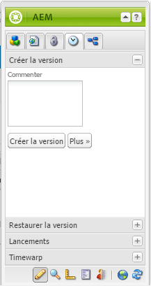
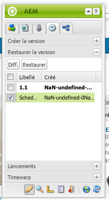
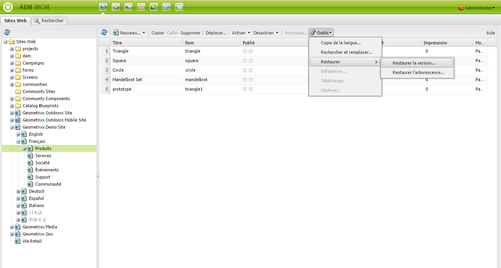
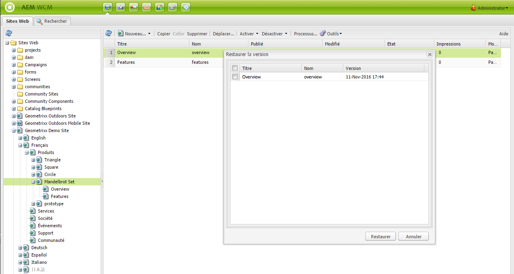
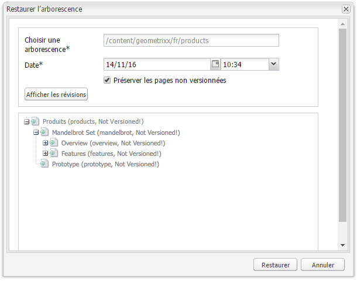
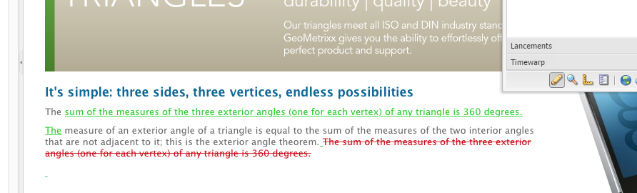
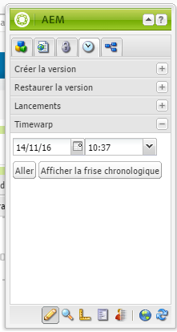
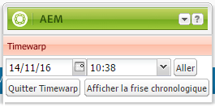
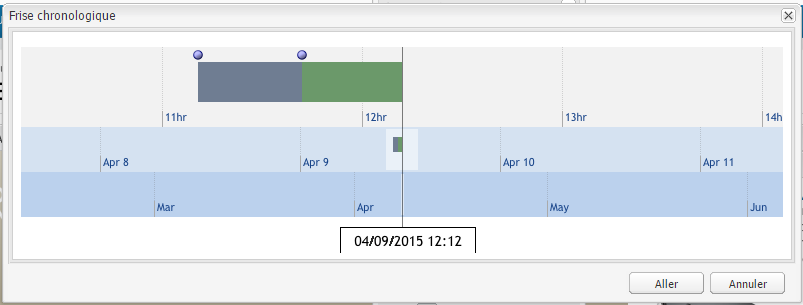
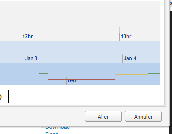

# Utilisation des versions de page{#working-with-page-versions}

>[!CAUTION]
>
>AEM 6.4 a atteint la fin de la prise en charge étendue et cette documentation n’est plus mise à jour. Pour plus d’informations, voir notre [période de support technique](https://helpx.adobe.com/fr/support/programs/eol-matrix.html). Rechercher les versions prises en charge [here](https://experienceleague.adobe.com/docs/?lang=fr).

Le contrôle de version permet de créer un « instantané » d’une page à un moment donné. Avec le contrôle de version, vous pouvez effectuer les opérations suivantes :

* Créez une version d’une page.
* Restaurez une page à une version précédente afin d’annuler une modification que vous avez apportée à une page, par exemple.
* Comparez la version actuelle d’une page à une version précédente avec les différences dans le texte et les images mises en surbrillance.

## Création d’une version   {#creating-a-new-version}

Pour créer une version d’une page :

1. Dans votre navigateur, ouvrez la page pour laquelle vous souhaitez créer une version.
1. Dans le sidekick, sélectionnez la variable **Contrôle de version** , puis le **Créer une version** sous-onglet.

   

1. Entrez un commentaire dans la zone **Commenter** (facultatif).
1. Pour définir un libellé pour la version (facultatif), cliquez sur le bouton **Plus >>** et définissez le **Libellé** pour attribuer un nom à la version. Si le libellé n’est pas défini, la version se voit attribuer un numéro automatiquement incrémenté.
1. Cliquez sur **Créer la version**. Un message grisé s’affiche sur la page ; par exemple :

   Version 1.2 créée pour : Chemises.

>[!NOTE]
>
>Une version est automatiquement créée lorsque la page est activée.

## Restauration d’une version de page à partir du sidekick {#restoring-a-page-version-from-sidekick}

Pour restaurer la page dans une version précédente :

1. Ouvrez la page pour laquelle vous souhaitez restaurer une version précédente.
1. Dans le sidekick, sélectionnez la variable **Contrôle de version** , puis le **Restaurer la version** sous-onglet.

   

1. Sélectionnez la version à restaurer, puis cliquez/appuyez sur **Restaurer**.

## Restauration d’une version de page à partir de la console {#restoring-a-page-version-from-the-console}

Appliquez cette méthode pour restaurer une version de page. Il peut également être utilisé pour restaurer des pages qui ont été supprimées précédemment :

1. Dans le **Sites web** , accédez à la page à restaurer, puis sélectionnez-la.
1. Dans le menu supérieur, sélectionnez **Outils**, puis **Restaurer**:

   

1. Sélectionnez ** Restaurer la version...** répertorie les versions des documents dans le dossier actif. Même si une page a été supprimée, sa dernière version est répertoriée :

   

1. Sélectionnez la version à restaurer, puis cliquez sur **Restaurer**. AEM restaure la ou les versions (ou arborescences) sélectionnées.

### Restauration d’une arborescence à partir de la console {#restoring-a-tree-from-the-console}

Appliquez cette méthode pour restaurer une version de page. Il peut également être utilisé pour restaurer des pages qui ont été supprimées précédemment :

1. Dans le **Sites web** , accédez au dossier à restaurer, puis sélectionnez-le.
1. Dans le menu supérieur, sélectionnez **Outils**, puis **Restaurer**.
1. Sélectionnez **Restaurer l’arborescence** pour afficher une boîte de dialogue qui permet de sélectionner l’arborescence à restaurer :

   

1. Cliquez sur **Restaurer**. AEM restaure l’arborescence que vous avez sélectionnée.

## Comparaison avec une version précédente {#comparing-with-a-previous-version}

Pour comparer la version actuelle de la page à une version précédente :

1. Dans votre navigateur, ouvrez la page pour laquelle effectuer la comparaison avec une version précédente.
1. Dans le sidekick, sélectionnez l’onglet **Création de versions**, puis le sous-onglet **Restaurer la version**.

   

1. Sélectionnez la version pour laquelle effectuer la comparaison, puis cliquez sur le bouton **Diff**.
1. Les différences entre la version actuelle et la version sélectionnée sont signalées de la façon suivante :

   * Le texte qui a été supprimé est rouge et est barré.
   * Le texte qui a été ajouté est vert et mis en surbrillance.
   * Les images qui ont été ajoutées ou supprimées sont entourées de vert.

   

1. Dans le sidekick, sélectionnez la variable **Restaurer la version** et cliquez sur le sous-onglet **&lt;&lt;back span=&quot;&quot; id=&quot;3&quot; translate=&quot;no&quot; /> pour afficher la version actuelle.**

## Distorsion du temps Timewarp {#timewarp}

La fonction de distorsion du temps Timewarp permet de simuler l’état ***publié*** d’une page à des moments spécifiques dans le passé.

L’objectif est de vous permettre d’effectuer le suivi du site web publié au moment sélectionné. Cette opération utilise les activations de page pour déterminer l’état de l’environnement de publication.

Pour ce faire :

* Le système recherche la version de page principale à l’heure sélectionnée.
* Cela signifie que la version affichée a été créée/activée. *before* point dans le temps sélectionné dans Timewarp.
* Lorsque vous accédez à une page qui a été supprimée, celle-ci s’affiche également, à condition que les anciennes versions de la page soient toujours disponibles dans le référentiel.
* Si aucune version publiée n’est trouvée, la fonction Timewarp revient à l’état actuel de la page dans l’environnement de création (ceci afin d’éviter une erreur/page 404, ce qui signifie que vous ne pouvez plus naviguer).

>[!NOTE]
>
>Si des versions sont supprimées du référentiel, Timewarp ne peut pas afficher la vue correcte. En outre, si des éléments (tels que du code, des css, des images, etc.) pour le rendu du site web ont été modifiés, la vue sera différente de ce qu’elle était initialement, car ces éléments ne sont pas versionnés dans le référentiel.

### Utilisation du calendrier Timewarp {#using-the-timewarp-calendar}

Timewarp est disponible à partir du sidekick.

La version Calendrier est utilisée si vous avez un jour spécifique à afficher :

1. Ouvrez le **Contrôle de version** puis cliquez sur **Timewarp** (près du bas du sidekick). La boîte de dialogue suivante s’affiche :

   

1. À l’aide des sélecteurs de date et d’heure, spécifiez la date/l’heure de votre choix, puis cliquez sur **Aller**.

   Timewarp affiche la page telle qu’elle se présentait dans son état publié avant/à la date choisie.

   >[!NOTE]
   >
   >Timewarp ne fonctionne entièrement que si vous avez publié la page précédemment. Dans le cas contraire, Timewarp affiche la page en cours dans l’environnement de création.

   >[!NOTE]
   >
   >Si vous accédez à une page qui a été supprimée du référentiel, elle sera correctement rendue si d’anciennes versions de la page sont toujours disponibles dans le référentiel.

   >[!NOTE]
   >
   >Vous ne pouvez pas modifier l’ancienne version de la page. Elle est disponible uniquement à des fins d’affichage. Si vous souhaitez restaurer l’ancienne version, vous devrez procéder manuellement à l’aide de la fonction [Restaurer](/help/sites-classic-ui-authoring/classic-page-author-work-with-versions.md#restoring-a-page-version-from-sidekick).

1. Une fois la consultation de la page terminée, cliquez sur :

   * **Quitter Timewarp** pour quitter la fonctionnalité et revenir à la page de création en cours.
   * [Afficher la frise chronologique](#using-the-timewarp-timeline) pour afficher la frise chronologique.

   

### Utilisation de la chronologie Timewarp {#using-the-timewarp-timeline}

La version de la chronologie est utilisée si vous souhaitez afficher un aperçu des activités de publication sur la page.

Si vous souhaitez afficher la chronologie du document :

1. Pour afficher la chronologie, vous pouvez effectuer l’une des opérations suivantes :

   1. Ouvrez le **Contrôle de version** puis cliquez sur **Timewarp** (près du bas du sidekick).
   1. Utilisez la boîte de dialogue du sidekick qui s’affiche après avoir [utilisé le calendrier Timewarp](#using-the-timewarp-calendar).

1. Cliquez sur **Afficher la frise chronologique**. La frise chronologique du document s’affiche alors, par exemple :

   

1. Pour naviguer dans la frise chronologique du document, procédez par glisser-déplacer.

   * Toutes les lignes indiquent les versions publiées.

      Une nouvelle ligne commence lorsqu’une page est activée. Une nouvelle couleur apparaît chaque fois que le document est modifié.

      Dans l’exemple ci-dessous, la ligne rouge indique que la page a été modifiée au cours de la période correspondant à la version verte initiale, tandis que la ligne jaune indique qu’elle a été modifiée pendant la version rouge, etc.
   

1. Cliquez sur :

   1. **Aller** pour afficher le contenu de la page publiée au moment sélectionné.
   1. **Quitter Timewarp** pour quitter la fonctionnalité et revenir à la page de création en cours.

### Limites du mode Timewarp

Timewarp s’efforce de reproduire au mieux une page à un moment donné. Toutefois, en raison de la complexité de la création continue de contenu dans AEM, cela n’est pas toujours possible. Ces restrictions doivent être prises en compte lors de l’utilisation de Timewarp.

* **Timewarp fonctionne sur la base de pages publiées** : toutes les fonctionnalités de Timewarp ne sont disponibles que si vous avez publié la page précédemment. Dans le cas contraire, Timewarp affiche la page en cours dans l’environnement de création.
* **Timewarp utilise des versions de page** : si vous accédez à une page qui a été supprimée du référentiel, elle s’affiche correctement si d’anciennes versions sont toujours disponibles dans le référentiel.
* **Les versions supprimées affectent Timewarp** : si des versions sont supprimées du référentiel, Timewarp n’est pas en mesure d’afficher la vue correcte.
* **Timewarp est en lecture seule** : vous ne pouvez pas modifier l’ancienne version de la page. Elle est disponible uniquement à des fins d’affichage. Si vous souhaitez restaurer l’ancienne version, vous devrez procéder manuellement à l’aide de la fonction Restaurer.
* **Timewarp est basé uniquement sur le contenu de page** : si des éléments destinés au rendu du site web (tels que du code, des feuilles css, des ressources/images, etc.) ont été modifiés, la vue sera différente de ce qu’elle était initialement, étant donné que ces éléments n’ont pas de suivi de version dans le référentiel.

>[!CAUTION]
>
>Timewarp est un outil conçu pour aider les auteurs à comprendre et à créer du contenu. Il ne s’agit pas d’un journal d’audit et il n’est pas destiné à des fins juridiques.
