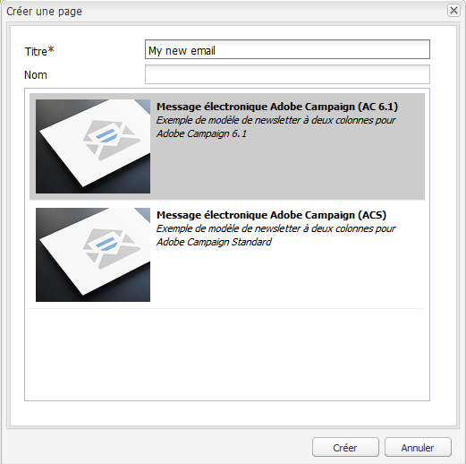
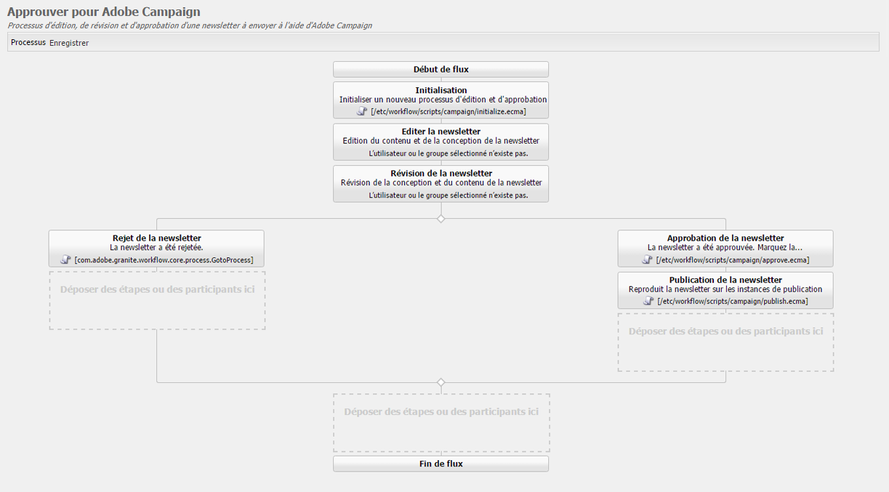

# Utilisation d’Adobe Campaign 6.1 et d’Adobe Campaign Standard{#working-with-adobe-campaign-and-adobe-campaign-standard}

Vous pouvez créer le contenu d’un courrier électronique dans AEM et le traiter dans les courriers électroniques Adobe Campaign. À cet effet, vous devez suivrez cette procédure :

1. Créez une newsletter dans AEM à partir d’un modèle spécifique à Adobe Campaign.
1. Sélectionnez [un service Adobe Campaign](#selectingtheadobecampaigncloudservice) avant de modifier le contenu pour accéder à toutes les fonctionnalités.
1. Modifiez le contenu.
1. Validez le contenu.

Le contenu peut alors être synchronisé avec une diffusion dans Adobe Campaign. Ce document contient des instructions détaillées.

>[!NOTE]
>
>Avant de pouvoir utiliser cette fonctionnalité, vous devez configurer AEM de manière à l’intégrer à [Adobe Campaign](/help/sites-administering/campaignonpremise.md) ou à [Adobe Campaign Standard](/help/sites-administering/campaignstandard.md).

## Envoi du contenu d’un courrier électronique via Adobe Campaign {#sending-email-content-via-adobe-campaign}

Une fois que vous avez configuré AEM et Adobe Campaign, vous pouvez créer du contenu à diffuser par courrier électronique directement dans AEM, puis le traiter dans Adobe Campaign.

Lorsque vous créez du contenu Adobe Campaign dans AEM, vous devez créer un lien vers un service Adobe Campaign avant de modifier le contenu pour accéder à toutes les fonctionnalités.

Deux cas de figure peuvent se présenter :

* Le contenu peut être synchronisé avec une diffusion à partir d’Adobe Campaign. Cela vous permet d’utiliser du contenu AEM dans une diffusion.
* (Version locale d’Adobe Campaign uniquement) Le contenu peut être envoyé directement vers Adobe Campaign, qui génère automatiquement une nouvelle diffusion par courrier électronique. Ce mode comporte des limitations.

Ce document contient des instructions détaillées.

### Création de contenu de courrier électronique {#creating-new-email-content}

>[!NOTE]
>
>When adding email templates, be sure to add them under **/content/campaigns** to make them available.

1. In AEM, select the **Websites** folder then browse your explorer to find where your email campaigns are managed. In the following example, the node concerned is **Websites** > **Campaigns** > **Geometrixx Outdoors** > **Email Campaigns**.

   >[!NOTE]
   >
   >[Les exemples de messages électroniques ne sont disponibles que dans Geometrixx](/help/sites-developing/we-retail.md#weretail). Téléchargez un exemple de contenu Geometrixx à partir de Package Share.

   

1. Select **New** > **New Page** to create new email content.
1. Sélectionnez l’un des modèles disponibles spécifiques à Adobe Campaign, puis renseignez les propriétés générales de la page. Par défaut, trois modèles sont disponibles :

   * **Adobe Campaign Email (AC 6.1)** : permet d’ajouter du contenu à un modèle prédéfini avant de l’envoyer vers Adobe Campaign 6.1 pour diffusion.
   * **Adobe Campaign Email (ACS)** : permet d’ajouter du contenu à un modèle prédéfini avant de l’envoyer vers Adobe Campaign Standard pour diffusion.

   

1. Click **Create** to create your email or newsletter.

### Sélection du service de cloud et du modèle d’Adobe Campaign {#selecting-the-adobe-campaign-cloud-service-and-template}

Pour l’intégration à Adobe Campaign, vous devez ajouter un service de cloud Adobe Campaign dans la page. Cela vous permet d’accéder à la personnalisation et à d’autres informations Adobe Campaign.

De plus, vous pouvez également avoir à sélectionner le modèle Adobe Campaign et à modifier l’objet et ajouter du texte brut pour les utilisateurs qui ne lisent pas le courrier électronique au format HTML.

1. Select the **Page** tab in the sidekick, then select **Page properties.**
1. In the **Cloud services** tab in the pop-up window, select **Add Service** to add the Adobe Campaign service and click **OK**.

   

1. Sélectionnez la configuration qui correspond à votre instance Adobe Campaign dans la liste déroulante, puis cliquez sur **OK**.

   >[!NOTE]
   >
   >Après avoir ajouté le service de cloud, veillez à appuyer/cliquer sur **OK** ou **Appliquer**. Cela permet à l’onglet **Adobe Campaign** de fonctionner correctement.

1. If you would like to apply a specific email delivery template (from Adobe Campaign), other than the default **mail** template, select **Page properties** again. In the **Adobe Campaign** tab, enter the email delivery template&#39;s internal name in the related Adobe Campaign instance.

   Dans Adobe Campaign Standard, le modèle est **Diffusion avec contenu AEM**. Dans Adobe Campaign 6.1, le modèle est **Diffusion par courrier électronique avec contenu AEM**.

   When you select the template, AEM automatically enables the **Adobe Campaign Newsletter** components.

### Modification du contenu d’un courrier électronique {#editing-email-content}

Vous pouvez modifier le contenu d’un courrier électronique dans l’interface utilisateur classique ou l’interface utilisateur optimisée pour les écrans tactiles.

1. Enter the subject and the text version of the email by selecting **Page properties** > **Email** from the toolbox.

   

1. Modifiez le contenu du courrier électronique en ajoutant les éléments de votre choix disponibles dans le sidekick. À cet effet, faites-les glisser. Ensuite, double-cliquez sur l’élément à modifier.

   Par exemple, vous pouvez ajouter du texte contenant des champs de personnalisation.

   

   Pour une description des composants disponibles pour les campagnes de newsletter/courrier électronique, reportez-vous à la section [Composants Adobe Campaign](/help/sites-classic-ui-authoring/classic-personalization-ac-components.md).

   

### Insertion d’une personnalisation {#inserting-personalization}

Lorsque vous modifiez votre contenu, vous pouvez insérer les éléments suivants :

* Champs de contexte Adobe Campaign. Il s’agit de champs que vous pouvez insérer dans votre texte et qui s’adapteront en fonction des données du destinataire (par exemple, prénom, nom ou toute donnée de la dimension cible).
* Blocs de personnalisation Adobe Campaign. Il s’agit de blocs de contenu prédéfini qui ne sont pas liés aux données du destinataire, tels qu’un logo de marque ou un lien vers une page miroir.

Pour une description complète des composants Adobe Campaign, reportez-vous à la section [Composants Adobe Campaign](/help/sites-classic-ui-authoring/classic-personalization-ac-components.md).

>[!NOTE]
>
>* Seuls les champs de la dimension cible **Profils** d’Adobe Campaign sont pris en compte.
>* When viewing Properties from **Sites**, you do not have access to the Adobe Campaign context fields. Vous pouvez y accéder directement à partir du courrier électronique en cours de modification.

>

1. Insert a new **Newsletter** > **Text &amp; Personalization (Campaign)** component.
1. Ouvrez le composant en double-cliquant dessus. La fenêtre **Modifier** dispose d’une fonctionnalité, qui permet d’insérer des éléments de personnalisation.

   >[!NOTE]
   >
   >Les champs de contexte disponibles correspondent à la dimension cible de **Profils** dans Adobe Campaign.
   >
   >See [Linking an AEM page to an Adobe Campaign email](/help/sites-classic-ui-authoring/classic-personalization-ac-campaign.md#linkinganaempagetoanadobecampaignemail).

   

1. Select **Client Context** in the sidekick to test the personalization fields using the data in the persona profiles.

   

1. Une fenêtre s’affiche et vous permet de sélectionner le persona de votre choix. Les champs de personnalisation sont remplacés automatiquement par des données du profil sélectionné.

   

### Aperçu d’une newsletter {#previewing-a-newsletter}

Vous pouvez prévisualiser la newsletter telle qu’elle se présentera, ainsi que la personnalisation.

1. Ouvrez la newsletter pour laquelle vous souhaitez afficher un aperçu et cliquez sur Aperçu (loupe) pour réduire le sidekick.
1. Cliquez sur l’une des icônes de client de messagerie pour découvrir comment se présente votre newsletter dans les différents clients de messagerie.

   

1. Développez le sidekick pour reprendre la modification.

### Approbation du contenu dans AEM {#approving-content-in-aem}

Une fois le contenu terminé, vous pouvez commencer la procédure d’approbation. Go to the **Workflow** tab of the toolbox and select the **Approve for Adobe Campaign** workflow.

Ce worfklow prêt à l’emploi comporte deux étapes : révision, puis approbation ou révision puis rejet. Néanmoins, ce worfklow peut être étendu et adapté à une procédure plus complexe.

Pour approuver le contenu pour Adobe Campaign, appliquez le worfklow en sélectionnant **Worfklow** dans le sidekick et en sélectionnant **Approuver pour Adobe Campaign** et cliquez sur **Démarrer le worfklow**. Parcourez les étapes et approuvez le contenu. Vous pouvez également rejeter le contenu en sélectionnant **Rejeter** au lieu de **Approuver** dans la dernière étape du worfklow.

Une fois le contenu approuvé, il s’affiche comme approuvé dans Adobe Campaign. Le courrier électronique peut alors être envoyé.

Dans Adobe Campaign Standard :

Dans Adobe Campaign 6.1 :

>[!NOTE]
>
>Le contenu non approuvé peut être synchronisé avec une diffusion dans Adobe Campaign, mais la diffusion ne peut pas être exécutée. Seul le contenu approuvé peut être envoyé via les diffusions Adobe Campaign.

## Liaison d’AEM à Adobe Campaign Standard et à Adobe Campaign 6.1 {#linking-aem-with-adobe-campaign-standard-and-adobe-campaign}

>[!NOTE]
>
>See [Linking AEM with Adobe Campaign Standard and Adobe Campaign 6.1](/help/sites-authoring/campaign.md#linking-aem-with-adobe-campaign-standard-and-adobe-campaign-classic) under [Working with Adobe Campaign 6.1 and Adobe Campaign Standard](/help/sites-authoring/campaign.md) in the standard authoring docurmentation for details.

