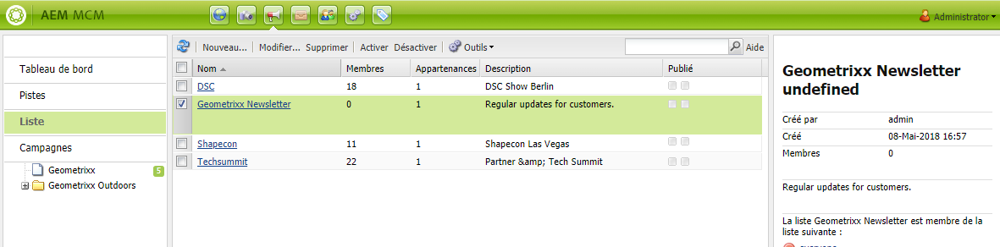
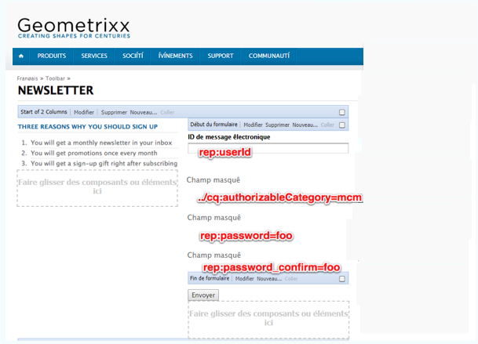
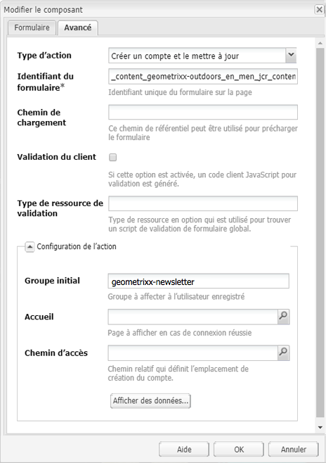

# Créer une page d’entrée efficace pour une newsletter{#creating-an-effective-newsletter-landing-page}

>[!CAUTION]
>
>AEM 6.4 a atteint la fin de la prise en charge étendue et cette documentation n’est plus mise à jour. Pour plus d’informations, voir notre [période de support technique](https://helpx.adobe.com/fr/support/programs/eol-matrix.html). Rechercher les versions prises en charge [here](https://experienceleague.adobe.com/docs/?lang=fr).

Une page d’entrée efficace pour newsletter vous permet d’obtenir le plus de personnes possible pour s’inscrire à votre newsletter (ou à toute autre campagne de marketing par e-mail). Vous pouvez utiliser les informations que vous collectez à partir des abonnements à vos newsletters pour obtenir des pistes.

Pour créer une landing page de newsletter efficace, vous devez effectuer les opérations suivantes :

1. Créez une liste pour la newsletter afin que les utilisateurs puissent s’abonner à cette dernière.
1. Créez le formulaire d’inscription. Pour ce faire, ajoutez une étape de workflow qui ajoute automatiquement la personne qui s’inscrit à la newsletter à votre liste de pistes.
1. Créez une page de confirmation qui remercie les utilisateurs de s’être inscrits et leur fournit éventuellement une promotion.
1. Ajoutez des teasers.

>[!NOTE]
>
>Adobe ne prévoit pas d’optimiser cette fonctionnalité (Gestion des prospects et des listes).\
>Il est recommandé d’utiliser [Adobe Campaign et son intégration à AEM](/help/sites-administering/campaign.md).

## Création d’une liste pour la newsletter {#creating-a-list-for-the-newsletter}

Créez une liste, par exemple : **Newsletter sur les Geometrixx**, dans MCM pour la newsletter à laquelle les utilisateurs doivent s’abonner. La création de listes est décrite dans la section [Création de listes](/help/sites-classic-ui-authoring/classic-personalization-campaigns.md#creatingnewlists). 

Voici un exemple de liste :

## Créer un formulaire d’inscription {#create-a-sign-up-form}

Créez un formulaire d’inscription à la newsletter qui permet aux utilisateurs de s’abonner aux balises. L’exemple de site web de Geometrixx fournit une page de newsletter dans la barre d’outils de Geometrixx où vous pouvez créer votre formulaire.

Pour créer votre propre formulaire de newsletter, reportez-vous aux informations sur la création de formulaires dans le [Documentation Forms](/help/sites-authoring/default-components.md#form). La newsletter utilise les balises de la bibliothèque de balises. Pour ajouter des balises supplémentaires, reportez-vous à la section [Administration des balises](/help/sites-authoring/tags.md#tagadministration).

Les champs masqués de l&#39;exemple suivant fournissent le minimum d&#39;informations (email). en outre, vous pouvez ajouter d’autres champs ultérieurement, mais cela aura un impact sur le taux de conversion.

L’exemple suivant est un formulaire créé à l’adresse http://localhost:4502/cf#/content/geometrixx/en/toolbar/newsletter.html.

1. Créez le formulaire.

   

1. Cliquez sur **Modifier** dans le composant de formulaire pour configurer le formulaire d’une page de remerciement (reportez-vous à la section [Création de pages de remerciement](#creating-a-thank-you-page)).

   

1. Définissez l’action de formulaire (ce qui se passe lorsque vous envoyez le formulaire) et configurez le groupe pour affecter les utilisateurs inscrits à la liste que vous avez créée précédemment (par exemple, geometrixx-newsletter).

   

## Création d’une page de remerciement {#creating-a-thank-you-page}

Lorsque les utilisateurs cliquent **S’abonner maintenant**, vous souhaitez qu’une page de remerciement s’ouvre automatiquement. Créez la page de remerciement dans la page Newsletter Geometrixx. Après avoir créé le formulaire Newsletter, modifiez le composant Formulaire et ajoutez le chemin d’accès à la page de remerciement.

L’envoi de la requête conduit l’utilisateur à une **Merci** après laquelle ils recevront un e-mail. Cette page de remerciement a été créée sous /content/geometrixx/en/toolbar/newsletter/thanks_you.

## Ajout de teasers {#adding-teasers}

Ajoutez des [teasers](/help/sites-classic-ui-authoring/classic-personalization-campaigns.md#teasers) pour cibler des audiences spécifiques. Par exemple, vous pouvez ajouter des teasers aux pages de remerciement et d’inscription à la newsletter.

Pour ajouter des teasers afin de créer une page d’entrée efficace pour newsletter :

1. Créez un paragraphe de teaser pour un cadeau d’inscription. Sélectionner **First** comme stratégie et inclure du texte qui les informe du cadeau qu’ils recevront.

   

1. Créez un paragraphe de teaser pour la page de remerciement. Sélectionner **First** comme stratégie et inclure du texte indiquant que le cadeau est en route.

   

1. Créez une campagne avec les deux teasers — marquez l’un avec l’activité et l’autre sans balise.

## Envoyer du contenu aux abonnés {#pushing-content-to-subscribers}

Envoyez les modifications aux pages par le biais de la fonctionnalité Newsletter dans MCM. Vous pouvez ensuite envoyer du contenu mis à jour aux abonnés.

Voir [Envoi de newsletters](/help/sites-classic-ui-authoring/classic-personalization-campaigns.md#newsletters).
