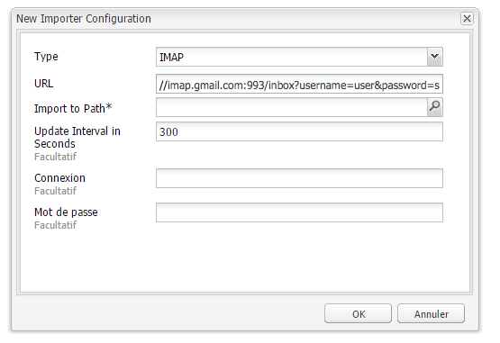

# Suivi des e-mails rejetés{#tracking-bounced-emails}

>[!CAUTION]
>
>AEM 6.4 a atteint la fin de la prise en charge étendue et cette documentation n’est plus mise à jour. Pour plus d’informations, voir notre [période de support technique](https://helpx.adobe.com/fr/support/programs/eol-matrix.html). Rechercher les versions prises en charge [here](https://experienceleague.adobe.com/docs/?lang=fr).

>[!NOTE]
>
>Adobe ne prévoit pas de continuer à améliorer le suivi des e-mails ouverts et des rebonds envoyés par le service SMTP AEM.
>
>Nous vous recommandons d’[exploiter Adobe Campaign et son intégration AEM](/help/sites-administering/campaign.md).

Lorsque vous envoyez une newsletter à de nombreux utilisateurs, la liste contient généralement des adresses électroniques non valides. L&#39;envoi de newsletters à ces adresses rebondit. AEM est capable de gérer ces rebonds et peut arrêter d’envoyer des newsletters à ces adresses après le dépassement du compteur de rebonds configuré. Par défaut, le taux de rebonds est défini sur 3, mais cette valeur est configurable.

Pour configurer AEM pour effectuer le suivi des messages rejetés, vous devez configurer AEM pour interroger une boîte aux lettres existante dans laquelle les messages rejetés sont reçus (il s’agit généralement de l’adresse électronique &quot;de&quot; que vous indiquez où vous envoyez la newsletter). AEM sonde cette boîte aux lettres et importe tous les messages sous le chemin indiqué dans la configuration de sondage. Un workflow est ensuite déclenché pour rechercher les adresses électroniques rebonds dans les utilisateurs et met à jour la valeur de la propriété bounceCounter de l’utilisateur en conséquence. Une fois le nombre maximal de rebonds configuré dépassé, l’utilisateur est supprimé de la liste des newsletters.

## Configuration de l’importateur de flux {#configuring-the-feed-importer}

L’importateur de flux vous permet d’importer du contenu provenant de sources externes de manière répétée dans votre référentiel. Avec cette configuration de l’importateur de flux, AEM recherche les mails rebonds dans la boîte aux lettres de l’expéditeur.

Pour configurer l’importateur de flux en vue du suivi des messages rejetés :

1. Dans **Outils**, sélectionnez l’importateur de flux.

1. Cliquez sur **Ajouter** pour créer une configuration.

   

1. Ajoutez une nouvelle configuration en sélectionnant le type et en ajoutant des informations à l’URL d’interrogation pour configurer l’hôte et le port. En outre, vous devez ajouter à la requête URL des paramètres spécifiques à l’adresse et au protocole. Définissez la configuration pour qu’elle interroge au moins une fois par jour.

   Toutes les configurations nécessitent des informations sur les éléments suivants dans l’URL d’interrogation :

   `username` : nom d’utilisateur à utiliser pour la connexion.

   `password` : mot de passe à utiliser pour la connexion.

   En outre, selon le protocole, vous pouvez configurer certains paramètres.

   **Propriétés de configuration POP3 :**

   `pop3.leave.on.server` : permet d’indiquer si des messages doivent être laissés ou non sur le serveur. Définissez la valeur sur « true » pour laisser les messages sur le serveur et sur « false » dans le cas contraire. La valeur par défaut est « true ».

   **Exemples POP3 :**

   | pop3s://pop.gmail.com:995/INBOX?username=user&amp;password=secret | Utilisation de pop3 sur SSL pour se connecter à GMail sur le port 995 avec user/secret, laissant les messages sur le serveur par défaut |
   |---|---|
   | pop3s://pop.gmail.com:995/INBOX?username=user&amp;password=secret&amp;pop3.leave.on.server=false | pop3s://pop.gmail.com:995/INBOX?username=user&amp;password=secret&amp;pop3.leave.on.server=false |

   **Propriétés de configuration IMAP :**

   Permet de définir des indicateurs à rechercher.

   `imap.flag.SEEN` :« false » pour les nouveaux messages ou les messages non consultés ; « true » pour les messages déjà lus

   Pour consulter la liste complète des indicateurs, reportez-vous à la page [https://java.sun.com/products/javamail/javadocs/javax/mail/Flags.Flag.html](https://java.sun.com/products/javamail/javadocs/javax/mail/Flags.Flag.html).

   **Exemples IMAP :**

   | imaps://imap.gmail.com:993/inbox?username=user&amp;password=secret | Utilisation d’IMAP sur SSL pour se connecter à GMail sur le port 993 avec user/secret. Obtention de nouveaux messages uniquement par défaut. |
   |---|---|
   | imaps://imap.gmail.com:993/inbox?username=user&amp;password=secret&amp;imap.flag.SEEN=true | Utilisation d’IMAP sur SSL pour se connecter à GMail 993 avec l’utilisateur/le secret, pour obtenir uniquement les messages déjà consultés. |
   | imaps://imap.gmail.com:993/inbox?username=user&amp;password=secret&amp;imap.flag.SEEN=true&amp;imap.flag.SEEN=false | Utilisation d’IMAP sur SSL pour se connecter à GMail 993 avec l’utilisateur/le secret, obtention de messages déjà lus OU nouveaux. |

1. Enregistrez la configuration.

## Configuration du composant du service de newsletter {#configuring-the-newsletter-service-component}

Après avoir configuré l’importateur de flux, vous devez configurer l’adresse De et le compteur de rebonds.

Pour configurer le service de newsletter :

1. Entrez dans la console OSGi `<host>:<port>/system/console/configMgr` et accédez à **Newsletter MCM**.

1. Configurez le service et enregistrez les modifications une fois cette opération terminée.

   

   Les configurations suivantes peuvent être définies pour ajuster le comportement :

   | Compteur de rebond maximal (max.bounce.count) | Définit le nombre de rebonds jusqu’à ce qu’un utilisateur soit omis lors de l’envoi d’une newsletter. La définition de cette valeur sur 0 désactive complètement la vérification de rebond. |
   |---|---|
   | Activity No Cache (sent.activity.nocache) | Définit le paramètre de cache à utiliser pour l’activité d’envoi de newsletter |

   Une fois enregistré, le service de newsletter MCM effectue les opérations suivantes :

   * Écrit une activité dans le flux masqué des utilisateurs lors de l’envoi réussi d’une newsletter.
   * Écrit une activité si un rebond est détecté et que le compteur de rebond des utilisateurs change.
