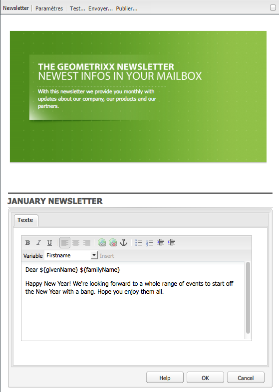
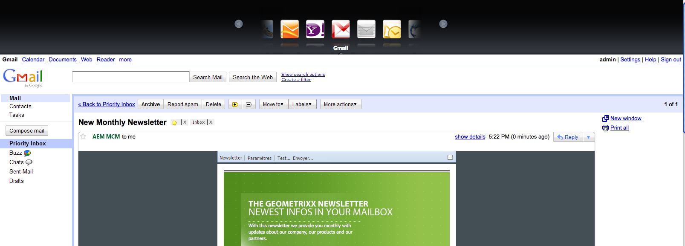
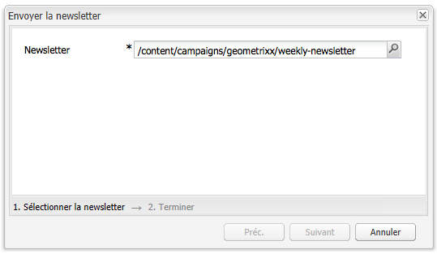

# Marketing par e-mail{#e-mail-marketing}

>[!CAUTION]
>
>AEM 6.4 a atteint la fin de la prise en charge étendue et cette documentation n’est plus mise à jour. Pour plus d’informations, voir notre [période de support technique](https://helpx.adobe.com/fr/support/programs/eol-matrix.html). Rechercher les versions prises en charge [here](https://experienceleague.adobe.com/docs/?lang=fr).

>[!NOTE]
>
>Adobe ne prévoit pas d&#39;améliorer davantage les emails ouverts/rebonds envoyés par le service SMTP AEM.\
>Nous vous recommandons d’[exploiter Adobe Campaign et son intégration AEM](/help/sites-administering/campaign.md).

Le marketing par e-mail (par exemple, les newsletters) est une partie importante de toute campagne marketing, car vous l’utilisez pour pousser du contenu vers vos pistes. Dans AEM, vous pouvez créer des newsletters à partir de contenu AEM existant et ajouter un nouveau contenu, spécifique aux newsletters.

Une fois créées, vous pouvez envoyer les newsletters à des groupes spécifiques d’utilisateurs immédiatement ou à un autre moment planifié (à l’aide d’un workflow). En outre, les utilisateurs peuvent s’abonner à des newsletters au format de leur choix.

En outre, AEM vous permet d’administrer la fonctionnalité de newsletter, notamment la gestion des rubriques, l’archivage des newsletters et l’affichage des statistiques sur les newsletters.

>[!NOTE]
>
>Dans Geometrixx, le modèle de newsletter ouvre automatiquement l’éditeur d’email. Vous pouvez utiliser l’éditeur d’email dans d’autres modèles dans lesquels vous souhaitez envoyer des emails, par exemple des invitations. L’éditeur de courrier électronique s’affiche chaque fois qu’une page est héritée de **mcm/components/newsletter/page**.

Ce document décrit les principes de base de la création de newsletters dans AEM. Pour plus d’informations sur l’utilisation du marketing par e-mail, consultez les documents suivants :

* [Création d’une page d’entrée efficace pour une newsletter](/help/sites-classic-ui-authoring/classic-personalization-campaigns-email-landingpage.md)
* [Gestion des abonnements](/help/sites-classic-ui-authoring/classic-personalization-campaigns-email-subscriptions.md)
* [Publication d’un e-mail sur des services de messagerie](/help/sites-classic-ui-authoring/classic-personalization-campaigns-email-newsletters.md)
* [Suivi des e-mails rejetés](/help/sites-classic-ui-authoring/classic-personalization-campaigns-email-tracking-bounces.md)

>[!NOTE]
>
>Si vous mettez à jour les fournisseurs de messagerie, effectuez un test en ligne ou envoyez une newsletter, ces opérations échouent si la newsletter n’est pas publiée au préalable sur l’instance de publication ou si l’instance de publication n’est pas disponible. Veillez à publier votre newsletter et à ce que l’instance de publication soit en cours d’exécution.

## Création d’une expérience de newsletter {#creating-a-newsletter-experience}

>[!NOTE]
>
>Les notifications électroniques doivent être configurées via la configuration osgi. Voir [Configuration des notifications par e-mail.](/help/sites-administering/notification.md)

1. Sélectionnez votre nouvelle campagne dans le volet de gauche ou double-cliquez dessus dans le volet de droite.

1. Sélectionnez la vue Liste à l’aide de l’icône :

   

1. Cliquez sur **Nouveau...**

   Vous pouvez spécifier la variable **Titre**, **Nom** et le type d&#39;expérience à créer ; dans ce cas, Newsletter.

   

1. Cliquez sur **Créer**.

1. Une nouvelle boîte de dialogue s’ouvre immédiatement. Vous pouvez y saisir les propriétés de la newsletter.

   **Liste des destinataires par défaut** est un champ obligatoire, dans la mesure où il s’agit du point de contact pour la newsletter (pour plus d’informations sur les listes, voir [Utilisation de listes](/help/sites-classic-ui-authoring/classic-personalization-campaigns.md#workingwithlists)).

   

   * **Nom de l’expéditeur**

      Nom qui doit apparaître comme celui de l’expéditeur de la newsletter.

   * **Adresse de l’expéditeur**

      Adresse électronique qui doit apparaître comme celle de l&#39;expéditeur de la newsletter.

   * **Objet**

      Sujet de la newsletter

   * **Répondre à**

      Adresse électronique pour le traitement des réponses pour la newsletter envoyée.

   * **Description**

      Description de la newsletter.

   * **Heure d’activation**

      Heure d’activation pour l’envoi de la newsletter.

   * **Liste des destinataires par défaut**

      Liste par défaut qui doit recevoir la newsletter.
   Elles peuvent être mises à jour ultérieurement à partir de la variable **Propriétés...** boîte de dialogue.

1. Cliquez sur **OK** pour enregistrer.

## Ajout de contenu aux newsletters {#adding-content-to-newsletters}

Vous pouvez ajouter du contenu, y compris du contenu dynamique, à votre newsletter comme vous le feriez dans n’importe quel composant AEM. Dans Geometrixx, certains composants du modèle Newsletter sont disponibles pour l’ajout et la modification de contenu dans les newsletters.

1. Dans le MCM, cliquez sur le **Campagnes** et double-cliquez sur la newsletter à laquelle vous souhaitez ajouter du contenu ou que vous souhaitez modifier. La newsletter s’ouvre.

1. Si les composants ne sont pas visibles, accédez à la vue Conception et activez les composants nécessaires (par exemple, les composants Newsletter) avant de commencer la modification.
1. Saisissez le texte, les images ou d’autres composants appropriés. Dans l’exemple de Geometrixx, 4 composants sont disponibles : Texte, Image, En-tête et 2 colonnes. Votre newsletter peut comporter plus ou moins de composants selon la manière dont vous la configurez.

   >[!NOTE]
   >
   >Vous personnalisez des newsletters à l’aide de variables. Dans la newsletter Geometrixx, les variables sont disponibles dans le composant Texte . Les valeurs des variables sont héritées des informations du profil utilisateur.

   

1. Pour insérer des variables, sélectionnez la variable dans la liste, puis cliquez sur **Insérer**. Les variables sont renseignées à partir du profil.

## Personnalisation des newsletters {#personalizing-newsletters}

Vous personnalisez les newsletters en insérant des variables prédéfinies dans le composant Texte des newsletters dans Geometrixx. Les valeurs des variables sont héritées des informations du profil utilisateur.

Vous pouvez également simuler la manière dont une newsletter est personnalisée en utilisant le contexte client et en chargeant un profil.

Pour personnaliser une newsletter et simuler son aspect :

1. Dans MCM, ouvrez la newsletter pour laquelle vous souhaitez personnaliser les paramètres.

1. Ouvrez le composant Texte que vous souhaitez personnaliser.

1. Placez le curseur à l’endroit où vous souhaitez que la variable apparaisse, sélectionnez une variable dans la liste déroulante, puis cliquez sur **Insérer**. Effectuez cette opération pour autant de variables que nécessaire et cliquez sur **OK**.

   

1. Pour simuler l’aspect de la variable lorsqu’elle est envoyée, appuyez sur CTRL+ALT+c pour ouvrir le contexte client et sélectionnez **Chargement**. Sélectionnez l’utilisateur dans la liste dont vous souhaitez charger le profil, puis cliquez sur **OK**.

   Les informations du profil que vous avez chargé renseignent les variables.

   

## Test de newsletters dans divers clients de messagerie électronique {#testing-newsletters-in-different-e-mail-clients}

>[!NOTE]
>
>Avant d’envoyer des newsletters, vérifiez la configuration OSGi pour l’Externaliseur de lien Day CQ à l’adresse `http://localhost:4502/system/console/configMgr`.
>
>Par défaut, la valeur du paramètre est `localhost:4502` et l’opération ne peut pas être menée à bien en cas de modification du port d’exécution de l’instance.

Basculer entre les clients de messagerie courants pour afficher un aperçu de la newsletter telle qu’elle sera présentée à vos prospects. Par défaut, votre newsletter s’ouvre avec aucun des clients de messagerie sélectionnés.

Actuellement, vous pouvez afficher des newsletters dans les clients de messagerie suivants :

* Courrier Yahoo
* Gmail
* Hotmail
* Thunderbird
* Microsoft Outlook 2007
* Apple Mail

Pour basculer entre les clients, cliquez sur l’icône correspondante pour afficher la newsletter dans ce client de messagerie :

1. Dans MCM, ouvrez la newsletter pour laquelle vous souhaitez personnaliser les paramètres.

1. Cliquez sur un client de messagerie dans la barre supérieure pour voir à quoi ressemblerait la newsletter dans ce client.

   

1. Répétez cette étape pour tout client de messagerie supplémentaire que vous voulez afficher.

   

## Personnalisation des paramètres de newsletter {#customizing-newsletter-settings}

Bien que seuls les utilisateurs autorisés puissent envoyer une newsletter, vous devez personnaliser les éléments suivants :

* L’objet, de sorte que les utilisateurs souhaitent ouvrir votre email et s’assurer que votre newsletter ne sera pas marquée comme du spam.
* L’adresse de l’expéditeur, par exemple noreply@geometrixx.com, de sorte que les utilisateurs reçoivent un e-mail d’une adresse spécifiée.

Pour personnaliser les paramètres de newsletter :

1. Dans MCM, ouvrez la newsletter pour laquelle vous souhaitez personnaliser les paramètres.

   

1. En haut de la newsletter, cliquez sur **Paramètres**.

   

   1. Saisissez le **De** adresse électronique
   1. Modifiez le **Objet** du courrier électronique, le cas échéant.
   1. Sélectionnez une **Liste des destinataires par défaut** dans la liste déroulante.
   1. Cliquez sur **OK**.

   Lorsque vous testez ou envoyez la newsletter, les destinataires reçoivent des emails avec l’adresse email et l’objet spécifiés.

## Newsletters des tests de vol {#flight-testing-newsletters}

Bien que les tests en vol ne soient pas obligatoires, avant d’envoyer une newsletter, vous pouvez la tester pour vous assurer qu’elle s’affiche comme vous le souhaitez.

Le test en vol permet d&#39;effectuer les opérations suivantes :

* Consultez la newsletter dans [tous les clients prévus](#testing-newsletters-in-different-e-mail-clients).
* Vérifiez que le serveur de messagerie est correctement configuré.
* Déterminez si votre email est signalé comme indésirable. (Veillez à vous inclure dans la liste des destinataires.)

>[!NOTE]
>
>Si vous mettez à jour les fournisseurs de messagerie, effectuez un test en ligne ou envoyez une newsletter, ces opérations échouent si la newsletter n’est pas publiée au préalable sur l’instance de publication ou si l’instance de publication n’est pas disponible. Veillez à publier votre newsletter et à ce que l’instance de publication soit en cours d’exécution.

Pour tester les newsletters :

1. Dans MCM, ouvrez la newsletter que vous souhaitez tester et envoyer.

1. Dans la partie supérieure de la newsletter, cliquez sur **Test** à tester avant l’envoi.

   

1. Saisissez l’adresse électronique de test à laquelle vous souhaitez envoyer la newsletter, puis cliquez sur **Envoyer**. Si vous souhaitez modifier le profil, vous chargez un autre profil dans le contexte client. Pour ce faire, appuyez sur CTRL+ALT+c et sélectionnez Charger et charger un profil.

## Envoi de newsletters {#sending-newsletters}

Vous pouvez envoyer une newsletter à partir de la newsletter ou de la liste. Les deux procédures sont décrites.

>[!NOTE]
>
>Avant d’envoyer des newsletters, vérifiez la configuration OSGi pour l’Externaliseur de lien Day CQ à l’adresse `http://localhost:4502/system/console/configMgr`.
>
>Par défaut, la valeur du paramètre est `localhost:4502` et l’opération ne peut pas être menée à bien en cas de modification du port d’exécution de l’instance.

>[!NOTE]
>
>Si vous mettez à jour les fournisseurs de messagerie, effectuez un test en ligne ou envoyez une newsletter, ces opérations échouent si la newsletter n’est pas publiée au préalable sur l’instance de publication ou si l’instance de publication n’est pas disponible. Veillez à publier votre newsletter et à ce que l’instance de publication soit en cours d’exécution.

### Envoi de newsletters à partir d’une campagne {#sending-newsletters-from-a-campaign}

Pour envoyer une newsletter à partir de la campagne :

1. Dans MCM, ouvrez la newsletter à envoyer.

   >[!NOTE]
   >
   >Avant l’envoi, assurez-vous d’avoir personnalisé l’objet de la newsletter et l’adresse électronique de l’expéditeur en [personnalisant ses paramètres](#customizing-newsletter-settings).
   >
   >Il est recommandé d’effectuer un [test envoi](#flight-testing-newsletters) de la newsletter avant de l’envoyer.

1. Dans la partie supérieure de la newsletter, cliquez sur **Envoyer**. L’assistant Newsletter s’ouvre.

1. Dans la liste des destinataires, sélectionnez la liste à laquelle vous souhaitez envoyer la newsletter, puis cliquez sur **Suivant**.

   

1. La fin de la configuration est confirmée. Cliquez sur **Envoyer** pour envoyer réellement la newsletter.

   

   >[!NOTE]
   >
   >Assurez-vous d’être l’un des destinataires pour vous assurer que la newsletter a été reçue.

### Envoi de newsletters à partir d’une liste {#sending-newsletters-from-a-list}

Pour envoyer une newsletter à partir d’une liste :

1. Dans le MCM, cliquez sur **Listes** dans le volet de gauche.

   >[!NOTE]
   >
   >Avant l’envoi, assurez-vous d’avoir personnalisé l’objet de la newsletter et l’adresse électronique de l’expéditeur en [personnalisant ses paramètres](#customizing-newsletter-settings). Vous ne pouvez pas tester une newsletter si vous l’envoyez à partir de la liste ; vous pouvez [test en vol](#flight-testing-newsletters) si vous l’envoyez à partir de la newsletter.

1. Cochez la case en regard de la liste des prospects auxquels vous souhaitez envoyer la newsletter.

1. Dans le menu **Outils**, sélectionnez **Envoyer la newsletter**. La fenêtre **Envoyer la newsletter** s’ouvre.

   

1. Dans le champ **Newsletter**, sélectionnez la newsletter que vous souhaitez envoyer, puis cliquez sur **Suivant**.

   

1. La fin de la configuration est confirmée. Cliquez sur **Envoyer** pour envoyer la newsletter sélectionnée à la liste de pistes spécifiée.

   

   Votre newsletter est envoyée aux destinataires sélectionnés.

## Abonnement à une newsletter {#subscribing-to-a-newsletter}

Cette section décrit comment s’abonner à une newsletter.

### Abonnement à une newsletter {#subscribing-to-a-newsletter-1}

Pour vous abonner à une newsletter (à l’aide du site web de Geometrixx comme exemple) :

1. Cliquez sur **Sites web** et accédez au Geometrixx **Barre d’outils** et ouvrez-le.

   

1. Dans la newsletter Geometrixx **S’inscrire** , saisissez votre adresse électronique et cliquez sur **S’inscrire**. Vous êtes maintenant abonné à la newsletter.
