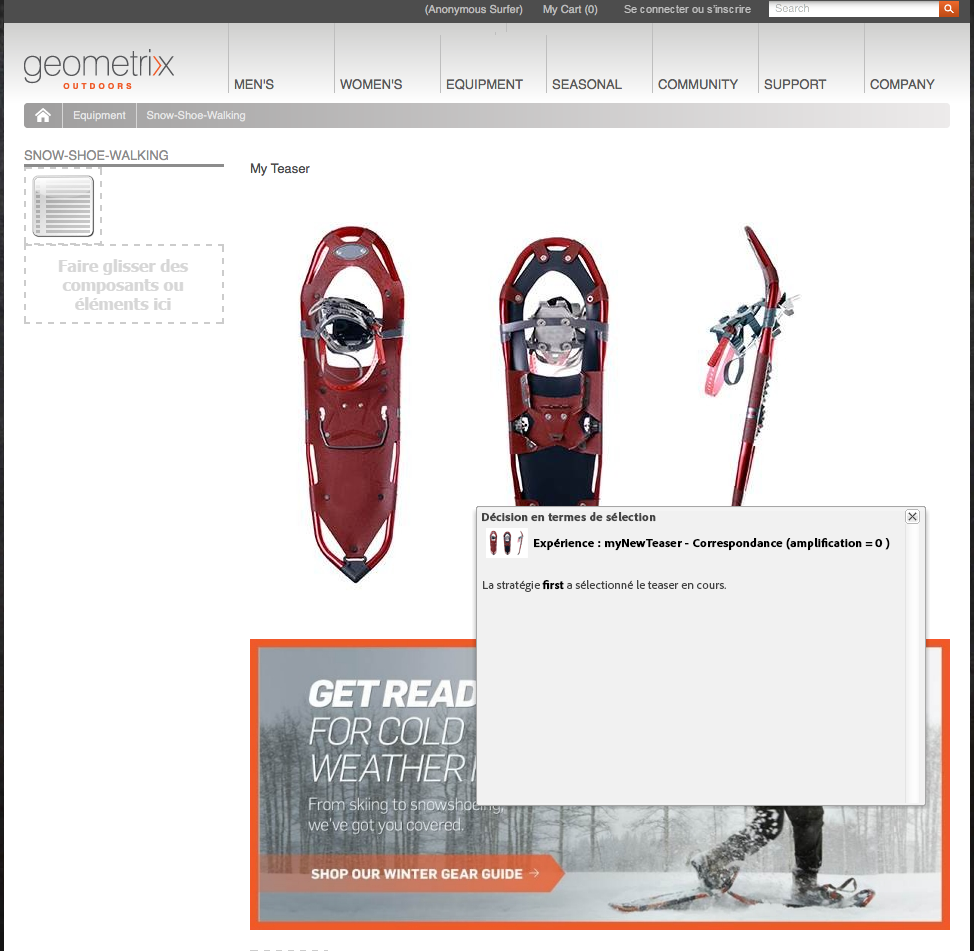
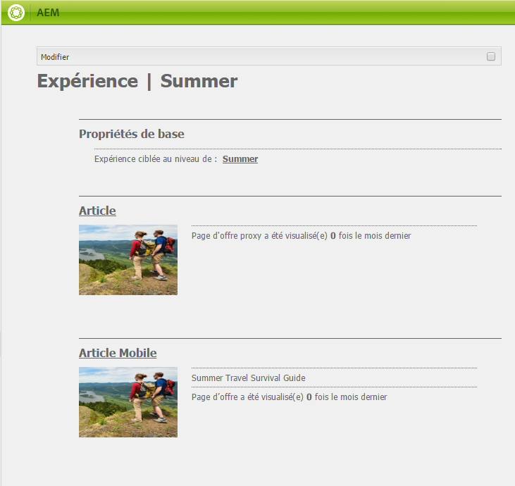

# Teasers et stratégies{#teasers-and-strategies}

>[!CAUTION]
>
>AEM 6.4 a atteint la fin de la prise en charge étendue et cette documentation n’est plus mise à jour. Pour plus d’informations, voir notre [période de support technique](https://helpx.adobe.com/fr/support/programs/eol-matrix.html). Rechercher les versions prises en charge [here](https://experienceleague.adobe.com/docs/?lang=fr).

Les campagnes utilisent souvent les teasers comme mécanisme pour inciter un segment spécifique de la population de visiteurs à consulter du contenu axé sur leurs intérêts. Un ou plusieurs teasers sont définis pour une campagne spécifique.

>[!NOTE]
>
>Le composant Teaser a été abandonné dans AEM 6.2.

* Les **pages de marque** sont stockées dans la section Campagnes du site Web. Une marque contient les différentes campagnes.

* Les **pages de campagne** sont stockées dans la section Campagnes du site Web. Chaque campagne comporte une page individuelle, sous laquelle sont conservées les définitions de teaser. La page conteneur, ou vue d’ensemble, contient également certaines informations et statistiques concernant les pages de teaser individuelles.

Les teasers d’AEM sont constitués de plusieurs parties :

* Les **pages de teaser** sont stockées dans une page de campagne appropriée et présentent les définitions des paragraphes de teaser disponibles pour chaque campagne spécifique. Ces définitions sont utilisées lors de l’affichage des paragraphes de teaser. y compris les variations de contenu, le segment à utiliser pour sélectionner une variation et augmenter le facteur.
* Le **Composant Teaser** est disponible prêt à l’emploi et vous permet de créer une instance de votre paragraphe de teaser spécifique dans une page de contenu. Vous pouvez faire glisser le composant de teaser à partir du sidekick, puis spécifier votre définition de teaser pour créer votre propre paragraphe de teaser. **Remarque :** Le composant Teaser a été abandonné dans AEM 6.2.

* **Paragraphes de teaser** sont des instances réelles de votre teaser dans une page de contenu. Elles incitent un segment de visiteurs à consulter du contenu axé sur leurs intérêts.
* Les pages qui contiennent le contenu de la campagne sont axées sur un segment de visiteurs spécifique. En règle générale, les paragraphes de teaser amènent le visiteur à de telles pages.

## Stratégies {#strategies}

Lors de l’ajout d’un paragraphe de teaser à une page, vous devez définir la **stratégie**.

C’est le cas de plusieurs teasers disponibles pour sélection, car leurs segments attribués sont tous résolus avec succès. Le **Stratégie** spécifie ensuite un critère supplémentaire utilisé pour sélectionner le teaser affiché :

* **Score Clickstream**, est basé sur les balises et les accès aux balises associés conservés dans le contexte client du visiteur (indiquent la fréquence à laquelle un visiteur a cliqué sur les pages contenant la balise correspondante). Les taux de fréquence d’accès aux balises définis sur la page du teaser sont comparés.
* **Aléatoire**, pour la sélection « aléatoire » ; emploie le facteur aléatoire généré pour une page. Celui-ci est visible dans le [contexte client](/help/sites-administering/client-context.md).

* **Première** dans la liste des segments résolus. L’ordre est celui des teasers dans la page conteneur de campagne.

Le [facteur d’amplification](/help/sites-administering/campaign-segmentation.md#boost-factor) du segment se répercute également sur la sélection. Il s’agit d’un facteur de pondération ajouté à une définition de segment pour augmenter/diminuer la probabilité relative de sa sélection.

Le workflow et les interrelations des divers critères de sélection sont mieux illustrés par un exemple (une méthode qui peut également être utilisée pour assurer que vos teasers atteignent le public requis).

Si les segments suivants ont déjà été créés et se voient attribuer leur facteur d’amplification respectif :

| Segment | Facteur d’amplification |
|---|---|
| S1 | 0 |
| S2 | 0 |
| S3 | 10 |
| S4 | 30 |
| S5 | 0 |
| S6 | 100 |

Et nous utilisons les définitions de teaser suivantes :

<table> 
 <tbody> 
  <tr> 
   <td>Campagne</td> 
   <td>Teaser</td> 
   <td>Segments affectés</td> 
   <td>Balises attribuées </td> 
  </tr> 
  <tr> 
   <td>C1</td> 
   <td>T1</td> 
   <td>S1, S2</td> 
   <td>Professionnel, Marketing</td> 
  </tr> 
  <tr> 
   <td>C1</td> 
   <td>T2 </td> 
   <td>S1</td> 
   <td>  </td> 
  </tr> 
  <tr> 
   <td>C1 </td> 
   <td>T3</td> 
   <td>S3, S4</td> 
   <td>  </td> 
  </tr> 
  <tr> 
   <td>C1 </td> 
   <td>T4</td> 
   <td>S2, S5</td> 
   <td>  </td> 
  </tr> 
  <tr> 
   <td>C1 </td> 
   <td>T5</td> 
   <td>S1, S2, S6</td> 
   <td>Marketing</td> 
  </tr> 
  <tr> 
   <td>C1 </td> 
   <td>T6</td> 
   <td>S6</td> 
   <td>Entreprise  </td> 
  </tr> 
 </tbody> 
</table>

Ensuite, si nous appliquons ceci à un visiteur où :

* **S1**, **S2** et **S6** sont résolus avec succès

* la balise **marketing** comporte 3 accès
* la balise **commerce** comporte 6 accès

Nous pouvons voir les résultats :

* correspond à la réussite. l’un des segments affectés au teaser est-il résolu avec succès pour le visiteur actuel ?
* facteur d’amplification : le facteur d’amplification le plus élevé de tous les segments applicables
* score de parcours de navigation : total cumulé de tous les accès de balises applicables.

qui sont calculés avant d’appliquer la stratégie appropriée :

<table> 
 <tbody> 
  <tr> 
   <td>Campagne</td> 
   <td>Teaser</td> 
   <td>Segments affectés</td> 
   <td>Balises </td> 
   <td>Correspondance réussie ?</td> 
   <td>Facteur d’amplification résultant</td> 
   <td>Score de flux de clics résultant </td> 
  </tr> 
  <tr> 
   <td>C1</td> 
   <td>T1</td> 
   <td>S1, S2</td> 
   <td>Professionnel, Marketing</td> 
   <td>Oui</td> 
   <td>0</td> 
   <td>9</td> 
  </tr> 
  <tr> 
   <td>C1</td> 
   <td>T2 </td> 
   <td>S1</td> 
   <td>  </td> 
   <td>Oui</td> 
   <td>0</td> 
   <td>  </td> 
  </tr> 
  <tr> 
   <td>C1 </td> 
   <td>T3</td> 
   <td>S3, S4</td> 
   <td>  </td> 
   <td>Non</td> 
   <td>  </td> 
   <td>  </td> 
  </tr> 
  <tr> 
   <td>C1 </td> 
   <td>T4</td> 
   <td>S2, S5</td> 
   <td>  </td> 
   <td>Oui  </td> 
   <td>0  </td> 
   <td>  </td> 
  </tr> 
  <tr> 
   <td>C1 </td> 
   <td>T5</td> 
   <td>S1, S2, S6</td> 
   <td>Marketing</td> 
   <td>Oui</td> 
   <td>100</td> 
   <td>3</td> 
  </tr> 
  <tr> 
   <td>C1 </td> 
   <td>T6</td> 
   <td>S6</td> 
   <td>Entreprise</td> 
   <td>Oui</td> 
   <td>100</td> 
   <td>6 </td> 
  </tr> 
 </tbody> 
</table>

Ces valeurs sont utilisées pour déterminer le ou les teasers que le visiteur verra, en fonction des **Stratégie** appliqué au paragraphe de teaser :

<table> 
 <tbody> 
  <tr> 
   <td>Stratégie</td> 
   <td>Teaser résultant</td> 
   <td>Commentaires</td> 
  </tr> 
  <tr> 
   <td>Premier</td> 
   <td>T5</td> 
   <td>Seuls T5 et T6 sont considérés comme leurs segments tous résolus. <i>et</i> ils ont le facteur d'amplification le plus élevé. La liste renvoyée est dans l’ordre T5, T6 ; T5 est donc sélectionné et affiché.</td> 
  </tr> 
  <tr> 
   <td>Aléatoire</td> 
   <td>T5 ou T6</td> 
   <td>Les deux teasers ont des segments qui sont tous résolus et le même facteur d’amplification. Par conséquent, les deux teasers sont affichés en proportion égale.</td> 
  </tr> 
  <tr> 
   <td>Score Clickstream</td> 
   <td>T6</td> 
   <td>
Les segments pour T1, T4, T5 et T6 sont tous résolus pour le visiteur. Les facteurs d'amplification plus élevés de T5 et T6 excluent alors T1 et T4. Enfin, le score Clickstream supérieur de T6 le fait que cette option soit sélectionnée.
 </td> 
  </tr> 
 </tbody> 
</table>

>[!NOTE]
>
>Si, après les techniques de résolution ci-dessus, plusieurs teasers sont disponibles pour sélection, une sélection interne (aléatoire) sélectionne un seul teaser à afficher.
>
>Par exemple, si la stratégie était Clickstream Score et que T5 avait le même Clickstream Score que T6 (c’est-à-dire 6 au lieu de 3), la sélection interne (aléatoire) serait utilisée pour sélectionner l’un de ces deux types.

Les paragraphes/pages de teaser sont utilisés pour diriger des segments de visiteurs spécifiques vers du contenu axé sur leurs intérêts. Ils peuvent présenter toute une gamme d’options parmi lesquelles le visiteur peut effectuer un choix, ou n’afficher qu’un seul paragraphe de teaser basé sur un segment de visiteurs spécifique ; par exemple, le paragraphe de teaser affiché peut dépendre de l’âge du visiteur.

En règle générale, une page de teaser est une action temporaire qui dure pendant une période spécifique, jusqu’à ce qu’elle soit remplacée par la page de teaser suivante.

Après avoir créé votre marque et votre campagne, vous pouvez créer et configurer votre expérience de teaser.

## Création d’un point de contact pour votre teaser {#creating-a-touchpoint-for-your-teaser}

>[!NOTE]
>
>Le composant Teaser a été abandonné dans AEM 6.2.

1. Accédez à la page de contenu dans laquelle vous souhaitez placer le paragraphe de teaser qui mènera à la page de votre campagne.
1. Ajouter un **Teaser** (disponible dans la **Personnalisation** dans le sidekick) à la position requise. Lors de sa première création, il indique que le chemin de la campagne n’est pas encore configuré :

   

1. Modifiez le composant de teaser pour ajouter les éléments suivants :

   * **Chemin de la campagne**
Chemin d’accès à la page de campagne qui contient la page de teaser individuelle ; les segments déterminent exactement le teaser affiché.
   * **[Stratégie](/help/sites-classic-ui-authoring/classic-personalization-campaigns.md#strategies)**
Méthode utilisée pour la sélection lorsque plusieurs segments sont résolus avec succès.
   

1. Cliquez sur **OK** pour enregistrer. Selon les segments que vous avez définis sur le teaser et le profil de l’utilisateur sous lequel vous êtes connecté, le contenu approprié s’affiche :

   

1. Placez le pointeur de la souris sur le paragraphe de teaser pour afficher l’icône de point d’interrogation (coin inférieur droit du composant). Cliquez sur ceci pour afficher les segments appliqués et déterminer s’ils sont actuellement résolus.

   

## Aperçu du teaser {#teaser-overview}

Outre la vue de campagne dans le MCM, la page de campagne fournit également des informations sur les teasers qui y sont connectés :

1. Dans la **Sites web** , ouvrez la page de l&#39;opération ; par exemple :

   `http://localhost:4502/content/campaigns/geometrixx-outdoors/storefront/summer.html`

   Vous accédez alors à un aperçu de la définition du teaser et des statistiques de visionnage :

   
