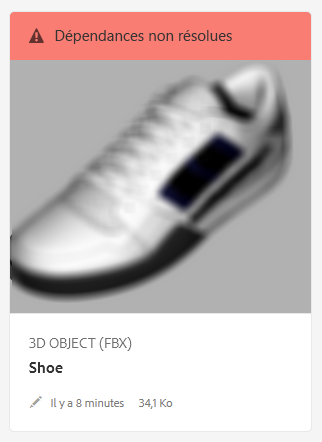

# Résolution des dépendances de fichiers{#resolving-file-dependencies}

Les dépendances des principaux fichiers de modèle 3D, tels que les fichiers de mappage de texture, sont résolues automatiquement, lorsque cela s’avère possible. Pour exécuter cette fonctionnalité, AEM recherche dans les dossiers d’éléments voisins les fichiers ayant les mêmes noms que ceux figurant dans le fichier 3D. If one or more dependencies are unresolvable during the Creating preview processing stage, the asset&#39;s card displays the following red banner message in the [!UICONTROL Card View]:

**Pour résoudre les dépendances** de fichiers :

1. In the **[!UICONTROL Card View]**, hover the pointer over the **[!UICONTROL Unresolved Dependencies]** banner message on the card, then tap the exclamation point icon.

   

1. Sur la page Propriétés des métadonnées, appuyez sur l’onglet **[!UICONTROL Dépendances]**.

   Les fichiers qu’AEM n’a pas pu résoudre sont répertoriés sous la colonne Chemins d’origine, en rouge.

1. Utilisez l’une ou plusieurs des méthodes suivantes :

   * **[!UICONTROL Rechercher et sélectionner les dépendances]**. (Cette option suppose que vous ayez déjà chargé les fichiers de dépendance.)

      1. Tap the **[!UICONTROL File Browse]** icon to the left of the red path.
      1. On the **[!UICONTROL Select Content]** page, navigate to the missing file, then tap on the file&#39;s card to select it.
      1. In the upper-left corner of the **[!UICONTROL Select Content]** page, tap **[!UICONTROL Close]** (X icon) to return to the **[!UICONTROL View Properties]** page.
   * **[!UICONTROL Charger les dépendances]**. (Cette option suppose que vous n’ayez pas encore chargé les fichiers manquants.)

      1. Notez les chemins et les noms de fichiers manquants.
      1. Dans le coin supérieur droit de la page, appuyez sur **[!UICONTROL Fermer]**.

   After the files are uploaded return to **[!UICONTROL View Properties > Dependencies]** page. La nouvelle ressource chargée est désormais correctement répertoriée comme une ressource référencée.

   * **[!UICONTROL Ignorer les dépendances]**.

      If a missing dependency is no longer needed, under the **[!UICONTROL Referenced Asset]** column, in the text field to the left of the missing file, type `n/a` so that AEM 3D ignores the file.

1. Near the upper-right corner of the **[!UICONTROL View Properties]** page, tap **[!UICONTROL Save]**.
1. Appuyez sur **[!UICONTROL Fermer]****[!UICONTROL pour revenir au mode Carte]**.

   La ressource est automatiquement traitée à nouveau avec les dépendances qui viennent d’être résolues.

