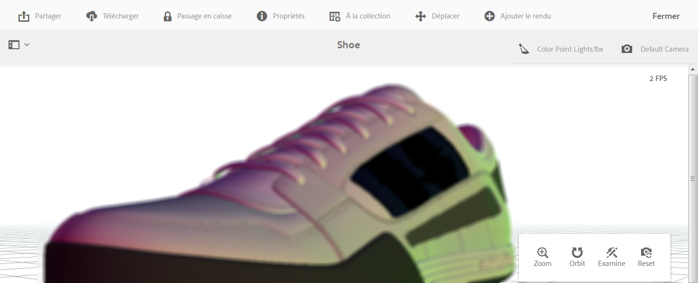

# Visualisation de ressources 3D{#viewing-d-assets}

La visionneuse 3D interactive est disponible sur la page de détails de la ressource dans AEM. La visionneuse comprend, entre autres, un ensemble de contrôles de caméra interactifs qui permettent d’orbiter, de zoomer et de faire un panoramique sur la ressource 3D.

En plus d’utiliser les scènes par défaut dans AEM 3D, vous pouvez utiliser des scènes que vous avez créées dans une application tierce et chargées dans AEM.

Voir [Utilisation de scènes dans AEM 3D](/help/sites-classic-ui-authoring/classicui-stages-aem3d.md).

>[!NOTE]
>
>Pour visualiser une ressource 3D, votre navigateur de périphérique ou de bureau doit être compatible webGL. En outre, le matériel graphique sous-jacent doit disposer de suffisamment de capacités et de mémoire pour effectuer le rendu des modèles à la taille souhaitée.

## Observations à propos des performances lorsque vous visualisez des ressources 3D {#performance-considerations-when-you-view-d-assets}

Le délai nécessaire pour ouvrir une ressource 3D sur la page de détails de la ressource dépend de plusieurs facteurs. Ces facteurs sont, entre autres :

* Bande passante et latences du serveur
* Taille du modèle (nombre de faces)
* Nombre et taille des correspondances
* Complexité de la scène. Par exemple, la taille de l’image IBL

De plus, les capacités de l’ordinateur client, par exemple un poste de travail, un ordinateur portable ou un appareil mobile tactile, doivent être prises en compte lorsque vous manipulez la caméra de manière interactive. Un système relativement puissant avec de bonnes capacités graphiques peut rendre l’expérience interactive d’affichage en 3D plus fluide et plus favorable.

**Pour vue de fichiers** 3D :

1. Assurez-vous d’avoir chargé des ressources 3D dans AEM.

   Reportez-vous à la section [À propos du téléchargement et du traitement des ressources 3D dans AEM](/help/sites-classic-ui-authoring/classicui-upload-proc-3d.md).
1. Dans **[!UICONTROL Adobe Experience Manager]**, sur la page **[!UICONTROL Navigation]**, appuyez sur **[!UICONTROL Ressources]**.
1. Dans l’angle supérieur droit de la page, dans la liste déroulante **[!UICONTROL Vue]**, appuyez sur **[!UICONTROL Mode Carte]**.

1. Accédez à une ressource 3D que vous souhaitez afficher.
1. Appuyez sur la carte de la ressource 3D pour l’ouvrir sur la page Détails de l’actif.

1. Procédez de l’une des manières suivantes :

   * Dans le coin inférieur droit de la page de détails de la ressource, utilisez la palette de commandes de caméra pour modifier différents affichages de la ressource.

      Si vous utilisez un périphérique d’entrée non tactile sans roulette de défilement, par exemple une souris à un bouton Apple classique, vous pouvez tout de même modifier le zoom ou la perspective d’une ressource 3D dans chaque mode respectif. You accomplish the action by pressing and holding down the `SHIFT`key while depressing the mouse button and dragging up or down.

      Lorsque vous utilisez un pavé tactile sur un ordinateur portable classique, il est souvent difficile de contrôler le comportement du zoom ou de la perspective à l’aide du geste à deux doigts. In such cases, you can press and hold down `SHIFT`during the action. Cela réduit la vitesse du geste de pincement et permet d’obtenir plus facilement la perspective ou le facteur de zoom exact que vous souhaitez. Alternately, you can use a one finger drag up or down while the `SHIFT`key is pressed to affect zoom or perspective behaviors.
   <table> 
    <tbody> 
      <tr> 
      <td><strong>Nom du contrôle de l'appareil photo</strong>  </td> 
      <td><strong>Description</strong></td> 
      </tr> 
      <tr> 
      <td>
Zoom
 
ou
 
Persp
 </td> 
      <td>
Appuyez ou cliquez pour basculer entre les modes Zoom et Perspective.
 
Or, press and hold down the <code>ALT/OPTION</code> key during the action to temporarily toggle to Perspective  mode. Relâchez la touche pour revenir en mode Zoom.
 
        <ul> 
        <li><strong>Comportement Zoom</strong>-Dolly en avant et en arrière qui rapproche ou éloigne la caméra de la ressource  que vous visualisez. Zoom est le comportement par défaut de la roulette de défilement d’une souris (le cas échéant) pour les gestes de pincement à deux doigts sur les appareils mobiles ou lorsque vous appuyez de manière prolongée sur la touche Maj tout en faisant glisser vers le haut ou vers le bas à l’aide du bouton gauche de la souris.</li> 
        <li><strong>Perspective</strong>- Modifie la longueur focale (également appelée champ de vue) de la caméra tout en conservant la taille relative de la ressource dans la vue. Perspective est le comportement alternatif de la roulette de défilement (le cas échéant) pour les gestes de pincement à deux doigts sur les appareils mobiles ou lorsque vous appuyez de manière prolongée sur la touche Maj tout en faisant glisser vers le haut ou vers le bas à l’aide du bouton gauche de la souris.</li> 
        </ul> </td> 
      </tr> 
      <tr> 
      <td>
Orbite
 
ou
 
Panoramique
 </td> 
      <td>
Appuyez ou cliquez pour basculer entre les modes Orbite et Panoramique.
 
Or, press and hold the <code>ALT/OPTION</code> key during the action to temporarily toggle to Pan mode. Relâchez la touche pour revenir en mode Orbite.
 
        <ul> 
        <li><strong>Orbite</strong>- Déplace la caméra d'affichage sur une sphère centrée sur un point de cible situé près du centre de la ressource 3D par défaut. Orbite est le comportement par défaut pour un glisser avec le bouton gauche ou un glisser par un seul toucher sur les appareils mobiles.</li> 
        <li><strong>Panoramique</strong>: déplace la caméra dans le plan de visualisation. Le point cible est déplacé en conséquence. Ainsi, les actions d’orbite suivantes déplaceront la caméra autour d’un nouveau point cible. Panoramique est le comportement alternatif pour le glisser avec le bouton gauche et le glisser par un seul toucher.</li> 
        </ul> </td> 
      </tr> 
      <tr> 
      <td>
Examen
 
ou
 
Cible
 </td> 
      <td>
Appuyez ou cliquez pour basculer entre les modes Examen et Cible.
 
        <ul> 
        <li><strong>Examinez</strong>-Appuyez ou cliquez pour passer en mode Cible.</li> 
        <li><strong>Appuyez sur Cible</strong>ou cliquez n'importe où sur la ressource 3D pour centrer la vue sur cette partie de la ressource.  Les actions d’orbite utilisent le nouveau point cible.</li> 
        </ul> </td> 
      </tr> 
      <tr> 
      <td>Réinitialiser</td> 
      <td>Appuyez ou cliquez pour rétablir le point de cible de vue au centre du modèle. Reset also moves the camera  closer or further away to show the asset in its entirety and at a reasonable viewing size.</td> 
      </tr> 
    </tbody> 
    </table>

1. Near the upper-right corner of the asset details page, tap the **[!UICONTROL Stage Selector]** icon. Sélectionnez un nom de scène avec l’arrière-plan et l’éclairage à appliquer à la ressource 3D.

   

   Les étapes fournissent l&#39;environnement-arrière-plan, le plan au sol et l&#39;éclairage dans lesquels le modèle 3D est visualisé.

   Voir [Utilisation de scènes dans AEM 3D](/help/sites-classic-ui-authoring/classicui-stages-aem3d.md).

1. Near the upper-right corner of the asset details page, tap the **[!UICONTROL Camera Selector]** icon, then select a camera view that you want to apply to the 3D asset.

   

   Les scènes fournissent souvent des caméras prédéfinies. Vous pouvez sélectionner à nouveau la caméra actuelle pour restaurer ses paramètres prédéfinis.

   Voir [Utilisation de scènes dans AEM 3D](/help/sites-classic-ui-authoring/classicui-stages-aem3d.md).

1. Dans le coin supérieur droit de la page, appuyez sur **[!UICONTROL Enregistrer]**.
1. Utilisez l’une des méthodes suivantes :

   * Effectuez le rendu de la ressource 3D.

      Voir [Rendu des ressources 3D](/help/sites-classic-ui-authoring/classicui-rendering-3d.md).

   * Dans l’angle supérieur droit de la page, appuyez sur **[!UICONTROL Fermer]** pour revenir à la page Ressources.

