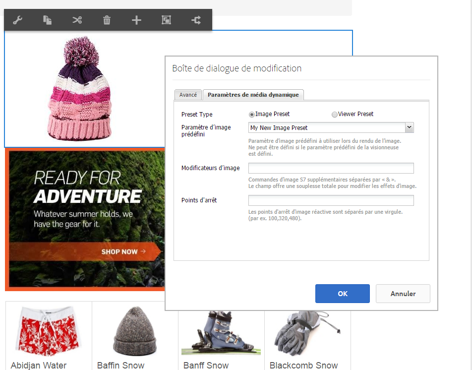

# Ajout de ressources Dynamic Media aux pages{#adding-dynamic-media-assets-to-pages}

Pour ajouter la fonctionnalité Dynamic Media aux ressources que vous utilisez sur des sites Web, vous pouvez ajouter le composant **[!UICONTROL Dynamic Media]** ou **[!UICONTROL Interactive Media]** directement aux pages. Pour ce faire, saisissez [!UICONTROL Conception] et activation des composants dynamic media. Vous pouvez ensuite ajouter ces composants à la page et ajouter des ressources au composant. Les composants Dynamic Media et Interactive Media sont dynamiques : ils détectent si vous ajoutez une image ou une vidéo et les options disponibles changent en conséquence.

Vous ajoutez directement des ressources Dynamic Media à la page si vous utilisez AEM comme système de gestion de contenu web.

>[!NOTE]
>
>Les zones cliquables sont disponibles et prêtes à l’emploi pour les bannières de carrousel.

## Ajout d’un composant Dynamic Media à une page {#adding-a-dynamic-media-component-to-a-page}

L’ajout d’un composant [!UICONTROL Dynamic Media] ou [!UICONTROL Interactive Media] à une page suit le même processus que l’ajout d’un composant sur n’importe quelle page. Les composants [!UICONTROL Dynamic Media] et [!UICONTROL Interactive Media] sont décrits en détail dans les sections suivantes.

Pour ajouter un composant ou une visionneuse Dynamic Media à une page, procédez comme suit :

1. Dans AEM, ouvrez la page où vous souhaitez ajouter le composant Dynamic Media.
1. Si aucun composant Dynamic Media n’est disponible, cliquez sur la règle dans le [!UICONTROL Sidekick] pour entrer **[!UICONTROL Conception]** mode, cliquez sur **[!UICONTROL Modifier]** parsys, puis sélectionnez **[!UICONTROL Dynamic Media]** pour rendre les composants Dynamic Media disponibles.

   >[!NOTE]
   >
   >Pour plus d’informations, consultez [Configuration des composants en mode Création](/help/sites-authoring/default-components-designmode.md).

1. Retournez en mode d’**[!UICONTROL édition]** en cliquant sur l’icône représentant un crayon dans le [!UICONTROL sidekick].
1. Faites glisser le composant **[!UICONTROL Dynamic Media]** ou **[!UICONTROL Interactive Media]** du groupe **[!UICONTROL Autre]** du sidekick jusqu’à l’emplacement souhaité sur la page.
1. Cliquez sur l’icône **[!UICONTROL Modifier]** pour ouvrir le composant.
1. Modifiez le composant comme requis et cliquez sur **[!UICONTROL OK]** pour enregistrer les modifications.

## Composants Dynamic Media {#dynamic-media-components}

[!UICONTROL Dynamic Media] et [!UICONTROL Interactive Media] sont disponibles dans le **[!UICONTROL sidekick]** sous [!UICONTROL Dynamic Media]. Vous utilisez le composant **[!UICONTROL Interactive Media]** pour toutes les ressources interactives telles que du contenu vidéo interactif, des images interactives ou des ensembles de carrousels. Pour tous les autres composants Dynamic Media, utilisez le composant **[!UICONTROL Dynamic Media]**.

>[!NOTE]
>
>Ces composants ne sont pas disponibles par défaut et doivent être sélectionnés en mode Conception avant leur utilisation. [Une fois les composants disponibles en mode Conception](/help/sites-authoring/default-components-designmode.md), vous pouvez les ajouter à votre page comme vous le feriez avec tout autre composant AEM.

### Composant Dynamic Media {#dynamic-media-component}

Le composant Média dynamique est dynamique ; il propose des options différentes selon que vous ajoutez une image ou une vidéo. Le composant prend en charge les paramètres d’image prédéfinis, ainsi que les visionneuses d’images telles que les visionneuses d’images, les visionneuses à 360°, les visionneuses de médias mixtes et le contenu vidéo. En outre, la visionneuse est réactive. En d’autres termes, la taille de l’écran change automatiquement en fonction de la taille de l’écran. Toutes les visionneuses sont basées sur le HTML5.

>[!NOTE]
>
>Si vous ajoutez le composant [!UICONTROL Dynamic Media] et si les **[!UICONTROL Paramètres de Dynamic Media]** sont vides ou s’il est impossible d’ajouter correctement une ressource, vérifiez les points suivants :
>
>* Vous avez [activé Dynamic Media](/help/assets/config-dynamic.md). Par défaut, Dynamic Media est désactivé.
>* L’image possède un fichier pyramid tiff. Les images importées avant l’activation de Dynamic Media ne possèdent pas de fichier pyramid tiff.
>

#### En cas d’utilisation d’images {#when-working-with-images}

Le composant [!UICONTROL Dynamic Media] permet d’ajouter des images dynamiques, notamment des visionneuses d’images, à 360° et de supports variés. Vous pouvez effectuer un zoom avant et arrière, faire pivoter une image dans une visionneuse à 360° ou sélectionner une image dans un autre type de visionneuse.

Vous pouvez également configurer directement dans le composant les paramètres prédéfinis de la visionneuse ou de l’image ou le format de l’image. Pour rendre une image réactive, vous pouvez définir les points d’arrêt ou appliquer un paramètre prédéfini d’image réactive.

Vous pouvez modifier les paramètres de Dynamic Media ci-après en cliquant sur **[!UICONTROL Modifier]** dans le composant, puis sur l’onglet **[!UICONTROL Paramètres de Dynamic Media]**.

>[!NOTE]
>
>Par défaut, le composant d’image Dynamic Media est adaptatif. Si vous souhaitez faire en sorte qu’il ait une taille fixe, définissez-la dans le composant de l’onglet **[!UICONTROL Avancé]** à l’aide des propriétés **[!UICONTROL Largeur]** et **[!UICONTROL Hauteur]**.

**[!UICONTROL Paramètre prédéfini de la visionneuse]** - Sélectionnez un paramètre prédéfini de visionneuse existant dans le menu déroulant. Si le paramètre prédéfini de visionneuse que vous recherchez n’est pas visible, vous devrez le rendre visible. Consultez [Gestion des paramètres prédéfinis de visionneuse](/help/assets/managing-viewer-presets.md). Si vous utilisez un paramètre prédéfini d’image, vous ne pouvez pas sélectionner de paramètre prédéfini de visionneuse, et inversement.

Il s’agit de la seule option disponible si vous affichez des visionneuses d’images, à 360° ou de supports variés. Les paramètres de visionneuse prédéfinis affichés sont également intelligents ; seuls les paramètres de visionneuse prédéfinis pertinents s’affichent.

**[!UICONTROL Paramètre d’image prédéfini]** - Sélectionnez un paramètre d’image prédéfini existant dans le menu déroulant. Si le paramètre d’image prédéfini que vous recherchez n’est pas visible, vous devrez le rendre visible. Consultez [Gestion des paramètres d’image prédéfinis](/help/assets/managing-image-presets.md). Si vous utilisez un paramètre prédéfini d’image, vous ne pouvez pas sélectionner de paramètre prédéfini de visionneuse, et inversement.

Cette option n’est pas disponible si vous affichez des visionneuses d’images, à 360° ou de supports variés.

**[!UICONTROL Modificateurs d’image]** - Vous pouvez modifier les effets d’image en fournissant des commandes d’image supplémentaires. Elles sont décrites dans la section [Gestion des paramètres d’image prédéfinis](/help/assets/managing-viewer-presets.md) et le [Référence de commande](https://experienceleague.adobe.com/docs/dynamic-media-developer-resources/image-serving-api/image-serving-api/http-protocol-reference/command-reference/c-command-reference.html?lang=fr).

Cette option n’est pas disponible si vous affichez des visionneuses d’images, à 360° ou de médias mixtes.

**[!UICONTROL Points d’arrêt]** - Si vous utilisez cette ressource sur un site réactif, vous devez ajouter les points d’arrêt de page. Les points d’arrêt d’image doivent être séparés par des virgules (,). Cette option fonctionne lorsqu’il n’existe aucune valeur de hauteur ou largeur définie dans un paramètre d’image prédéfini.

Cette option n’est pas disponible si vous affichez des visionneuses d’images, à 360° ou de médias mixtes.

Vous pouvez modifier les [!UICONTROL paramètres avancés] ci-après en cliquant sur **[!UICONTROL Modifier]** dans le composant.

**[!UICONTROL Titre]** - Modifiez le titre de l’image.

**[!UICONTROL Texte de remplacement]** - Ajoutez un titre à l’image pour les utilisateurs pour lesquels les graphiques sont désactivés.

Cette option n’est pas disponible si vous affichez des visionneuses d’images, à 360° ou de médias mixtes.

**[!UICONTROL URL, Ouvrir dans]** - Vous pouvez définir une ressource à partir de pour ouvrir un lien. Définissez l’**[!UICONTROL URL]**, puis dans **[!UICONTROL Ouvrir dans]**, indiquez si vous souhaitez que la ressource s’ouvre dans la même fenêtre ou dans une nouvelle.

Cette option n’est pas disponible si vous affichez des visionneuses d’images, à 360° ou de médias mixtes.

**[!UICONTROL Largeur et hauteur]** - Saisissez une valeur en pixels si vous souhaitez que la taille de l’image soit fixe. Si vous ne fournissez pas de valeurs, la ressource devient adaptative.

#### En cas d’utilisation de vidéos {#when-working-with-video}

Le composant [!UICONTROL Dynamic Media] permet d’ajouter une vidéo dynamique à vos pages Web. Lorsque vous modifiez le composant, vous pouvez choisir d’utiliser un paramètre prédéfini de la visionneuse de vidéos pour lire la vidéo sur la page.

Vous pouvez modifier les paramètres [!UICONTROL Dynamic Media] ci-après en cliquant sur **[!UICONTROL Modifier]** dans le composant.

>[!NOTE]
>
>Par défaut le composant vidéo Dynamic Media est adaptatif. Si vous souhaitez lui donner une taille fixe, définissez-la sous l’onglet **[!UICONTROL Avancé]** du composant, grâce aux options **[!UICONTROL Largeur]** et **[!UICONTROL Hauteur]**.

**[!UICONTROL Paramètre prédéfini de la visionneuse]** - Sélectionnez un paramètre prédéfini de visionneuse de vidéos existant dans le menu déroulant. Si le paramètre prédéfini de visionneuse que vous recherchez n’est pas visible, vous devrez le rendre visible. Consultez [Gestion des paramètres prédéfinis de visionneuse](/help/assets/managing-viewer-presets.md).

Vous pouvez modifier les paramètres [!UICONTROL avancés] ci-après en cliquant sur **[!UICONTROL Modifier]** dans le composant.

**[!UICONTROL Titre]** - Modifiez le titre de la vidéo.

**[!UICONTROL Largeur et hauteur]** - Saisissez une valeur en pixels si vous souhaitez que la taille de la vidéo soit fixe. Si vous ne fournissez pas de valeurs, la vidéo devient adaptative.

#### Mode de diffusion d’une vidéo sécurisée {#how-to-delivery-secure-video}

Dans AEM 6.2, lorsque vous installez [FP-13480](https://experience.adobe.com/#/downloads/content/software-distribution/en/aem.html?package=/content/software-distribution/en/details.html/content/dam/aem/public/adobe/packages/cq620/featurepack/cq-6.2.0-featurepack-13480), vous pouvez contrôler si la vidéo est diffusée via une connexion SSL sécurisée (HTTPS) ou une connexion non sécurisée (HTTP). Par défaut, le protocole de diffusion vidéo est automatiquement hérité du protocole de la page web d’incorporation. Si la page web est chargée via HTTPS, la vidéo est également diffusée via HTTPS. Inversement, si la page web est chargée via HTTP, la vidéo est diffusée via HTTP. Dans la plupart des cas, ce comportement par défaut est correct et aucune modification de configuration n’est nécessaire. Vous pouvez toutefois remplacer ce comportement par défaut en ajoutant `VideoPlayer.ssl=on` à la fin d’un chemin d’URL ou à la liste des autres paramètres de configuration de la visionneuse dans un fragment de code intégré afin de forcer la diffusion sécurisée de la vidéo.

Pour plus d’informations sur la diffusion sécurisée de vidéos et l’utilisation de l’attribut de configuration `VideoPlayer.ssl` dans le chemin d’accès URL, consultez [Diffusion sécurisée de vidéos](https://experienceleague.adobe.com/docs/dynamic-media-developer-resources/library/viewers-aem-assets-dmc/video/c-html5-video-viewer-20-securevideodelivery.html?lang=fr) dans le Guide de référence des visionneuses. Outre la visionneuse vidéo, la diffusion sécurisée de vidéos est disponible pour la visionneuse de médias mixtes et la visionneuse de vidéos interactives.

### Composant Interactive Media {#interactive-media-component}

Le composant Interactive Media est destiné aux ressources présentant des éléments interactifs tels que des zones réactives ou des zones cliquables. Si vous disposez d’une image interactive, d’une vidéo interactive ou d’une bannière de carrousel, utilisez le composant **[!UICONTROL Interactive Media]**.

Le composant [!UICONTROL Interactive Media] est dynamique : il propose des options différentes selon que vous ajoutez une image ou une vidéo. En outre, la visionneuse est réactive. En d’autres termes, la taille de l’écran change automatiquement en fonction de la taille de l’écran. Toutes les visionneuses sont basées sur le HTML5.

Vous pouvez modifier les paramètres **[!UICONTROL Général]** ci-après en cliquant sur **[!UICONTROL Modifier]** dans le composant.

**[!UICONTROL Paramètre prédéfini de la visionneuse]** - Sélectionnez un paramètre prédéfini de visionneuse existant dans le menu déroulant. Si le paramètre prédéfini de visionneuse que vous recherchez n’est pas visible, vous devrez le rendre visible. Les paramètres de visionneuse prédéfinis doivent être publiés avant de pouvoir être utilisés. Voir Gestion des paramètres prédéfinis de visionneuse.

**[!UICONTROL Titre]** - Modifiez le titre de la vidéo.

**[!UICONTROL Largeur et hauteur]** - Saisissez une valeur en pixels si vous souhaitez que la taille de la vidéo soit fixe. Si vous ne fournissez pas de valeurs, la vidéo devient adaptative.

Vous pouvez modifier les paramètres **[!UICONTROL Ajouter au panier]** ci-après en cliquant sur **[!UICONTROL Modifier]** dans le composant.

**[!UICONTROL Afficher la ressource de produit]** - Par défaut, cette valeur est sélectionnée. La ressource de produit affiche une image du produit telle que définie dans le module Commerce. Désactivez la case pour ne pas afficher la ressource de produit.

**[!UICONTROL Afficher le prix du produit]** - Par défaut, cette valeur est sélectionnée. Le prix du produit affiche le prix de l’élément tel qu’il est défini dans le module Commerce. Désactivez la case pour ne pas afficher le prix du produit.

**[!UICONTROL Afficher le formulaire de produit]** - Par défaut, cette valeur n’est pas sélectionnée. Le formulaire de produit contient toutes les variantes de produit, telles que la taille et la couleur. Désactivez la case pour ne pas afficher les variantes de produit.
