# Ajouter les fonctionnalités de Dynamic Media Classic à votre page{#adding-scene-features-to-your-page}

[L’Adobe Dynamic Media ](https://help.adobe.com/en_US/scene7/using/WS26AB0D9A-F51C-464e-88C8-580A5A82F810.html) Classicis est une solution hébergée permettant de gérer, d’améliorer, de publier et de diffuser des ressources multimédias enrichies sur des écrans et des imprimantes Web, mobiles, électroniques et connectés à Internet.

Vous pouvez vue AEM fichiers publiés dans Dynamic Media Classic dans différentes visionneuses :

* Zoom
* Fenêtre déroulante
* Vidéo
* Modèle d’image
* Image

Vous pouvez publier des ressources numériques directement d’AEM à Dynamic Media Classic et vous pouvez publier des ressources numériques de Dynamic Media Classic vers AEM.

Cette section décrit comment publier des ressources numériques d’AEM à Dynamic Media Classic et vice versa. Les visionneuses sont également décrites en détail. Pour plus d’informations sur la configuration des AEM pour Dynamic Media Classic, voir [Intégration de Dynamic Media Classic avec AEM](/help/sites-administering/scene7.md).

Voir aussi [Ajout de zones cliquables](/help/assets/image-maps.md).

Pour plus d’informations sur l’utilisation des composants vidéo avec AEM, voir :

* [Vidéo](/help/sites-classic-ui-authoring/manage-assets-classic-s7-video.md)

>[!NOTE]
>
>Si les ressources Dynamic Media Classic ne s’affichent pas correctement, assurez-vous que Contenu multimédia dynamique est [désactivé](/help/assets/config-dynamic.md#disabling-dynamic-media), puis actualisez la page.

## Publication manuelle dans Dynamic Media Classic à partir de ressources {#manually-publishing-to-scene-from-assets}

Vous pouvez publier des fichiers numériques dans Dynamic Media Classic à partir de la console Ressources dans l’interface utilisateur classique ou directement à partir de la ressource.

>[!NOTE]
>
>aem publie dans Dynamic Media Classic de manière asynchrone. Une fois que vous avez cliqué sur **[!UICONTROL Publier]**, la publication de votre fichier dans Dynamic Media Classic peut prendre plusieurs secondes.

### Publication depuis la console Ressources {#publishing-from-the-assets-console}

Pour publier dans Dynamic Media Classic à partir de la console Ressources si les ressources se trouvent dans un dossier de cible Dynamic Media Classic :

1. Dans l’interface utilisateur classique AEM, cliquez sur **[!UICONTROL Ressources numériques]** pour accéder au gestionnaire de ressources numériques.

1. Sélectionnez la ou les ressources ou le dossier dans le dossier de cible que vous souhaitez publier dans Dynamic Media Classic, cliquez avec le bouton droit de la souris et sélectionnez **[!UICONTROL Publier vers Dynamic Media Classic]**. Vous pouvez également sélectionner **[!UICONTROL Publier vers Dynamic Media Classic]** dans le menu **[!UICONTROL Outils]**.

   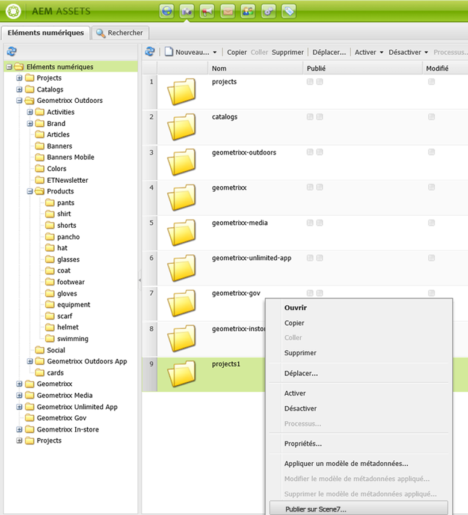

1. Accédez à Dynamic Media Classic et vérifiez que les ressources sont disponibles.

   >[!NOTE]
   >
   >Si les ressources ne se trouvent pas dans un dossier synchronisé Dynamic Media Classic, **[!UICONTROL Publier vers Dynamic Media Classic]** dans les deux menus est visible mais désactivé.

### Publication depuis un élément {#publishing-from-an-asset}

Vous pouvez publier manuellement un fichier tant qu’il se trouve dans le dossier Dynamic Media Classic synchronisé.

>[!NOTE]
>
>Si le fichier n’est pas situé dans le dossier synchronisé Dynamic Media Classic, le lien vers **[!UICONTROL Publier vers Dynamic Media Classic]** n’est pas disponible.

**Pour publier vers Dynamic Media Classic directement à partir d’un fichier** numérique :

1. Dans AEM, cliquez sur **[!UICONTROL Eléments numériques]** pour accéder au Digital Asset Manager.

1. Double-cliquez pour ouvrir un élément.

1. Dans le volet d’informations sur les ressources, sélectionnez **[!UICONTROL Publier vers Dynamic Media Classic]**.

   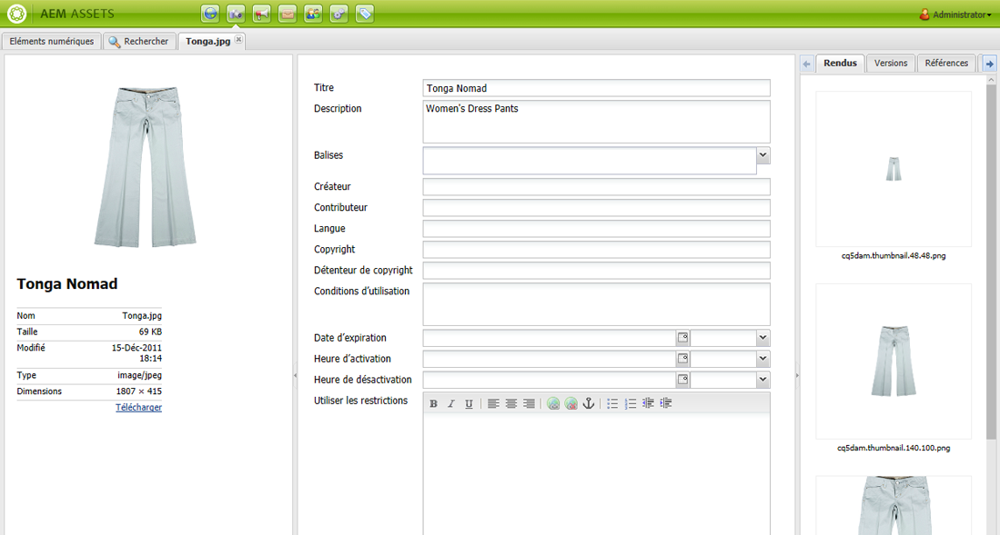

1. Le lien devient **[!UICONTROL Publication...]**, puis **[!UICONTROL Publié]**. Accédez à Dynamic Media Classic et vérifiez que la ressource est disponible.

   >[!NOTE]
   >
   >Si le fichier n’est pas publié correctement dans Dynamic Media Classic, le lien devient **[!UICONTROL Échec de publication]**. Si le fichier a déjà été publié sur Dynamic Media Classic, le lien indique **[!UICONTROL Publier à nouveau sur Dynamic Media Classic]**. La republication vous permet d’apporter des modifications à un fichier dans AEM et de le republier.

### Publication de fichiers en dehors du dossier de cible CQ {#publishing-assets-from-outside-the-cq-target-folder}

Adobe vous recommande de publier des fichiers dans Dynamic Media Classic uniquement à partir des fichiers du dossier Dynamic Media Classic cible. Cependant, si vous devez télécharger des fichiers à partir d’un dossier situé en dehors du dossier de cible, vous pouvez toujours le faire en les téléchargeant dans un dossier *ad-hoc* de Dynamic Media Classic.

Pour ce faire, vous devez configurer la configuration Cloud pour la page où apparaîtra le fichier. Vous ajoutez ensuite un composant Dynamic Media Classic à la page et faites glisser un fichier sur le composant. Une fois les propriétés de la page définies pour cette page, un lien **[!UICONTROL Publier vers Dynamic Media Classic]** s’affiche lorsque l’option sélectionnée déclenche le téléchargement vers Dynamic Media Classic.

>[!NOTE]
>
>Les ressources qui se trouvent dans le dossier ad hoc n’apparaissent pas dans le navigateur de contenu Dynamic Media Classic.

**Pour publier des fichiers qui résident en dehors du dossier** de cible CQ :

1. Dans AEM interface utilisateur classique, cliquez sur **[!UICONTROL Sites Web]** et accédez à la page Web à laquelle vous souhaitez ajouter un fichier numérique qui n’est pas encore publié dans Dynamic Media Classic. (Les règles normales d’héritage de la page s’appliquent.)

1. Dans le sidekick, cliquez sur l’icône **[!UICONTROL Page]**, puis sur **[!UICONTROL Propriétés de la page]**.

1. Cliquez sur **[!UICONTROL Cloud Services] > [!UICONTROL Ajouter les services] > [!UICONTROL Dynamic Media Classic (Scene7)]**.
1. Dans la liste déroulante Adobe Dynamic Media Classic, sélectionnez la configuration souhaitée, puis cliquez sur **[!UICONTROL OK]**.

   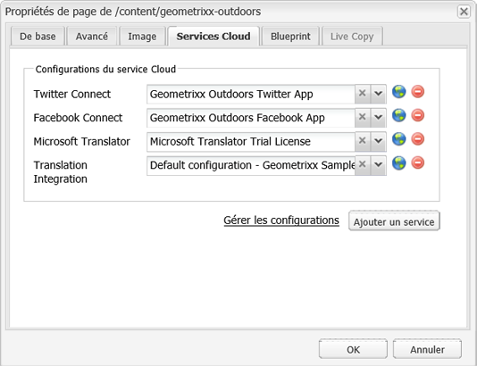

1. Sur la page Web, ajoutez un composant Dynamic Media Classic (Scene7) à l’emplacement souhaité sur la page.
1. Depuis l’outil de recherche de contenu, faites glisser un élément numérique vers le composant. Vous voyez un lien vers **[!UICONTROL Vérifier l’état de publication de Dynamic Media Classic]**.

   >[!NOTE]
   >
   >Si la ressource numérique se trouve dans le dossier de cible CQ, aucun lien vers **[!UICONTROL Vérifier l’état de publication de Dynamic Media Classic]** n’apparaît. Les éléments sont simplement placés dans le composant.

   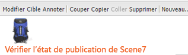

1. Cliquez sur **[!UICONTROL Vérifier l’état de publication de Dynamic Media Classic]**. Si le fichier n’est pas publié, AEM le publie dans Dynamic Media Classic. Une fois téléchargé, l’élément figure dans le dossier ad hoc. Par défaut, le dossier ad hoc se trouve dans le dossier `name_of_the_company/CQ5_adhoc`. Vous pouvez [configurer ce chemin, le cas échéant](#configuringtheadhocfolder).

   >[!NOTE]
   >
   >Si la ressource ne se trouve pas dans un dossier synchronisé Dynamic Media Classic et qu’aucune configuration de cloud Dynamic Media Classic n’est associée à la page active, le téléchargement échoue.

## Composants Dynamic Media Classic (Scene7) {#scene-components}

Les composants Dynamic Media Classic suivants sont disponibles dans AEM :

* Zoom
* Fenêtre déroulante (Zoom)
* Modèle d’image
* Image
* Vidéo

>[!NOTE]
>
>Ces composants ne sont pas disponibles par défaut et doivent être sélectionnés en mode **[!UICONTROL Conception]** avant de les utiliser.

Une fois qu’ils sont disponibles en mode **[!UICONTROL Conception]**, vous pouvez ajouter les composants à votre page comme tout autre composant AEM. Les ressources qui n’ont pas encore été publiées sur Dynamic Media Classic sont publiées sur Dynamic Media Classic si elles se trouvent dans un dossier synchronisé ou sur une page ou avec une configuration de cloud Dynamic Media Classic.

### Avis de fin de vie des visiteurs de Flash {#flash-viewers-end-of-life-notice}

Depuis le 31 janvier 2017, l’Adobe Dynamic Media Classic a officiellement mis fin à la prise en charge de la plate-forme du lecteur de Flash.

Pour plus d’informations sur cette modification importante, voir [FAQ sur la fin de vie du lecteur de Flash](https://docs.adobe.com/content/docs/en/aem/6-1/administer/integration/marketing-cloud/scene7/flash-eol.html).

### Ajouter un composant Dynamic Media Classic à une page {#adding-a-scene-component-to-a-page}

Ajouter un composant Dynamic Media Classic à une page revient à ajouter un composant à une page. Les composants Dynamic Media Classic sont décrits en détail dans les sections suivantes.

**Pour ajouter un composant/lecteur Dynamic Media Classic à une page de l’interface utilisateur** classique :

1. Dans AEM, ouvrez la page dans laquelle vous souhaitez ajouter le composant Dynamic Media Classic.

1. Si aucun composant Dynamic Media Classic n’est disponible, cliquez sur la règle dans le panneau latéral pour accéder au mode **[!UICONTROL Conception]**, cliquez sur **[!UICONTROL Modifier]** et sélectionnez tous les composants **[!UICONTROL Dynamic Media Classic]** pour les rendre disponibles.

1. Revenez au mode **[!UICONTROL Modifier]** en cliquant sur le crayon dans le sidekick.

1. Faites glisser un composant du groupe **[!UICONTROL Dynamic Media Classic]** du panneau latéral sur la page à l’emplacement souhaité.

1. Cliquez sur l’icône **[!UICONTROL Modifier]** pour ouvrir le composant.

1. Modifiez le composant comme requis et cliquez sur **[!UICONTROL OK]** pour enregistrer les modifications.

### Ajout d’expériences de visionnage interactif à un site web réactif  {#adding-interactive-viewing-experiences-to-a-responsive-website}

Une conception réactive signifie que les éléments s’adaptent selon l’emplacement où ils sont affichés. Avec une conception adaptée, les mêmes ressources s’affichent efficacement sur plusieurs périphériques.

**Pour ajouter une expérience de visualisation interactive à un site réactif dans l’interface utilisateur** classique :

1. Connectez-vous à AEM et assurez-vous que vous disposez de [Cloud Services Dynamic Media Classic ](/help/sites-administering/scene7.md#configuring-scene-integration) Adobe configurés et que les composants Dynamic Media Classic sont disponibles.

   >[!NOTE]
   >
   >Si les composants WCM Dynamic Media Classic ne sont pas disponibles, veillez à les activer au moyen du mode **[!UICONTROL Conception].

1. Dans un site Web sur lequel les composants Dynamic Media Classic sont activés, faites glisser une visionneuse **[!UICONTROL Image]** vers la page.
1. Modifiez le composant et ajustez les points d’arrêt dans l’onglet **[!UICONTROL Paramètres Dynamic Media Classic]**.

   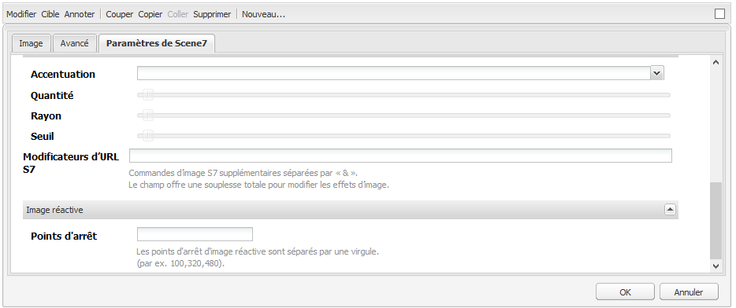

1. Confirmez que les visionneuses se redimensionnent de manière réactive et que toutes les interactions sont optimisées pour les ordinateurs de bureau, les tablettes et les appareils mobiles.

### Paramètres communs à tous les composants Dynamic Media Classic {#settings-common-to-all-scene-components}

Bien que les options de configuration varient, les éléments suivants sont communs à tous les composants Dynamic Media Classic :

* **[!UICONTROL Référence du fichier]** : accédez à un fichier que vous souhaitez référencer. La référence de fichier affiche l’URL du fichier et pas nécessairement l’URL complète Dynamic Media Classic, y compris les commandes et paramètres d’URL. Vous ne pouvez pas ajouter de commandes d’URL et de paramètres Dynamic Media Classic dans ce champ. Ils doivent être ajoutés par l’intermédiaire de la fonctionnalité correspondante du composant.
* **[!UICONTROL Largeur]** : permet de définir la largeur.
* **[!UICONTROL Hauteur]** : permet de définir la hauteur.

Vous définissez ces options de configuration en cliquant sur un composant Dynamic Media Classic, par exemple, lorsque vous ouvrez un composant **[!UICONTROL Zoom]** :

### Zoom {#zoom}

Le composant Zoom HTML5 affiche une image plus grande lorsque vous appuyez sur le bouton +.

L’élément comporte des outils de zoom dans sa partie inférieure. Cliquez sur **[!UICONTROL +]** pour agrandir. Cliquez sur **[!UICONTROL -]** pour réduire. Cliquez sur **[!UICONTROL x]** ou sur la flèche de zoom réinitialisé pour ramener l’image à la taille d’origine sous laquelle elle a été importée. Cliquez sur les flèches en diagonale pour passer en mode plein écran. Cliquez sur **[!UICONTROL Modifier]** pour configurer le composant. Avec ce composant, vous pouvez configurer des paramètres [communs à tous les composants Dynamic Media Classic](#settings-common-to-all-scene-components).

### Flyout {#flyout}

Dans le composant Fenêtre déroulante HTML5, l’élément s’affiche sous la forme d’un écran partagé : à gauche se trouve l’élément à la taille spécifiée, à droite la partie sur laquelle le zoom a été effectué. Cliquez sur **[!UICONTROL Modifier]** pour configurer le composant. Avec ce composant, vous pouvez configurer des paramètres [communs à tous les composants Dynamic Media Classic](/help/sites-administering/scene7.md#settingscommontoalldynamicmediaclassiccomponents).

>[!NOTE]
>
>Si le composant Fenêtre déroulante utilise une taille personnalisée, cette taille personnalisée est utilisée et la configuration réactive du composant est désactivée.
>
>Si votre composant Fenêtre déroulante utilise la taille par défaut, telle que définie dans la vue [!UICONTROL Conception], la taille par défaut est utilisée et le composant s’étire pour prendre en compte la taille de la mise en page avec une configuration adaptée du composant activée. Sachez toutefois qu’il existe une limite à la configuration réactive du composant. Lorsque vous utilisez le composant Fenêtre déroulante avec la configuration réactive, vous ne devez pas l’utiliser avec l’étirement de pleine page. Dans le cas contraire, la fenêtre déroulante peut s’étendre au-delà de la bordure droite de la page.

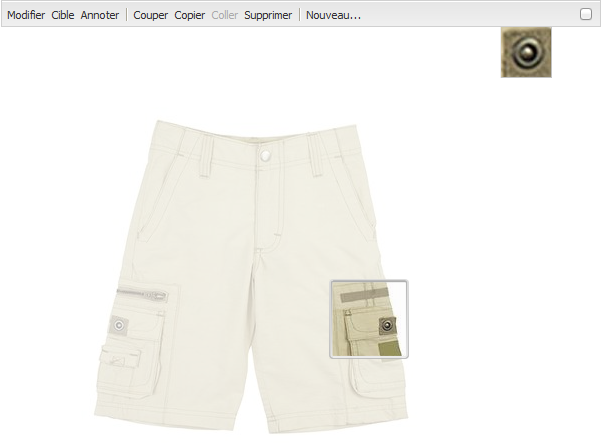

### Image {#image}

Le composant d’image Dynamic Media Classic vous permet d’ajouter des fonctionnalités Dynamic Media Classic à vos images, telles que les modificateurs Dynamic Media Classic, les paramètres prédéfinis d’image ou de visionneuse et l’accentuation. Le composant d’image Dynamic Media Classic est similaire à d’autres composants d’image dans AEM avec la fonctionnalité spéciale Dynamic Media Classic. Dans cet exemple, le modificateur URL Dynamic Media Classic est appliqué à l’image, `&op_invert=1`.

**[!UICONTROL Titre, Texte]**  de remplacement : dans l’onglet   Avancé, ajoutez un titre à l’image et un texte de remplacement pour les utilisateurs dont les graphiques sont désactivés.

**[!UICONTROL URL, Ouvrir dans]**  : vous pouvez définir un fichier à partir duquel ouvrir un lien. Définissez les options **[!UICONTROL URL]** et **[!UICONTROL Ouvrir dans]** pour indiquer si vous souhaitez qu’il s’ouvre dans la même fenêtre ou dans une nouvelle fenêtre.

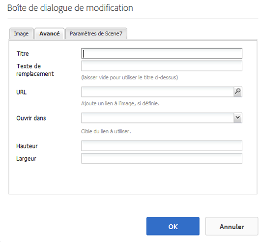

**[!UICONTROL Paramètre]**  prédéfini de visionneuse : sélectionnez un paramètre prédéfini de visionneuse existant dans le menu déroulant. Si le paramètre prédéfini de visionneuse que vous recherchez n’est pas visible, vous devrez le rendre visible. Voir [Gestion des paramètres prédéfinis de visionneuse](/help/assets/managing-viewer-presets.md). Si vous utilisez un paramètre prédéfini d’image, vous ne pouvez pas sélectionner de paramètre prédéfini de visionneuse, et inversement.

**[!UICONTROL Configuration]**  Dynamic Media Classic : sélectionnez la configuration Dynamic Media Classic que vous souhaitez utiliser pour récupérer les paramètres d’image prédéfinis principaux à partir de Scene7 Publishing System.

**[!UICONTROL Paramètre]**  d’image prédéfini : sélectionnez un paramètre d’image prédéfini existant dans le menu déroulant. Si le paramètre d’image prédéfini que vous recherchez n’est pas visible, vous devrez le rendre visible. Voir [Gestion des paramètres d’image prédéfinis](/help/assets/managing-image-presets.md). Si vous utilisez un paramètre prédéfini d’image, vous ne pouvez pas sélectionner de paramètre prédéfini de visionneuse, et inversement.

**[!UICONTROL Format]**  de sortie : sélectionnez le format de sortie de l&#39;image, par exemple jpeg. Selon le format de sortie que vous sélectionnez, vous pouvez ajouter des options de configuration supplémentaires. Voir [Gestion des paramètres d’image prédéfinis](/help/assets/managing-image-presets.md).

**[!UICONTROL Accentuation]**  : sélectionnez le mode d’accentuation de l’image. L’accentuation est expliquée en détail dans [*Adobe Dynamic Media Classic Image Quality and Sharpening Best Practices*](/help/assets/assets/s7_sharpening_images.pdf).

**[!UICONTROL Modificateurs]**  d’URL : vous pouvez modifier les effets d’image en fournissant d’autres commandes d’image Dynamic Media Classic. Ils sont décrits dans [Gestion des paramètres d’image prédéfinis](/help/assets/managing-image-presets.md) et la [référence de commande](https://docs.adobe.com/content/help/fr-FR/dynamic-media-developer-resources/image-serving-api/image-serving-api/http-protocol-reference/command-reference/c-command-reference.html).

**[!UICONTROL Points d’arrêt]**  - Si votre site Web est réactif, vous souhaitez ajuster les points d’arrêt. Les points d’arrêt doivent être séparés par des virgules `,`.

### Modèle d’image {#image-template}

[Les ](https://help.adobe.com/en_US/scene7/using/WS60B68844-9054-4099-BF69-3DC998A04D3C.html) modèles d’image Dynamic Media Classic sont du contenu Photoshop superposé importé dans Dynamic Media Classic, où le contenu et les propriétés ont été paramétrés pour la variabilité. Le composant **[!UICONTROL Modèle d’image]** permet d’importer des images et de modifier le texte dynamiquement dans AEM. En outre, vous pouvez configurer le composant **[!UICONTROL Modèle d’image]** afin d’utiliser des valeurs provenant de ClientContext de sorte que chaque utilisateur voit l’image d’une manière personnalisée.

Cliquez sur **[!UICONTROL Modifier]** pour configurer le composant. Vous pouvez configurer des paramètres [communs à tous les composants Dynamic Media Classic](/help/sites-administering/scene7.md#settingscommontoalldynamicmediaclassicscomponents) ainsi que d’autres paramètres décrits dans cette section.

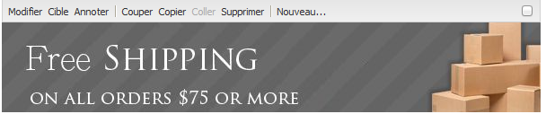

**[!UICONTROL Référence du fichier, Largeur, Hauteur]**  - Voir les paramètres communs à tous les composants Dynamic Media Classic.

>[!NOTE]
>
>Les commandes et paramètres d’URL Dynamic Media Classic ne peuvent pas être ajoutés directement à l’URL de référence de fichier. Ils ne peuvent être définis que dans l’interface utilisateur du composant, dans le panneau **[!UICONTROL Paramètre]**.

**[!UICONTROL Titre, Alt]** TextDans le  [!UICONTROL modèle d’image ] Dynamic Media Classic, ajoutez un titre à l’image et ajoutez un texte de remplacement pour les utilisateurs dont les graphiques sont désactivés.

**[!UICONTROL URL, Ouvrir]** dans Vous pouvez définir un fichier à partir duquel ouvrir un lien. Définissez l’**[!UICONTROL URL]**, puis dans le champ **[!UICONTROL Ouvrir dans]**, indiquez si vous souhaitez l’ouvrir dans la même fenêtre ou une nouvelle fenêtre.

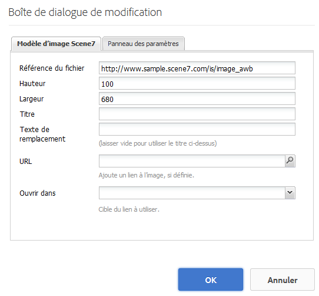

**** Panneau de paramètresLors de l’importation d’une image, les paramètres sont prérenseignés avec les informations de l’image. En l’absence de contenu pouvant être modifié dynamiquement, cette fenêtre est vide.

#### Modification dynamique du texte {#changing-text-dynamically}

Pour une modification dynamique du texte, saisissez le nouveau texte dans les champs, puis cliquez sur **[!UICONTROL OK]**. Dans cet exemple, le **[!UICONTROL Prix]** est désormais de 50 $ et l’expédition de 99 cents.

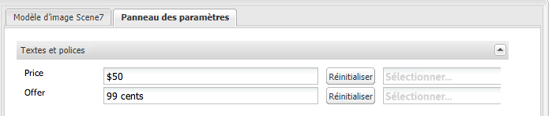

Le texte de l’image change. Vous pouvez réinitialiser le texte sur la valeur d’origine en cliquant sur **[!UICONTROL Réinitialiser]** en regard du champ.

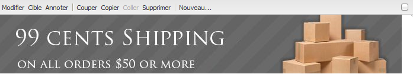

#### Modification du texte afin de refléter une valeur ClientContext {#changing-text-to-reflect-the-value-of-a-client-context-value}

Pour lier un champ à une valeur de contexte client, cliquez sur **[!UICONTROL Sélectionner]** pour ouvrir le menu contextuel client, sélectionnez le contexte client, puis cliquez sur **[!UICONTROL OK]**. Dans cet exemple, le nom change selon la liaison entre le Nom et le nom formaté du profil.

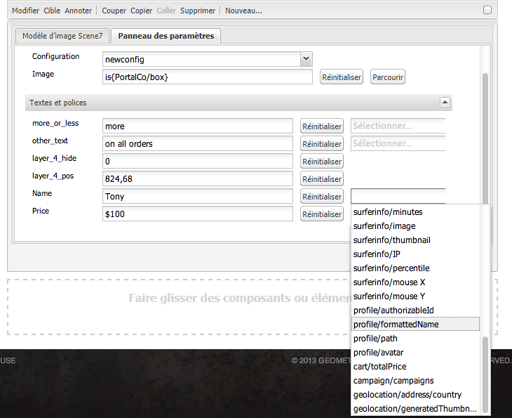

Le texte reflète le nom de l’utilisateur actuellement connecté. Vous pouvez réinitialiser le texte sur la valeur d’origine en cliquant sur **[!UICONTROL Réinitialiser]** en regard du champ.

#### Création du modèle d’image Dynamic Media Classic en tant que lien {#making-the-scene-image-template-a-link}

**Pour faire du modèle d’image Dynamic Media Classic un lien** :

1. Sur la page contenant le composant de modèle d’image Dynamic Media Classic, cliquez sur **[!UICONTROL Modifier]**.
1. Dans le champ **[!UICONTROL URL]**, saisissez l’URL à laquelle l’utilisateur accède lorsqu’il clique sur l’image. Dans le champ **[!UICONTROL Ouvrir dans]**, choisissez où vous souhaitez que la cible s’ouvre (une nouvelle fenêtre ou la même fenêtre).

   

1. Cliquez sur **[!UICONTROL OK]**.

### Composant vidéo {#video-component}

Le composant Dynamic Media Classic **[!UICONTROL Vidéo]** (disponible à partir de la section Dynamic Media Classic du sidekick) utilise la détection de périphérique et de bande passante pour diffuser la vidéo appropriée sur chaque écran. Ce composant est un lecteur vidéo HTML5. Il s’agit d’une visionneuse unique pouvant être utilisée sur plusieurs canaux.

Il peut être utilisé pour des ensembles de vidéos adaptables, une vidéo MP4 unique ou une vidéo F4V unique.

Voir [Vidéo](/help/sites-classic-ui-authoring/manage-assets-classic-s7-video.md) pour plus d’informations sur le fonctionnement des vidéos avec l’intégration Dynamic Media Classic. En outre, comparez [le composant **Dynamic Media Classic video** au composant de base **video**](/help/sites-classic-ui-authoring/manage-assets-classic-s7-video.md).

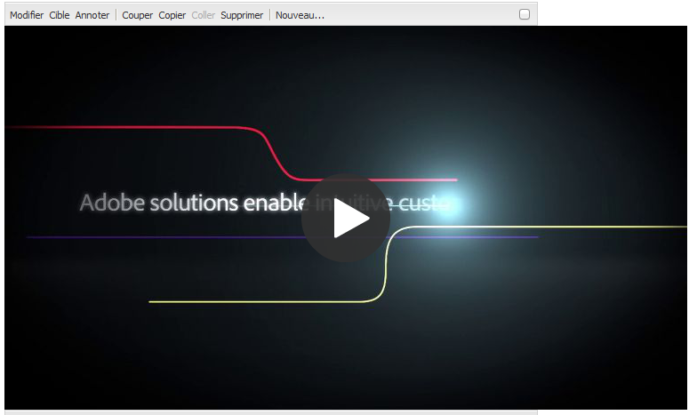

### Limitations connues du composant vidéo {#known-limitations-for-the-video-component}

La gestion des actifs numériques et la gestion de contenu web d’Adobe indiquent si une vidéo maître est téléchargée. Elles n’affichent pas les éléments proxy suivants :

* Rendus codés Dynamic Media Classic
* Visionneuses de vidéos adaptatives Dynamic Media Classic

Lors de l’utilisation d’une visionneuse de vidéos adaptative avec le composant vidéo Dynamic Media Classic, vous devez redimensionner le composant pour l’adapter aux dimensions de la vidéo.

## Explorateur de contenu Dynamic Media Classic {#scene-content-browser}

L’explorateur de contenu Dynamic Media Classic vous permet de vue de contenu de Dynamic Media Classic directement en AEM. Pour accéder au navigateur de contenu, dans l’outil de recherche de contenu, sélectionnez **[!UICONTROL Dynamic Media Classic]** dans l’interface utilisateur optimisée pour les écrans tactiles ou l’icône **[!UICONTROL S7]** dans l’interface utilisateur classique. La fonctionnalité est identique pour les deux interfaces utilisateur.

Si vous disposez de plusieurs configurations, AEM affiche la [configuration par défaut](/help/sites-administering/scene7.md#configuring-a-default-configuration). Vous pouvez sélectionner différentes configurations directement dans le navigateur de contenu Dynamic Media Classic du menu déroulant.

>[!NOTE]
>
>* Les fichiers situés dans le dossier ad hoc n’apparaissent pas dans le navigateur de contenu Dynamic Media Classic.
>* Lorsque [La Prévisualisation sécurisée est activée](/help/sites-administering/scene7.md#configuring-the-state-published-unpublished-of-assets-pushed-to-scene), les fichiers publiés et non publiés sur Dynamic Media Classic s’affichent dans le navigateur de contenu Dynamic Media Classic.
>* Si vous ne voyez pas **[!UICONTROL Dynamic Media Classic]** ou l&#39;icône **[!UICONTROL S7]** comme option dans le navigateur de contenu, vous devez [configurer Dynamic Media Classic pour qu&#39;il fonctionne avec AEM](/help/sites-administering/scene7.md).

   >
   >
* Pour la vidéo, le navigateur de contenu Dynamic Media Classic prend en charge :
   >
   >
* Les ensembles de vidéos adaptables. Il s’agit de conteneurs de tous les rendus vidéo requis pour lire la vidéo sans difficultés sur plusieurs écrans.
>* La vidéo MP4 unique
>* Vidéo F4V simple

### Parcours du contenu dans l’interface utilisateur classique {#browsing-content-in-the-classic-ui}

Parcourez le contenu de Dynamic Media Classic en cliquant sur l’onglet **[!UICONTROL S7]**.

Vous pouvez modifier la configuration à laquelle vous accédez en sélectionnant la configuration. Les dossiers changent en fonction de la configuration sélectionnée.

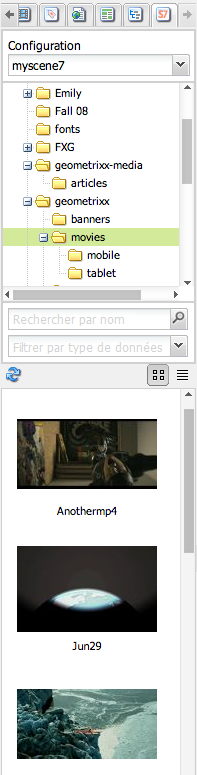

Comme avec l’outil de recherche de contenu des ressources, vous pouvez effectuer une rechercher des éléments et filtrer les résultats. Néanmoins, à la différence de l’outil de recherche de contenu des ressources, lors de la saisie d’un mot-clé dans l’onglet **[!UICONTROL S7]**, le nom du fichier *commence par* la chaîne que vous avez saisie au lieu de *contenir* le mot-clé.

Par défaut, les éléments sont affichés par nom de fichier. Vous pouvez également filtrer les résultats par type d’élément.

>[!NOTE]
>
>Pour la vidéo, le navigateur de contenu Dynamic Media Classic de WCM prend en charge :
>
>* Les ensembles de vidéos adaptables. Il s’agit de conteneurs de tous les rendus vidéo requis pour lire la vidéo sans difficultés sur plusieurs écrans.
>* La vidéo MP4 unique
>* Vidéo F4V simple

>

### Recherche de ressources Dynamic Media Classic à l’aide de l’explorateur de contenu {#searching-for-scene-assets-with-the-content-browser}

La recherche de ressources Dynamic Media Classic est similaire à la recherche de ressources AEM, sauf que lorsque vous effectuez une recherche, vous voyez en fait une vue distante des ressources dans le système Dynamic Media Classic, plutôt que de les importer directement dans AEM.

Vous pouvez utiliser l’interface utilisateur classique ou l’interface utilisateur optimisée pour les écrans tactiles pour visualiser et rechercher des éléments. Selon l’interface, le mode de recherche est légèrement différent.

Lors d’une recherche dans l’une ou l’autre des interfaces, vous pouvez filtrer selon les critères suivants (présentés ici dans l’interface utilisateur optimisée pour les écrans tactiles) :

**[!UICONTROL Entrez des mots-clés]**  : vous pouvez rechercher des ressources par nom. Lors de la recherche par mots-clés, vous saisissez le début du nom du fichier. Par exemple, la saisie du mot « swimming » recherche tous les noms de fichier qui commencent par ces lettres, dans cet ordre. Veillez à appuyer sur Entrée après avoir tapé le mot-clé de recherche de l’élément.

**[!UICONTROL Dossier/chemin]**  : le nom du dossier qui s&#39;affiche dépend de la configuration que vous avez sélectionnée. Vous pouvez descendre vers des niveaux inférieurs en cliquant sur l’icône du dossier et en sélectionnant un sous-dossier, puis en cliquant sur la coche pour le sélectionner.

Si vous saisissez un mot-clé et sélectionnez un dossier, AEM recherche ce dossier et tous les sous-dossiers. Néanmoins, si vous ne saisissez pas de mots-clés lors de la recherche, la sélection du dossier n’affiche que les éléments de ce dossier et n’inclut pas les sous-dossiers.

Par défaut, AEM recherche le dossier sélectionné et tous les sous-dossiers.

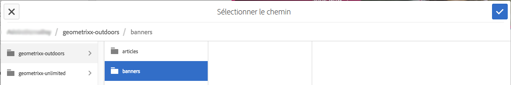

**[!UICONTROL Type de]** fichierSélectionnez Dynamic Media Classic pour parcourir le contenu Dynamic Media Classic. Cette option est disponible uniquement si vous avez déjà configuré Dynamic Media Classic.

**** ConfigurationSi plusieurs configurations Dynamic Media Classic sont définies en  [!UICONTROL Cloud Services], vous pouvez les sélectionner ici. De ce fait, le dossier change selon la configuration que vous avez choisie.

**[!UICONTROL Type de ressourceDans le navigateur Dynamic Media Classic, vous pouvez filtrer les résultats pour inclure l’un des éléments suivants :]**  images, modèles, vidéos et visionneuses de vidéos adaptatives. Si vous ne sélectionnez aucun type d’élément, AEM recherche par défaut tous les types d’élément.

>[!NOTE]
>
>* Lors de la recherche de vidéos, vous recherchez un seul rendu. Les résultats renvoient le rendu d’origine (uniquement &amp;amp ; ast ; .mp4) et le rendu codé.
>* Lors de la recherche d’une visionneuse de vidéos adaptative, vous recherchez le dossier et tous les sous-dossiers, mais uniquement si vous avez ajouté un mot-clé à la recherche. Si vous n’avez pas ajouté de mot-clé, AEM ne recherche pas les sous-dossiers.

>

**** Statut de publicationVous pouvez filtrer les fichiers en fonction de l’état de publication :   Publier ou  [!UICONTROL Annuler la publication]. Si vous ne sélectionnez aucun [!UICONTROL état de publication], AEM recherche par défaut tous les états de publication.

