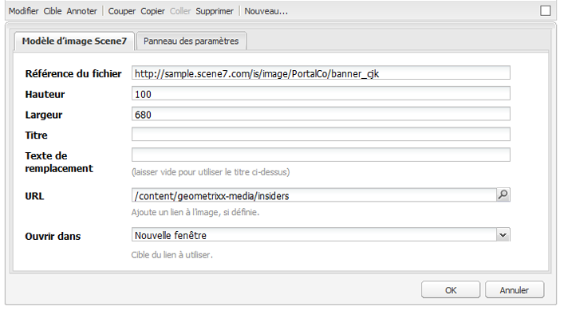

# L’ajout de fonctionnalités Dynamic Media Classic à votre page{#adding-scene-features-to-your-page}

>[!CAUTION]
>
>AEM 6.4 a atteint la fin de la prise en charge étendue et cette documentation n’est plus mise à jour. Pour plus d’informations, voir notre [période de support technique](https://helpx.adobe.com/fr/support/programs/eol-matrix.html). Rechercher les versions prises en charge [here](https://experienceleague.adobe.com/docs/?lang=fr).

Adobe Dynamic Media Classic est une solution hébergée pour la gestion, l’amélioration, la publication et la diffusion de contenus multimédias enrichis sur le web, sur les appareils mobiles, par e-mail, sur les appareils connectés à Internet et par impression.

Vous pouvez afficher AEM ressources publiées dans Dynamic Media Classic dans différentes visionneuses :

* Zoom
* Fenêtre déroulante
* Vidéo
* Modèle d’image
* Image

Vous pouvez publier des ressources numériques directement d’AEM vers Dynamic Media Classic et vous pouvez également les publier de Dynamic Media Classic vers AEM.

Cette section décrit comment publier des ressources numériques d’AEM vers Dynamic Media Classic et vice versa. Les visionneuses sont également décrites en détail. Pour plus d’informations sur la configuration d’AEM pour Dynamic Media Classic, voir [Intégration de Dynamic Media Classic à AEM](/help/sites-administering/scene7.md).

Voir aussi [Ajout de zones cliquables](/help/assets/image-maps.md).

Pour plus d’informations sur l’utilisation des composants vidéo avec AEM, voir :

* [Vidéo](/help/sites-classic-ui-authoring/manage-assets-classic-s7-video.md)

>[!NOTE]
>
>Si les ressources Dynamic Media Classic ne s’affichent pas correctement, assurez-vous que Dynamic Media est [disabled](/help/assets/config-dynamic.md#disabling-dynamic-media) puis actualisez la page.

## Publication manuelle dans Dynamic Media Classic à partir d’Assets {#manually-publishing-to-scene-from-assets}

Vous pouvez publier des ressources numériques dans Dynamic Media Classic à partir de la console Ressources de l’interface utilisateur classique ou directement à partir de la ressource.

>[!NOTE]
>
>AEM publie dans Dynamic Media Classic de manière asynchrone. Après avoir cliqué sur **[!UICONTROL Publier]**, la publication de votre ressource sur Dynamic Media Classic peut prendre plusieurs secondes.

### Publication depuis la console Assets {#publishing-from-the-assets-console}

Pour publier sur Dynamic Media Classic à partir de la console Ressources si les ressources se trouvent dans un dossier cible Dynamic Media Classic :

1. Dans AEM IU classique, cliquez sur **[!UICONTROL Ressources numériques]** pour accéder au gestionnaire des ressources numériques.

1. Sélectionnez la ou les ressources ou le dossier dans le dossier cible que vous souhaitez publier dans Dynamic Media Classic, cliquez avec le bouton droit de la souris et sélectionnez **[!UICONTROL Publication sur Dynamic Media Classic]**. Vous pouvez également sélectionner **[!UICONTROL Publication sur Dynamic Media Classic]** de la **[!UICONTROL Outils]** .

   

1. Accédez à Dynamic Media Classic et vérifiez que les ressources sont disponibles.

   >[!NOTE]
   >
   >Si les ressources ne se trouvent pas dans un dossier synchronisé Dynamic Media Classic, **[!UICONTROL Publication sur Dynamic Media Classic]** dans les deux menus est visible, mais désactivé.

### Publication à partir d’une ressource {#publishing-from-an-asset}

Vous pouvez publier manuellement une ressource tant qu’elle se trouve dans le dossier Dynamic Media Classic synchronisé.

>[!NOTE]
>
>Si la ressource ne se trouve pas dans le dossier synchronisé Dynamic Media Classic, le lien vers **[!UICONTROL Publication sur Dynamic Media Classic]** n’est pas disponible.

**Pour publier vers Dynamic Media Classic directement à partir d’une ressource numérique**:

1. Dans AEM, cliquez sur **[!UICONTROL Ressources numériques]** pour accéder au gestionnaire des ressources numériques.

1. Double-cliquez pour ouvrir une ressource.

1. Dans le volet des détails de la ressource, sélectionnez **[!UICONTROL Publier sur Dynamic Media Classic]**.

   

1. Le lien devient **[!UICONTROL Publication...]**, puis **[!UICONTROL Publié]**. Accédez à Dynamic Media Classic et vérifiez que la ressource est disponible.

   >[!NOTE]
   >
   >Si la ressource n’est pas publiée correctement dans Dynamic Media Classic, le lien devient **[!UICONTROL Échec de la publication]**. Si la ressource a déjà été publiée sur Dynamic Media Classic, le lien se lit comme suit : **[!UICONTROL Republication sur Dynamic Media Classic]**. La republication vous permet d’apporter des modifications à une ressource dans AEM et de la republier.

### Publication de ressources à partir du dossier cible CQ {#publishing-assets-from-outside-the-cq-target-folder}

Adobe recommande de publier des ressources dans Dynamic Media Classic uniquement à partir des ressources du dossier cible Dynamic Media Classic. Cependant, si vous devez charger des ressources à partir d’un dossier en dehors du dossier cible, vous pouvez toujours le faire en les chargeant dans une *ad hoc* sur Dynamic Media Classic.

Pour ce faire, configurez la configuration du cloud pour la page sur laquelle la ressource apparaîtra. Vous ajoutez ensuite un composant Dynamic Media Classic à la page, puis faites glisser et déposez une ressource sur le composant. Une fois les propriétés de page définies pour cette page, une **[!UICONTROL Publication sur Dynamic Media Classic]** s’affiche, lorsqu’il est sélectionné, il déclenche le téléchargement vers Dynamic Media Classic.

>[!NOTE]
>
>Les ressources qui se trouvent dans le dossier ad hoc n’apparaissent pas dans l’explorateur de contenu Dynamic Media Classic.

**Pour publier des ressources qui se trouvent en dehors du dossier cible CQ**:

1. Dans AEM IU classique, cliquez sur **[!UICONTROL Sites web]** et accédez à la page web à laquelle vous souhaitez ajouter une ressource numérique qui n’est pas encore publiée sur Dynamic Media Classic. (Les règles normales d’héritage de la page s’appliquent.)

1. Dans le sidekick, cliquez sur la variable **[!UICONTROL Page]** puis cliquez sur **[!UICONTROL Propriétés de la page]**.

1. Cliquez sur **[!UICONTROL Cloud Services] > [!UICONTROL Ajout de services] > [!UICONTROL Dynamic Media Classic (Scene7)]**.
1. Dans la liste déroulante Adobe Dynamic Media Classic , sélectionnez la configuration souhaitée, puis cliquez sur **[!UICONTROL OK]**.

   

1. Sur la page web, ajoutez un composant Dynamic Media Classic (Scene7) à l’emplacement souhaité sur la page.
1. Depuis l’outil de recherche de contenu, faites glisser une ressource numérique vers le composant. Vous voyez un lien vers **[!UICONTROL Vérification de l’état de publication Dynamic Media Classic]**.

   >[!NOTE]
   >
   >Si la ressource numérique se trouve dans le dossier cible CQ, aucun lien vers **[!UICONTROL Vérification de l’état de publication Dynamic Media Classic]** apparaît. Les ressources sont simplement placées dans le composant.

   

1. Cliquez sur **[!UICONTROL Vérification de l’état de publication Dynamic Media Classic]**. Si la ressource n’est pas publiée, AEM la publie dans Dynamic Media Classic. Une fois la ressource chargée, elle se trouve dans le dossier ad hoc. Par défaut, le dossier ad hoc se trouve dans la variable `name_of_the_company/CQ5_adhoc`. Vous pouvez [si nécessaire, configurez-le.](#configuringtheadhocfolder).

   >[!NOTE]
   >
   >Si la ressource ne se trouve pas dans un dossier synchronisé Dynamic Media Classic et qu’aucune configuration cloud Dynamic Media Classic n’est associée à la page active, le chargement échoue.

## Composants Dynamic Media Classic (Scene7) {#scene-components}

Les composants Dynamic Media Classic suivants sont disponibles dans AEM :

* Zoom
* Fenêtre déroulante (Zoom)
* Modèle d’image
* Image
* Vidéo

>[!NOTE]
>
>Ces composants ne sont pas disponibles par défaut et doivent être sélectionnés dans **[!UICONTROL Conception]** avant d’utiliser .

Une fois qu’elles sont disponibles dans **[!UICONTROL Conception]** , vous pouvez ajouter les composants à votre page comme tout autre composant AEM. Les ressources qui n’ont pas encore été publiées sur Dynamic Media Classic le seront si elles se trouvent dans un dossier synchronisé, sur une page ou avec une configuration cloud Dynamic Media Classic.

### Avis de fin de vie des visionneuses par Flash {#flash-viewers-end-of-life-notice}

À compter du 31 janvier 2017, Adobe Dynamic Media Classic a officiellement arrêté la prise en charge de la plate-forme de la visionneuse de Flashs.

### Ajout d’un composant Dynamic Media Classic à une page {#adding-a-scene-component-to-a-page}

L’ajout d’un composant Dynamic Media Classic à une page est identique à l’ajout d’un composant à n’importe quelle page. Les composants Dynamic Media Classic sont décrits en détail dans les sections suivantes.

**Pour ajouter un composant/une visionneuse Dynamic Media Classic à une page dans l’IU classique**:

1. Dans AEM, ouvrez la page dans laquelle vous souhaitez ajouter le composant Dynamic Media Classic.

1. Si aucun composant Dynamic Media Classic n’est disponible, cliquez sur la règle dans le sidekick pour la saisir. **[!UICONTROL Conception]** mode, cliquez sur **[!UICONTROL Modifier]** parsys, puis sélectionnez l’ensemble des **[!UICONTROL Dynamic Media Classic]** pour les rendre disponibles.

1. Revenir à **[!UICONTROL Modifier]** en cliquant sur le crayon dans le sidekick.

1. Faites glisser un composant à partir du **[!UICONTROL Dynamic Media Classic]** Regroupez dans le sidekick la page à l’emplacement souhaité.

1. Cliquez sur **[!UICONTROL Modifier]** pour ouvrir le composant.

1. Modifiez le composant selon les besoins, puis cliquez sur **[!UICONTROL OK]** pour enregistrer les modifications.

### Ajout d’expériences d’affichage interactif à un site web réactif {#adding-interactive-viewing-experiences-to-a-responsive-website}

La conception réactive de vos ressources signifie que vos ressources s’adaptent en fonction de l’endroit où elles s’affichent. La conception réactive permet d’afficher les mêmes ressources sur plusieurs appareils.

**Ajout d’une expérience de visionnage interactif à un site réactif dans l’interface utilisateur classique**:

1. Connectez-vous à AEM et assurez-vous que vous avez [Cloud Services Adobe Dynamic Media Classic configurés](/help/sites-administering/scene7.md#configuring-scene-integration) et que les composants Dynamic Media Classic sont disponibles.

   >[!NOTE]
   >
   >Si les composants de la gestion de contenu web Dynamic Media Classic ne sont pas disponibles, veillez à les activer au moyen de la **[!UICONTROL Conception] mode .

1. Dans un site web où les composants Dynamic Media Classic sont activés, faites glisser un **[!UICONTROL Image]** de la page.
1. Modifiez le composant et ajustez les points d’arrêt dans le **[!UICONTROL Paramètres Dynamic Media Classic]** .

   

1. Confirmez que les visionneuses se redimensionnent de manière réactive et que toutes les interactions sont optimisées pour les ordinateurs de bureau, les tablettes et les appareils mobiles.

### Paramètres communs à tous les composants Dynamic Media Classic {#settings-common-to-all-scene-components}

Bien que les options de configuration varient, les paramètres suivants sont communs à tous les composants Dynamic Media Classic :

* **[!UICONTROL Référence du fichier]** : accédez à un fichier que vous souhaitez référencer. La référence du fichier affiche l’URL de la ressource, et pas nécessairement l’ensemble de l’URL Dynamic Media Classic, avec les commandes et paramètres d’URL. Vous ne pouvez pas ajouter de commandes et de paramètres d’URL Dynamic Media Classic dans ce champ. Ils doivent être ajoutés par le biais de la fonctionnalité correspondante dans le composant.
* **[!UICONTROL Largeur]** - Permet de définir la largeur.
* **[!UICONTROL Hauteur]** - Permet de définir la hauteur.

Vous définissez ces options de configuration en double-cliquant sur un composant Dynamic Media Classic, par exemple, lorsque vous ouvrez une **[!UICONTROL Zoom]** component :

### Zoom {#zoom}

Le composant Zoom HTML5 affiche une image plus grande lorsque vous appuyez sur le bouton +.

L’élément comporte des outils de zoom dans sa partie inférieure. Cliquez sur **[!UICONTROL +]** pour agrandir. Cliquez sur **[!UICONTROL -]** pour réduire. Cliquer **[!UICONTROL x]** ou la flèche de réinitialisation du zoom rétablit la taille d’origine de l’image importée. Cliquez sur les flèches diagonales pour le faire apparaître en plein écran. Cliquez sur **[!UICONTROL Modifier]** pour configurer le composant. Avec ce composant, vous pouvez configurer les [paramètres communs à tous les composants Dynamic Media Classic](#settings-common-to-all-scene-components).

### Flyout {#flyout}

Dans le composant Fenêtre déroulante HTML5, l’élément s’affiche sous la forme d’un écran partagé : à gauche se trouve l’élément à la taille spécifiée, à droite la partie sur laquelle le zoom a été effectué. Cliquez sur **[!UICONTROL Modifier]** pour configurer le composant. Avec ce composant, vous pouvez configurer les [paramètres communs à tous les composants Dynamic Media Classic](/help/sites-administering/scene7.md#settingscommontoalldynamicmediaclassiccomponents).

>[!NOTE]
>
>Si le composant Fenêtre déroulante utilise une taille personnalisée, cette taille personnalisée est utilisée et la configuration réactive du composant est désactivée.
>
>Si votre composant Fenêtre déroulante utilise la taille par défaut, comme défini dans la variable [!UICONTROL Conception] , la taille par défaut est utilisée et le composant s’étire pour s’adapter à la taille de mise en page avec la configuration réactive du composant activée. Néanmoins, gardez à l’esprit qu’il existe une limite à la configuration réactive du composant. Lorsque vous utilisez le composant Fenêtre déroulante avec configuration réactive, vous ne devez pas l’utiliser avec l’extension de page entière. Sinon, la fenêtre déroulante peut s’étendre au-delà de la bordure droite de la page.

### Image {#image}

Le composant Image Dynamic Media Classic vous permet d’ajouter des fonctionnalités Dynamic Media Classic à vos images, telles que les modificateurs Dynamic Media Classic, les paramètres d’image ou de visionneuse prédéfinis et l’accentuation. Le composant d’image Dynamic Media Classic est similaire aux autres composants d’image d’AEM avec des fonctionnalités spéciales de Dynamic Media Classic. Dans cet exemple, le modificateur URL Dynamic Media Classic, `&op_invert=1` est appliqué à l’image.

**[!UICONTROL Titre, Texte secondaire]** : dans l’onglet [!UICONTROL Avancé], ajoutez un titre à l’image et un texte de remplacement destiné aux utilisateurs dont les graphiques sont désactivés.

**[!UICONTROL URL, Ouvrir dans]** : vous pouvez définir une ressource pour ouvrir un lien. Définissez l’**[!UICONTROL URL]**, puis dans **[!UICONTROL Ouvrir dans]**, indiquez si vous souhaitez que la ressource s’ouvre dans la même fenêtre ou dans une nouvelle.

**[!UICONTROL Paramètre prédéfini de la visionneuse]** : sélectionnez un paramètre prédéfini de visionneuse existant. Si le paramètre prédéfini de visionneuse que vous recherchez n’est pas visible, vous devrez le rendre visible. Consultez [Gestion des paramètres prédéfinis de visionneuse](/help/assets/managing-viewer-presets.md). Vous ne pouvez pas sélectionner de paramètre prédéfini de visionneuse si vous utilisez un paramètre d’image prédéfini et vice versa.

**[!UICONTROL Configuration Dynamic Media Classic]** - Sélectionnez la configuration Dynamic Media Classic à utiliser pour récupérer les paramètres d’image prédéfinis principaux à partir de Scene7 Publishing System.

**[!UICONTROL Paramètre prédéfini d’image]** : sélectionnez un paramètre prédéfini d’image existant. Si le paramètre d’image prédéfini que vous recherchez n’est pas visible, vous devrez le rendre visible. Consultez [Gestion des paramètres d’image prédéfinis](/help/assets/managing-image-presets.md). Vous ne pouvez pas sélectionner de paramètre prédéfini de visionneuse si vous utilisez un paramètre d’image prédéfini et vice versa.

**[!UICONTROL Format de sortie]** - Sélectionnez le format de sortie de l’image, par exemple jpeg. Selon le format de sortie que vous sélectionnez, vous pouvez ajouter des options de configuration supplémentaires. Consultez [Gestion des paramètres d’image prédéfinis](/help/assets/managing-image-presets.md).

**[!UICONTROL Accentuation]** - Sélectionnez le mode d’accentuation de l’image. L’accentuation est expliquée en détail en [*Bonnes pratiques relatives à la qualité des images Adobe Dynamic Media Classic et à l’accentuation*](/help/assets/assets/sharpening_images.pdf).

**[!UICONTROL Modificateurs d’URL]** : vous pouvez modifier les effets d’image en fournissant des commandes d’image Dynamic Media Classic supplémentaires. Elles sont décrites dans la section [Gestion des paramètres d’image prédéfinis](/help/assets/managing-image-presets.md) et le [Référence de commande](https://experienceleague.adobe.com/docs/dynamic-media-developer-resources/image-serving-api/image-serving-api/http-protocol-reference/command-reference/c-command-reference.html?lang=fr).

**[!UICONTROL Points d’arrêt]** : si votre site web est réactif, vous pouvez modifier les points d’arrêt. Les points d’arrêt doivent être séparés par des virgules `,`.

### Modèle d’image {#image-template}

Les [Modèles d’image Dynamic Media Classic](https://experienceleague.adobe.com/docs/dynamic-media-classic/using/template-basics/quick-start-template-basics.html?lang=fr#template-basics) sont du contenu Photoshop superposé importé dans Dynamic Media Classic, où le contenu et les propriétés ont été paramétrés pour leur permettre d’être variables. Le **[!UICONTROL Modèle d’image]** permet d’importer des images et de modifier dynamiquement le texte dans AEM. En outre, vous pouvez configurer le composant **[!UICONTROL Modèle d’image]** afin d’utiliser des valeurs provenant de ClientContext de sorte que chaque utilisateur voit l’image d’une manière personnalisée.

Cliquez sur **[!UICONTROL Modifier]** pour configurer le composant. Vous pouvez configurer [paramètres communs à tous les composants Dynamic Media Classic](/help/sites-administering/scene7.md#settingscommontoalldynamicmediaclassicscomponents) ainsi que d’autres paramètres décrits dans cette section.

**[!UICONTROL Référence du fichier, Largeur, Hauteur]** - Voir les paramètres communs à tous les composants Dynamic Media Classic.

>[!NOTE]
>
>Les commandes et paramètres d’URL Dynamic Media Classic ne peuvent pas être ajoutés directement à l’URL de référence du fichier. Ils ne peuvent être définis que dans l’interface utilisateur du composant, dans le panneau **[!UICONTROL Paramètre]**.

**[!UICONTROL Titre, texte de remplacement]** Dans le [!UICONTROL Modèle d’image Dynamic Media Classic] ajoutez un titre à l’image et un texte de remplacement pour les utilisateurs pour lesquels les graphiques sont désactivés.

**[!UICONTROL URL, Ouvrir dans]** Vous pouvez définir une ressource à partir de pour ouvrir un lien. Définissez l’**[!UICONTROL URL]**, puis dans le champ **[!UICONTROL Ouvrir dans]**, indiquez si vous souhaitez l’ouvrir dans la même fenêtre ou une nouvelle fenêtre.

**[!UICONTROL Panneau de paramètres]** Lors de l’importation d’une image, les paramètres sont prérenseignés avec les informations de l’image. En l’absence de contenu pouvant être modifié dynamiquement, cette fenêtre est vide.

#### Modification dynamique du texte {#changing-text-dynamically}

Pour modifier dynamiquement le texte, saisissez le nouveau texte dans les champs, puis cliquez sur **[!UICONTROL OK]**. Dans cet exemple, le **[!UICONTROL Prix]** est désormais de 50 $ et l’expédition de 99 cents.

Le texte de l’image change. Vous pouvez réinitialiser le texte à sa valeur d’origine en cliquant sur **[!UICONTROL Réinitialiser]** en regard du champ.

#### Modification du texte pour refléter la valeur d’une valeur ClientContext {#changing-text-to-reflect-the-value-of-a-client-context-value}

Pour lier un champ à une valeur de contexte client, cliquez sur **[!UICONTROL Sélectionner]** pour ouvrir le menu client-context, sélectionnez le contexte client, puis cliquez sur **[!UICONTROL OK]**. Dans cet exemple, le nom change selon la liaison entre le Nom et le nom formaté du profil.

Le texte reflète le nom de l’utilisateur actuellement connecté. Vous pouvez réinitialiser le texte à sa valeur d’origine en cliquant sur **[!UICONTROL Réinitialiser]** en regard du champ.

#### Faire du modèle d’image Dynamic Media Classic un lien {#making-the-scene-image-template-a-link}

**Pour faire du modèle d’image Dynamic Media Classic un lien**:

1. Sur la page contenant le composant de modèle d’image Dynamic Media Classic, cliquez sur **[!UICONTROL Modifier]**.
1. Dans le champ **[!UICONTROL URL]**, saisissez l’URL à laquelle l’utilisateur accède lorsqu’il clique sur l’image. Dans le champ **[!UICONTROL Ouvrir dans]**, choisissez où vous souhaitez que la cible s’ouvre (une nouvelle fenêtre ou la même fenêtre).

   

1. Cliquez sur **[!UICONTROL OK]**.

### Composant vidéo {#video-component}

Le composant **[!UICONTROL Vidéo]** de Dynamic Media Classic (disponible depuis la section Dynamic Media Classic du sidekick) utilise la détection d’appareil et de bande passante pour diffuser la vidéo adéquate à chaque écran. Ce composant est un lecteur vidéo HTML5. Il s’agit d’une visionneuse unique pouvant être utilisée sur plusieurs canaux.

Il peut être utilisé pour des visionneuses de vidéos adaptatives, une vidéo MP4 unique ou une vidéo F4V unique.

Pour plus d’informations sur le fonctionnement des vidéos avec l’intégration de Dynamic Media Classic, regardez [Vidéo](/help/sites-classic-ui-authoring/manage-assets-classic-s7-video.md). En outre, voir comment [la valeur **Vidéo Dynamic Media Classic** compare le composant à la base ; **video** component](/help/sites-classic-ui-authoring/manage-assets-classic-s7-video.md).

### Limitations connues du composant vidéo {#known-limitations-for-the-video-component}

La gestion des actifs numériques et la gestion de contenu web Adobes indiquent si une vidéo originale est chargée. Elles n’affichent pas les éléments proxy suivants :

* Rendus codés Dynamic Media Classic
* Visionneuses de vidéos adaptatives Dynamic Media Classic

Lors de l’utilisation d’une visionneuse de vidéos adaptatives avec le composant vidéo Dynamic Media Classic, vous devez redimensionner le composant pour l’adapter aux dimensions de la vidéo.

## Navigateur de contenu Dynamic Media Classic {#scene-content-browser}

L’explorateur de contenu Dynamic Media Classic vous permet d’afficher le contenu de Dynamic Media Classic directement dans AEM. Pour accéder au navigateur de contenu, dans l’outil de recherche de contenu, sélectionnez **[!UICONTROL Dynamic Media Classic]** dans l’interface utilisateur optimisée pour les écrans tactiles, ou l’icône **[!UICONTROL S7]** dans l’interface utilisateur classique. Cette fonctionnalité est identique pour les deux interfaces utilisateur.

Si vous disposez de plusieurs configurations, AEM affiche par défaut la variable [configuration par défaut](/help/sites-administering/scene7.md#configuring-a-default-configuration). Vous pouvez sélectionner différentes configurations directement dans le navigateur de contenu Dynamic Media Classic depuis le menu déroulant.

>[!NOTE]
>
>* Les ressources situées dans le dossier ad hoc n’apparaissent pas dans l’explorateur de contenu Dynamic Media Classic.
>* Lorsque l’[aperçu sécurisé est activé](/help/sites-administering/scene7.md#configuring-the-state-published-unpublished-of-assets-pushed-to-scene), les ressources publiées et dépubliées sur Dynamic Media Classic apparaissent dans le navigateur de contenu de Dynamic Media Classic.
>* Si vous ne voyez pas **[!UICONTROL Dynamic Media Classic]** ou le **[!UICONTROL S7]** comme option dans l’explorateur de contenu, vous devez [configurer Dynamic Media Classic pour qu’il fonctionne avec AEM](/help/sites-administering/scene7.md).
>
>* Pour la vidéo, le navigateur de contenu Dynamic Media Classic prend en charge les éléments suivants :
>
>* Les visionneuses de vidéos adaptatives : il s’agit de conteneurs de tous les rendus vidéo requis pour lire la vidéo sans difficultés sur plusieurs écrans.
>* Vidéo MP4 unique
>* Vidéo F4V unique

### Navigation dans le contenu de l’IU classique {#browsing-content-in-the-classic-ui}

Parcourez le contenu dans Dynamic Media Classic en cliquant sur le **[!UICONTROL S7]** .

Vous pouvez modifier la configuration à laquelle vous accédez en la sélectionnant. Les dossiers changent en fonction de la configuration que vous sélectionnez.

Comme avec l’outil de recherche de contenu pour les ressources, vous pouvez rechercher des ressources et filtrer les résultats. Toutefois, contrairement à l’outil de recherche de ressources, lorsque vous saisissez un mot-clé dans la variable **[!UICONTROL S7]** onglet, nom du fichier *commence par* la chaîne que vous avez saisie, plutôt que *contain* le mot-clé dans le nom du fichier.

Par défaut, les ressources sont affichées par nom de fichier. Vous pouvez également filtrer les résultats par type de ressource.

>[!NOTE]
>
>Pour la vidéo, le navigateur de contenu Dynamic Media Classic de la gestion de contenu web prend en charge :
>
>* Les visionneuses de vidéos adaptatives : il s’agit de conteneurs de tous les rendus vidéo requis pour lire la vidéo sans difficultés sur plusieurs écrans.
>* Vidéo MP4 unique
>* Vidéo F4V unique
>

### Recherche de ressources Dynamic Media Classic à l’aide de l’explorateur de contenu {#searching-for-scene-assets-with-the-content-browser}

La recherche de ressources Dynamic Media Classic est similaire à la recherche AEM ressources, sauf que lorsque vous effectuez une recherche, une vue distante des ressources s’affiche dans le système Dynamic Media Classic, plutôt que de les importer directement dans AEM.

Vous pouvez utiliser l’IU classique ou l’IU optimisée pour les écrans tactiles pour afficher et rechercher des ressources. Selon l’interface, la manière dont vous effectuez des recherches diffère légèrement.

Lors d’une recherche dans l’une ou l’autre des interfaces, vous pouvez filtrer selon les critères suivants (présentés ici dans l’interface utilisateur optimisée pour les écrans tactiles) :

**[!UICONTROL Entrez des mots-clés]** - Vous pouvez rechercher des ressources par nom. Lors de la recherche des mots-clés que vous saisissez, le nom de fichier commence par . Par exemple, la saisie du mot « swimming » recherche tous les noms de fichier qui commencent par ces lettres, dans cet ordre. Veillez à cliquer sur Entrée après avoir tapé le terme pour trouver la ressource.

**[!UICONTROL Dossier/chemin]** - Le nom du dossier qui s’affiche dépend de la configuration que vous avez sélectionnée. Vous pouvez descendre jusqu’à des niveaux inférieurs en cliquant sur l’icône de dossier et en sélectionnant un sous-dossier, puis en cliquant sur la coche pour le sélectionner.

Si vous saisissez un mot-clé et sélectionnez un dossier, AEM recherche ce dossier et les sous-dossiers. Toutefois, si vous ne saisissez aucun mot-clé lors de la recherche, la sélection du dossier affichera uniquement les ressources contenues dans ce dossier et n’inclura aucun sous-dossier.

Par défaut, AEM recherche le dossier sélectionné et tous les sous-dossiers.

**[!UICONTROL Type de ressource]** Sélectionnez Dynamic Media Classic pour parcourir le contenu Dynamic Media Classic. Cette option n’est disponible que si vous avez déjà configuré Dynamic Media Classic.

**[!UICONTROL Configuration]** Si plusieurs configurations Dynamic Media Classic sont définies dans [!UICONTROL Cloud Services], vous pouvez le sélectionner ici. Par conséquent, le dossier change en fonction de la configuration choisie.

**[!UICONTROL Type de ressource]** Dans le navigateur Dynamic Media Classic, vous pouvez filtrer les résultats pour inclure l’un des éléments suivants : images, modèles, vidéos et ensembles de vidéos adaptatifs. Si vous ne sélectionnez aucun type de ressource, AEM recherche par défaut tous les types de ressource.

>[!NOTE]
>
>* Lors de la recherche de vidéos, vous recherchez un seul rendu. Les résultats retournent le rendu d’origine (uniquement en &amp;ast;.mp4) et le rendu codé.
>* Lors de la recherche d’une visionneuse de vidéos adaptative, vous effectuez une recherche dans le dossier et tous les sous-dossiers, mais uniquement si vous avez ajouté un mot-clé à la recherche. Si vous n’avez pas ajouté de mot-clé, AEM ne recherche pas les sous-dossiers.
>

**[!UICONTROL État de publication]** Vous pouvez filtrer les ressources en fonction de l’état de publication : [!UICONTROL Publié] ou [!UICONTROL Non publié]. Si vous ne sélectionnez aucune [!UICONTROL État de publication], AEM recherche par défaut tous les états de publication.

