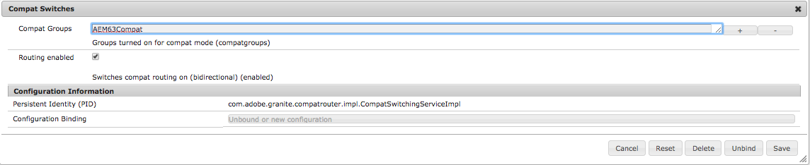

# Compatibilité descendante dans AEM 6.4{#backward-compatibility-in-aem}

## Présentation {#overview}

>[!NOTE]
>
>Pour obtenir une liste des modifications de contenu et de configuration qui ne relèvent pas du package de compatibilité, voir la section [Restructuration du référentiel dans AEM 6.4](/help/sites-deploying/repository-restructuring.md).

Dans AEM 6.4, toutes les fonctionnalités ont été développées en tenant compte de la compatibilité ascendante.

Dans la majorité des cas, les utilisateurs qui exécutent AEM 6.3 ne doivent pas changer le code ni les personnalisations lorsqu’ils effectuent la mise à niveau. Pour les clients AEM 6.1 et 6.2, il n&#39;y a pas de changement de rupture supplémentaire qui pourrait survenir lors d&#39;une mise à niveau vers la version 6.3.

Dans les cas où la compatibilité descendante des fonctionnalités ne peut pas être conservée, il est possible de garantir la rétrocompatibilité des lots et du contenu en installant un module de compatibilité pour 6.3 (pour savoir où télécharger ce module, consultez la procédure de configuration ci-dessous). Ce package de compatibilité rétablira la compatibilité des applications conformes à AEM 6.3.

Le module de compatibilité vous permet d’exécuter AEM en mode de compatibilité et de différer le développement personnalisé par rapport à de nouvelles fonctionnalités d’AEM :

>[!NOTE]
>
>Notez que le module de compatibilité n’est qu’une solution temporaire visant à différer le développement requis pour garantir une compatibilité avec AEM 6.4. Il est recommandé de ne l’utiliser qu’en dernier ressort si vous ne parvenez pas à remédier aux problèmes de compatibilité par le biais du développement immédiatement après la mise à niveau. Il est vivement conseillé de basculer vers le mode natif et de désinstaller le module de compatibilité dès que vous décidez de procéder au développement personnalisé basé sur 6.4 et de tirer pleinement parti des fonctionnalités de la version 6.4.

Le module de compatibilité propose deux modes : **Routage activé** et **Routage désactivé**.

Cela vous permet d’exécuter AEM 6.4 dans trois modes différents :

**Mode natif :**

Le mode natif s’adresse aux personnes qui souhaitent utiliser toutes les nouvelles fonctionnalités d’AEM 6.4 et sont disposées à effectuer certaines tâches de développement pour que leurs personnalisations fonctionnent avec l’ensemble de ces fonctionnalités.

Cela signifie que des ajustements devront peut-être être effectués dans votre application juste après la mise à niveau.

**Mode de compatibilité : module de compatibilité installé avec le mode Routage activé**

Le mode de compatibilité s’adresse aux utilisateurs dont les personnalisations des interfaces ne sont pas rétrocompatibles. Cela permet à AEM de s’exécuter en mode de compatibilité et de différer le développement personnalisé requis par rapport aux nouvelles fonctionnalités d’AEM incompatibles avec une partie de votre code personnalisé.

**Mode hérité : module de compatibilité installé avec le mode Routage désactivé**

Le mode hérité s’adresse aux utilisateurs qui possèdent des interfaces personnalisées basées sur du code hérité ou obsolète d’AEM qui a été déplacé dans le module de compatibilité.

## Méthode de configuration {#how-to-set-up}

Le package de compatibilité AEM 6.3 peut être installé en tant que package à l’aide de Package Manager. Vous pouvez télécharger le package de compatibilité [AEM 6.3 à partir du site Software Distribution](https://experience.adobe.com/#/downloads/content/software-distribution/en/aem.html?package=/content/software-distribution/en/details.html/content/dam/aem/public/adobe/packages/cq640/compatpack/aem-compat-cq64-to-cq63).

Une fois le module de compatibilité installé, le routage peut être activé ou désactivé à l’aide d’un commutateur dans la configuration OSGI, comme indiqué ci-dessous :

Une fois le module de compatibilité installé et configuré, les fonctionnalités sont utilisées sur la base du mode de compatibilité choisi.
