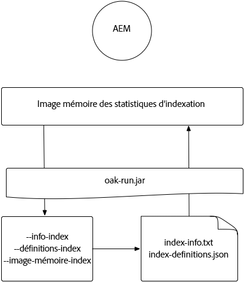
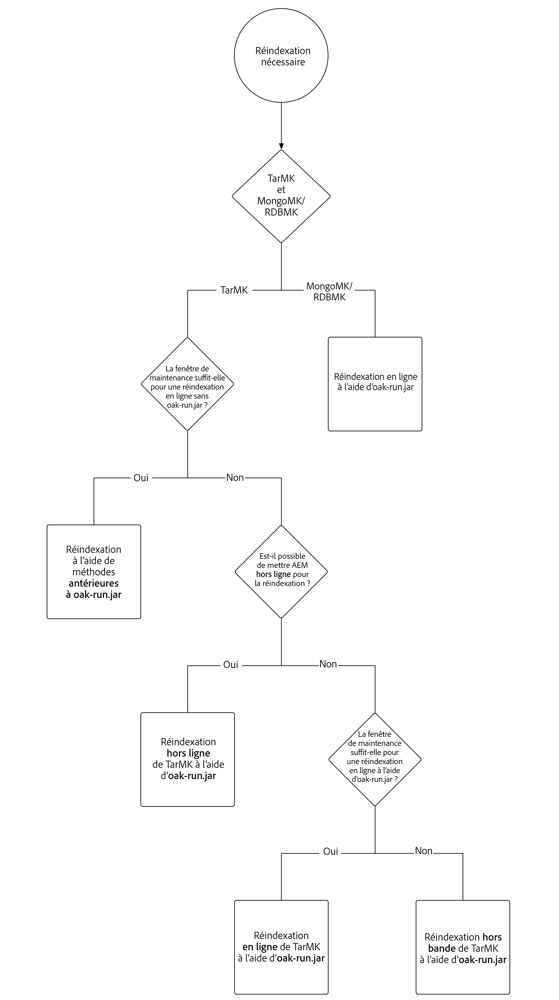
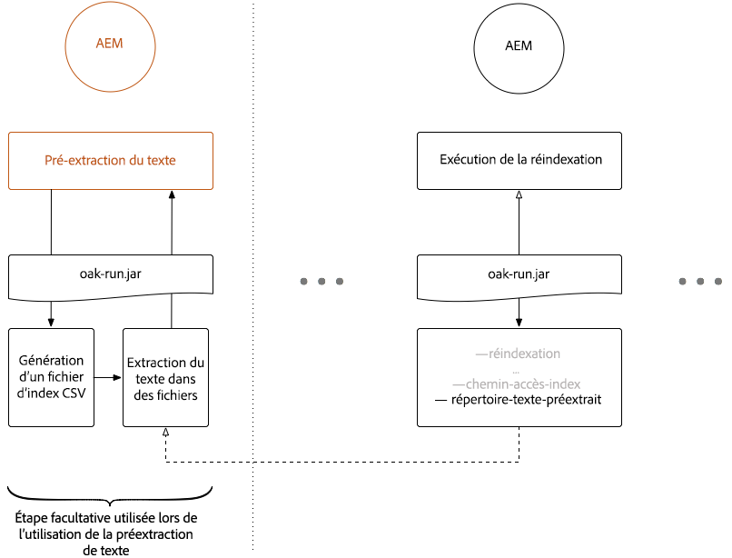
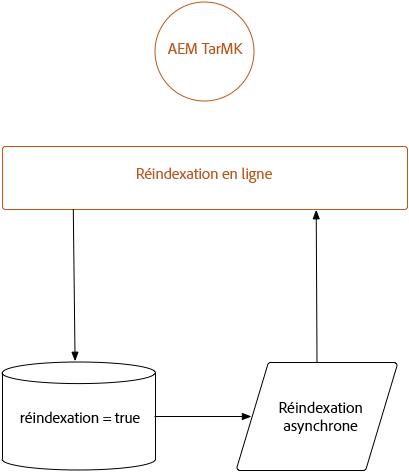
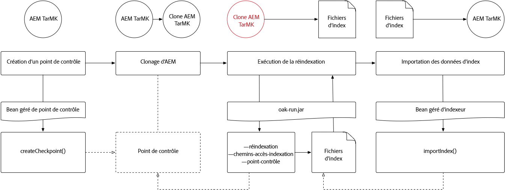

# Indexation par l’intermédiaire du fichier Jar d’Oak-run{#indexing-via-the-oak-run-jar}

>[!CAUTION]
>
>AEM 6.4 a atteint la fin de la prise en charge étendue et cette documentation n’est plus mise à jour. Pour plus d’informations, voir notre [période de support technique](https://helpx.adobe.com/fr/support/programs/eol-matrix.html). Rechercher les versions prises en charge [here](https://experienceleague.adobe.com/docs/?lang=fr).

Oak-run prend en charge tous les cas d’utilisation d’indexation sur la ligne de commande sans avoir à opérer au niveau JMX. Les avantages de l’approche oak-run sont les suivants :

1. Il s’agit d’un nouvel ensemble d’outils d’indexation pour AEM 6.4.
1. Elle réduit la durée de réindexation, ce qui a un impact bénéfique sur les temps de réindexation sur les référentiels plus volumineux.
1. Il réduit la consommation des ressources au cours de la réindexation dans AEM, ce qui se traduit par de meilleures performances du système pour d’autres activités AEM.
1. Oak-run fournit une prise en charge hors-bande : si les conditions d’exploitation ne permettent pas d’exécuter une réindexation sur les instances d’exploitation, un environnement cloné peut être utilisé à cette fin afin d’éviter un impact critique sur les performances.

Vous trouverez, ci-dessous, la liste des scénarios d’utilisation qui peuvent être appliqués lors de l’exécution d’opérations d’indexation par le biais de l’outil `oak-run`.

## Contrôles de cohérence d’index {#indexconsistencychecks}

>[!NOTE]
>
>Pour plus d’informations sur ce scénario, voir [Cas d’utilisation 1 - Contrôle de cohérence de l’index](/help/sites-deploying/oak-run-indexing-usecases.md#usercase1indexconsistencycheck).

* `oak-run.jar`détermine rapidement si les index lucene oak sont corrompus.
* Il est recommandé de lancer l’exécution sur une instance AEM en cours d’utilisation pour les niveaux de contrôle de cohérence 1 et 2.

## Statistiques d’index {#indexstatistics}

>[!NOTE]
>
>Pour plus d’informations sur ce scénario, voir [Cas d’utilisation 2 - Statistiques des index](/help/sites-deploying/oak-run-indexing-usecases.md#usecase2indexstatistics)

* `oak-run.jar` vide toutes les définitions d’index, toutes les statistiques d’index importantes et tout le contenu d’index en vue d’une analyse hors ligne.

* Son exécution est recommandée sur une instance AEM en cours d’utilisation.

## Arborescence de décision de la méthode de réindexation {#reindexingapproachdecisiontree}

Ce diagramme illustre une arborescence de décision concernant l’utilisation des diverses méthodes de réindexation.

## Réindexation de MongoMK / RDMBMK {#reindexingmongomk}

>[!NOTE]
>
>Pour plus d’informations sur ce scénario, voir [Cas d’utilisation 3 - Réindexation](/help/sites-deploying/oak-run-indexing-usecases.md#usecase3reindexing).

### Pré-extraction de texte pour SegmentNodeStore et DocumentNodeStore {#textpre-extraction}

[pré-extraction de texte](/help/sites-deploying/best-practices-for-queries-and-indexing.md#how-to-perform-text-pre-extraction) (une fonctionnalité qui existe avec AEM 6.3) peut être utilisée pour réduire le temps de réindexation. La pré-extraction de texte peut être utilisée conjointement avec toutes les méthodes de réindexation.

En fonction de la méthode d’indexation du fichier `oak-run.jar`, diverses étapes seront effectuées de part et d’autre de l’étape « Procéder à la réindexation » dans le diagramme ci-dessous.

>[!NOTE]
>
>Orange indique les activités pour lesquelles AEM doit se trouver dans une fenêtre de maintenance.

### Réindexation en ligne pour MongoMK ou RDBMK à l’aide du fichier oak-run.jar {#onlinere-indexingformongomk}

>[!NOTE]
>
>Pour plus d’informations sur ce scénario, voir [Réindexation - DocumentNodeStore](/help/sites-deploying/oak-run-indexing-usecases.md#reindexdocumentnodestore).

Il s’agit de la méthode recommandée pour réindexer les installations MongoMK (et RDBMK) AEM. Aucune autre méthode ne doit être utilisée.

Ce processus ne doit être exécuté que sur une seule instance AEM de la grappe.

## Réindexation de TarMK {#re-indexingtarmk}

>[!NOTE]
>
>Pour plus d’informations sur ce scénario, voir [Réindexation - SegmentNodeStore](/help/sites-deploying/oak-run-indexing-usecases.md#reindexsegmentnodestore).

* **Observations relatives à Cold Standby (TarMK)**

   * Il n&#39;y a pas de considération particulière pour le Secondaire froid; les instances Secondaires en froid synchronisent les modifications comme d’habitude.

* **Fermes de publication AEM (les fermes de publication AEM doivent toujours être TarMK)**

   * Pour la batterie de serveurs de publication, elle doit être effectuée pour l’ensemble OU exécuter les étapes sur une seule publication, puis cloner la configuration pour d’autres (en prenant toutes les précautions habituelles lors du clonage d’instances AEM ; sling.id - doit pointer vers quelque chose ici)

### Réindexation en ligne pour TarMK {#onlinere-indexingfortarmk}

>[!NOTE]
>
>Pour plus d’informations sur ce scénario, voir [Réindexation en ligne - SegmentNodeStore](/help/sites-deploying/oak-run-indexing-usecases.md#onlinereindexsegmentnodestore).

Il s’agit de la méthode utilisée avant l’introduction des nouvelles fonctionnalités d’indexation du fichier oak-run.jar. Elle peut être exécutée en définissant la propriété `reindex=true` sur l’index Oak.

Cette approche peut être utilisée si les effets sur le temps et les performances à indexer sont acceptables pour le client. C’est souvent le cas pour les installations AEM de petite et moyenne taille.

### Réindexation en ligne de TarMK à l’aide du fichier oak-run.jar {#onlinere-indexingtarmkusingoak-run-jar}

>[!NOTE]
>
>Pour obtenir des informations détaillées sur ce scénario, consultez la section [Réindexation en ligne – SegmentNodeStore – L’instance AEM est en cours d’exécution](/help/sites-deploying/oak-run-indexing-usecases.md#onlinereindexsegmentnodestoretheaeminstanceisrunning).

La réindexation en ligne de TarMK à l’aide du fichier oak-run.jar est plus rapide que la [Réindexation en ligne pour TarMK](#onlinere-indexingfortarmk) décrite ci-dessus. Cependant, elle exige également d’être exécutée au cours d’une fenêtre de maintenance, en sachant que cette fenêtre sera plus étroite. Son exécution s’accompagne, en outre, d’étapes supplémentaires.

>[!NOTE]
>
>La couleur orange indique les opérations au cours desquelles AEM doit être exécuté au cours d’une session de maintenance.

### Réindexation hors ligne de TarMK à l’aide du fichier oak-run.jar {#offlinere-indexingtarmkusingoak-run-jar}

>[!NOTE]
>
>Pour plus d’informations sur ce scénario, voir [Réindexation en ligne - SegmentNodeStore - L’instance AEM est arrêtée](/help/sites-deploying/oak-run-indexing-usecases.md#onlinereindexsegmentnodestoreaeminstanceisdown).

La réindexation hors ligne de TarMK est la méthode de réindexation la plus simple basée sur le fichier `oak-run.jar`, en ce sens qu’elle ne nécessite qu’un seul commentaire `oak-run.jar`. Toutefois, l’instance AEM doit être arrêtée.

>[!NOTE]
>
>Rouge indique les opérations où AEM doit être arrêté.

### Réindexation hors-bande de TarMK à l’aide du fichier oak-run.jar  {#out-of-bandre-indexingtarmkusingoak-run-jar}

>[!NOTE]
>
>Pour obtenir des informations détaillées sur ce scénario, voir [Réindexation hors-bande – SegmentNodeStore](/help/sites-deploying/oak-run-indexing-usecases.md#outofbandreindexsegmentnodestore).

La réindexation hors-bande réduit l’impact de la réindexation sur les instances AEM en cours d’utilisation.

>[!NOTE]
>
>Rouge indique les opérations où AEM peut être arrêté.

## Mise à jour des définitions d’indexation {#updatingindexingdefinitions}

>[!NOTE]
>
>Pour obtenir des informations détaillées sur ce scénario, consultez le [Cas d’utilisation 4 – Mise à jour des définitions d’indexation](/help/sites-deploying/oak-run-indexing-usecases.md#usecase4updatingindexdefinitions).

### Création et mise à jour des définitions d’index sur TarMK à l’aide d’ACS Ensure Index {#creatingandupdatingindexdefinitionsontarmkusingacsensureindex}

>[!NOTE]
>
>ACS Ensure Index est un projet pris en charge par la communauté et n’est pas pris en charge par la prise en charge des Adobes.

Cela permet d’envoyer la définition d’index via un module de contenu, ce qui entraîne une réindexation en définissant l’indicateur de réindexation sur `true`. Cela fonctionne pour les configurations plus petites où la réindexation ne prend pas beaucoup de temps.

Pour plus d’informations, voir [Documentation d’ACS Ensure Index](https://adobe-consulting-services.github.io/acs-aem-commons/features/ensure-oak-index/index.html) pour plus d’informations.

### Création et mise à jour des définitions d’index sur TarMK à l’aide du fichier oak-run.jar {#creatingandupdatingindexdefinitionsontarmkusingoak-run-jar}

Si l’exécution d’une réindexation à l’aide de méthodes autres que `oak-run.jar` s’avère trop pénalisante sur le plan de la durée et des performances, vous pouvez adopter l’approche suivante basée sur `oak-run.jar` pour importer et réindexer des définitions d’index Lucene dans une installation AEM basée sur TarMK.

### Création et mise à jour des définitions d’index sur MongoMK à l’aide du fichier oak-run.jar {#creatingandupdatingindexdefinitionsonmonogmkusingoak-run-jar}

Si l’exécution d’une réindexation à l’aide de méthodes autres que `oak-run.jar` s’avère trop pénalisante sur le plan de la durée et des performances, vous pouvez adopter l’approche suivante basée sur `oak-run.jar` pour importer et réindexer des définitions d’index Lucene dans des installations AEM basées sur MongoMK.

