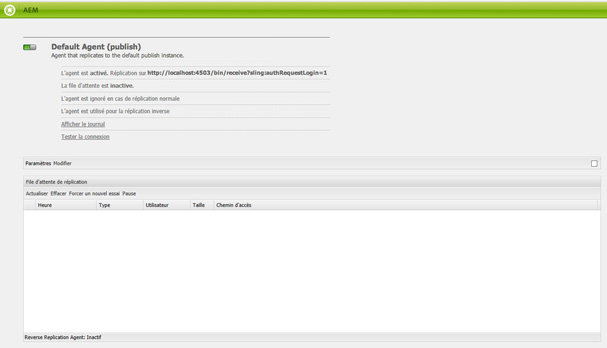
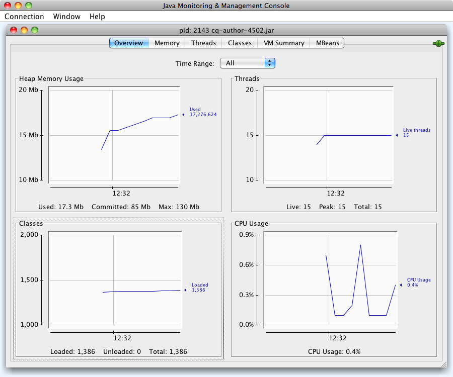

# Surveiller et maintenir votre instance AEM{#monitoring-and-maintaining-your-aem-instance}

>[!CAUTION]
>
>AEM 6.4 a atteint la fin de la prise en charge étendue et cette documentation n’est plus mise à jour. Pour plus d’informations, voir notre [période de support technique](https://helpx.adobe.com/fr/support/programs/eol-matrix.html). Rechercher les versions prises en charge [here](https://experienceleague.adobe.com/docs/?lang=fr).

Une fois les instances AEM déployées, certaines tâches sont nécessaires pour surveiller et conserver leur fonctionnalité, leur performance et leur intégrité.

Un facteur clé est que, pour identifier les problèmes potentiels, vous devez connaître l’apparence et le comportement de vos systèmes dans des conditions normales. Pour ce faire, il est préférable de surveiller le système et de collecter des informations sur une période donnée.

| Vérification | Considérations | Commentaire/Actions |
|---|---|---|
| Plan de sauvegarde. |  | Découvrez comment [Sauvegarde de votre instance](/help/sites-deploying/monitoring-and-maintaining.md#backups). |
| Plan de reprise sur sinistre. | Les directives de reprise sur sinistre de votre entreprise. |  |
| Un système de suivi des erreurs est disponible pour signaler des problèmes. | Par exemple, [bugzilla](https://www.bugzilla.org/), [jira](https://www.atlassian.com/software/jira/), ou plusieurs autres. |  |
| Les systèmes de fichiers sont surveillés. | Le référentiel CRX se « bloque » s’il n’y a pas suffisamment d’espace disque disponible. Il reprendra une fois que l’espace sera disponible. | Les messages « `*ERROR* LowDiskSpaceBlocker` » s’affichent dans le fichier journal lorsque l’espace disque est faible. |
| Les [fichiers journaux](/help/sites-deploying/monitoring-and-maintaining.md#working-with-audit-records-and-log-files) sont surveillés. |  |  |
| La surveillance du système s’exécute (constamment) en arrière-plan. | Cela comprend l’usage du processeur, de la mémoire, du disque et du réseau. En utilisant par exemple iostat / vmstat / perfmon. | Les données enregistrées sont visualisées et peuvent être utilisées pour suivre les problèmes de performance. Les données brutes sont également accessibles. |
| [Surveillance AEM performance](/help/sites-deploying/monitoring-and-maintaining.md#monitoring-performance). | Inclusion [Compteurs de requêtes](/help/sites-deploying/monitoring-and-maintaining.md#request-counters) pour surveiller les niveaux de trafic. | Si une perte de performance importante ou à long terme est constatée, une enquête approfondie doit être menée. |
| Vous surveillez vos [agents de réplication](/help/sites-deploying/monitoring-and-maintaining.md#monitoring-your-replication-agents). |  |  |
| Purge régulière des instances de workflow. | Taille du référentiel et performances du workflow. | Voir [Purge régulière des instances de workflow](/help/sites-administering/workflows-administering.md#regular-purging-of-workflow-instances). |

## Sauvegardes {#backups}

Il est recommandé de sauvegarder les éléments suivants :

* Votre installation logicielle - avant/après des modifications importantes de la configuration
* Le contenu conservé dans le référentiel, régulièrement

Votre entreprise aura probablement une stratégie de sauvegarde que vous devrez suivre, des considérations supplémentaires sur les éléments à sauvegarder et quand inclure :

* l’importance du système et des données.
* la fréquence à laquelle des modifications sont apportées au logiciel ou aux données.
* le volume des données; La capacité peut parfois poser problème, tout comme le temps nécessaire pour effectuer la sauvegarde.
* Si votre sauvegarde peut être effectuée au moment où les utilisateurs sont en ligne ; et si possible, quel en est l’impact sur la performance.
* la répartition géographique des utilisateurs ; c’est-à-dire quand est le meilleur moment pour effectuer une sauvegarde (afin de minimiser l’impact) ?
* Votre stratégie de reprise après sinistre ; y a-t-il des directives sur l’emplacement du stockage de données de sauvegarde (par exemple, hors site et médias spécifiques etc.).

Souvent, une sauvegarde complète est effectuée à intervalles réguliers (par exemple tous les jours, toutes les semaines ou tous les mois), avec des sauvegardes incrémentielles entre les deux (par exemple toutes les heures, tous les jours ou toutes les semaines).

>[!CAUTION]
>
>Lors de l’exécution des sauvegardes de vos instances d’exploitation, des tests *doivent* être effectués pour vous assurer que la sauvegarde peut être restaurée.
>
>Sans cela, la sauvegarde est potentiellement inutile (au pire des cas).

>[!NOTE]
>
>Pour plus d’informations sur les performances de sauvegarde, consultez la section [Performances des sauvegardes](/help/sites-deploying/configuring-performance.md#backup-performance) .

### Sauvegarde de votre installation logicielle {#backing-up-your-software-installation}

Après l’installation ou des modifications importantes de la configuration, effectuez une sauvegarde de votre installation logicielle.

Pour ce faire, vous devez [sauvegarde de votre référentiel entier ;](#backing-up-your-repository) puis :

1. Arrêtez d&#39;AEM.
1. Sauvegardez l’intégralité du fichier `<cq-installation-dir>` depuis votre système de fichiers.

>[!CAUTION]
>
>Si vous gérez un serveur d’application tiers, des fichiers supplémentaires peuvent se trouver sur un emplacement différent et doivent également être pris en charge. Découvrez [comment installer AEM avec un serveur d’application](/help/sites-deploying/application-server-install.md) pour plus d’informations sur la configuration des serveurs d’applications.

>[!CAUTION]
>
>La sauvegarde incrémentielle de l’entrepôt de données de fichier est prise en charge ; lors de l’utilisation de la sauvegarde incrémentielle pour d’autres composants (tels que l’index Lucene), assurez-vous que les fichiers supprimés sont également marqués comme supprimés dans la sauvegarde.

>[!NOTE]
>
>La mise en miroir du disque peut également être utilisée comme mécanisme de sauvegarde.

### Sauvegarde du référentiel {#backing-up-your-repository}

Le [Sauvegarde et restauration](/help/sites-administering/backup-and-restore.md) la section de la documentation CRX couvre tous les problèmes liés aux sauvegardes du référentiel CRX.

Pour plus d’informations sur la réalisation d’une sauvegarde &quot;à chaud&quot; en ligne, voir [Création d’une sauvegarde en ligne](/help/sites-administering/backup-and-restore.md#online-backup).

## Purge de version {#version-purging}

Le **Purge des versions** est destiné à purger les versions d’un noeud ou d’une hiérarchie de noeuds dans votre référentiel. Son Principal objectif est de vous aider à réduire la taille de votre référentiel en supprimant les anciennes versions de vos noeuds.

Cette section traite des opérations de maintenance liées à la fonctionnalité de création de versions d’AEM. Le **Purge de la version** est destiné à purger les versions d’un noeud ou d’une hiérarchie de noeuds dans votre référentiel. Son Principal objectif est de vous aider à réduire la taille de votre référentiel en supprimant les anciennes versions de vos noeuds.

### Présentation {#overview}

L’outil **Purge de versions** est disponible dans la console **[Outils](/help/sites-administering/tools-consoles.md)** sous **Versions** ou directement à l’adresse :

`https://<server>:<port>/etc/versioning/purge.html`


**Chemin de début** Un chemin absolu sur lequel la purge doit être effectuée. Vous pouvez sélectionner le chemin de début en cliquant sur le navigateur d’arborescence du référentiel. 

**Récursif** Lors de la purge des données, vous pouvez choisir d’effectuer une opération sur un nœud ou sur une hiérarchie complète en choisissant Récursif. Dans ce cas, le chemin donné définit le nœud racine de la hiérarchie. 

**Versions maximales à conserver** Nombre maximal de versions à conserver pour un nœud. Lorsque ce nombre dépasse la valeur, les versions les plus anciennes sont purgées.

**Âge de version maximal** L’âge maximal de la version d’un nœud. Lorsque l’âge d’une version dépasse cette valeur, elle est purgée. 

**Exécution d’essai** Étant donné que la suppression des versions de contenu est définitive et ne peut pas être rétablie sans la restauration d’une sauvegarde, l’outil Purge de versions fournit un mode Exécution d’essai qui permet d’afficher un aperçu des versions purgées. Pour lancer le mode Exécution d’essai du processus de purge, cliquez sur Exécution d’essai.

**Purge** Lancez la purge des versions sur le nœud défini par le chemin de début.

### Purge des versions d’un site web {#purging-versions-of-a-web-site}

Pour purger les versions d’un site web, procédez comme suit :

1. Accédez à la console **[Outils](/help/sites-administering/tools-consoles.md)**, sélectionnez **Versions** et double-cliquez sur **Purger les versions**.
1. Définissez le chemin de début du contenu à purger (par exemple `/content/geometrixx-outdoors`).

   * Si vous souhaitez purger uniquement le noeud défini par votre chemin d’accès, désélectionnez **Récursif**.
   * Si vous souhaitez purger le noeud défini par votre chemin d’accès et ses descendants, sélectionnez **Récursif**.

1. Définissez le nombre maximal de versions (pour chaque noeud) que vous souhaitez conserver. Laissez le paramètre vide si vous ne souhaitez pas l’utiliser.

1. Définissez l’âge maximal de la version en jours (pour chaque nœud) que vous souhaitez conserver. Laissez le paramètre vide si vous ne souhaitez pas l’utiliser.

1. Cliquez sur **Exécution d’essai** pour prévisualiser le processus de purge.
1. Cliquez sur **Purge** pour lancer le processus.

>[!CAUTION]
>
>Les nœuds purgés ne peuvent pas être rétablis sans restaurer le référentiel. Vous devez veiller à votre configuration. Nous vous recommandons de toujours lancer une exécution d’essai avant la purge. 

### Analyse de la console {#analyzing-the-console}

Le **Exécution d’essai** et **Purge** Les processus répertorient tous les noeuds qui ont été traités. Au cours du processus, un nœud peut avoir l’un des statuts suivants :

* `ignore (not versionnable)` : le nœud ne prend pas en charge les versions et est ignoré lors du processus.
* `ignore (no version)` : le nœud n’a pas de version et est ignoré lors du processus.
* `retained` : le nœud n’est pas purgé.
* `purged` : le nœud est purgé.

Par ailleurs, la console affiche des informations utiles sur les versions :

* `V 1.0` : le numéro de version.
* `V 1.0.1`&amp;ast; : l’étoile indique que la version est la version actuelle.
* `Thu Mar 15 2012 08:37:32 GMT+0100` : la date de la version.

Dans l’exemple suivant :

* Le **Chemises** Les versions sont purgées car leur âge de version est supérieur à 2 jours.
* Le **Tonga Fashions !** Les versions sont purgées car leur nombre de versions est supérieur à 5.


## Utilisation des enregistrements d’audit et des fichiers journaux {#working-with-audit-records-and-log-files}

Les enregistrements de contrôle et les fichiers journaux relatifs à Adobe Experience Manager (AEM) se trouvent à différents emplacements. Vous trouverez ci-dessous un aperçu de ce que vous pouvez trouver.

### Utiliser des journaux {#working-with-logs}

AEM WCM enregistre des journaux détaillés. Une fois que vous avez décompressé et démarré Quickstart, vous pouvez trouver les journaux dans :

* `<cq-installation-dir>/crx-quickstart/logs/`
* `<cq-installation-dir>/crx-quickstart/repository/`

#### Rotation des fichiers journaux {#log-file-rotation}

La rotation de fichier journal fait référence au processus qui limite la croissance du fichier par la création régulière d’un nouveau fichier. Dans AEM, un fichier journal appelé `error.log` est activé une fois par jour, selon les règles en place :

* Le fichier `error.log` est renommé selon le modèle {original_filename} `.yyyy-MM-dd`. Par exemple, le 11 juillet 2010, le fichier journal actuel est renommé `error.log-2010-07-10`, puis un nouveau fichier `error.og` est créé.
* Les fichiers journaux précédents ne sont pas supprimés. Il est de votre responsabilité de nettoyer régulièrement les anciens fichiers journaux pour limiter l’utilisation du disque.

>[!NOTE]
>
>Si vous mettez à niveau votre installation AEM, notez que tout fichier journal existant qui n’est plus utilisé par AEM restera sur le disque. Vous pouvez les supprimer sans risque. Toutes les nouvelles entrées de journal seront écrites dans les nouveaux fichiers journaux.

### Recherche des fichiers journaux {#finding-the-log-files}

Divers fichiers journaux sont conservés sur le serveur de fichiers sur lequel vous avez installé AEM :

* `<cq-installation-dir>/crx-quickstart/logs`

   * `access.log`

      Toutes les demandes d’accès à la gestion du contenu web d’AEM et au référentiel sont enregistrées ici.

   * `audit.log`

      Les actions de modération sont enregistrées ici.

   * `error.log`

      Les messages d’erreur (de différents niveaux de gravité) sont enregistrés ici.

   * [ `ImageServer-<PortId>-yyyy>-<mm>-<dd>.log`](https://experienceleague.adobe.com/docs/dynamic-media-developer-resources/image-serving-api/image-serving-api/config-admin/server-logging/c-image-server-log.html?lang=fr)

      Ce journal n’est utilisé que si Dynamic Media est activé. Il propose des statistiques et des informations d’analyse utilisées pour analyser le comportement du processus interne d’ImageServer.

   * `request.log`

      Chaque demande d’accès est enregistrée ici en même temps que la réponse.

   * [ `s7access-<yyyy>-<mm>-<dd>.log`](https://experienceleague.adobe.com/docs/dynamic-media-developer-resources/image-serving-api/image-serving-api/config-admin/server-logging/c-access-log.html?lang=fr)

      Ce journal n’est utilisé que si Dynamic Media est activé. Le journal s7access enregistre chaque demande envoyée à Dynamic Media via `/is/image` et `/is/content`.

   * `stderr.log`

      Contient les messages d’erreur, de différents niveaux de gravité, générés lors du démarrage. Par défaut, le niveau de journalisation est défini sur `Warning` ( `WARN`)

   * `stdout.log`

      Contient des messages de journaux indiquant les événements pendant le démarrage.

   * `upgrade.log`

      Fournit un journal de toutes les opérations de mise à niveau qui s’exécutent à partir de la variable `com.day.compat.codeupgrade` et `com.adobe.cq.upgradesexecutor` modules.

* `<cq-installation-dir>/crx-quickstart/repository`

   * `revision.log`

      Informations sur la journalisation des révisions.

>[!NOTE]
>
>Les journaux ImageServer et s7access ne sont pas inclus dans la variable **Télécharger complet** qui est généré à partir du **system/console/status-Bundlelist** page. À des fins d’assistance, si vous rencontrez des problèmes avec Dynamic Media, veuillez également ajouter les journaux ImageServer et s7access lorsque vous contactez le service clientèle.

### Activation du niveau de journalisation DÉBOGUER {#activating-the-debug-log-level}

Le niveau de journalisation par défaut [Configuration de la journalisation Apache Sling](/help/sites-deploying/osgi-configuration-settings.md#osgi-configuration-settings) est Informations. Par conséquent, les messages de débogage ne sont pas consignés.

Pour activer le niveau de journalisation de débogage pour un journal, définissez la propriété `org.apache.sling.commons.log.level` pour le débogage dans le référentiel. Par exemple, sur `/libs/sling/config/org.apache.sling.commons.log.LogManager` pour configurer la [journalisation globale Apache Sling](/help/sites-deploying/osgi-configuration-settings.md#osgi-configuration-settings).

>[!CAUTION]
>
>Ne laissez pas le journal au niveau du journal de débogage plus longtemps que nécessaire, car il génère de nombreuses entrées de journal, consommant ainsi des ressources.

Une ligne du fichier de débogage commence généralement par DEBUG, puis fournit le niveau de journalisation, l’action d’installation et le message du journal. Par exemple :

```shell
DEBUG 3 WebApp Panel: WebApp successfully deployed
```

Les niveaux de journal sont les suivants :

| 0 | Erreur fatale | L’action a échoué et le programme d’installation ne peut pas continuer. |
|---|---|---|
| 1 | Erreur | L’action a échoué. L’installation se poursuit mais une partie de la gestion du contenu web d’AEM n’a pas été installée correctement et ne fonctionnera pas. |
| 2 | Avertissement | L’action a réussi, mais a rencontré des problèmes. La gestion du contenu web d’AEM risque de ne pas fonctionner correctement. |
| 3 | Informations | L’action a réussi. |

### Création d’un fichier journal personnalisé {#create-a-custom-log-file}

>[!NOTE]
>
>Lorsque vous utilisez Adobe Experience Manager, plusieurs méthodes permettent de gérer les paramètres de configuration de ces services. see [Configuration d’OSGi](/help/sites-deploying/configuring-osgi.md) pour plus d’informations et pour connaître les pratiques recommandées.

Dans certains cas, vous pouvez créer un fichier journal personnalisé avec un niveau de journalisation différent. Vous pouvez le faire depuis le référentiel en procédant comme suit :

1. S’il n’existe pas déjà, créez un dossier de configuration (`sling:Folder`) pour votre projet `/apps/<project-name>/config`.
1. Sous `/apps/<project-name>/config`, créez un nœud pour la nouvelle [configuration de l’enregistreur de journaux Apache Sling](/help/sites-deploying/osgi-configuration-settings.md#osgi-configuration-settings) :

   * Nom :

   `org.apache.sling.commons.log.LogManager.factory.config-<identifier>` (car il s’agit d’un enregistreur)

   Où `<identifier>` est remplacé par du texte libre que vous devez entrer pour l’instance (vous ne pouvez pas omettre cette information). Par exemple, `org.apache.sling.commons.log.LogManager.factory.config-MINE`

   * Type : `sling:OsgiConfig`
   >[!NOTE]
   >
   >Bien que cela ne constitue pas une exigence technique, il est recommandé de rendre `<identifier>` unique.

1. Définissez les propriétés suivantes sur ce nœud :

   * Nom : `org.apache.sling.commons.log.file`

      Type : chaîne

      Valeur : spécifiez le fichier journal ; par exemple, `logs/myLogFile.log`.

   * Nom : `org.apache.sling.commons.log.names`

      Type : `String[] (String + Multi)`

      Valeur : spécifiez les services OSGi pour lequel l’enregistreur consigne les messages ; par exemple, tous les services suivants :

      * `org.apache.sling`
      * `org.apache.felix`
      * `com.day`
   * Nom : `org.apache.sling.commons.log.level`

      Type : chaîne

      Valeur : spécifiez le niveau de journalisation requis (`debug`, `info`, `warn` ou `error`) ; par exemple, `debug`.

   * Configurez les autres paramètres en fonction de vos besoins :

      * Nom : `org.apache.sling.commons.log.pattern`

         Type : `String`

         Valeur : spécifier le modèle du message du journal, au besoin ; par exemple,

         `{0,date,dd.MM.yyyy HH:mm:ss.SSS} *{4}* [{2}] {3} {5}`
   >[!NOTE]
   >
   >`org.apache.sling.commons.log.pattern` prend en charge jusqu’à six arguments.
   >
   >{0} Horodatage de type `java.util.Date`
   >
   >{1} Le marqueur de journal
   >
   >{2} Le nom du thread actuel
   >
   >{3} Le nom de l’enregistreur
   >
   >{4} Le niveau de journalisation
   >
   >{5} Le message du journal
   >
   >Si l’appel de journal comprend un `Throwable`, la trace de pile est ajoutée au message. 

   >[!CAUTION]
   >
   >org.apache.sling.commons.log.names doit avoir une valeur.

   >[!NOTE]
   >
   >Les chemins du rédacteur de journalisation est relatif à l’emplacement `crx-quickstart`.
   >
   >Par conséquent, un fichier journal spécifié en tant que :
   >
   >`logs/thelog.log`
   >
   >écrit à :
   >
   >`<cq-installation-dir>/crx-quickstart/logs/thelog.log`.
   >
   >et un fichier journal spécifié en tant que :
   >
   >`../logs/thelog.log`
   >
   >inscrit dans un répertoire :
   >
   >`<cq-installation-dir>/logs/`\
   >(soit à côté de `<cq-installation-dir>/crx-quickstart/`).

1. Cette étape est nécessaire uniquement lorsqu’un nouvel auteur est nécessaire (c’est-à-dire avec une configuration différente de l’auteur par défaut).

   >[!CAUTION]
   >
   >Une nouvelle configuration d’auteur de journalisation est uniquement nécessaire lorsque celle par défaut n’est pas appropriée. \
   >Si aucun auteur explicite n’est configuré, le système génère automatiquement un auteur implicite par défaut.

   Sous `/apps/<project-name>/config`, créez un nœud pour la nouvelle [configuration de l’enregistreur de journaux Apache Sling](/help/sites-deploying/osgi-configuration-settings.md#osgi-configuration-settings) :

   * Nom : `org.apache.sling.commons.log.LogManager.factory.writer-<identifier>` (s’agissant d’un rédacteur)

      Où `<identifier>` est remplacé par du texte libre que vous devez entrer pour l’instance (vous ne pouvez pas omettre cette information). Par exemple, `org.apache.sling.commons.log.LogManager.factory.writer-MINE`

   * Type : `sling:OsgiConfig`
   >[!NOTE]
   >
   >Bien que cela ne constitue pas une exigence technique, il est recommandé de rendre `<identifier>` unique.

   Définissez les propriétés suivantes sur ce nœud :

   * Nom : `org.apache.sling.commons.log.file`

      Type : `String`

      Valeur : indiquez le fichier journal afin qu’il corresponde au fichier spécifié dans l’enregistreur ;

      pour cet exemple : `../logs/myLogFile.log`.

   * Configurez les autres paramètres en fonction de vos besoins :

      * Nom : `org.apache.sling.commons.log.file.number`

         Type : `Long`

         Valeur : spécifiez le nombre de fichiers journaux que vous souhaitez conserver ; par exemple, `5`.

      * Nom : `org.apache.sling.commons.log.file.size`

         Type : `String`

         Valeur : spécifiez-la comme nécessaire pour contrôler la rotation du fichier par taille/date ; par exemple, `'.'yyyy-MM-dd`.
   >[!NOTE]
   >
   >`org.apache.sling.commons.log.file.size` contrôle la rotation du fichier journal en fonction du paramètre :
   >
   >* de taille maximale de fichier
   >* ou de planification heure/date

   >
   >pour indiquer quand un nouveau fichier sera créé (et le fichier existant renommé selon le modèle de nom). 
   >
   >* Une taille maximale peut être spécifiée par un nombre. Si aucune unité de taille n’est donnée, il s’agit du nombre d’octets, ou vous pouvez ajouter l’une des unités de taille : `KB`, `MB` ou `GB` (la casse est ignorée).
   >* Une planification heure/date peut être spécifiée sous la forme d’un motif `java.util.SimpleDateFormat`. Cela définit le délai au bout duquel le fichier subit une rotation ; de même que le suffixe ajouté au fichier pivoté (pour identification). 

   >
   >La valeur par défaut est de yyyy-MM-dd (pour la rotation quotidienne du journal).
   >
   >Par exemple, à minuit le 20 janvier 2010 (ou pour être précis, lorsque le premier message de journal après cette heure est envoyé), ../logs/error.log sera renommé ../logs/error.log.2010-01-20. La journalisation du 21 janvier sera générée vers une version nouvelle et vide de ../logs/error.log jusqu’à ce qu’elle soit remplacée lors de la prochaine modification quotidienne.
   >
   >| `'.'yyyy-MM` | Rotation au début de chaque mois |
   >|---|---|
   >| `'.'yyyy-ww` | Rotation le premier jour de la semaine (dépend du paramètre régional) |
   >| `'.'yyyy-MM-dd` | Rotation à minuit chaque jour |
   >| `'.'yyyy-MM-dd-a` | Rotation à minuit et midi chaque jour |
   >| `'.'yyyy-MM-dd-HH` | Rotation au début de chaque heure |
   >| `'.'yyyy-MM-dd-HH-mm` | Rotation au début de chaque minute |
   >
   >Remarque : Lorsque vous spécifiez une heure/date :
   > 1. vous devez placer le texte littéral « escape » dans une paire de guillemets simples (’ ’) ;
      >
      >     cela permet d’éviter que certains caractères ne soient interprétés comme des lettres majuscules.
   >
   >  1. N’utilisez que les caractères autorisés pour un nom de fichier valide n’importe où dans l’option.


1. Lisez votre nouveau fichier journal avec l’outil de votre choix.

   Le fichier journal créé dans cet exemple sera `../crx-quickstart/logs/myLogFile.log`.

La console Felix fournit également des informations sur la prise en charge du journal Sling à l’adresse `../system/console/slinglog` ; par exemple, `http://localhost:4502/system/console/slinglog`.

### Recherche des enregistrements d’audit {#finding-the-audit-records}

Les registres d’audit sont tenus pour indiquer qui a fait quoi et quand. Différents enregistrements d’audit sont générés pour les événements WCM et OSGi AEM.

#### AEM les enregistrements d’audit WCM affichés lors de la création de pages {#aem-wcm-audit-records-shown-when-page-authoring}

1. Ouvrez une page.
1. Dans le sidekick, vous pouvez sélectionner l’onglet avec l’icône de verrouillage, puis double-cliquer sur **Journal d’audit...**
1. Une nouvelle fenêtre s’ouvre, affichant la liste des enregistrements d’audit pour la page active.

   

1. Cliquez sur **OK** quand vous voulez fermer la fenêtre.

#### AEM des enregistrements d’audit WCM dans le référentiel {#aem-wcm-auditing-records-within-the-repository}

Dans le dossier `/var/audit`, les enregistrements d’audit sont conservés selon la ressource. Vous pouvez descendre jusqu’à afficher les enregistrements individuels et les informations qu’ils contiennent.

Ces entrées contiennent les mêmes informations que celles affichées lors de la modification d’une page.

#### Enregistrements d’audit OSGi à partir de la console web {#osgi-audit-records-from-the-web-console}

Les événements OSGi produisent également des enregistrements d’audit pouvant être affichés dans l’onglet **Statut de la configuration** -> Onglet **Fichiers journaux** dans la console web Adobe AEM : 


## Surveillance de vos agents de réplication {#monitoring-your-replication-agents}

Vous pouvez surveiller vos [files d’attente de réplication](/help/sites-deploying/replication.md) pour détecter lorsqu’une file d’attente est arrêtée ou bloquée, ce qui peut à son tour indiquer un problème avec une instance de publication ou un système externe :

* toutes les files d’attente requises sont-elles activées ?
* des files d’attente désactivées sont-elles toujours requises ?
* toutes les files d’attente `enabled` doivent avoir le statut `idle` ou `active`, qui indiquent un fonctionnement normal ; aucune file d’attente ne doit être `blocked`, ce qui signale souvent des problèmes du côtés des destinataires.

* Si la taille de la file d’attente augmente au fil du temps, cela peut indiquer qu’elle est bloquée.

Pour surveiller un agent de réplication :

1. Accédez au **Outils** dans AEM.
1. Cliquez sur **Réplication**.
1. Double-cliquez sur le lien vers les agents pour l’environnement approprié (volet gauche ou droit) ; par exemple **Agents sur l’auteur**.

   La fenêtre qui s’affiche affiche un aperçu de tous vos agents de réplication pour l’environnement de création, y compris leur cible et leur état.

1. Cliquez sur le nom de l’agent approprié (qui est un lien) pour afficher des informations détaillées sur cet agent :

   

   Vous pouvez effectuer les opérations suivantes :

   * Vérifiez si l’agent est activé.
   * Voir la cible de toutes les réplications.
   * Vérifiez si la file d’attente de réplication est actuellement principale (activée).
   * Vérifiez s’il existe des éléments dans la file d’attente.
   * **Actualiser** ou **Effacer** pour mettre à jour l’affichage des entrées de file d’attente ; vous pouvez ainsi voir les éléments entrer et quitter la file d’attente.
   * **Afficher le journal** pour accéder au journal de toutes les actions de l’agent de réplication.
   * **Tester la connexion** à l’instance cible.
   * **Forcer une nouvelle tentative** sur les éléments de la file d’attente, le cas échéant.

   >[!CAUTION]
   >
   >N’utilisez pas le lien &quot;Tester la connexion&quot; pour la boîte d’envoi de réplication inverse sur une instance de publication.
   >
   >Si un test de réplication est effectué pour une file d’attente de la boîte d’envoi, les éléments qui sont plus anciens que la réplication de test sont retraités avec chaque réplication inverse.
   >
   >Si de tels éléments existent déjà dans la file d’attente, ils peuvent être recherchés avec la requête XPath JCR suivante et doivent être supprimés.
   >
   >`/jcr:root/var/replication/outbox//*[@cq:repActionType='TEST']`

Vous pouvez toujours développer une solution pour détecter tous les agents de réplication (situés sous `/etc/replication/author` ou `/etc/replication/publish`), puis vérifier le statut de l’agent (`enabled`, `disabled`) et de la file d’attente sous-jacente (`active`, `idle`, `blocked`).

## Surveillance des performances {#monitoring-performance}

[Optimisation des performances](/help/sites-deploying/configuring-performance.md) est un processus interactif qui reçoit l’attention pendant le développement. Après le déploiement, il est généralement examiné après des intervalles ou des événements spécifiques.

Les méthodes utilisées lors de la collecte des informations pour le ciblage peuvent également être utilisées pour une surveillance continue.

>[!NOTE]
>
>Les configurations [spécifiques disponibles pour améliorer la performance](/help/sites-deploying/configuring-performance.md#configuring-for-performance) peuvent également être vérifiées.

Vous trouverez ci-après une liste des problèmes de performance qui surviennent de temps à autre, ainsi que des solutions potentielles sur la façon de les repérer et de les résoudre.

| Domaine | Symptôme(s) | Pour augmenter la capacité... | Pour réduire le volume... |
|---|---|---|---|
| Client | Utilisation élevée du processeur client. | Installez un processeur client avec des performances supérieures. | Simplifiez (par HTML) la mise en page. |
|  | Faible usage du processeur du serveur. | Effectuez une mise à niveau vers un navigateur plus rapide. | Améliorez le cache côté client. |
|  | Certains clients sont rapides, d’autres lents. |  |  |
| Serveur |  |  |  |
| Réseau | Faible usage du processeur sur les serveurs et les clients. | Supprimez tous les goulets d’étranglement réseau. | Améliorez/optimisez la configuration du cache client. |
|  | La navigation locale sur le serveur est (comparativement) rapide. | Augmentez la bande passante du réseau. | Réduisez le &quot;poids&quot; de vos pages web (par exemple moins d’images, HTML optimisé). |
| Serveur web | L’utilisation du processeur sur le serveur web est élevée. | Mettez vos serveurs web en grappe. | Réduire les accès par page (visite). |
|  |  | Utilisez un équilibreur de charge matériel. |  |
| Application | L’utilisation du processeur du serveur est élevée. | Mettez en grappe vos instances AEM. | Recherchez et éliminez les hogs de processeur et de mémoire (utilisez la révision du code, la sortie de minutage, etc.). |
|  | Consommation de mémoire élevée. |  | Améliorez la mise en cache à tous les niveaux. |
|  | Faibles délais de réponse. |  | Optimisez les modèles et les composants (par exemple, la structure, la logique). |
| Référentiel |  |  |  |
| Cache |  |  |  |

Les problèmes de performances peuvent être dus à un certain nombre de causes qui n’ont rien à voir avec votre site web, notamment des ralentissements temporaires de la vitesse de connexion, de la charge du processeur, etc.

Cela peut également avoir un impact sur tous vos visiteurs, ou seulement sur un sous-ensemble d’entre eux.

Toutes ces informations doivent être obtenues, classées et analysées avant de pouvoir optimiser la performance générale ou résoudre des problèmes spécifiques.

* Avant de rencontrer un problème de performances :

   * collecter le plus d’informations possible pour acquérir une bonne connaissance pratique du système dans des circonstances normales ;

* Lorsque vous rencontrez un problème de performances :

   * essayez de le répliquer avec un (ou de préférence plusieurs) navigateur web standard, sur un autre client dont vous savez qu&#39;il présente de bonnes performances générales et/ou sur le serveur lui-même (si possible).
   * vérifier si des éléments (liés au système) ont changé dans un espace temporel approprié et si l’une de ces modifications a pu avoir une incidence sur les performances ;
   * posez des questions telles que :

      * le problème se produit-il uniquement à des moments spécifiques ?
      * le problème se produit-il uniquement sur des pages spécifiques ?
      * les autres demandes sont-elles affectées ?
   * collecter autant d’informations que possible à comparer avec vos connaissances du système dans des circonstances normales :


### Outils de surveillance et d’analyse des performances {#tools-for-monitoring-and-analyzing-performance}

Vous trouverez ci-dessous un bref aperçu de certains outils disponibles pour surveiller et analyser les performances.

Certaines dépendent de votre système d’exploitation.

<table> 
 <tbody> 
  <tr> 
   <td>Outil</td> 
   <td>Utilisé pour analyser...</td> 
   <td>Utilisation / Plus d’informations...</td> 
  </tr> 
  <tr> 
   <td>request.log</td> 
   <td>Temps de réponse et simultanéité.</td> 
   <td><a href="#interpreting-the-request-log">Interprétation de request.log</a>.</td> 
  </tr> 
  <tr> 
   <td>truss/strace</td> 
   <td>Chargements de page</td> 
   <td><p>Commandes Unix/Linux pour tracer les appels et les signaux du système. Augmentez le niveau de journalisation sur <code>INFO</code>.</p> <p>Analysez le nombre de chargements de page par requête, quelles pages, etc.</p> </td> 
  </tr> 
  <tr> 
   <td>Images mémoire de threads</td> 
   <td>Observez les threads JVM. Identifiez les contentions, les verrous et les exécutants longs.</td> 
   <td><p>En fonction du système d’exploitation :<br /> - Unix/Linux : <code>kill -QUIT &lt;<em>pid</em>&gt;</code><br /> - Windows (mode console) : Ctrl-Break<br /> </p> <p>Des outils d’analyse sont également disponibles, tels que <a href="https://java.net/projects/tda/">TDA</a>.<br /> </p> </td> 
  </tr> 
  <tr> 
   <td>Décharges de tas</td> 
   <td>Problèmes de mémoire insuffisante qui ralentissent les performances.</td> 
   <td><p>Ajoutez l’option :<br /> option <code>-XX:+HeapDumpOnOutOfMemoryError</code><br /> vers l’appel Java à AEM.</p> <p>Voir <a href="https://java.sun.com/javase/6/webnotes/trouble/TSG-VM/html/clopts.html#gbzrr">Guide de dépannage pour Java SE 6 avec HotSpot VM</a>.</p> </td> 
  </tr> 
  <tr> 
   <td>Appels système</td> 
   <td>Identifiez les problèmes de minutage.</td> 
   <td><p>Appels à <code>System.currentTimeMillis()</code> ou <code>com.day.util</code>. Les durées sont utilisées pour générer les horodatages à partir de votre code ou via les <a href="#html-comments">commentaires HTML</a>.</p> <p><strong>Remarque :</strong> Ils doivent être mis en oeuvre afin qu’ils puissent être activés/désactivés selon les besoins ; lorsqu’un système fonctionne correctement, les frais liés à la collecte de statistiques ne sont pas nécessaires.</p> </td> 
  </tr> 
  <tr> 
   <td>Apache Bench</td> 
   <td>Identifiez les fuites de mémoire, analysez de manière sélective le temps de réponse.</td> 
   <td><p>l’utilisation de base est la suivante :</p> <p><code>ab -k -n &lt;<em>requests</em>&gt; -c &lt;<em>concurrency</em>&gt; &lt;<em>url</em>&gt;</code></p> <p>Consultez <a href="#apache-bench">Apache Bench</a> et la <a href="https://httpd.apache.org/docs/2.2/programs/ab.html">page ab man</a> pour plus de détails.</p> </td> 
  </tr> 
  <tr> 
   <td>Analyse de la recherche</td> 
   <td> </td> 
   <td>Exécutez les requêtes de recherche hors ligne, identifiez le temps de réponse de la requête, testez et confirmez le jeu de résultats.<br /> </td> 
  </tr> 
  <tr> 
   <td>JMeter</td> 
   <td>Tests de charge et tests fonctionnels.</td> 
   <td><a href="https://jakarta.apache.org/jmeter/">https://jakarta.apache.org/jmeter/</a></td> 
  </tr> 
  <tr> 
   <td>JProfiler</td> 
   <td>Profilage détaillé du processeur et de la mémoire.</td> 
   <td><a href="https://www.ej-technologies.com/">https://www.ej-technologies.com/</a></td> 
  </tr> 
  <tr> 
   <td>JConsole</td> 
   <td>Observez les mesures et les threads JVM.</td> 
   <td><p>Utilisation : jconsole</p> <p>Voir <a href="https://java.sun.com/developer/technicalArticles/J2SE/jconsole.html">jconsole</a> et <a href="#monitoring-performance-using-jconsole">Surveillance de la performance en utilisant JConsole</a>.</p> <p><strong>Remarque :</strong> avec JDK 1.6, JConsole est extensible avec des modules complémentaires ; par exemple, Top ou TDA (Thread Dump Analyzer).</p> </td> 
  </tr> 
  <tr> 
   <td>Java VisualVM</td> 
   <td>Observez les mesures, les threads, la mémoire et le profilage JVM.</td> 
   <td><p>Utilisation : jvisualvm ou visualvm<br /> </p> <p>Voir <a href="https://java.sun.com/javase/6/docs/technotes/tools/share/jvisualvm.html">jvisualvm</a>, <a href="https://visualvm.github.io/releases.html">visualvm</a> et <a href="#monitoring-performance-using-j-visualvm">Surveillance de la performance à l’aide de (J)VisualVM</a>.</p> <p><strong>Remarque :</strong> avec JDK 1.6, VisualVM est extensible avec des modules complémentaires.</p> </td> 
  </tr> 
  <tr> 
   <td>truss/strace, lsof</td> 
   <td>Appel du noyau en profondeur et analyse des processus (Unix).</td> 
   <td>Commandes Unix/Linux.</td> 
  </tr> 
  <tr> 
   <td>Statistiques de minutage</td> 
   <td>Voir les statistiques de minutage pour le rendu des pages.</td> 
   <td><p>Pour voir les statistiques de durée pour le rendu de page, vous pouvez utiliser <strong>Ctrl-Shift-U</strong> avec <code>?debugClientLibs=true</code> défini dans l’URL.</p> </td> 
  </tr> 
  <tr> 
   <td>Outil de profilage du processeur et de la mémoire<br /> </td> 
   <td><a href="#interpreting-the-request-log">Utilisé lors de l’analyse des demandes lentes pendant le développement</a>.</td> 
   <td>Par exemple, <a href="https://www.yourkit.com/">YourKit</a>.</td> 
  </tr> 
  <tr> 
   <td><a href="#information-collection">Collecte des informations</a></td> 
   <td>L’état actuel de votre installation.</td> 
   <td>Apprendre le plus possible sur votre installation peut également vous aider à détecter ce qui a pu causer un changement au niveau de la performance et si ces changements sont justifiés. Ces informations doivent être collectées de façon régulière, afin que vous puissiez facilement identifier des changements importants.</td> 
  </tr> 
 </tbody> 
</table>

### Interprétation de request.log {#interpreting-the-request-log}

Ce fichier permet d’enregistrer des données de base sur chaque demande envoyée à AEM. Vous pouvez en tirer des conclusions précieuses.

`request.log` fournit une méthode intégrée pour identifier la durée des demandes. Pour le développement, il est utile d’utiliser `tail -f` sur `request.log` et d’observer les temps de réponse lents. Pour analyser un fichier `request.log` de plus grande envergure, nous vous recommandons [l’utilisation de `rlog.jar`, qui permet de trier et de filtrer les délais de réponse](#using-rlog-jar-to-find-requests-with-long-duration-times).

Nous vous recommandons d’isoler les pages « lentes » de `request.log`, puis de les régler individuellement pour une meilleure performance. Cette opération est généralement effectuée en incorporant des mesures de performance par composant, ou en utilisant un outil de profilage des performances tel que ` [yourkit](https://www.yourkit.com/)`.

#### Surveillance du trafic sur votre site web {#monitoring-traffic-on-your-website}

Le journal des requêtes enregistre chaque requête effectuée, ainsi que la réponse apportée :

```xml
09:43:41 [66] -> GET /author/y.html HTTP/1.1
09:43:41 [66] <- 200 text/html 797ms
```

En totalisant toutes les entrées de GET au cours de périodes spécifiques (par exemple, sur différentes périodes de 24 heures), vous pouvez effectuer des instructions sur le trafic moyen de votre site web.

#### Surveillance des temps de réponse avec request.log {#monitoring-response-times-with-the-request-log}

Le journal des demande est un point de départ intéressant pour l’analyse de performances :

`<cq-installation-dir>/crx-quickstart/logs/request.log`

Le journal se présente comme suit (les lignes sont raccourcies par souci de simplicité) :

```xml
31/Mar/2009:11:32:57 +0200 [379] -> GET /path/x HTTP/1.1 
31/Mar/2009:11:32:57 +0200 [379] <- 200 text/html 33ms 
31/Mar/2009:11:33:17 +0200 [380] -> GET /path/y HTTP/1.1 
31/Mar/2009:11:33:17 +0200 [380] <- 200 application/json 39ms
```

Ce journal comporte une ligne par requête ou réponse :

* Date à laquelle chaque demande ou réponse a été effectuée.
* Numéro de la requête, entre crochets. Ce nombre correspond à la requête et à la réponse.
* Flèche indiquant s’il s’agit d’une requête (flèche pointant vers la droite) ou d’une réponse (flèche vers la gauche).
* Pour les demandes, la ligne contient :

   * la méthode (généralement, GET, HEAD ou POST) ;
   * la page demandée ;
   * le protocole

* Pour les réponses, la ligne contient :

   * le code d’état (200 signifie &quot;succès&quot;, 404 signifie &quot;page introuvable&quot;
   * le type MIME ;
   * le temps de réponse ;

En utilisant de petits scripts, vous pouvez extraire les informations requises du fichier journal et assembler les statistiques de votre choix. Vous pouvez ainsi identifier les pages ou les types de pages lents et déterminer si les performances globales sont satisfaisantes.

#### Surveillance des temps de réponse de la recherche avec request.log {#monitoring-search-response-times-with-the-request-log}

Les demandes de recherche sont également enregistrées dans le fichier journal :

```xml
31/Mar/2009:11:35:34 +0200 [338] -> GET /author/playground/en/tools/search.html?query=dilbert&size=5&dispenc=utf-8 HTTP/1.1
31/Mar/2009:11:35:34 +0200 [338] <- 200 text/html 1562ms
```

Ainsi, comme ci-dessus, vous pouvez utiliser des scripts pour extraire les informations pertinentes et créer des statistiques.

Cependant, une fois que vous avez déterminé le temps de réponse, vous devrez peut-être analyser pourquoi la requête prend le temps qu’elle prend et ce qui peut être fait pour améliorer la réponse.

#### Surveillance du nombre et de l’impact des utilisateurs simultanés {#monitoring-the-number-and-impact-of-concurrent-users}

`request.log` peut encore être utilisé pour surveiller les accès simultanés et la réaction du système dans cette situation.

Des tests doivent être effectués pour déterminer le nombre d’utilisateurs simultanés que le système peut traiter avant qu’un impact négatif ne soit observé. Là encore, des scripts peuvent être utilisés pour extraire les résultats du fichier journal :

* surveiller le nombre de requêtes effectuées au cours d’une période spécifique ; par exemple, une minute ;
* tester les effets d’un nombre spécifique d’utilisateurs effectuant tous les mêmes requêtes en même temps (le plus près possible) ; Par exemple, 30 utilisateurs qui cliquent **Enregistrer** en même temps.

```xml
31/Mar/2009:11:45:29 +0200 [333] -> GET /author/libs/Personalize/content/statics.close.gif HTTP/1.1
31/Mar/2009:11:45:29 +0200 [334] -> GET /author/libs/Personalize/content/statics.detach.gif HTTP/1.1
31/Mar/2009:11:45:30 +0200 [335] -> GET /author/libs/CFC/content/imgs/logo.rZMNURccynWcTpCxyuBNiTCoiBMmw000.default.gif HTTP/1.1
31/Mar/2009:11:45:32 +0200 [335] <- 304 text/html 0ms
31/Mar/2009:11:45:33 +0200 [334] <- 200 image/gif 31ms
31/Mar/2009:11:45:38 +0200 [333] <- 200 image/gif 31ms
31/Mar/2009:11:45:42 +0200 [336] -> GET /author/libs/CFC/content/imgs/logo.rZMNURccynWcTZRXunQbbQtvuuCMbRRBuWXz0000.default.gif HTTP/1.1
31/Mar/2009:11:45:43 +0200 [337] -> GET /author/titlebar_bg.gif HTTP/1.1
31/Mar/2009:11:45:43 +0200 [336] <- 304 text/html 0ms
31/Mar/2009:11:45:44 +0200 [337] <- 304 text/html 0ms
```

### Utilisation de rlog.jar pour rechercher des requêtes avec des durées longues {#using-rlog-jar-to-find-requests-with-long-duration-times}

AEM comprend divers outils d’assistance situés dans :
\
`<cq-installation-dir>/crx-quickstart/opt/helpers`

L’un de ces outils, `rlog.jar`, peut être utilisé pour trier rapidement `request.log` de sorte que les demandes soient affichées selon la durée, c’est-à-dire de la plus longue à la plus courte.

La commande suivante affiche les arguments possibles :

```shell
$java -jar rlog.jar 
Request Log Analyzer Version 21584 Copyright 2005 Day Management AG 
Usage: 
  java -jar rlog.jar [options] <filename> 
Options: 
  -h               Prints this usage. 
  -n <maxResults>  Limits output to <maxResults> lines. 
  -m <maxRequests> Limits input to <maxRequest> requests. 
  -xdev            Exclude POST request to CRXDE.
```

Par exemple, vous pouvez l’exécuter en spécifiant le fichier `request.log` en tant que paramètre et afficher les 10 premières demandes ayant la plus longue durée :

```shell
$ java -jar ../opt/helpers/rlog.jar -n 10 request.log 
*Info * Parsed 464 requests. 
*Info * Time for parsing: 22ms 
*Info * Time for sorting: 2ms 
*Info * Total Memory: 1mb 
*Info * Free Memory: 1mb 
*Info * Used Memory: 0mb 
------------------------------------------------------ 
     18051ms 31/Mar/2009:11:15:34 +0200 200 GET /content/geometrixx/en/company.html text/ html 
      2198ms 31/Mar/2009:11:15:20 +0200 200 GET /libs/cq/widgets.js application/x-javascript 
      1981ms 31/Mar/2009:11:15:11 +0200 200 GET /libs/wcm/content/welcome.html text/html 
      1973ms 31/Mar/2009:11:15:52 +0200 200 GET /content/campaigns/geometrixx.teasers..html text/html 
      1883ms 31/Mar/2009:11:15:20 +0200 200 GET /libs/security/cq-security.js application/x-javascript 
      1876ms 31/Mar/2009:11:15:20 +0200 200 GET /libs/tagging/widgets.js application/x-javascript
      1869ms 31/Mar/2009:11:15:20 +0200 200 GET /libs/tagging/widgets/themes/default.js application/x-javascript 
      1729ms 30/Mar/2009:16:45:56 +0200 200 GET /libs/wcm/content/welcome.html text/html; charset=utf-8 
      1510ms 31/Mar/2009:11:15:34 +0200 200 GET /bin/wcm/contentfinder/asset/view.json/ content/dam?_dc=1238490934657&query=&mimeType=image&_charset_=utf-8 application/json 
      1462ms 30/Mar/2009:17:23:08 +0200 200 GET /libs/wcm/content/welcome.html text/html; charset=utf-8 
```

Vous pouvez avoir à concaténer les différents fichiers `request.log` si vous devez effectuer cette opération sur un grand échantillon de données.

### Apache Bench {#apache-bench}

Pour minimiser l’impact des cas particuliers (tels que le nettoyage, etc.), il est recommandé d’utiliser un outil tel que `apachebench` (voir par exemple [ab](https://httpd.apache.org/docs/2.2/programs/ab.html) pour obtenir plus d’informations) pour vous aider à identifier les fuites de mémoire et à analyser de manière sélective le délai de réponse.

Apache Bench peut être utilisé de la manière suivante :

```shell
$ ab -c 5 -k -n 1000 "http://localhost:4503/content/geometrixx/en/company.html"
This is ApacheBench, Version 2.3 <$Revision: 655654 $>
Copyright 1996 Adam Twiss, Zeus Technology Ltd, https://www.zeustech.net/
Licensed to The Apache Software Foundation, https://www.apache.org/

Benchmarking localhost (be patient)
Completed 100 requests
Completed 200 requests
Completed 300 requests
Completed 400 requests
Completed 500 requests
Completed 600 requests
Completed 700 requests
Completed 800 requests
Completed 900 requests
Completed 1000 requests
Finished 1000 requests

Server Software: Day-Servlet-Engine/4.1.52
Server Hostname: localhost
Server Port: 4503

Document Path: /content/geometrixx/en/company.html
Document Length: 24127 bytes

Concurrency Level: 5
Time taken for tests: 69.766 seconds
Complete requests: 1000
Failed requests: 998
(Connect: 0, Receive: 0, Length: 998, Exceptions: 0)
Write errors: 0
Keep-Alive requests: 0
Total transferred: 24160923 bytes
HTML transferred: 24010923 bytes
Requests per second: 14.33 /sec (mean)
Time per request: 348.828 [ms] (mean)
Time per request: 69.766 [ms] (mean, across all concurrent requests)
Transfer rate: 338.20 [Kbytes/sec] received

Connection Times (ms)
min mean[+/-sd] median max
Connect: 0 1 3.9 0 58
Processing: 138 347 568.5 282 8106
Waiting: 137 344 568.1 281 8106
Total: 139 348 568.4 283 8106

Percentage of the requests served within a certain time (ms)
50% 283
66% 323
75% 356
80% 374
90% 439
95% 512
98% 1047
99% 1132
100% 8106 (longest request)
```

Les chiffres ci-dessus sont extraits d’un ordinateur portable standard MacBook Pro (mi-2010) avec accès à la page d’entreprise geometrixx, comme inclus dans une installation d’AEM par défaut. Cette page est très simple mais n’est pas optimisée en terme de performance. 

`apachebench` affiche également la durée par demande comme la moyenne de toutes les requêtes simultanées ; ici `Time per request: 54.595 [ms]` (moyenne de toutes les requêtes simultanées). Vous pouvez modifier la valeur du paramètre d’accès simultané `-c` (nombre de demandes multiples à exécuter à un moment donné) pour voir si cela produit un effet.

### Compteurs de requêtes {#request-counters}

Les informations sur le trafic de requêtes (nombre de requêtes pendant une période spécifique) vous donnent une indication de la charge sur votre instance. Ces informations peuvent être extraites de [request.log](#interpreting-the-request-log) à l’aide des compteurs, automatisant ainsi la collecte de données pour vous permettre de constater :

* différences significatives dans l’activité (c’est-à-dire différencier &quot;de nombreuses demandes&quot; et &quot;de faible activité&quot;)
* lorsqu’une instance n’est pas utilisée ;
* Tout redémarrage (les compteurs sont réinitialisés sur 0)

Pour automatiser la collecte des informations, vous pouvez également installer un RequestFilter afin d’incrémenter un compteur pour chaque requête. Plusieurs compteurs peuvent être utilisés pour différentes périodes.

Les informations collectées peuvent être utilisées pour indiquer :

* modifications importantes de l’activité
* une instance redondante
* tout redémarrage (compteur réinitialisé à 0)

### Commentaires HTML {#html-comments}

Nous vous recommandons d’inclure des `html comments` sur la performance du serveur pour chaque projet. De nombreux bons exemples publics peuvent être trouvés; sélectionnez une page, ouvrez la source de la page pour l’afficher et faites défiler la page vers le bas, le code suivant peut être affiché :

```xml
</body>
 </html>
        <!--
        Page took 58 milliseconds to be rendered by server
         -->
```

### Surveillance des performances à l’aide de JConsole {#monitoring-performance-using-jconsole}

La commande d’outil `jconsole` est disponible avec JDK.

1. Démarrez votre instance AEM.
1. Exécutez `jconsole.`.
1. Sélectionnez votre instance AEM et **connectez-vous**.

1. Depuis l’application `Local`, double-cliquez sur `com.day.crx.quickstart.Main` ; l’aperçu par défaut s’affiche :

   

   Après cela, vous pouvez sélectionner d’autres options.

### Surveillance de la performance à l’aide de (J)VisualVM {#monitoring-performance-using-j-visualvm}

Depuis le JDK 1.6, la commande d’outil `jvisualvm` est disponible. Une fois que vous avez installé le JDK 1.6. vous pouvez :

1. Démarrez votre instance AEM.

   >[!NOTE]
   >
   >Si vous utilisez Java 5, vous pouvez ajouter l’argument `-Dcom.sun.management.jmxremote` à la ligne de commande Java qui permet de lancer votre JVM. JMX est activé par défaut avec Java 6.

1. Exécutez l’une des deux options suivantes :

   * `jvisualvm` : dans le dossier bin JDK 1.6 (version testée)
   * `visualvm` : peut être téléchargé à partir de [VisualVM](https://visualvm.github.io/releases.html) (la version la plus à la pointe)

1. Depuis l’application `Local`, double-cliquez sur `com.day.crx.quickstart.Main` ; l’aperçu par défaut s’affiche :

   

   Après cela, vous pouvez sélectionner d’autres options, y compris Moniteur :

   

Vous pouvez utiliser cet outil pour générer des vidages de thread et des vidages de mémoire. Ces informations sont souvent demandées par l’équipe d’assistance technique.

### Collecte des informations {#information-collection}

Connaître autant que possible votre installation peut vous aider à déterminer ce qui a pu provoquer un changement de performances et si ces modifications sont justifiées. Ces informations doivent être collectées de façon régulière, afin que vous puissiez facilement identifier des changements importants.

Les informations suivantes peuvent s’avérer utiles :

* [Combien d’auteurs travaillent avec le système ?](#how-many-authors-are-working-with-the-system)
* [Quel est le nombre moyen d’activations de page par jour ?](#what-is-the-average-number-of-page-activations-per-day)
* [Combien de pages maintenez-vous actuellement sur ce système ? ](#how-many-pages-do-you-currently-maintain-on-this-system)
* [Si vous utilisez MSM, quel est le nombre moyen de rollouts par mois ? ](#if-you-use-msm-what-is-the-average-number-of-rollouts-per-month)
* [Quel est le nombre moyen de Live Copies par mois ? ](#what-is-the-average-number-of-live-copies-per-month)
* [Si vous utilisez AEM Assets, combien de ressources maintenez-vous actuellement ?](#if-you-use-aem-assets-how-many-assets-do-you-currently-maintain-in-assets)
* [Quelle est la taille moyenne des ressources ?](#what-is-the-average-size-of-the-assets)
* [Combien de modèles sont actuellement utilisés ?](#how-many-templates-are-currently-used)
* [Combien de composants sont actuellement utilisés ?](#how-many-components-are-currently-used)
* [Combien de demandes par heure recevez-vous sur le système de création lorsque le niveau d’activité est élevé ?](#how-many-requests-per-hour-do-you-have-on-the-author-system-at-peak-time)
* [Combien de demandes par heure recevez-vous sur le système de publication lorsque le niveau d’activité est élevé ?](#how-many-requests-per-hour-do-you-have-on-the-publish-system-at-peak-time)

#### Combien d’auteur(e)s travaillent avec le système ? {#how-many-authors-are-working-with-the-system}

Pour afficher le nombre d’auteurs qui ont utilisé le système depuis l’installation, utilisez la ligne de commande :

```shell
cd <cq-installation-dir>/crx-quickstart/logs
cut -d " " -f 3 access.log | sort -u | wc -l
```

Pour afficher le nombre d’auteurs travaillant sur une date donnée :

```shell
grep "<date>" access.log | cut -d " " -f 3 | sort -u | wc -l
```

#### Quel est le nombre moyen d’activations de page par jour ? {#what-is-the-average-number-of-page-activations-per-day}

Pour afficher le nombre total d’activations de page depuis l’installation du serveur, utilisez une requête de référentiel ; via CRXDE - Outils - Requête :

* **Type** `XPath`

* **Chemin** `/`

* **Requête** `//element(*, cq:AuditEvent)[@cq:type='Activate']`

Calculez ensuite le nombre de jours écoulés depuis l’installation pour calculer la moyenne.

#### Combien de pages maintenez-vous actuellement sur ce système ? {#how-many-pages-do-you-currently-maintain-on-this-system}

Pour voir le nombre de pages actuellement sur le serveur, utilisez une requête de référentiel ; via CRXDE - Outils - Requête :

* **Type** `XPath`

* **Chemin** `/`

* **Requête** `//element(*, cq:Page)`

#### Si vous utilisez MSM, quel est le nombre moyen de déploiements par mois ? {#if-you-use-msm-what-is-the-average-number-of-rollouts-per-month}

Pour déterminer le nombre total de déploiements depuis l’installation, utilisez une requête de référentiel ; via CRXDE - Outils - Requête :

* **Type** `XPath`

* **Chemin** `/`

* **Requête** `//element(*, cq:AuditEvent)[@cq:type='PageRolledOut']`

Calculez le nombre de mois écoulés depuis l’installation pour calculer la moyenne.

#### Quel est le nombre moyen de Live Copies par mois ? {#what-is-the-average-number-of-live-copies-per-month}

Pour déterminer le nombre total de Live Copies effectuées depuis l’installation, utilisez une requête de référentiel ; via CRXDE - Outils - Requête :

* **Type** `XPath`

* **Chemin** `/`

* **Requête** `//element(*, cq:LiveSyncConfig)`

Utilisez toujours le nombre de mois écoulés depuis l’installation pour calculer la moyenne.

#### Si vous utilisez AEM Assets, combien de ressources maintenez-vous actuellement ? {#if-you-use-aem-assets-how-many-assets-do-you-currently-maintain-in-assets}

Pour voir le nombre de ressource de gestion des ressources numériques que vous conservez actuellement, utilisez une requête de référentiel ; via CRXDE - Outils - Requête :

* **Type** `XPath`

* **Chemin** `/`

* **Requête** `/jcr:root/content/dam//element(*, dam:Asset)`

#### Quelle est la taille moyenne des ressources ? {#what-is-the-average-size-of-the-assets}

Pour déterminer la taille totale du dossier `/var/dam` :

1. Utilisez WebDAV pour mapper le référentiel dans le système de fichiers local.

1. Utilisez la ligne de commande :

   ```shell
   cd /Volumes/localhost/var
   du -sh dam/
   ```

   Pour obtenir la taille moyenne, divisez la taille globale par le nombre total de ressources dans `/var/dam` (obtenu ci-dessus).

#### Combien de modèles sont actuellement utilisés ? {#how-many-templates-are-currently-used}

Pour voir le nombre de modèles actuellement sur le serveur, utilisez une requête de référentiel ; via CRXDE - Outils - Requête :

* **Type** `XPath`

* **Chemin** `/`

* **Requête** `//element(*, cq:Template)`

#### Combien de composants sont actuellement utilisés ? {#how-many-components-are-currently-used}

Pour voir le nombre de composants actuellement sur le serveur, utilisez une requête de référentiel ; via CRXDE - Outils - Requête :

* **Type** `XPath`

* **Chemin** `/`

* **Requête** `//element(*, cq:Component)`

#### Combien de demandes par heure recevez-vous sur le système de création lorsque le niveau d’activité est élevé ? {#how-many-requests-per-hour-do-you-have-on-the-author-system-at-peak-time}

Pour déterminer le nombre de demandes par heure que vous recevez sur le système de création lorsque le niveau d’activité est élevé :

1. Pour déterminer le nombre total de demandes depuis l’installation, utilisez la ligne de commande :

   ```shell
   cd <cq-installation-dir>/crx-quickstart/logs
   grep -R "\->" request.log | wc -l
   ```

1. Pour déterminer les dates de début et de fin :

   ```shell
   vim request.log
   G / 1G: for the last/first lines
   ```

   Utilisez ces valeurs pour calculer le nombre d’heures écoulées depuis l’installation, puis le nombre moyen de demandes par heure.

#### Combien de demandes par heure recevez-vous sur le système de publication lorsque le niveau d’activité est élevé ? {#how-many-requests-per-hour-do-you-have-on-the-publish-system-at-peak-time}

Répétez la procédure ci-dessus sur votre instance de publication.

## Analyse de scénarios spécifiques {#analyzing-specific-scenarios}

Voici une liste de suggestions des éléments à vérifier si vous commencez à rencontrer certains problèmes de performance. La liste n’est (malheureusement) pas tout à fait complète.

>[!NOTE]
>
>Consultez les articles suivants pour plus d’informations :
>
>* [Images mémoire de threads](https://helpx.adobe.com/experience-manager/kb/TakeThreadDump.html)
>* [Analyse des problèmes de mémoire](https://helpx.adobe.com/experience-manager/kb/AnalyzeMemoryProblems.html)
>* [Analyse à l’aide du profileur intégré](https://helpx.adobe.com/experience-manager/kb/AnalyzeUsingBuiltInProfiler.html)
>* [Analyse des processus lents et bloqués](https://helpx.adobe.com/fr/experience-manager/kb/AnalyzeSlowAndBlockedProcesses.html)
>


### Processeur à 100 % {#cpu-at}

Si le processeur de votre système fonctionne constamment à 100 %, voir :

* La base de connaissances :

   * [Analyse des processus lents et bloqués](https://helpx.adobe.com/fr/experience-manager/kb/AnalyzeSlowAndBlockedProcesses.html) 

### Mémoire insuffisante {#out-of-memory}

Bien que de telles erreurs doivent être détectées pendant le développement et les tests, certains scénarios peuvent passer.

Si votre système manque de mémoire, cela peut être observé de différentes manières, notamment par la dégradation des performances et les messages d’erreur, y compris le sous-texte :

`java.lang.OutOfMemoryError`

Dans ce cas, vérifiez les éléments suivants :

* les paramètres JVM utilisés pour [AEM de démarrage](/help/sites-deploying/deploy.md#getting-started)
* La base de connaissances :

   * [Analyse des problèmes de mémoire](https://helpx.adobe.com/experience-manager/kb/AnalyzeMemoryProblems.html)

### E/S de disque {#disk-i-o}

Si votre système manque d’espace disque ou si vous constatez que le disque est en train de se réduire, procédez comme suit :

* Si vous avez désactivé la collecte des informations de débogage ; il peut être configuré à différents emplacements, notamment :

   * [Gestionnaire de script JSP Apache Sling](/help/sites-deploying/osgi-configuration-settings.md#osgi-configuration-settings)
   * [Gestionnaire de script Java Apache Sling](/help/sites-deploying/osgi-configuration-settings.md#osgi-configuration-settings)
   * [Configuration de journalisation Apache Sling](/help/sites-deploying/osgi-configuration-settings.md#osgi-configuration-settings)
   * [Gestionnaire de bibliothèques HTML CQ](/help/sites-deploying/osgi-configuration-settings.md#osgi-configuration-settings)
   * [Filtre de débogage de la gestion du contenu web CQ](/help/sites-deploying/osgi-configuration-settings.md#osgi-configuration-settings)
   * [Enregistreurs](/help/sites-deploying/monitoring-and-maintaining.md#activating-the-debug-log-level)

* Si et comment vous avez configuré [la purge de version](/help/sites-deploying/version-purging.md)
* La base de connaissances :

   * [Trop de fichiers ouverts](https://helpx.adobe.com/experience-manager/kb/TooManyOpenFiles.html)
   * [Le journal consomme trop d’espace disque](https://helpx.adobe.com/fr/experience-manager/kb/JournalTooMuchDiskSpace.html)

### Dégradation régulière des performances {#regular-performance-degradation}

Si les performances de votre instance se détériorent après chaque redémarrage (parfois une semaine ou plus tard), les éléments suivants peuvent être vérifiés :

* [Mémoire insuffisante](#out-of-memory)
* La base de connaissances :

   * [Sessions non fermées](https://helpx.adobe.com/fr/experience-manager/kb/AnalyzeUnclosedSessions.html)

### Réglage JVM {#jvm-tuning}

La machine virtuelle Java (JVM) a été considérablement améliorée en termes de réglage (notamment depuis Java 7). Pour cette raison, la spécification d’une taille JVM fixe raisonnable et l’utilisation des valeurs par défaut sont souvent appropriées.

Si les paramètres par défaut ne conviennent pas, il est important d’établir une méthode pour surveiller et évaluer les performances du GC avant de tenter d’ajuster la JVM. cela peut impliquer des facteurs de surveillance, notamment la taille du tas, l’algorithme et d’autres aspects.

Voici quelques choix courants :

* VerboseGC :

   ```
   -verbose:gc \
    -Xloggc:$LOGS/verbosegc.log \
    -XX:+PrintGCDetails \
    -XX:+PrintGCDateStamps
   ```

Le rapport résultant peut être assimilé par un visualiseur GC comme :

` [https://www.ibm.com/developerworks/library/j-ibmtools2/](https://www.ibm.com/developerworks/library/j-ibmtools2/)`

Ou JConsole :

* Ces paramètres concernent une connexion « très ouverte » de JMX :

   ```
   -Dcom.sun.management.jmxremote \
    -Dcom.sun.management.jmxremote.port=8889 \
    -Dcom.sun.management.jmxremote.authenticate=false \
    -Dcom.sun.management.jmxremote.ssl=false
   ```

* Connectez-vous ensuite à JVM avec la JConsole :\
   ` [https://docs.oracle.com/javase/6/docs/technotes/guides/management/jconsole.html](https://docs.oracle.com/javase/6/docs/technotes/guides/management/jconsole.html)`

Cela vous aidera à déterminer la quantité de mémoire utilisée, les algorithmes GC utilisés, leur durée d’exécution et l’impact sur la performance de l’application. Sans cela, le réglage consiste simplement à manipuler des boutons de façon aléatoire.

>[!NOTE]
>
>Pour la machine virtuelle d’Oracle, il existe également des informations à l’adresse suivante : 
>
>[https://docs.oracle.com/javase/7/docs/technotes/guides/vm/server-class.html](https://docs.oracle.com/javase/7/docs/technotes/guides/vm/server-class.html)
