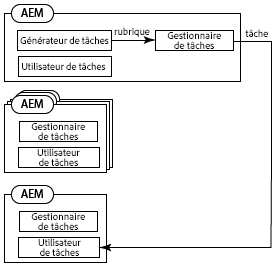
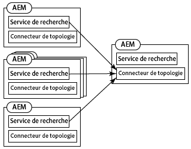
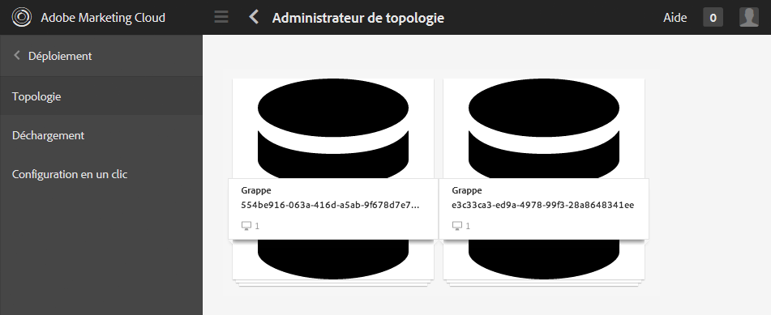
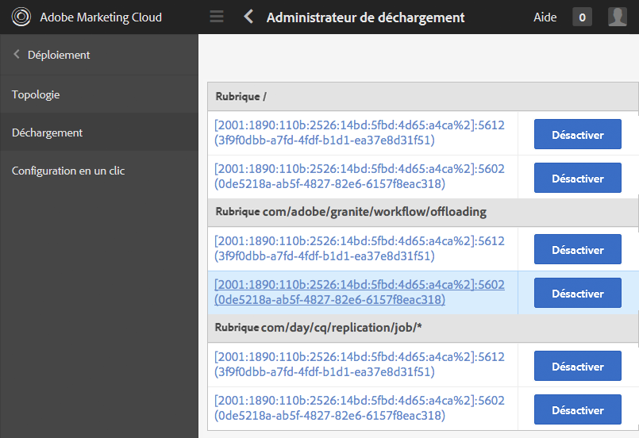
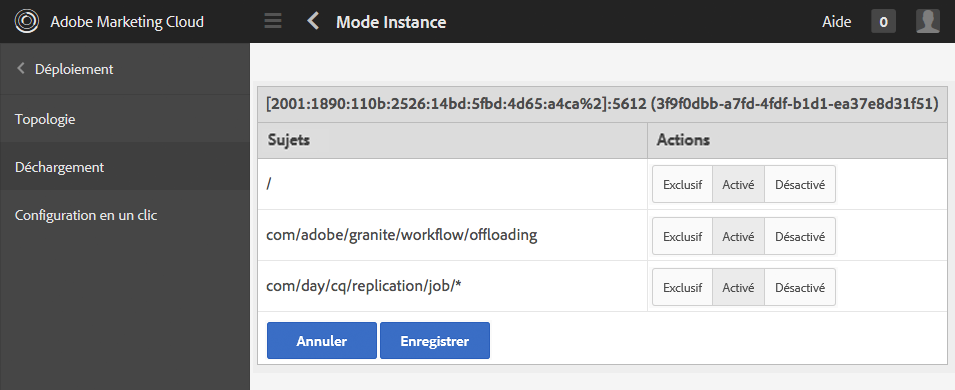
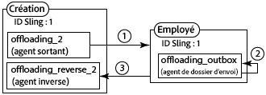
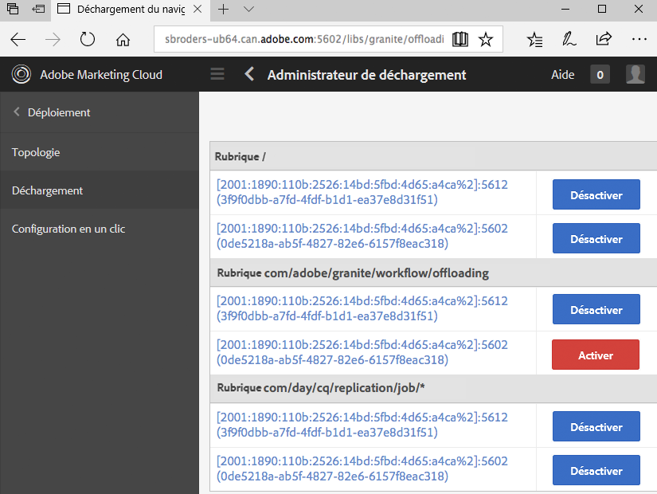

# Tâches de déchargement{#offloading-jobs}

>[!CAUTION]
>
>AEM 6.4 a atteint la fin de la prise en charge étendue et cette documentation n’est plus mise à jour. Pour plus d’informations, voir notre [période de support technique](https://helpx.adobe.com/fr/support/programs/eol-matrix.html). Rechercher les versions prises en charge [here](https://experienceleague.adobe.com/docs/?lang=fr).

## Présentation {#introduction}

Le déchargement répartit les tâches de traitement entre les instances de Experience Manager dans une topologie. Avec le déchargement, vous pouvez utiliser des instances de Experience Manager spécifiques pour exécuter des types de traitement spécifiques. Un traitement spécialisé vous permet de maximiser l’utilisation des ressources de serveur disponibles.

Le déchargement est basé sur les fonctionnalités [Apache Sling Discovery](https://sling.apache.org/documentation/bundles/discovery-api-and-impl.html) et Sling JobManager. Pour utiliser le déchargement, ajoutez des clusters Experience Manager à une topologie, puis identifiez les rubriques de tâche devant être traitées par le cluster. Les grappes sont composées d’une ou de plusieurs instances de Experience Manager, de sorte qu’une seule instance est considérée comme un cluster.

Pour plus d’informations sur l’ajout d’instances à une topologie, voir [Administration des topologies](/help/sites-deploying/offloading.md#administering-topologies).

### Distribution des tâches {#job-distribution}

Sling JobManager et JobConsumer permettent la création de tâches qui sont traitées dans une topologie :

* JobManager : Service qui crée des tâches pour des rubriques spécifiques.
* JobConsumer : Service qui exécute des tâches sur une ou plusieurs rubriques. Plusieurs services JobConsumer peuvent être enregistrés pour la même rubrique.

Lorsque JobManager crée une tâche, la structure de déchargement sélectionne une grappe de Experience Manager dans la topologie pour exécuter la tâche :

* La grappe doit inclure une ou plusieurs instances qui exécutent un JobConsumer enregistré pour la rubrique de tâche.
* La rubrique doit être activée pour au moins une instance de la grappe.

Voir [Configuration de la consommation de rubrique](/help/sites-deploying/offloading.md#configuring-topic-consumption) pour plus d’informations sur l’amélioration de la distribution des tâches.

Lorsque la structure de déchargement sélectionne un cluster pour exécuter une tâche et que le cluster est constitué de plusieurs instances, la distribution Sling détermine l’instance de la grappe qui exécute la tâche.

### Tâches utiles {#job-payloads}

La structure de déchargement prend en charge les charges utiles des tâches qui associent des tâches aux ressources dans le référentiel. Les payloads de tâche sont utiles lorsque des tâches sont créées pour des ressources de traitement et que la tâche est déchargée sur un autre ordinateur.

Lors de la création d’une tâche, il est garanti que la charge utile se trouve uniquement sur l’instance qui crée la tâche. Lors du déchargement de la tâche, les agents de réplication s’assurent que la charge utile est créée sur l’instance qui finit par consommer la tâche. Lorsque l’exécution de la tâche est terminée, la réplication inverse entraîne la copie de la charge utile vers l’instance qui a créé la tâche.

## Administration des topologies {#administering-topologies}

Les topologies sont des clusters Experience Manager légèrement interconnectées qui participent au déchargement. Une grappe se compose d’une ou de plusieurs instances de serveur Experience Manager (une seule instance est considérée comme une grappe).

Chaque instance de Experience Manager exécute les services liés au déchargement suivants :

* Discovery Service : Envoie des requêtes à un connecteur de topologie pour rejoindre la topologie.
* Topology Connector : Reçoit les demandes de jointure et accepte ou refuse chaque demande.

Le service de détection de tous les membres de la topologie pointe vers le connecteur de topologie sur l’un des membres. Dans les sections qui suivent, ce membre est appelé membre racine.

Chaque grappe de la topologie contient une instance reconnue comme leader. Le responsable de la grappe interagit avec la topologie au nom des autres membres de la grappe. Lorsque le leader quitte la grappe, un nouveau leader est automatiquement sélectionné.

### Affichage de la topologie {#viewing-the-topology}

Utilisez le navigateur de topologies pour explorer l’état de la topologie dans laquelle l’instance de Experience Manager participe. Le navigateur de topologies affiche les grappes et les instances de la topologie.

Pour chaque cluster, une liste des membres du cluster s’affiche, indiquant l’ordre dans lequel chaque membre a rejoint le cluster et quel membre est le leader. La propriété actuelle indique l’instance que vous êtes en train de gérer.

Pour chaque instance de cluster, vous pouvez voir plusieurs propriétés liées à la topologie :

* Une liste autorisée de rubriques pour le client des travaux de l’instance.
* Points d’entrée exposés pour la connexion à la topologie.
* Rubriques de tâche pour lesquelles l’instance est enregistrée pour le déchargement.
* Rubriques de tâche que l’instance traite.

1. À l’aide de l’interface utilisateur tactile, cliquez sur l’onglet Outils . ([http://localhost:4502/tools.html](http://localhost:4502/tools.html))
1. Dans la zone Opérations Granite, cliquez sur Navigateur de déchargement.
1. Dans le panneau de navigation, cliquez sur Navigateur de topologies.

   Les grappes qui participent à la topologie s’affichent.

   

1. Cliquez sur une grappe pour afficher la liste des instances de la grappe, ainsi que leur identifiant, leur état actuel et leur état de leader.
1. Cliquez sur un ID d’instance pour afficher des propriétés plus détaillées.

Vous pouvez également utiliser la console web pour afficher les informations de topologie. La console fournit des informations supplémentaires sur les grappes de topologie :

* Quelle instance est l’instance locale.
* Les services Topology Connector que cette instance utilise pour se connecter à la topologie (sortante) et les services qui se connectent à cette instance (entrante).
* Modifiez l’historique des propriétés de la topologie et de l’instance.

Utilisez la procédure suivante pour ouvrir la page de gestion des topologies de la console web :

1. Ouvrez la console web dans votre navigateur. ([http://localhost:4502/system/console](http://localhost:4502/system/console))
1. Cliquez sur Principal > Gestion de topologie.

   

### Configuration de l’appartenance à une topologie {#configuring-topology-membership}

Le service de détection Apache Sling basé sur les ressources s’exécute sur chaque instance pour contrôler la manière dont les instances de Experience Manager interagissent avec une topologie.

Le service Discovery envoie des demandes de POST périodiques (pulsations) aux services Topology Connector pour établir et gérer des connexions avec la topologie. Le service Topology Connector maintient une liste d’adresses IP ou de noms d’hôte autorisés à rejoindre la topologie :

* Pour joindre une instance à une topologie, précisez l’URL du service Topology Connector du membre racine.
* Pour permettre à une instance de rejoindre une topologie, ajoutez l’instance à la liste autorisée du service Topology Connector du membre racine.

Utilisez la console web ou un noeud sling:OsgiConfig pour configurer les propriétés suivantes du service org.apache.sling.discovery.impt.Config :

<table> 
 <tbody> 
  <tr> 
   <th>Nom de la propriété</th> 
   <th>Nom OSGi</th> 
   <th>Description</th> 
   <th>Valeur par défaut</th> 
  </tr> 
  <tr> 
   <td>Timeout de pulsation (secondes)</td> 
   <td>heartbeatTimeout</td> 
   <td>Durée, en secondes, d’attente d’une réponse de pulsation avant que l’instance ciblée ne soit considérée comme non disponible. </td> 
   <td>20</td> 
  </tr> 
  <tr> 
   <td>Intervalle de pulsation (secondes)</td> 
   <td>heartbeatInterval</td> 
   <td>Durée en secondes entre les pulsations.</td> 
   <td>15</td> 
  </tr> 
  <tr> 
   <td>Délai d’événement minimal (secondes)</td> 
   <td>minEventDelay</td> 
   <td>
Lorsqu’une modification est apportée à la topologie, délai nécessaire pour retarder le changement de statut de TOPOLOGY_CHANGING à TOPOLOGY_CHANGED. Chaque modification qui se produit lorsque l’état est TOPOLOGY_CHANGING augmente le délai de cette durée.
 
Ce délai empêche les écouteurs d’être inondés d’événements. 
 
Pour ne pas utiliser de délai, indiquez 0 ou un nombre négatif.
 </td> 
   <td>3</td> 
  </tr> 
  <tr> 
   <td>URL de Topology Connector</td> 
   <td>topologyConnectorUrls</td> 
   <td>URL des services Topology Connector pour envoyer des messages de pulsation.</td> 
   <td>http://localhost:4502/libs/sling/topology/connector</td> 
  </tr> 
  <tr> 
   <td>Liste autorisée de Topology Connector</td> 
   <td>topologyConnectorWhitelist</td> 
   <td>La liste des adresses IP ou noms d’hôte que le service Topology Connector local autorise dans la topologie. </td> 
   <td>
localhost
 
127.0.0.1
 </td> 
  </tr> 
  <tr> 
   <td>Nom du descripteur du référentiel</td> 
   <td>leaderElectionRepositoryDescriptor</td> 
   <td> </td> 
   <td>&lt;no value&gt;</td> 
  </tr> 
 </tbody> 
</table>

Utilisez la procédure suivante pour connecter une instance CQ au membre racine d’une topologie. La procédure pointe l’instance vers l’URL Topology Connector du membre racine de la topologie. Exécutez cette procédure sur tous les membres de la topologie.

1. Ouvrez la console web dans votre navigateur. ([http://localhost:4502/system/console](http://localhost:4502/system/console))
1. Cliquez sur Principal > Gestion de topologie.
1. Cliquez sur Configurer Discovery Service.
1. Ajoutez un élément à la propriété Topology Connector URLs et spécifiez l’URL du service Topology Connector du membre de la topologie racine. L’URL se présente sous la forme https://rootservername:4502/libs/sling/topology/connector.

Effectuez la procédure suivante sur le membre racine de la topologie. La procédure ajoute les noms des autres membres de la topologie à sa liste autorisée Discovery Service.

1. Ouvrez la console web dans votre navigateur. ([http://localhost:4502/system/console](http://localhost:4502/system/console))
1. Cliquez sur Principal > Gestion de topologie.
1. Cliquez sur Configurer Discovery Service.
1. Pour chaque membre de la topologie, ajoutez un élément à la propriété de liste autorisée de Topology Connector, puis indiquez le nom d’hôte ou l’adresse IP du membre de la topologie.

## Configuration de la consommation de rubrique {#configuring-topic-consumption}

Utilisez le navigateur de déchargement pour configurer la consommation des rubriques pour les instances de Experience Manager dans la topologie. Pour chaque instance, vous pouvez spécifier les rubriques qu’elle consomme. Par exemple, pour configurer votre topologie de sorte qu’une seule instance consomme des rubriques d’un type spécifique, désactivez la rubrique sur toutes les instances sauf une.

Les tâches sont réparties entre les instances pour lesquelles la rubrique associée est activée à l’aide d’une logique circulaire.

1. À l’aide de l’interface utilisateur tactile, cliquez sur l’onglet Outils . ([http://localhost:4502/tools.html](http://localhost:4502/tools.html))
1. Dans la zone Opérations Granite, cliquez sur Navigateur de déchargement.
1. Dans le panneau de navigation, cliquez sur Navigateur de déchargement.

   Les rubriques de déchargement et les instances de serveur pouvant utiliser les rubriques s’affichent.

   

1. Pour désactiver la consommation d’une rubrique pour une instance, sous le nom de la rubrique, cliquez sur Désactiver en regard de l’instance.
1. Pour configurer toutes les consommations de rubrique pour une instance, cliquez sur l’identificateur de l’instance au-dessous d’une rubrique.

   

1. Cliquez sur l’un des boutons suivants en regard d’une rubrique pour configurer le comportement de consommation de l’instance, puis cliquez sur Enregistrer :

   * Activé : Cette instance consomme des tâches de cette rubrique.
   * Désactivé : cette instance ne consomme pas les tâches de cette rubrique.
   * Exclusif : cette instance consomme uniquement les tâches de cette rubrique.

   **Remarque :** Lorsque vous sélectionnez Exclusif pour une rubrique, toutes les autres rubriques sont automatiquement définies sur Désactivé.

### Consommateurs de tâches installés {#installed-job-consumers}

Plusieurs implémentations de JobConsumer sont installées avec Experience Manager. Les rubriques pour lesquelles ces JobConsumers sont enregistrés apparaissent dans le navigateur de déchargement. Les rubriques supplémentaires qui apparaissent sont celles que les JobConsumers personnalisés ont enregistrées. Le tableau suivant décrit les JobConsumers par défaut.

| Rubrique de tâche | PID de service | Description |
|---|---|---|
| / | org.apache.sling.event.impl.jobs.deprecated.EventAdminBridge | Installé avec Apache Sling. Tâches de traitement générées par l’administrateur d’événements OSGi, à des fins de rétrocompatibilité. |
| com/day/cq/replication/job/&amp;ast; | com.day.cq.replication.impl.AgentManagerImpl | Un agent de réplication qui réplique les payloads de la tâche. |
| com/adobe/granite/workflow/offloading | com.adobe.granite.workflow.core.offloading.WorkflowOffloadingJobConsumer | Traite les tâches que le workflow Déchargeur de ressources de mise à jour de gestion des actifs numériques génère. |

### Désactivation et activation des rubriques pour une instance {#disabling-and-enabling-topics-for-an-instance}

Le service Apache Sling Job Consumer Manager fournit les propriétés de liste autorisée et de liste bloquée des rubriques. Configurez ces propriétés pour activer ou désactiver le traitement de rubriques spécifiques sur une instance Experience Manager.

**Remarque :** Si l’instance appartient à une topologie, vous pouvez également utiliser le navigateur de déchargement sur tout ordinateur de la topologie pour activer ou désactiver les rubriques.

La logique qui crée la liste des rubriques activées permet d’abord toutes les rubriques qui se trouvent dans la liste autorisée, puis supprime les rubriques qui se trouvent sur la liste bloquée. Par défaut, toutes les rubriques sont activées (la valeur de la liste autorisée est `*`) et aucune rubrique n’est désactivée (la liste bloquée n’a aucune valeur).

Utilisez le console web ou un nœud `sling:OsgiConfig` pour configurer les propriétés suivantes. Pour les nœuds `sling:OsgiConfig`, le paramètre PID du service Gestionnaire de consommation de tâche est org.apache.sling.event.impl.jobs.JobConsumerManager.

| Nom de la propriété dans la console web | Identifiant OSGi | Description |
|---|---|---|
| Liste autorisée de rubrique | job.consumermanager.whitelist | Liste des rubriques que le service JobManager local traite. La valeur par défaut &amp;ast; envoie toutes les rubriques au service TopicConsumer enregistré. |
| Liste bloquée de rubrique | job.consumermanager.blacklist | Liste des rubriques que le service JobManager local ne traite pas. |

## Création d’agents de réplication pour le déchargement {#creating-replication-agents-for-offloading}

La structure de déchargement utilise la réplication pour transporter des ressources entre l’auteur et le programme de travail. La structure de déchargement crée automatiquement des agents de réplication lorsque les instances rejoignent la topologie. Les agents sont créés avec des valeurs par défaut. Vous devez modifier manuellement le mot de passe utilisé par les agents pour l’authentification.

>[!CAUTION]
>
>Un problème connu avec les agents de réplication générés automatiquement est le fait que vous devez créer manuellement de nouveaux agents de réplication. Suivez la procédure décrite à la section [Problèmes liés à l’utilisation des agents de réplication générés automatiquement](/help/sites-deploying/offloading.md#problems-using-the-automatically-generated-replication-agents) avant de créer les agents pour le déchargement.

Créez les agents de réplication qui transportent les charges utiles des tâches entre les instances pour le déchargement. L’illustration suivante présente les agents qui doivent être déchargés de l’auteur vers une instance de travail. L’auteur a un identifiant Sling de 1, alors que l’identifiant Sling de l’instance de travail est 2 :

Cette configuration nécessite les trois agents suivants :

1. Un agent sortant sur l’instance de création qui se réplique sur l’instance de travail.
1. Agent inverse sur l’instance de création qui extrait de la boîte d’envoi sur l’instance de travail.
1. Un agent de boîte d’envoi sur l’instance de travail.

Ce schéma de réplication est similaire à celui utilisé entre les instances d’auteur et de publication. Toutefois, pour la situation de déchargement, toutes les instances impliquées sont des instances de création.

>[!NOTE]
>
>La structure de déchargement utilise la topologie pour obtenir les adresses IP des instances de déchargement. La structure crée ensuite automatiquement les agents de réplication en fonction de ces adresses IP. Si les adresses IP des instances de déchargement changent par la suite, la modification est automatiquement propagée sur la topologie une fois l’instance redémarrée. Toutefois, la structure de déchargement ne met pas automatiquement à jour les agents de réplication pour refléter les nouvelles adresses IP. Pour éviter cette situation, utilisez des adresses IP fixes pour toutes les instances de la topologie.

### Nommage des agents de réplication pour le déchargement {#naming-the-replication-agents-for-offloading}

Utilisez un format spécifique pour la propriété ***Nom*** des agents de réplication, afin que la structure de déchargement puisse utiliser automatiquement l’agent correct pour les instances de travail spécifiques.

**Nommer un agent sortant sur l’instance d’auteur :** 

`offloading_<slingid>`, où `<slingid>` est l’identifiant Sling de l’instance de travail.

Exemple : `offloading_f5c8494a-4220-49b8-b079-360a72f71559`

**Nommer l’agent inverse sur l’instance d’auteur :** 

`offloading_reverse_<slingid>`, où `<slingid>` est l’identifiant Sling de l’instance de travail.

Exemple : `offloading_reverse_f5c8494a-4220-49b8-b079-360a72f71559`

**Nommer le dossier d’envoi sur l’instance de travail :**

`offloading_outbox`

### Création de l’agent sortant {#creating-the-outgoing-agent}

1. Créez un **agent de réplication** sur l’auteur. (Voir [documentation pour les agents de réplication](/help/sites-deploying/replication.md)). Indiquez un **titre**. Le **nom** doit suivre la convention de dénomination.
1. Créez un agent en utilisant les propriétés suivantes :

   | Propriété | Valeur |
   |---|---|
   | Paramètres > Type de sérialisation | Valeur par défaut |
   | Transfert >URI de transfert | https://*`<ip of target instance>`*:*`<port>`*`/bin/receive?sling:authRequestLogin=1` |
   | Transfert > Utilisateur de transfert | Utilisateur de réplication sur l’instance cible |
   | Transport > Mot de passe de transport | Mot de passe de l’utilisateur de réplication sur l’instance cible |
   | Extension > Méthode HTTP | POST |
   | Déclencheurs > Ignorer la valeur par défaut | True |

### Création de l’agent inverse {#creating-the-reverse-agent}

1. Créez un **agent de réplication inverse** sur l’auteur. (Voir [documentation pour les agents de réplication](/help/sites-deploying/replication.md).) Indiquez un **titre**. Le **nom** doit suivre la convention de dénomination.
1. Créez un agent en utilisant les propriétés suivantes :

   | Propriété | Valeur |
   |---|---|
   | Paramètres > Type de sérialisation | Valeur par défaut |
   | Transfert >URI de transfert | https://*`<ip of target instance>`*:*`<port>`*`/bin/receive?sling:authRequestLogin=1` |
   | Transfert > Utilisateur de transfert | Utilisateur de réplication sur l’instance cible |
   | Transport > Mot de passe de transport | Mot de passe de l’utilisateur de réplication sur l’instance cible |
   | Extension > Méthode HTTP | GET |

### Création de l’agent de dossier d’envoi {#creating-the-outbox-agent}

1. Créez un **agent de réplication** sur l’instance de travail. (Voir [documentation pour les agents de réplication](/help/sites-deploying/replication.md).) Indiquez un **titre**. Le **nom** doit être `offloading_outbox`.
1. Créez l’agent en utilisant les propriétés suivantes.

   | Propriété | Valeur |
   |---|---|
   | Paramètres > Type de sérialisation | Valeur par défaut |
   | Transfert >URI de transfert | repo://var/replication/outbox |
   | Déclencheur > Ignorer la valeur par défaut | True |

### Recherche de l’identifiant Sling {#finding-the-sling-id}

Procurez-vous l’identifiant Sling d’une instance de Experience Manager à l’aide de l’une des méthodes suivantes :

* Ouvrez la console web et, dans les paramètres Sling, recherchez la valeur de la propriété d’identifiant Sling ([http://localhost:4502/system/console/status-slingsettings](http://localhost:4502/system/console/status-slingsettings)). Cette méthode est utile si l’instance ne fait pas encore partie de la topologie.
* Utilisez le navigateur de topologies si l’instance fait déjà partie de la topologie.

## Déchargement du traitement des ressources DAM {#offloading-the-processing-of-dam-assets}

Configurez les instances d’une topologie de sorte que des instances spécifiques effectuent le traitement en arrière-plan des ressources ajoutées ou mises à jour dans la gestion des ressources numériques.

Par défaut, Experience Manager exécute le workflow Ressources de mise à jour de gestion des actifs numériques lorsqu’une ressource de gestion des actifs numériques est modifiée ou ajoutée à la gestion des actifs numériques. Modifiez le comportement par défaut afin que Experience Manager exécute à la place le workflow Déchargeur de ressources de mise à jour de gestion des actifs numériques . Ce workflow génère une tâche JobManager comportant une rubrique de `com/adobe/granite/workflow/offloading`. Ensuite, configurez la topologie de sorte que la tâche soit déchargée vers un programme de travail dédié.

>[!CAUTION]
>
>Aucun workflow ne doit être transitoire lorsqu’il est utilisé avec le déchargement du workflow. Par exemple, le workflow Ressources de mise à jour de gestion des actifs numériques ne doit pas être transitoire lorsqu’il est utilisé pour le déchargement des ressources. Pour définir/annuler la définition de l’indicateur transitoire sur un workflow, voir [Processus transitoires](/help/assets/performance-tuning-guidelines.md#workflows).

La procédure suivante utilise les caractéristiques suivantes pour la topologie de déchargement :

* Une ou plusieurs instances de Experience Manager sont des instances de création avec lesquelles les utilisateurs interagissent pour ajouter ou mettre à jour des ressources DAM.
* Les utilisateurs ne doivent pas interagir directement avec une ou plusieurs instances de Experience Manager qui traitent les ressources de gestion des actifs numériques. Ces instances sont dédiées au traitement en arrière-plan des ressources de gestion des ressources numériques.

1. Sur chaque instance de Experience Manager, configurez Discovery Service pour qu’il pointe vers le Topography Connector racine. (Voir [Configuration de l’appartenance à une topologie](#title4).)
1. Configurez le connecteur Topography Connector racine de sorte que les instances de connexion soient sur la liste autorisée.
1. Ouvrez le navigateur de déchargement et désactivez l’option `com/adobe/granite/workflow/offloading` sur les instances avec lesquelles les utilisateurs interagissent pour charger ou modifier des ressources DAM.

   

1. Sur chaque instance avec laquelle les utilisateurs interagissent pour charger ou modifier des ressources DAM, configurez les lanceurs de workflow pour utiliser le workflow Déchargement des ressources de mise à jour de gestion des actifs numériques :

   1. Ouvrez la console Processus .
   1. Cliquez sur l’onglet Lanceur .
   1. Localisez les deux configurations de lanceur qui exécutent le workflow Ressource de mise à jour de gestion des actifs numériques . Un type d’événement de configuration du lanceur est Node Created et l’autre type est Node Modified.
   1. Modifiez les deux types d’événements afin qu’ils exécutent le workflow Déchargement des ressources de mise à jour de gestion des actifs numériques . (Pour plus d’informations sur les configurations du lanceur, voir [Démarrage des workflows lorsque les noeuds changent](/help/sites-administering/workflows-starting.md).)

1. Sur les instances qui effectuent le traitement en arrière-plan des ressources de gestion des actifs numériques, désactivez les lanceurs de workflow qui exécutent le workflow Ressources de mise à jour de gestion des actifs numériques .

## Informations complémentaires {#further-reading}

Outre les détails présentés sur cette page, vous pouvez également lire les informations suivantes :

* Pour plus d’informations sur l’utilisation des API Java pour créer des tâches et des consommateurs de tâche, consultez la section [Création et consommation des tâches pour le déchargement](/help/sites-developing/dev-offloading.md).
* Pour obtenir des instructions générales et les bonnes pratiques relatives au déchargement des ressources, voir [Directives générales et bonnes pratiques relatives au déchargement des ressources](/help/assets/assets-offloading-best-practices.md#general-guidance-and-best-practices-for-asset-offloading).
* Pour savoir comment désactiver la création automatique des agents de déchargement, voir [Désactivation de la gestion automatique des agents](/help/assets/assets-offloading-best-practices.md#turning-off-automatic-agent-management).
