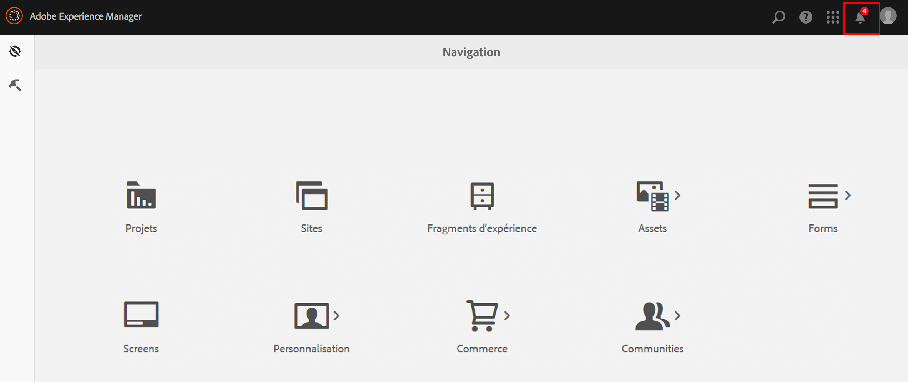
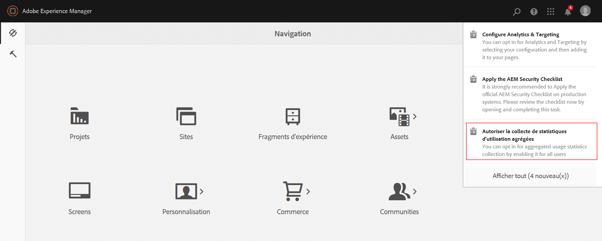
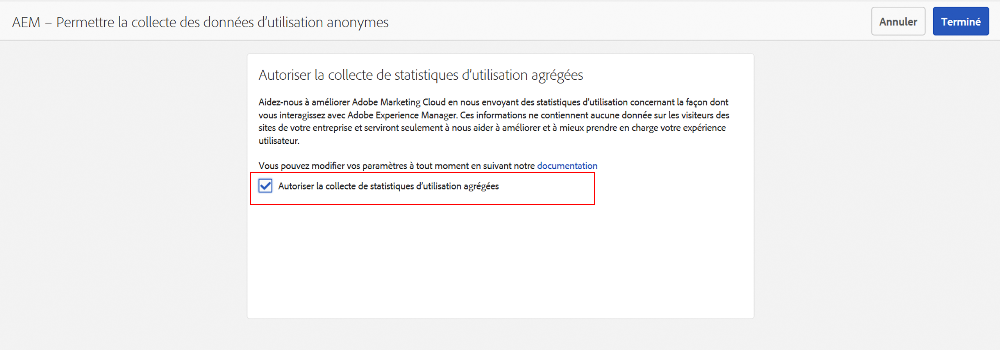
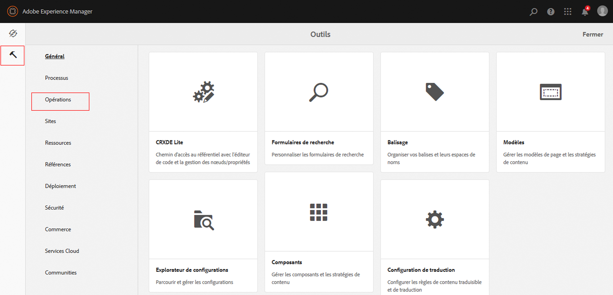
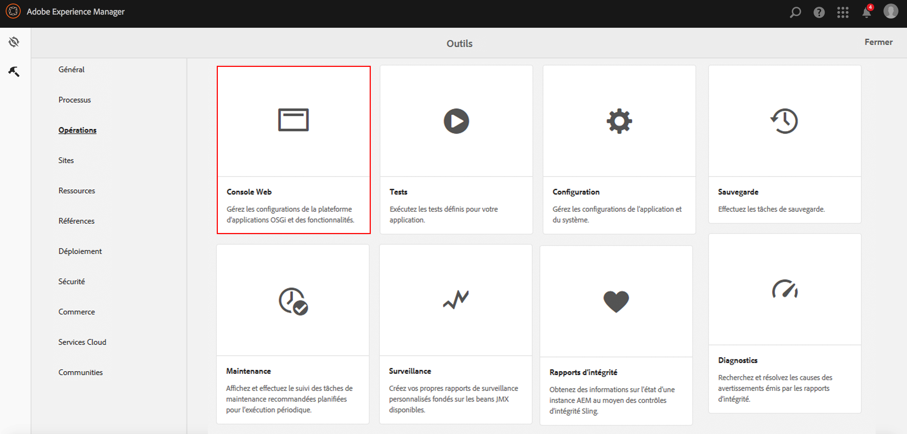

# Souscription à la collecte de statistiques d’utilisation agrégées{#opting-into-aggregated-usage-statistics-collection}

## Présentation {#introduction}

Vous pouvez aider à améliorer Adobe Marketing Cloud en envoyant à Adobe des statistiques concernant la façon dont vous interagissez avec AEM. Ces informations ne contiennent aucune donnée sur les visiteurs du site de votre entreprise et sont uniquement utilisées afin d’aider Adobe à créer, gérer et optimiser l’expérience utilisateur.

Vous pouvez souscrire à la collecte de statistiques d’utilisation à l’aide de l’IU tactile ou de la console web.

>[!NOTE]
>
>Il existe diverses réglementations en matière de protection des données et de confidentialité ; y compris et entre autres le RGPD et le CCPA. AEM Sites est prêt à aider les clients à respecter leurs obligations en matière de protection des données et de confidentialité. Cette page guide les clients à travers les procédures de souscription à la collecte de statistiques d’utilisation agrégées (et d’exclusion de celle-ci).
>
>Pour plus d’informations, consultez le [Centre de traitement des données personnelles d’Adobe](https://www.adobe.com/fr/privacy.html).

>[!NOTE]
>
>Vous pouvez également vous exclure à tout moment à l’aide de la [Console web](/help/sites-deploying/opt-in-aggregated-usage-statistics.md#opt-in-by-using-the-web-console) ou en ne sélectionnant pas l’option de souscription sur l’écran de souscription AEM.

## Souscription à l’aide de l’IU tactile {#opt-in-by-using-the-touch-ui}

La première fois que vous démarrez AEM, vous pouvez souscrire à l’aide de l’IU tactile, comme suit :

1. Sur l’écran de navigation AEM, cliquez sur l’icône **Boîte de réception** (en forme de cloche).

   

1. Dans la liste déroulante, cliquez sur **Autoriser la collecte de statistiques d’utilisation agrégées**.

   

1. Sur l’écran de souscription, sélectionnez **Autoriser la collecte de statistiques d’utilisation agrégées**.

   

1. Cliquez sur **Terminé**.

## Souscription à l’aide de la console web {#opt-in-by-using-the-web-console}

Vous pouvez souscrire (ou vous exclure) à l’aide de la console web, comme suit :

1. Sur l’écran de navigation AEM, cliquez sur **Outils**, puis sur **Opérations**.

   

1. Dans la fenêtre Opérations, cliquez sur **Console web**.

   

1. Recherchez « **Collecte de statistiques d’utilisation agrégées** ».
1. Cliquez sur l’icône **Modifier**.

   

1. Cochez la case **Activé**. Vous pouvez également désélectionner la case si vous souhaitez vous exclure de la collecte de statistiques d’utilisation.

   

1. Cliquez sur **Enregistrer**.
