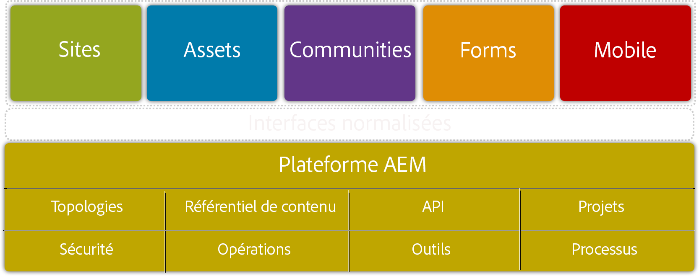
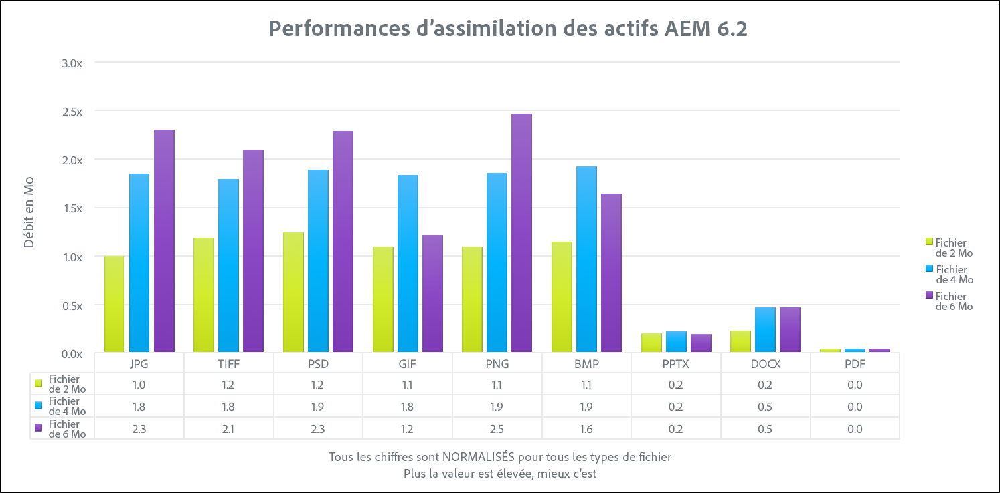
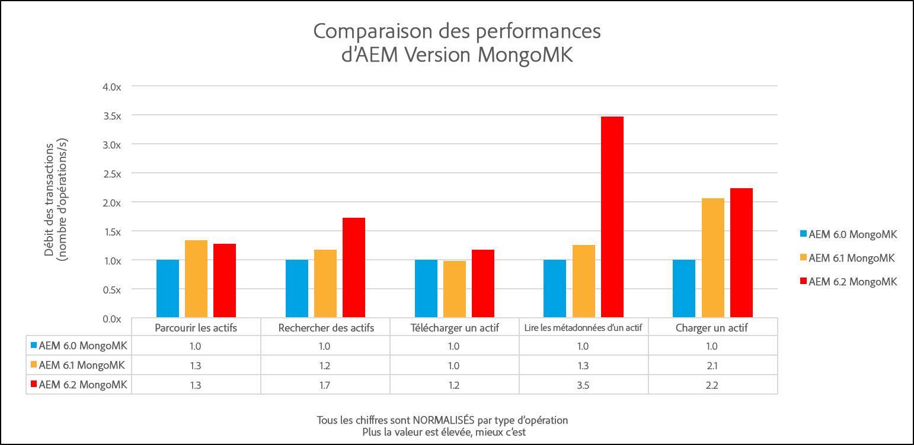
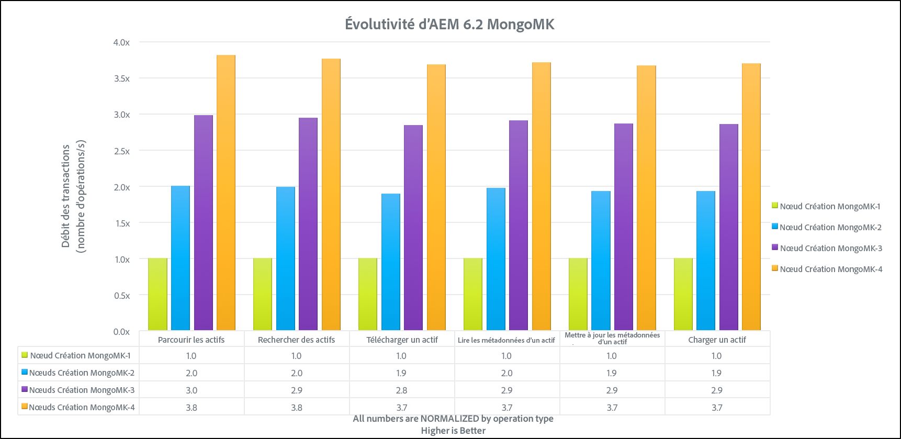
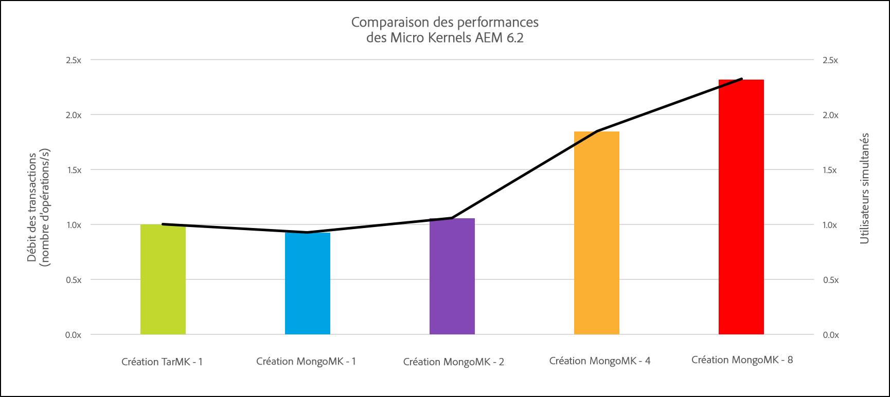
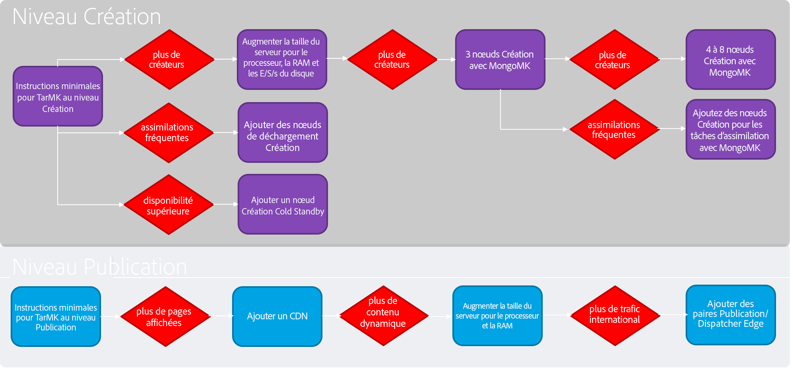

# Instructions de performance{#performance-guidelines}

Cet page fournit des directives générales sur l’optimisation de la performance de votre déploiement AEM. Si vous n’êtes pas familier avec AEM, veuillez étudier les pages suivantes avant de commencer à lire les directives en matière de performance :

* [Concepts de base d’AEM](/help/sites-deploying/deploy.md#basic-concepts) 
* [Présentation du stockage dans AEM ](/help/sites-deploying/storage-elements-in-aem-6.md#overview-of-storage-in-aem)
* [Déploiements recommandés](/help/sites-deploying/recommended-deploys.md)
* [Exigences techniques](/help/sites-deploying/technical-requirements.md)

Les options de déploiement disponibles pour l’AEM (faites défiler jusqu’à la vue de toutes les options) sont illustrées ci-dessous :

<table> 
 <tbody> 
  <tr> 
   <td>
<strong>AEM</strong>
 
<strong>Produit</strong>
 </td> 
   <td>
<strong>Topologie</strong>
 </td> 
   <td>
<strong>Système d’exploitation</strong>
 </td> 
   <td>
<strong>Serveur d’applications</strong>
 </td> 
   <td>
<strong>JRE</strong>
 </td> 
   <td>
<strong>Sécurité</strong>
 </td> 
   <td>
<strong>Micronoyau</strong>
 </td> 
   <td>
<strong>Banque de données</strong>
 </td> 
   <td>
<strong>Indexation</strong>
 </td> 
   <td>
<strong>Serveur web</strong>
 </td> 
   <td>
<strong>Navigateur</strong>
 </td> 
   <td>
<strong>Marketing Cloud</strong>
 </td> 
  </tr> 
  <tr> 
   <td>
Sites
 </td> 
   <td>
Non-HA 
 </td> 
   <td>
Windows
 </td> 
   <td>
CQSE
 </td> 
   <td>
Oracle
 </td> 
   <td>
LDAP
 </td> 
   <td>
Tar
 </td> 
   <td>
Segment
 </td> 
   <td>
Propriété
 </td> 
   <td>
Apache 
 </td> 
   <td>
Edge
 </td> 
   <td>
Cible
 </td> 
  </tr> 
  <tr> 
   <td>
Assets
 </td> 
   <td>
Publish-HA 
 </td> 
   <td>
Solaris
 </td> 
   <td>
WebLo gic
 </td> 
   <td>
IBM
 </td> 
   <td>
SAML
 </td> 
   <td>
MongoDB
 </td> 
   <td>
File
 </td> 
   <td>
Lucene
 </td> 
   <td>
IIS
 </td> 
   <td>
IE
 </td> 
   <td>
Analyses
 </td> 
  </tr> 
  <tr> 
   <td>
Communities
 </td> 
   <td>
Author-CS 
 </td> 
   <td>
Red Hat 
 </td> 
   <td>
WebSphere
 </td> 
   <td>
hp
 </td> 
   <td>
Oauth
 </td> 
   <td>
RDB/Oracle 
 </td> 
   <td>
S3/Azure
 </td> 
   <td>
Solr
 </td> 
   <td>
iPlanet 
 </td> 
   <td>
Firefox
 </td> 
   <td>
Campagne
 </td> 
  </tr> 
  <tr> 
   <td>
Formulaires
 </td> 
   <td>
Déchargement d’auteur
 </td> 
   <td>
HP-UX
 </td> 
   <td>
Tomcat 
 </td> 
   <td>
 
 </td> 
   <td>
 
 </td> 
   <td>
RDB/DB2 
 </td> 
   <td>
MongoDB 
 </td> 
   <td>
 
 </td> 
   <td>
 
 </td> 
   <td>
Chrome
 </td> 
   <td>
Social
 </td> 
  </tr> 
  <tr> 
   <td>
Mobile
 </td> 
   <td>
Cluster d’auteur
 </td> 
   <td>
IBM AIX 
 </td> 
   <td>
JBoss 
 </td> 
   <td>
 
 </td> 
   <td>
 
 </td> 
   <td>
RDB/MySQL 
 </td> 
   <td>
RDBMS 
 </td> 
   <td>
 
 </td> 
   <td>
 
 </td> 
   <td>
Safari
 </td> 
   <td>
Public
 </td> 
  </tr> 
  <tr> 
   <td>
Multi-site
 </td> 
   <td>
ASRP
 </td> 
   <td>
SUSE
 </td> 
   <td>
 
 </td> 
   <td>
 
 </td> 
   <td>
 
 </td> 
   <td>
RDB/SQLServer 
 </td> 
   <td>
 
 </td> 
   <td>
 
 </td> 
   <td>
 
 </td> 
   <td>
 
 </td> 
   <td>
Ressources
 </td> 
  </tr> 
  <tr> 
   <td>
Commerce
 </td> 
   <td>
MSRP
 </td> 
   <td>
Apple OS
 </td> 
   <td>
 
 </td> 
   <td>
 
 </td> 
   <td>
 
 </td> 
   <td>
 
 </td> 
   <td>
 
 </td> 
   <td>
 
 </td> 
   <td>
 
 </td> 
   <td>
 
 </td> 
   <td>
Activation
 </td> 
  </tr> 
  <tr> 
   <td>
Dynamic Media
 </td> 
   <td>
JSRP
 </td> 
   <td>
 
 </td> 
   <td>
 
 </td> 
   <td>
 
 </td> 
   <td>
 
 </td> 
   <td>
 
 </td> 
   <td>
 
 </td> 
   <td>
 
 </td> 
   <td>
 
 </td> 
   <td>
 
 </td> 
   <td>
Mobile
 </td> 
  </tr> 
  <tr> 
   <td>
Brand Portal
 </td> 
   <td>
J2E
 </td> 
   <td>
 
 </td> 
   <td>
 
 </td> 
   <td>
 
 </td> 
   <td>
 
 </td> 
   <td>
 
 </td> 
   <td>
 
 </td> 
   <td>
 
 </td> 
   <td>
 
 </td> 
   <td>
 
 </td> 
   <td>
 
 </td> 
  </tr> 
  <tr> 
   <td>
AoD
 </td> 
   <td>
 
 </td> 
   <td>
 
 </td> 
   <td>
 
 </td> 
   <td>
 
 </td> 
   <td>
 
 </td> 
   <td>
 
 </td> 
   <td>
 
 </td> 
   <td>
 
 </td> 
   <td>
 
 </td> 
   <td>
 
 </td> 
   <td>
 
 </td> 
  </tr> 
  <tr> 
   <td>
LiveFyre
 </td> 
   <td>
 
 </td> 
   <td>
 
 </td> 
   <td>
 
 </td> 
   <td>
 
 </td> 
   <td>
 
 </td> 
   <td>
 
 </td> 
   <td>
 
 </td> 
   <td>
 
 </td> 
   <td>
 
 </td> 
   <td>
 
 </td> 
   <td>
 
 </td> 
  </tr> 
  <tr> 
   <td>
Screens
 </td> 
   <td>
 
 </td> 
   <td>
 
 </td> 
   <td>
 
 </td> 
   <td>
 
 </td> 
   <td>
 
 </td> 
   <td>
 
 </td> 
   <td>
 
 </td> 
   <td>
 
 </td> 
   <td>
 
 </td> 
   <td>
 
 </td> 
   <td>
 
 </td> 
  </tr> 
  <tr> 
   <td>
Sécurité des documents
 </td> 
   <td>
 
 </td> 
   <td>
 
 </td> 
   <td>
 
 </td> 
   <td>
 
 </td> 
   <td>
 
 </td> 
   <td>
 
 </td> 
   <td>
 
 </td> 
   <td>
 
 </td> 
   <td>
 
 </td> 
   <td>
 
 </td> 
   <td>
 
 </td> 
  </tr> 
  <tr> 
   <td>
Gestion des processus
 </td> 
   <td>
 
 </td> 
   <td>
 
 </td> 
   <td>
 
 </td> 
   <td>
 
 </td> 
   <td>
 
 </td> 
   <td>
 
 </td> 
   <td>
 
 </td> 
   <td>
 
 </td> 
   <td>
 
 </td> 
   <td>
 
 </td> 
   <td>
 
 </td> 
  </tr> 
  <tr> 
   <td>
Appli de bureau  
 </td> 
   <td>
 
 </td> 
   <td>
 
 </td> 
   <td>
 
 </td> 
   <td>
 
 </td> 
   <td>
 
 </td> 
   <td>
 
 </td> 
   <td>
 
 </td> 
   <td>
 
 </td> 
   <td>
 
 </td> 
   <td>
 
 </td> 
   <td>
 
 </td> 
  </tr> 
 </tbody> 
</table>

>[!NOTE]
>
>Les directives de performance s’appliquent principalement à AEM Sites.

## Quand utiliser les conseils de performance ? {#when-to-use-the-performance-guidelines}

Utilisez les conseils de performance dans les situations suivantes :

* **Le premier déploiement** : lorsque vous prévoyez de déployer AEM Sites ou AEM Assets pour la première fois, il est important de comprendre les options dont vous disposez pour configurer le micronoyau, l’entrepôt·de nœuds et l’entrepôt de données (par rapport aux paramètres par défaut). Par exemple, vous pouvez modifier les paramètres par défaut de l’entrepôt de données pour TarMK vers un entrepôt de données de fichiers.
* **Mise à niveau vers une nouvelle version** : lorsque vous effectuez une mise à niveau vers une nouvelle version, il est important de comprendre les différences en terme de performance par rapport à l’environnement d’exécution. Cela s’applique par exemple à une mise à niveau d’AEM 6.1 à 6.2, ou d’AEM 6.0 CRX2 à 6.2 OAK.
* **Le délai de réponse est lent** : lorsque l’architecture Nodestore sélectionnée ne répond pas à vos besoins, il est important de comprendre les différences de performance par rapport à d’autres options de topologie. Par exemple, le déploiement de TarMK au lieu de MongoMK ou l’utilisation d’un entrepôt de données de fichiers plutôt qu’un entrepôt de données partagé par Amazon S3 ou Microsoft Azure.
* **Ajouter plus d’auteurs** : lorsque la topologie TarMK ne répond plus à vos besoins de performance et une fois que de la taille du nœud d’auteur a atteint sa capacité maximale, il est important de comprendre les différences de performance par rapport à l’utilisation de MongoMK avec au mois trois nœuds d’auteur. Par exemple, le déploiement de MongoMK au lieu de TarMK.
* **Ajouter plus de contenu** : lorsque l’architecture recommandée d’entrepôt de données ne répond pas à vos besoins, il est important de comprendre les différences de performance par rapport à d’autres options d’entrepôt de données. Exemple : l’utilisation de l’entrepôt de données Amazon S3 ou Microsoft Azure au lieu d’un entrepôt de données de fichiers.

## Présentation {#introduction}

Ce chapitre offre un aperçu général de l’architecture d’AEM et de ses composants les plus importants. Il fournit également des conseils de développement et décrit les scénarios dans les tests de comparaison entre TarMK et MongoMK.

### La plateforme AEM  {#the-aem-platform}

La plateforme AEM est constituée des composants suivants :

Pour plus d’informations sur la plateforme AEM, voir [Ce qui est AEM](/help/sites-deploying/deploy.md#what-is-aem).

### L’architecture d’AEM {#the-aem-architecture}

Le déploiement d’AEM repose sur trois composants clés. L’**instance d’auteur** utilisée par les rédacteurs, éditeurs et les approbateurs de contenu pour créer et réviser le contenu. Lorsque le contenu est approuvé, il est publié sur un type d’instance secondaire nommée **instance de publication**, à partir de laquelle il est consulté par les utilisateurs finaux. Le troisième bloc de construction est le **Répartiteur**, module qui gère la mise en cache et le filtrage des URL et qui est installé sur le serveur Web. Pour plus d’informations sur l’architecture d’AEM, voir [Scénarios de déploiement classiques](/help/sites-deploying/deploy.md#typical-deployment-scenarios).

### Micronoyaux {#micro-kernels}

Les micronoyaux servent de gestionnaires de persistence dans AEM. Il existe trois types de micro-noyaux utilisés avec les AEM : TarMK, MongoDB et la base de données relationnelle (sous prise en charge restreinte). Le choix d’un exemple correspondant à vos besoins dépend de la finalité de l’instance et du type de déploiement envisagé. Pour plus d’informations sur les micro-noyaux, voir la page [Déploiements recommandés](/help/sites-deploying/recommended-deploys.md).

### Entrepôt de nœuds {#nodestore}

Dans AEM, des données binaires peuvent être stockées indépendamment des nœuds de contenu.  L’emplacement où les données binaires sont stockées est appelé&#x200B;**entrepôt de données**, tandis que l’emplacement des nœuds et propriétés de contenu est appelé&#x200B;**entrepôt de nœuds(nodestore)**.

>[!NOTE]
>
>Adobe recommande TarMK comme technologie de persistance par défaut à utiliser par les clients pour les instances d’auteur et de publication AEM.

>[!CAUTION]
>
>La prise en charge du micronoyau de la base de données relationnelle est limitée. Contactez[ l’assistance clientèle d’Adobe](https://helpx.adobe.com/fr/marketing-cloud/contact-support.html) avant d’utiliser ce type de micronoyau.

### Entrepôt de données {#data-store}

Lorsque vous traitez un grand nombre de fichiers binaires, il est recommandé d’utiliser un entrepôt de données externe au lieu de l’entrepôt de nœuds par défaut pour optimiser la performance. Par exemple, si votre projet nécessite un grand nombre de ressources multimédias, leur stockage dans l’entrepôt de données Fichiers ou Azure/S3 rendra leur accès plus rapide que leur stockage direct dans une base de données MongoDB.

Pour plus d&#39;informations sur les options de configuration disponibles, voir [Configuration de Noeuds et de Stockages de données](/help/sites-deploying/data-store-config.md).

>[!NOTE]
>
>Adobe recommande d’utiliser l’option de déploiement d’AEM sur Azure ou Amazon Web Services (AWS) en utilisant les services d’Adobe Managed Services, où les clients pourront bénéficier d’une équipe possédant l’expérience et les compétences de déploiement et d’opération d’AEM pour les environnements de cloud computing. Consultez notre [documentation supplémentaire sur Adobe Managed Services](https://www.adobe.com/marketing-cloud/enterprise-content-management/managed-services-cloud-platform.html?aemClk=t).
>
>Pour des recommandations sur le déploiement d’AEM sur Azure ou AWS, en dehors des Adobe Managed Services, nous vous recommandons vivement de travailler directement avec votre fournisseur cloud ou avec l’un de nos partenaires prenant en charge le déploiement d’AEM dans l’environnement de cloud de votre choix. Le partenaire ou fournisseur cloud que vous choisissez est responsable du dimensionnement, de la conception et de l’implémentation de l’architecture qu’ils vont prendre en charge pour répondre à vos besoins spécifiques en matière de performance, de chargement, d’évolutivité et de sécurité.
>
>Pour plus de détails, voir la page [exigences techniques](/help/sites-deploying/technical-requirements.md#supported-platforms).

### Recherche {#search-features}

Les fournisseurs d’index personnalisés utilisés avec AEM sont répertoriés dans cette section. Pour en savoir plus sur l’indexation, voir [Requêtes en chêne et Indexation](/help/sites-deploying/queries-and-indexing.md).

>[!NOTE]
>
>Pour la plupart des déploiements, Adobe conseille d’utiliser l’index Lucene. Nous vous recommandons d’utiliser Solr uniquement pour son évolutivité dans les déploiements spécialisés et plus complexes.

### Conseils de développement {#development-guidelines}

Le développement dans AEM doit être axé sur **les performances et l’évolutivité**. Ci-dessous figurent un certain nombre de bonnes pratiques que vous pouvez suivre : 

**À FAIRE**

* Séparez la présentation de la logique et du contenu
* Utilisez les API (ex. : Sling) et outils (ex. : réplication ) d’AEM existants
* Développez dans le cadre du contenu réel
* Développez pour une capacité de mise en cache optimale
* Minimisez le nombre d’enregistrements (ex. : à l’aide de workflow transitoires)
* Assurez-vous que toutes les points de terminaison HTTP sont en RESTful
* Limitez la portée de l’observation JCR
* Prenez soin du thread asynchrone

**À NE PAS FAIRE**

* N’utilisez pas les API JCR directement, si possible
* Ne modifiez pas /libs, mais plutôt les incrustations d’utilisation
* N’utilisez pas les requêtes dans la mesure du possible
* N’utilisez pas les liaisons Sling pour obtenir des services OSGi en code Javascript, mais utilisez plutôt :

   * @Reference dans un composant DS
   * @Inject dans un modèle Sling
   * sling.getService() dans une classe d’utilisation Sightly
   * sling.getService() dans un JSP
   * un ServiceTracker 
   * accès direct au registre de service OSGi

Pour plus de détails sur le développement dans AEM, lisez [Développement - Principes de base](/help/sites-developing/the-basics.md). Pour connaître d’autres meilleures pratiques, reportez-vous à la section [Meilleures pratiques de développement](/help/sites-developing/best-practices.md).

### Scénarios de référence  {#benchmark-scenarios}

>[!NOTE]
>
>Tous les tests comparatifs affichés sur cette page ont été réalisés dans un environnement de laboratoire.

Les scénarios de test détaillés ci-dessous sont utilisés pour les sections de comparaison de TarMK, MongoMk et TarMK avec les chapitres MongoMk. Pour identifier le scénario qui a été utilisé pour un test comparatif particulier, consultez le champ de scénario du tableau [Caractéristiques techniques.](/help/sites-deploying/performance-guidelines.md#tarmk-performance-benchmark)

**Scénario de produit unique**

AEM Assets:

* Interactions utilisateur : Parcourir les ressources / Rechercher les ressources / Télécharger les ressources / Lire les métadonnées des ressources / Mettre à jour les métadonnées des ressources / Transférer la ressource / Exécuter le workflow Transférer la ressource
* Mode d’exécution : utilisateurs simultanés, une interaction par utilisateur

**Scénario de produits variés**

AEM Sites + AEM Assets :

* Interactions utilisateur de Sites : Lire l’article / Lire la page / Créer un paragraphe / Éditer un paragraphe / Activer la page de contenu / Rechercher un auteur
* Interactions utilisateur d’Assets : Parcourir les ressources / Rechercher les ressources / Télécharger les ressources / Lire les métadonnées des ressources / Mettre à jour les métadonnées des ressources / Transférer la ressource / Exécuter le workflow Transférer la ressource
* Mode d’exécution : utilisateurs simultanés, interactions variées par utilisateur

**Scénario de cas d’utilisation vertical**

Média:

* Lire l’article (27,4 %), lire la page (10,9 %), créer une session (2,6 %), activer la page de contenu (1,7 %) créer une page de contenu (0,4 %), créer un paragraphe (4,3 %), modifier le paragraphe (0,9 %), composant d’image (0,9 %), parcourir les ressources (20 %), lire les métadonnées de la ressource (8,5 %) télécharger la ressource (4,2 %), rechercher la ressource (0,2 %), Mettre à niveau les métadonnées de la ressource (2,4 %) transférer la ressource (1,2 %), parcourir le projet (4,9 %), lire le projet (6,6 %), Projet Ajouter une ressource (1,2 %), Projet Ajouter un site (1,2 %), créer un projet (0,1 %), rechercher un auteur (0,4 %)
* Mode d’exécution : utilisateurs simultanés, interactions variées par utilisateur

## TarMK  {#tarmk}

Ce chapitre offre des directives générales en matière de performance pour TarMK, spécifiant les exigences minimales d’architecture et la configuration des paramètres. Des tests comparatifs sont également fournis pour plus de précisions.

Adobe recommande TarMK comme technologie de persistance par défaut à utiliser par les utilisateurs dans tous les scénarios de déploiement, pour les instances d’auteur et de publication AEM.

Pour plus d’informations sur TarMK, voir [Scénarios de déploiement](/help/sites-deploying/recommended-deploys.md#deployment-scenarios) et [Stockage tar](/help/sites-deploying/storage-elements-in-aem-6.md#tar-storage).

### Directives d’architecture minimale pour TarMK {#tarmk-minimum-architecture-guidelines}

>[!NOTE]
>
>Les directives d’architecture minimale présentées ci-dessous concernent les environnements de production et les sites ayant un trafic élevé. Il s&#39;agit **non** des [spécifications minimales](/help/sites-deploying/technical-requirements.md#prerequisites) requises pour exécuter AEM.

Pour créer une bonne performance lorsque vous utilisez TarMK, il est conseillé de commencer à partir de l’architecture suivante :

* Une instance d’auteur
* Deux instances de publication
* Deux dispatchers

Les consignes sur l’architecture pour AEM Sites et AEM Assets sont illustrées ci-dessous.

>[!NOTE]
>
>La réplication sans binaires doit être **ACTIVÉE** si l’entrepôt de données du fichier est partagé.

**Conseils d’architecture Tar pour AEM Sites**

**Conseils d’architecture Tar pour AEM Assets**

### Directives sur les paramètres TarMK {#tarmk-settings-guideline}

Pour une bonne performance, nous vous conseillons de suivre les conseils relatifs aux paramètres présentés ci-dessous. Pour savoir comment modifier les paramètres, [voir cette page](https://helpx.adobe.com/fr/experience-manager/kb/performance-tuning-tips.html).

<table> 
 <tbody> 
  <tr> 
   <td><strong>Configuration</strong></td> 
   <td><strong>Paramètre</strong></td> 
   <td><strong>Valeur</strong></td> 
   <td><strong>Description</strong></td> 
  </tr> 
  <tr> 
   <td>Files d’attente des tâches Sling</td> 
   <td><code>queue.maxparallel</code></td> 
   <td>Définissez la valeur sur la moitié du nombre de cœurs de processeur. </td> 
   <td>Par défaut, le nombre de threads simultanés par file d’attente des tâches est égal au nombre de cœurs de processeur.</td> 
  </tr> 
  <tr> 
   <td>File d’attente des workflows transitoires Granite</td> 
   <td><code>Max Parallel</code></td> 
   <td>Définissez la valeur sur la moitié du nombre de cœurs de processeur.</td> 
   <td> </td> 
  </tr> 
  <tr> 
   <td>Paramètres JVM   </td> 
   <td>
<code>Doak.queryLimitInMemory</code>
 
<code>Doak.queryLimitReads</code>
 
<code>Dupdate.limit</code>
 
<code>Doak.fastQuerySize</code>
 </td> 
   <td>
500 000
 
100 000
 
250 000
 
True
 </td> 
   <td>Ajoutez ces paramètres JVM dans le script de démarrage AEM afin d’empêcher les requêtes coûteuses de surcharger les systèmes.</td> 
  </tr> 
  <tr> 
   <td>Configuration de l’index Lucene </td> 
   <td>
<code>CopyOnRead</code>
 
<code>CopyOnWrite</code>
 
<code>Prefetch Index Files</code>
 </td> 
   <td>
Activé
 
Activé
 
Activé
 </td> 
   <td>Pour plus de détails sur les paramètres disponibles, voir <a href="https://jackrabbit.apache.org/oak/docs/query/lucene.html">cette page</a>.</td> 
  </tr> 
  <tr> 
   <td>Entrepôt de données = Entrepôt de données S3</td> 
   <td>
<code>maxCachedBinarySize</code>
 
<code>cacheSizeInMB</code>
 </td> 
   <td>
1048576 (1 Mb) ou plus petit
 
2-10 % de la taille maximale du tas
 </td> 
   <td>Voir aussi <a href="/help/sites-deploying/data-store-config.md#data-store-configurations">Configurations de la banque de données</a>.</td> 
  </tr> 
  <tr> 
   <td>Workflow Ressource de mise à jour de la gestion des actifs numériques</td> 
   <td><code>Transient Workflow</code></td> 
   <td>vérifié</td> 
   <td>Ce workflow gère la mise à jour des ressources.</td> 
  </tr> 
  <tr> 
   <td>Écriture différée des métadonnées de gestion des actifs numériques</td> 
   <td><code>Transient Workflow</code></td> 
   <td>vérifié</td> 
   <td>Ce workflow gère l’écriture différée XMP au format binaire d’origine et définit la date de la dernière modification dans jcr.</td> 
  </tr> 
 </tbody> 
</table>

### Comparatif des performances TarMK  {#tarmk-performance-benchmark}

#### Spécifications techniques {#technical-specifications}

Les tests comparatifs ont été effectués selon les spécifications suivantes :

|  | **Noeud d’auteur** |
|---|---|
| Serveur | Matériel métallique nu (HP) |
| Système d’exploitation | RedHat Linux |
| UC / Coeurs | Processeur Intel(R) Xeon(R) E5-2407 à 2,40 GHz, 8 coeurs |
| Mémoire RAM | 32 Go |
| Disque | Magnétique |
| Java | Oracle JRE version 8 |
| Tas JVM | 16 Go |
| Produit | AEM 6.2 |
| Entrepôt de nœuds | TarMK |
| Banque de données | Fichier DS |
| Scénario | Produit unique : Ressources / 30 threads simultanés |

#### Résultats du comparatif des performances {#performance-bechmark-results}

>[!NOTE]
>
>Les chiffres présentés ci-dessous ont été normalisés en prenant 1 comme ligne de base et ne représentent pas les chiffres de débit réels.

 

## MongoMK {#mongomk}

La raison principale pour choisir la persistance MongoMK plutôt que TarMK est sa capacité à faire évoluer les instances horizontalement. Cela permet d’avoir au moins deux instances d’auteur actives s’exécutant à tout moment et d’utiliser MongoDB en tant que système de stockage de persistance. La nécessité d’exécuter plus d’une instance d’auteur découle en général du fait que la capacité du processeur et de la mémoire d’un serveur unique, prenant en charge toutes les activités de création simultanées, n’est plus suffisante.

Pour plus d’informations sur TarMK, voir [Scénarios de déploiement](/help/sites-deploying/recommended-deploys.md#deployment-scenarios) et [Enregistrement Mongo](/help/sites-deploying/storage-elements-in-aem-6.md#mongo-storage).

### Conseils d’architecture minimale MongoMK {#mongomk-minimum-architecture-guidelines}

Pour créer une bonne performance lorsque vous utilisez MongoMK, il est conseillé de commencer à partir de l’architecture suivante :

* Trois instances d’auteur
* Deux instances de publication
* Trois instances MongoDB
* Deux dispatchers

>[!NOTE]
>
>Dans les environnements de production, MongoDB sera toujours utilisé comme un ensemble de réplication avec une instance principale et deux instances secondaires. Les lectures et écritures sont envoyées à l’instance principale alors que les lectures peuvent être envoyées aux instances secondaires. Si le stockage n’est pas disponible, une des instances secondaires peut être remplacée par un arbitre, mais les ensembles de réplication MongoDB doivent toujours être composés d’un nombre impair d’instances.

>[!NOTE]
>
>La réplication sans binaires doit être **ACTIVÉE** si l’entrepôt de données du fichier est partagé.

### Directives de paramètres MongoMK {#mongomk-settings-guidelines}

Pour une bonne performance, nous vous conseillons de suivre les conseils relatifs aux paramètres présentés ci-dessous. Pour savoir comment modifier les paramètres, [voir cette page](https://helpx.adobe.com/experience-manager/kb/performance-tuning-tips.html).

<table> 
 <tbody> 
  <tr> 
   <td><strong>Configuration</strong></td> 
   <td><strong>Paramètre</strong></td> 
   <td><strong>Valeur (default)</strong></td> 
   <td><strong>Description</strong></td> 
  </tr> 
  <tr> 
   <td>Files d’attente des tâches Sling</td> 
   <td><code>queue.maxparallel</code></td> 
   <td>Définissez la valeur sur la moitié du nombre de cœurs de processeur. </td> 
   <td>Par défaut, le nombre de threads simultanés par file d’attente des tâches est égal au nombre de cœurs de processeur.</td> 
  </tr> 
  <tr> 
   <td>File d’attente des workflows transitoires Granite</td> 
   <td><code>Max Parallel</code></td> 
   <td>Définissez la valeur sur la moitié du nombre de cœurs de processeur.</td> 
   <td> </td> 
  </tr> 
  <tr> 
   <td>Paramètres JVM   </td> 
   <td>
<code>Doak.queryLimitInMemory</code>
 
<code>Doak.queryLimitReads</code>
 
<code>Dupdate.limit</code>
 
<code>Doak.fastQuerySize</code>
 
<code>Doak.mongo.maxQueryTimeMS</code>
 </td> 
   <td>
500 000
 
100 000
 
250 000
 
True
 
60 000
 </td> 
   <td>Ajoutez ces paramètres JVM dans le script de démarrage AEM afin d’empêcher les requêtes coûteuses de surcharger les systèmes.</td> 
  </tr> 
  <tr> 
   <td>Configuration de l’index Lucene </td> 
   <td>
<code>CopyOnRead</code>
 
<code>CopyOnWrite</code>
 
<code>Prefetch Index Files</code>
 </td> 
   <td>
Activé
 
Activé
 
Activé
 </td> 
   <td>Pour plus d’informations sur les paramètres disponibles, voir<a href="https://jackrabbit.apache.org/oak/docs/query/lucene.html"> cette page</a>.</td> 
  </tr> 
  <tr> 
   <td>Entrepôt de données = Entrepôt de données S3</td> 
   <td>
<code>maxCachedBinarySize</code>
 
<code>cacheSizeInMB</code>
 </td> 
   <td>
1048576 (1 Mb) ou plus petit
 
2-10 % de la taille maximale du tas
 </td> 
   <td>Voir aussi <a href="/help/sites-deploying/data-store-config.md#data-store-configurations">Configurations de la banque de données</a>.</td> 
  </tr> 
  <tr> 
   <td>DocumentNodeStoreService </td> 
   <td>
<code>cache</code>
 
<code>nodeCachePercentage</code>
 
<code>childrenCachePercentage</code>
 
<code>diffCachePercentage</code>
 
<code>docChildrenCachePercentage</code>
 
<code>prevDocCachePercentage</code>
 
<code>persistentCache</code>
 </td> 
   <td>
2048
 
35 (25)
 
20 (10)
 
30 (5)
 
10 (3)
 
4 (4)
 
./cache,size=2048,binary=0,-compact,-compress
 </td> 
   <td>
La taille du cache par défaut est fixée à 256 Mo.
 
Impacte le temps qu’il faut pour exécuter l’invalidation du cache.
 </td> 
  </tr> 
  <tr> 
   <td>oak-observation</td> 
   <td>
<code>thread pool</code>
 
<code>length</code>
 </td> 
   <td>
min et max = 20
 
50 000
 </td> 
   <td> </td> 
  </tr> 
 </tbody> 
</table>

### Comparaison des performances MongoMK {#mongomk-performance-benchmark}

### Spécifications techniques {#technical-specifications-1}

Les tests comparatifs ont été effectués selon les spécifications suivantes :

|  | **Noeud d’auteur** | **Noeud MongoDB** |
|---|---|---|
| Serveur | Matériel métallique nu (HP) | Matériel métallique nu (HP) |
| Système d’exploitation | RedHat Linux | RedHat Linux |
| UC / Coeurs | Processeur Intel(R) Xeon(R) E5-2407 à 2,40 GHz, 8 coeurs | Processeur Intel(R) Xeon(R) E5-2407 à 2,40 GHz, 8 coeurs |
| Mémoire RAM | 32 Go | 32 Go |
| Disque | Magique - >1 000 IOPS | Magique - >1 000 IOPS |
| Java | Oracle JRE version 8 | N/A |
| Tas JVM | 16 Go | S/O |
| Produit | AEM 6.2 | MongoDB 3.2 WiredTiger |
| Entrepôt de nœuds | MongoMK | S/O |
| Banque de données | Fichier DS | S/O |
| Scénario | Produit unique : Ressources / 30 threads simultanés | Produit unique : Ressources / 30 threads simultanés |

### Résultats de la comparaison des performances {#performance-benchmark-results}

>[!NOTE]
>
>Les chiffres présentés ci-dessous ont été normalisés en prenant 1 comme ligne de base et ne représentent pas les chiffres de débit réels.

 

## Comparaison de TarMK et MongoMK {#tarmk-vs-mongomk}

Le principe de base à ne pas oublier lorsque vous choisissez entre les deux outils est que TarMK est conçu pour des performances, tandis que MongoMK est utilisé pour son évolutivité. Adobe recommande TarMK comme technologie de persistance par défaut à utiliser par les utilisateurs dans tous les scénarios de déploiement, pour les instances d’auteur et de publication AEM.

La raison principale pour choisir la persistance MongoMK plutôt que TarMK est sa capacité à faire évoluer les instances horizontalement. Cela permet d’avoir au moins deux instances d’auteur actives s’exécutant à tout moment et d’utiliser MongoDB en tant que système de stockage de persistance. La nécessité d’exécuter plus d’une instance d’auteur découle en général du fait que la capacité du processeur et de la mémoire d’un serveur unique, prenant en charge toutes les activités de création simultanées, n’est plus suffisante.

Pour plus de détails sur la comparaison entre TarMK et MongoMK, voir [Déploiements recommandés](/help/sites-deploying/recommended-deploys.md#microkernels-which-one-to-use).

### Directives concernant la comparaison entre TarMK et MongoMk  {#tarmk-vs-mongomk-guidelines}

**Avantages de TarMK**

* Conçu spécifiquement pour les applications de gestion de contenu
* Les fichiers sont toujours cohérents et peuvent être sauvegardés à l’aide de n’importe quel outil de sauvegarde basé sur un fichier
* Fournit un mécanisme de basculement : voir [Cold Secondaire](/help/sites-deploying/tarmk-cold-standby.md) pour plus d&#39;informations.
* Fournit un haut niveau de performance et un stockage de données fiable avec des frais d’exploitation minimes
* Réduit le coût total de possession

**Critères de sélection de MongoMK**

* Nombre d’utilisateurs nommés connectés au cours de la journée : des milliers ou plus
* Nombre d’utilisateurs simultanés : des centaines ou plus. 
* Volume d’assimilation de ressources par jour : des cntaines de milliers, voire plus.
* Volume de modifications de pages par jour : des centaines de milliers ou plus
* Volume de recherches par jour : des dizaines de milliers, voire plus.

### Comparaison de TarMK et MongoMK  {#tarmk-vs-mongomk-benchmarks}

>[!NOTE]
>
>Les chiffres présentés ci-dessous ont été normalisés en prenant 1 comme ligne de base et ne représentent pas les chiffres de débit réels.

###  Caractéristiques techniques du scénario 1  {#scenario-technical-specifications}

<table> 
 <tbody> 
  <tr> 
   <td><strong> </strong></td> 
   <td><strong>Noeud OAK de l’auteur</strong></td> 
   <td><strong>Noeud MongoDB</strong></td> 
   <td> </td> 
  </tr> 
  <tr> 
   <td>Serveur</td> 
   <td>Matériel métallique nu (HP)</td> 
   <td>Matériel métallique nu (HP)</td> 
   <td> </td> 
  </tr> 
  <tr> 
   <td>Système d’exploitation</td> 
   <td>RedHat Linux</td> 
   <td>RedHat Linux</td> 
   <td> </td> 
  </tr> 
  <tr> 
   <td>UC / Coeurs</td> 
   <td>Processeur Intel(R) Xeon(R) E5-2407 à 2,40 GHz, 8 coeurs</td> 
   <td>Processeur Intel(R) Xeon(R) E5-2407 à 2,40 GHz, 8 coeurs</td> 
   <td> </td> 
  </tr> 
  <tr> 
   <td>Mémoire RAM</td> 
   <td>32 Go</td> 
   <td>32 Go</td> 
   <td> </td> 
  </tr> 
  <tr> 
   <td>Disque</td> 
   <td>Magique - &gt;1 000 IOPS</td> 
   <td>Magique - &gt;1 000 IOPS</td> 
   <td> </td> 
  </tr> 
  <tr> 
   <td>Java</td> 
   <td>Oracle JRE version 8</td> 
   <td>S/O</td> 
   <td> </td> 
  </tr> 
  <tr> 
   <td>JVM Heap16 Go</td> 
   <td>16 Go</td> 
   <td>S/O</td> 
   <td> </td> 
  </tr> 
  <tr> 
   <td>Produit </td> 
   <td>AEM 6.2</td> 
   <td>MongoDB 3.2 WiredTiger</td> 
   <td> </td> 
  </tr> 
  <tr> 
   <td>Entrepôt de nœuds</td> 
   <td>TarMK ou MongoMK</td> 
   <td>S/O</td> 
   <td> </td> 
  </tr> 
  <tr> 
   <td>Banque de données</td> 
   <td>Fichier DS </td> 
   <td>S/O</td> 
   <td> </td> 
  </tr> 
  <tr> 
   <td>Scénario</td> 
   <td>
  Produit unique : Ressources / 30 threads simultanés par exécution
 </td> 
   <td> </td> 
   <td> </td> 
  </tr> 
 </tbody> 
</table>

### Résultats de la comparaison des performances du scénario 1 {#scenario-performance-benchmark-results}

### Caractéristiques techniques du scénario 2 {#scenario-technical-specifications-1}

>[!NOTE]
>
>Pour activer le même nombre d’auteurs avec MongoDB qu’avec un système TarMK, vous aurez besoin d’un cluster avec deux nœuds AEM. Un cluster MongoDB de quatre nœuds peut gérer 1,8 fois le nombre d’auteurs d’une instance TarMK. Un cluster MongoDB de huit nœuds peut gérer 2,3 fois le nombre d’auteurs d’une instance TarMK.

<table> 
 <tbody> 
  <tr> 
   <td><strong> </strong></td> 
   <td><strong>Noeud TarMK de l’auteur</strong></td> 
   <td><strong>Noeud MongoMK de l’auteur</strong></td> 
   <td><strong>Noeud MongoDB</strong></td> 
  </tr> 
  <tr> 
   <td>Serveur</td> 
   <td>AWS c3.8xlarge</td> 
   <td>AWS c3.8xlarge</td> 
   <td>AWS c3.8xlarge</td> 
  </tr> 
  <tr> 
   <td>Système d’exploitation</td> 
   <td>RedHat Linux</td> 
   <td>RedHat Linux</td> 
   <td>RedHat Linux</td> 
  </tr> 
  <tr> 
   <td>UC / Coeurs</td> 
   <td>32</td> 
   <td>32</td> 
   <td>32</td> 
  </tr> 
  <tr> 
   <td>Mémoire RAM</td> 
   <td>60 Go</td> 
   <td>60 Go</td> 
   <td>60 Go</td> 
  </tr> 
  <tr> 
   <td>Disque</td> 
   <td>SSD - 10 000 E/S</td> 
   <td>SSD - 10 000 E/S</td> 
   <td>SSD - 10 000 E/S</td> 
  </tr> 
  <tr> 
   <td>Java</td> 
   <td>Oracle JRE version 8</td> 
   <td>  Oracle JRE version 8</td> 
   <td>S/O</td> 
  </tr> 
  <tr> 
   <td>JVM Heap16 Go</td> 
   <td>30 Go</td> 
   <td>30 Go</td> 
   <td>S/O</td> 
  </tr> 
  <tr> 
   <td>Produit </td> 
   <td>AEM 6.2</td> 
   <td>AEM 6.2</td> 
   <td>  MongoDB 3.2 WiredTiger</td> 
  </tr> 
  <tr> 
   <td>Entrepôt de nœuds</td> 
   <td>TarMK </td> 
   <td>MongoMK</td> 
   <td>  S/O</td> 
  </tr> 
  <tr> 
   <td>Banque de données</td> 
   <td>Fichier DS </td> 
   <td>  Fichier DS</td> 
   <td>  S/O</td> 
  </tr> 
  <tr> 
   <td>Scénario</td> 
   <td>
    Cas d’utilisation vertical : Fils simultanés Media/2000
 </td>
   <td></td>
   <td></td>
  </tr> 
 </tbody> 
</table>

### Résultats de la comparaison des performances du scénario 2 {#scenario-performance-benchmark-results-1}

### Conseils relatifs à l’évolutivité de l’architecture d’AEMִSites et AEM Assets {#architecture-scalability-guidelines-for-aem-sites-and-assets}

## Résumé des conseils de performance  {#summary-of-performance-guidelines}

Les conseils répertoriés sur cette page peuvent être résumés comme suit :

* **TarMK avec l’entrepôt de donnée de fichier** est l’approche recommandée pour la plupart des clients :

   * Topologie minimale : une instance d’auteur, deux instances de publication, deux dispatchers
   * Activer la réplication sans binaires si l’entrepôt de donnée de fichier est partagé

* **MongoMK avec entrepôt de donnée de fichier** est l’approche recommandée pour une évolutivité horizontale au niveau de l’auteur :

   * Topologie minimale : trois instances d’auteur, trois instances MongoDB, deux instances de publication, deux dispatchers
   * Activer la réplication sans binaires si l’entrepôt de donnée de fichier est partagé

* L’**entreprôt de nœuds** doit être stocké sur le disque local, pas dans un NAS (network attached storage)
* Lors de l’utilisation de **Amazon S3** :

   * La banque de données Amazon S3 est partagée entre l’auteur et de le niveau de publication
   * La réplication sans binaires doit être activée
   * Le nettoyage de la mémoire requiert une première exécution sur tous les nœuds d’auteur et de publication, puis une seconde exécution sur l’auteur

* **L’index personnalisé doit être créé en plus de l’index prêt à l’emploi** basé sur la plupart des recherches courantes

   * Les index Lucene doivent être utilisés pour les index personnalisés

* **La personnalisation du flux de travail peut améliorer considérablement les performances**, par exemple en supprimant l’étape vidéo dans le flux de travail &quot;Mettre à jour le fichier&quot;, en désactivant les écouteurs qui ne sont pas utilisés, etc.

Pour plus d’informations, consultez également la page [Déploiements recommandés](/help/sites-deploying/recommended-deploys.md).
