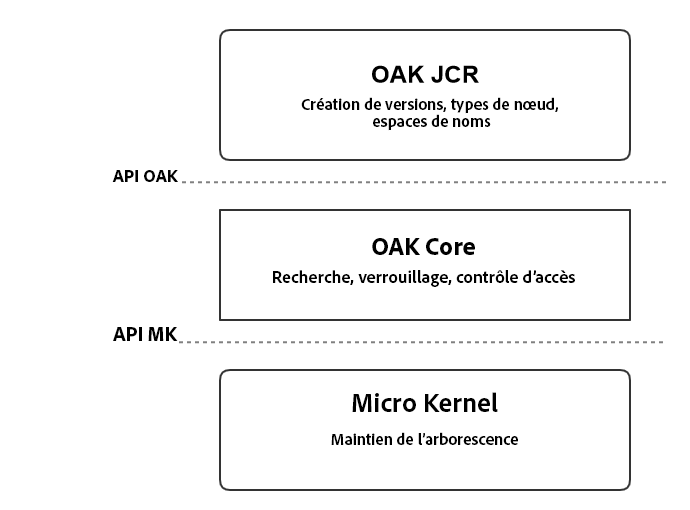
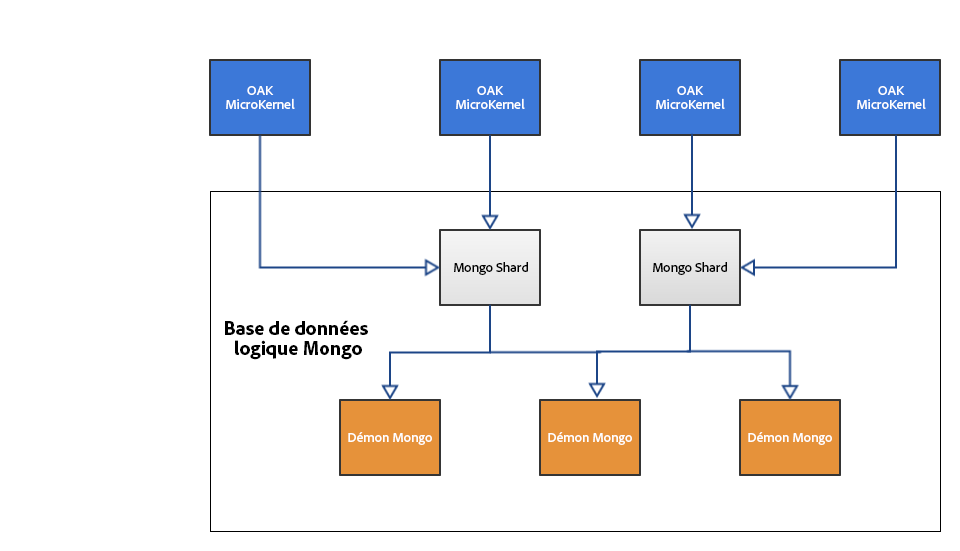

# Présentation de la plateforme AEM{#introduction-to-the-aem-platform}

>[!CAUTION]
>
>AEM 6.4 a atteint la fin de la prise en charge étendue et cette documentation n’est plus mise à jour. Pour plus d’informations, voir notre [période de support technique](https://helpx.adobe.com/fr/support/programs/eol-matrix.html). Rechercher les versions prises en charge [here](https://experienceleague.adobe.com/docs/?lang=fr).

La plateforme AEM dans AEM 6 est basée sur Apache Jackrabbit Oak.

Apache Jackrabbit Oak vise à implémenter un référentiel de contenu hiérarchique évolutif et performant pour l’utiliser comme fondation des sites web modernes de classe mondiale et d’autres applications de contenu exigeantes.

Il succède à Jackrabbit 2 et il est utilisé par AEM 6 comme structure par défaut pour son référentiel de contenu, CRX.

## Principes et objectifs de conception {#design-principles-and-goals}

Oak met en oeuvre les [JSR-283](https://www.day.com/day/en/products/jcr/jsr-283.html) (JCR 2.0) spécification. Ses principaux objectifs de conception sont les suivants :

* Meilleure prise en charge des référentiels volumineux
* Plusieurs noeuds de cluster répartis pour une haute disponibilité
* Meilleures performances
* Prise en charge de nombreux nœuds enfants et de niveaux de contrôle d’accès

## Concept de l’architecture {#architecture-concept}

### Stockage {#storage}

Le but de la couche de stockage est :

* Mise en oeuvre d’un modèle d’arborescence
* Rendre possible l’alimentation du stockage
* Fournir un mécanisme de mise en grappe

### Oak Core {#oak-core}

Oak Core ajoute plusieurs calques à la couche de stockage :

* Contrôles de niveau d’accès
* Recherche et indexation
* Observation

### Oak JCR {#oak-jcr}

L’objectif principal du JCR Oak est de transformer la sémantique JCR en opérations arborescentes. Il est aussi chargé des éléments suivants :

* Mise en oeuvre de l’API JCR
* Contenir des commit hooks qui implémentent des contraintes JCR

En outre, les implémentations non Java sont désormais possibles et font partie du concept Oak JCR. 

## Présentation du stockage {#storage-overview}

La couche de stockage Oak fournit une couche d’abstraction pour le stockage réel du contenu.

Actuellement, il existe deux implémentations du stockage disponibles dans AEM 6 : le **stockage tar** et le **stockage MongoDB**.

### Stockage tar {#tar-storage}

Le stockage Tar utilise des fichiers tar. Il stocke le contenu sous la forme de différents types d’enregistrements dans des segments plus volumineux. Les journaux sont utilisés pour effectuer le suivi de l’état le plus récent du référentiel.

Il existe plusieurs principes de conception clés sur lesquels il a été construit :

* **Segments non modifiables**

Le contenu est stocké dans les segments avec une taille pouvant aller jusqu’à 256 Ko. Ils sont inaltérables, ce qui permet de mettre en cache les segments utilisés fréquemment et de réduire les erreurs système susceptibles de compromettre le référentiel.

Chaque segment est identifié par un identifiant unique (UUID) et contient un sous-ensemble continu de l’arborescence de contenu. En outre, les segments peuvent référencer d’autres contenus. Chaque segment conserve une liste des UUID des autres segments référencés. 

* **Localité**

Les enregistrements associés tels qu’un noeud et ses enfants immédiats sont généralement stockés dans le même segment. Cela permet de rechercher le référentiel très rapidement et d’éviter la plupart des pertes de cache pour les clients standard qui accèdent à plusieurs noeuds associés par session.

* **Compacité**

La mise en forme des enregistrements est optimisée pour la taille afin de réduire les coûts d’E/S et d’intégrer le plus de contenu possible dans les caches.

### Stockage Mongo {#mongo-storage}

Le stockage MongoDB exploite MongoDB pour le partage et la mise en grappe. L’arborescence du référentiel est conservée dans une base de données MongoDB où chaque noeud est un document distinct.

Il a plusieurs particularités :

* Révisions

Pour chaque mise à jour (validation) du contenu, une nouvelle révision est créée. Une révision est essentiellement une chaîne composée de trois éléments :

1. Horodatage dérivé de l’heure système de la machine sur laquelle il a été généré.
1. Un compteur pour distinguer les révisions créées avec le même horodatage
1. ID de noeud de la grappe dans lequel la révision a été créée

* Branches

Les branches sont prises en charge, ce qui permet au client d’organiser plusieurs modifications et de les rendre visibles avec un seul appel de fusion.

* Documents précédents

Le stockage MongoDB ajoute des données à un document à chaque modification. Cependant, elle supprime uniquement les données si un nettoyage est explicitement déclenché. Les anciennes données sont déplacées lorsqu’un certain seuil est atteint. Les documents précédents ne contiennent que des données non modifiables, ce qui signifie qu’ils ne contiennent que des révisions validées et fusionnées.

* Métadonnées du noeud de cluster

Les données relatives aux noeuds de cluster principaux et inactifs sont conservées dans la base de données afin de faciliter les opérations de cluster.

Une configuration en cluster AEM typique avec un stockage MongoDB :

## Qu&#39;est-ce qui diffère de Jackrabbit 2 ? {#what-is-different-from-jackrabbit}

Oak étant conçu pour être rétrocompatible avec la norme JCR 1.0, il n’y aura pratiquement aucune modification au niveau de l’utilisateur. Cependant, il existe des différences notables que vous devez prendre en compte lors de la configuration d’une AEM basée sur Oak :

* Oak ne crée pas automatiquement d’index. Pour cette raison, les index personnalisés doivent être créés si nécessaire.
* Contrairement à Jackrabbit 2 où les sessions reflètent toujours le dernier état du référentiel, avec Oak, une session reflète une vue stable du référentiel à partir du moment où la session a été acquise. Cela est dû au modèle MVCC sur lequel Oak est basé.
* Les frères de même nom (SNS) ne sont pas pris en charge dans Oak. 

## Autre documentation liée aux plateformes {#other-platform-related-documentation}

Pour plus d&#39;informations sur la plateforme AEM, consultez également les articles ci-dessous :

* [Configuration des entrepôts de nœuds et des magasins de données dans AEM 6](/help/sites-deploying/data-store-config.md)
* [Requêtes et indexation Oak](/help/sites-deploying/queries-and-indexing.md)
* [Éléments de stockage dans AEM 6](/help/sites-deploying/storage-elements-in-aem-6.md)
* [AEM avec MongoDB](/help/sites-deploying/aem-with-mongodb.md)
