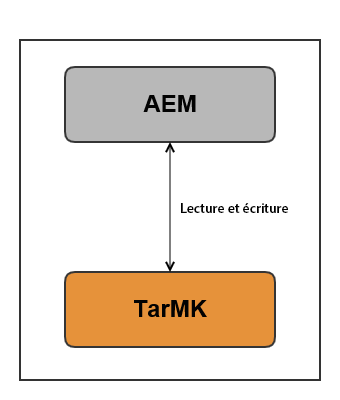
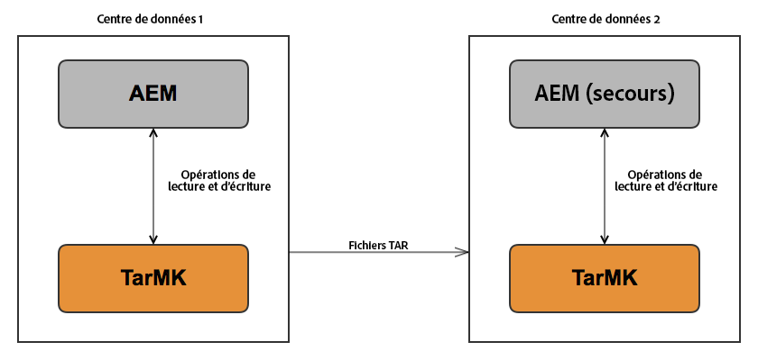
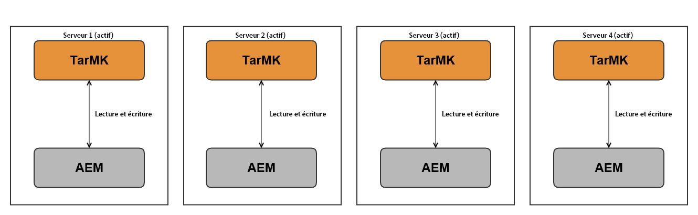
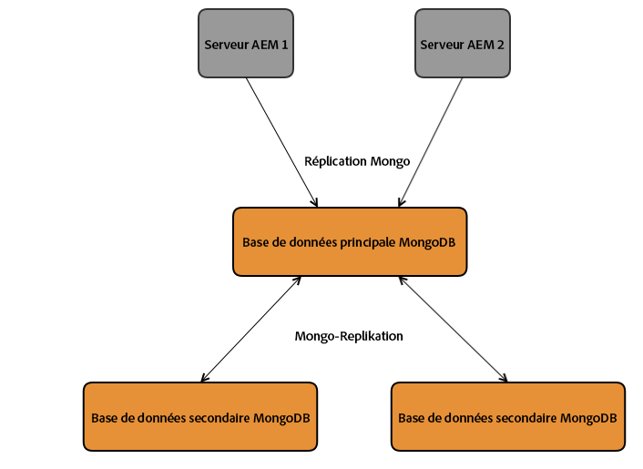
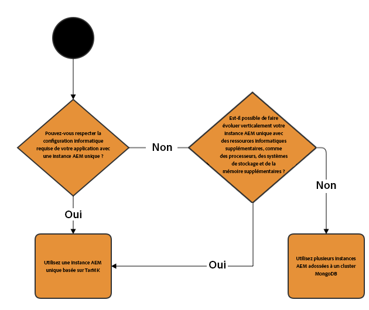
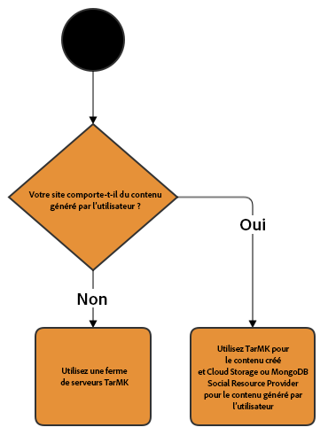

# Déploiements recommandés{#recommended-deployments}

>[!CAUTION]
>
>AEM 6.4 a atteint la fin de la prise en charge étendue et cette documentation n’est plus mise à jour. Pour plus d’informations, voir notre [période de support technique](https://helpx.adobe.com/fr/support/programs/eol-matrix.html). Rechercher les versions prises en charge [here](https://experienceleague.adobe.com/docs/?lang=fr).

>[!NOTE]
>
>Cette page se rapporte aux topologies recommandées pour AEM. Pour plus d’informations sur les fonctionnalités de mise en cluster et sur leur configuration, reportez-vous à la [documentation sur les API Discovery Apache Sling](https://sling.apache.org/documentation/bundles/discovery-api-and-impl.html). 

Les micronoyaux agissent comme gestionnaires de persistance dans AEM 6.4. Le choix d’un micronoyau en fonction de vos besoins dépend de l’objectif de votre instance et du type de déploiement que vous envisagez.

Les exemples ci-dessous ont pour but d’indiquer les utilisations recommandées dans les configurations d’AEM les plus courantes.

## Scénarios de déploiement {#deployment-scenarios}

### Instance TarMK unique {#single-tarmk-instance}

Dans ce scénario, une seule instance TarMK s’exécute sur un seul serveur.

**Il s’agit du déploiement par défaut pour les instances de création.**

Les avantages :

* Simple
* Maintenance aisée
* Bonne performance

Les inconvénients :

* Non évolutif au-delà des limites de la capacité du serveur
* Aucune capacité de basculement

### TarMK Cold Secondaire {#tarmk-cold-standby}

Une instance TarMK agit comme l’instance Principale. Le référentiel de la Principale est répliqué vers un système de basculement Secondaire.

Le mécanisme Cold Secondaire peut également être utilisé comme sauvegarde, car le référentiel complet est constamment répliqué sur le serveur de basculement. Le serveur de basculement s’exécute en mode Secondaire froid, ce qui signifie que seul le récepteur Http de l’instance est en cours d’exécution.

Les avantages :

* Simplicité
* Maintenabilité
* Performance
* Basculement

Les inconvénients :

* Non évolutif au-delà des limites de la capacité du serveur
* Un serveur est inactif la plupart du temps.
* Le basculement n’est pas automatique. Il doit être détecté en externe avant que le système de basculement puisse commencer à traiter les requêtes.

>[!NOTE]
>
>Pour plus d’informations sur la configuration d’AEM avec TarMK Cold Standby, reportez-vous [cet](/help/sites-deploying/tarmk-cold-standby.md) article.

>[!NOTE]
>
>Le déploiement du mécanisme Cold Standby dans cet exemple de TarMK exige que les instances principales et de secours disposent de licences distinctes, en raison de la réplication constante vers le serveur de basculement. Pour plus d’informations sur les licences, veuillez consulter les [conditions générales de licence d’Adobe](https://www.adobe.com/fr/legal/terms/enterprise-licensing.html).

### Ferme TarMK {#tarmk-farm}

Plusieurs instances Oak s’exécutent chacune avec une instance TarMK. Les référentiels TarMK sont indépendants et doivent être synchronisés.

Le fait que le serveur de création publie le même contenu à chaque membre de la ferme assure la synchronisation des référentiels. Pour plus d’informations, voir [Réplication](/help/sites-deploying/replication.md).

Pour AEM Communities, le contenu généré par l’utilisateur n’est jamais répliqué. Pour toutes questions concernant la prise en charge du contenu créé par l’utilisateur dans une ferme TarMK, reportez-vous à la section [Remarques relatives à AEM Communities](#considerations-for-aem-communities).

**Il s’agit du déploiement par défaut pour les environnements de publication.**

Les avantages :

* Performance
* Évolutivité pour l’accès en lecture
* Basculement

### Grappe Oak avec basculement MongoMK pour une haute disponibilité dans un seul centre de données {#oak-cluster-with-mongomk-failover-for-high-availability-in-a-single-datacenter}

Cette approche implique que plusieurs instances Oak accèdent à un ensemble de réplications MongoDB dans un data center, créant ainsi un cluster actif-actif pour l’environnement de création AEM. Les ensembles de réplications de MongoDB sont utilisés pour fournir un haut niveau de disponibilité et de redondance en cas de panne de matériel ou de réseau.

Les avantages :

* Possibilité d’effectuer une mise à l’échelle horizontale avec de nouvelles instances d’auteur AEM
* Haute disponibilité, redondance et basculement automatisé de la couche de données

Les inconvénients :

* Les performances peuvent être inférieures à celles de TarMK pour certains scénarios.

### Grappe Oak avec basculement MongoMK sur plusieurs data centers {#oak-cluster-with-mongomk-failover-across-multiple-datacenters}

Cette approche implique que plusieurs instances Oak accèdent à un ensemble de réplications MongoDB défini sur plusieurs data centers, créant ainsi un cluster actif-actif pour l’environnement de création AEM. Avec plusieurs centres de données, la réplication MongoDB fournit le même niveau élevé de disponibilité et de redondance, mais inclut désormais la capacité de gérer une éventuelle panne de courant du centre de données.

Les avantages :

* Possibilité d’effectuer une mise à l’échelle horizontale avec de nouvelles instances d’auteur AEM
* Haute disponibilité, redondance et basculement automatisé de la couche de données (y compris les pannes de centre de données)

>[!NOTE]
>
>Dans le diagramme ci-dessus, les serveurs AEM 3 et AEM 4 sont présentés avec un statut inactif, ce qui suppose une latence réseau entre les serveurs AEM du centre de données 2 et le nœud primaire MongoDB du centre de données 1 qui est supérieure à l’exigence décrite [ici](/help/sites-deploying/aem-with-mongodb.md#checklists). Si la latence maximum est compatible avec les exigences, par exemple en utilisant les zones de disponibilité, les serveurs AEM dans le centre données 2 peuvent être actifs également, créant un cluster AEM actif-actif dans plusieurs centres de données.

>[!NOTE]
>
>Pour plus d’informations sur les concepts architecturaux de MongoDB décrits dans cet article, consultez la section [Réplication MongoDB](https://docs.mongodb.org/manual/replication/).

## Microkernels : celle à utiliser {#microkernels-which-one-to-use}

La règle de base qui doit être prise en compte lors du choix entre les deux micronoyaux disponibles est que TarMK est conçu pour les performances, tandis que MongoMK est utilisé pour l’évolutivité.

Vous pouvez utiliser ces tableaux de décision afin de déterminer le type de déploiement le plus adapté à vos besoins.

Adobe recommande vivement à TarMK d’être la technologie de persistance par défaut utilisée par les clients dans tous les scénarios de déploiement, tant pour les instances d’auteur que de publication AEM, sauf dans les cas d’utilisation décrits ci-dessous.

### Exceptions pour choisir AEM MongoMK plutôt que TarMK sur les instances d’auteur {#exceptions-for-choosing-aem-mongomk-over-tarmk-on-author-instances}

La Principale raison pour choisir le serveur principal de persistance MongoMK plutôt que TarMK est de mettre les instances à l’échelle horizontale. Cela signifie que deux instances d’auteur ou plus principales s’exécutent en permanence et utilisent MongoDB comme système de stockage de persistance. La nécessité d’exécuter plusieurs instances de création découle généralement du fait que la capacité du processeur et de la mémoire d’un seul serveur, prenant en charge toutes les activités de création simultanées, n’est plus durable.

Il est presque impossible de prédire quel sera le modèle exact de simultanéité une fois qu’un nouveau site sera mis en ligne. Par conséquent, Adobe vous recommande de prendre en compte les critères suivants lors de l’évaluation de l’utilisation de MongoMK et de deux noeuds principaux d’auteur ou plus :

1. Nombre d’utilisateurs nommés connectés au cours de la journée : des milliers ou plus.
1. Nombre d’utilisateurs simultanés : des centaines ou plus.
1. Volume d’assimilation de ressources par jour : des centaines de milliers, voire plus.
1. Volume de modifications de pages par jour : des centaines de milliers (y compris les mises à jour automatisées via le Multi-site Manager ou des assimilations de flux d’actualité, par exemple).
1. Volume de recherches par jour : des dizaines de milliers, voire plus.

>[!NOTE]
>
>Tough Day peut être utilisé pour évaluer les performances de l’application du client dans le contexte de la configuration matérielle déployée. Plus d’informations sur cet outil sont disponibles [here](/help/sites-developing/tough-day.md).

Un déploiement minimal avec MongoDB implique généralement la topologie suivante :

* Un ensemble de réplications MongoDB composé d’un nœud principal, de deux nœuds secondaires avec chacune des instances MongoDB s’exécutant dans une zone de disponibilité avec une latence de moins de 15 millisecondes entre chaque nœud ; 
* Groupe d’instances d’auteur avec un noeud leader, un noeud non leader et les deux principaux à tout moment, chacune des instances d’auteur étant exécutée dans chacun des centres de données, où les instances Principales et secondaires de MongoDB sont en cours d’exécution.

En outre, il est vivement recommandé de configurer la banque de données sur un système de fichiers partagé ou Amazon S3, de sorte que les ressources ou les fichiers binaires ne soient pas stockés dans MongoDB. Cela garantit des performances optimales dans le déploiement.

L’un des avantages supplémentaires du déploiement d’un ensemble de réplications MongoDB avec un cluster de plusieurs instances d’auteur est de disposer d’un scénario de récupération automatisée avec un temps d’arrêt minimal en cas d’échec des instances d’auteur, de la réplication MongoDB ou d’un centre de données complet. Néanmoins, le choix de MongoMK plutôt que TarMK ne doit pas être uniquement motivé par les exigences de reprise, car TarMK peut également fournir une solution de temps d’arrêt minimal avec un mécanisme de basculement contrôlé.

Si les critères ci-dessus ne doivent pas être remplis au cours des dix-huit premiers mois du déploiement, nous vous recommandons de commencer par déployer AEM à l’aide de TarMK, puis de réévaluer votre configuration à une date ultérieure lorsque les critères ci-dessus s’appliquent, et enfin de déterminer s’il faut rester sur TarMK ou migrer vers MongoMK.

### Exceptions pour choisir AEM MongoMK plutôt que TarMK sur les instances de publication {#exceptions-for-choosing-aem-mongomk-over-tarmk-on-publish-instances}

Il n’est pas recommandé de déployer MongoMK pour les instances de publication. Le niveau de publication du déploiement est presque toujours déployé en tant que ferme d’instances de publication entièrement indépendantes exécutant TarMK, qui sont synchronisées en répliquant le contenu des instances d’auteur. Cette architecture &quot;shared no&quot;, propre aux instances de publication, permet au déploiement du niveau de publication de se dimensionner horizontalement de manière linéaire. La topologie de ferme offre également l’avantage d’appliquer une mise à jour ou une mise à niveau aux instances de publication de manière progressive, de sorte que toute modification au niveau de publication ne nécessite aucun temps d’arrêt.

Cela ne s’applique pas à AEM Communities qui utilise des grappes MongoMK sur le niveau de publication lorsqu’il y a plusieurs éditeurs. Si vous choisissez JSRP (consultez la section [Stockage du de contenu de la communauté](/help/communities/working-with-srp.md)), un cluster MongoMK est approprié, comme le serait tout cluster côté publication, quel que soit le MK sélectionné, comme MongoDB ou RDB.

### Conditions préalables et recommandations de déploiement d’AEM avec MongoMK {#prerequisites-and-recommendations-when-deploying-aem-with-mongomk}

Certaines conditions préalables et des recommandations sont disponibles si vous envisagez un déploiement MongoMK pour AEM :

**Conditions préalables obligatoires pour les déploiements de MongoDB :**

1. L’architecture et le dimensionnement du déploiement MongoDB doivent faire partie de la mise en oeuvre du projet avec l’aide des architectes MongoDB ou Adobe Consulting qui connaissent bien AEM ;
1. L’expertise de MongoDB doit être présente au sein de l’équipe partenaire ou du client afin de pouvoir maintenir et gérer un environnement MongoDB existant ou nouveau ;
1. Vous pouvez choisir de déployer la version commerciale ou open source de MongoDB (AEM prend en charge les deux), mais vous devez acheter un contrat de maintenance et de support MongoDB directement auprès de MongoDB Inc ;
1. Les architectures et infrastructures globales d&#39;AEM et de MongoDB doivent être bien définies et validées par un architecte d&#39;AEM Adobe ;
1. Vous devez examiner le modèle de prise en charge des déploiements d’AEM qui incluent MongoDB.

**Recommandations essentielles pour les déploiements de MongoDB :**

* Consultez l’article sur MongoDB pour [Adobe Experience Manager](https://www.mongodb.com/lp/contact/mongodb-adobe-experience-manager) ;
* Passez en revue la liste de contrôle d’exploitation [MongoDB](https://docs.mongodb.org/manual/administration/production-checklist/) ;
* Participez à une formation en ligne sur MongoDB [ici](https://university.mongodb.com/).

>[!NOTE]
>
>Pour toute question concernant ces instructions, les conditions préalables et les recommandations, veuillez contacter [Assistance clientèle Adobe](https://helpx.adobe.com/fr/marketing-cloud/contact-support.html).

### Considérations pour AEM Communities {#considerations-for-aem-communities}

Pour les sites qui prévoient de déployer [AEM Communities](/help/communities/overview.md), il est recommandé de [choix d’un déploiement](/help/communities/working-with-srp.md) optimisé pour la gestion du contenu généré par les membres de la communauté de l’environnement de publication.

En utilisant une [magasin commun](/help/communities/working-with-srp.md), le contenu généré par l’utilisateur n’a pas besoin d’être répliqué entre les instances de création et d’autres instances de publication pour obtenir une vue cohérente du contenu créé par l’utilisateur.

Vous trouverez ci-dessous un ensemble de matrices décisionnelles pour vous aider à choisir le meilleur type de persistance pour votre déploiement :

#### Choix du type de déploiement pour les instances d’auteur {#choosing-the-deployment-type-for-author-instances}

#### Choix du type de déploiement pour les instances de publication {#choosing-the-deployment-type-for-publish-instances}

>[!NOTE]
>
>MongoDB est un logiciel tiers non inclus dans le package de licence d’AEM. Pour plus d’informations, consultez la page [Politique de licence de MongoDB](https://www.mongodb.org/about/licensing/).
>
>Pour tirer le meilleur parti de votre déploiement AEM, Adobe recommande d’obtenir une licence de la version MongoDB Enterprise afin de bénéficier d’une assistance professionnelle.
>
>La licence comprend un ensemble standard de répliques, composé d’une instance principale et de deux instances secondaires qui peuvent être utilisées pour les déploiements de création ou de publication.
>
>Si vous souhaitez exécuter les instances de création et de publication sur MongoDB, deux licences distinctes doivent être achetées.
>
>Pour plus d’informations, consultez la page [MongoDB pour Adobe Experience Manager](https://www.mongodb.com/lp/contact/mongodb-adobe-experience-manager).
