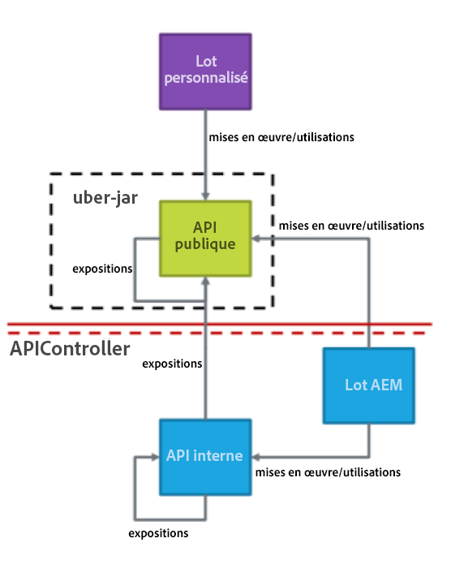
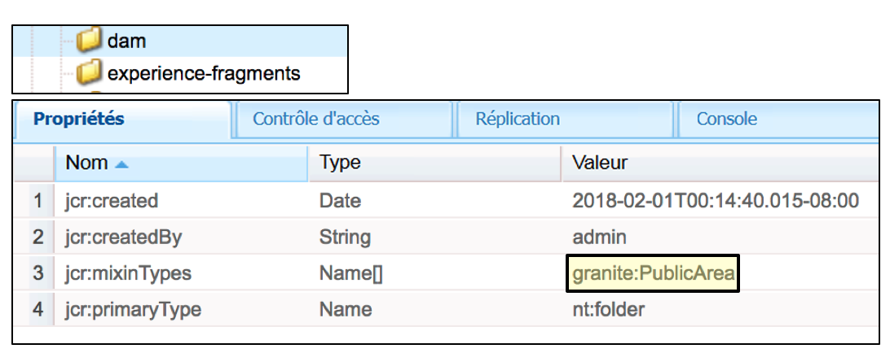
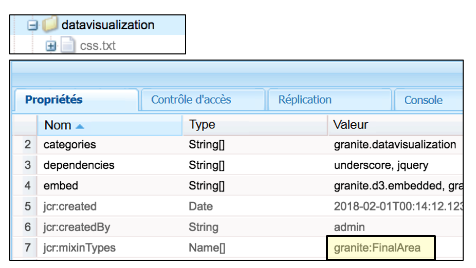
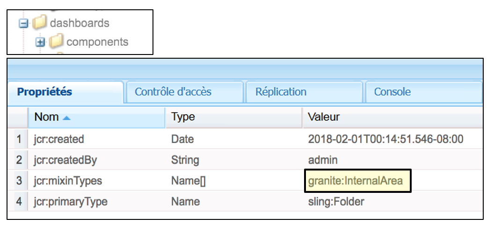
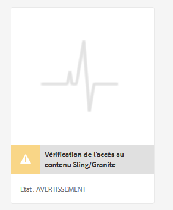
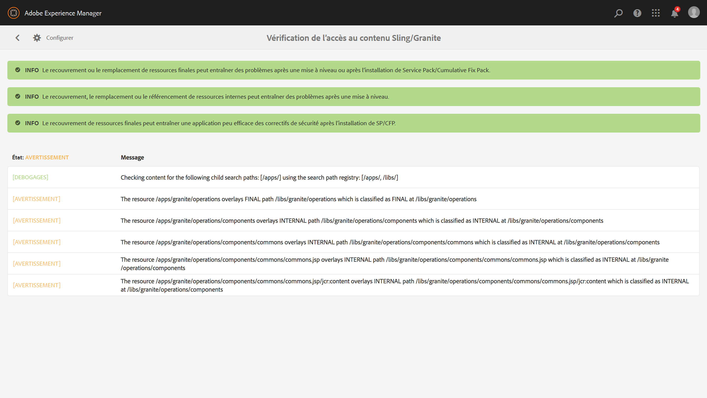
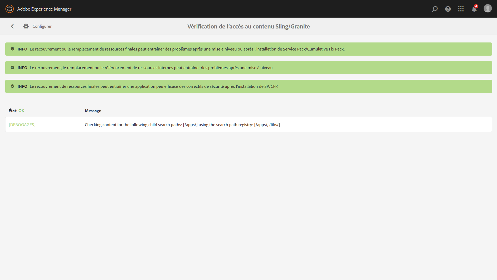

# Mises à niveau possibles{#sustainable-upgrades}

>[!CAUTION]
>
>AEM 6.4 a atteint la fin de la prise en charge étendue et cette documentation n’est plus mise à jour. Pour plus d’informations, voir notre [période de support technique](https://helpx.adobe.com/fr/support/programs/eol-matrix.html). Rechercher les versions prises en charge [here](https://experienceleague.adobe.com/docs/?lang=fr).

## Structure de personnalisation {#customization-framework}

### Architecture (fonctionnelle/infrastructure/contenu/application)  {#architecture-functional-infrastructure-content-application}

La fonctionnalité de structure de personnalisation est conçue pour aider à réduire les violations dans les zones non extensibles du code (comme les API) ou du contenu (comme les superpositions) qui ne sont pas compatibles avec la mise à niveau.

Il existe deux composants de la structure de personnalisation : la valeur **Surface d’API** et le **Classification de contenu**.

#### Surface d’API {#api-surface}

Dans les versions précédentes d’AEM, de nombreuses API ont été exposées via Uber Jar. Certaines de ces API n’étaient pas destinées à être utilisées par les clients, mais ont été exposées pour prendre en charge AEM fonctionnalités entre les lots. Dorénavant, les API Java seront marquées comme publiques ou privées pour indiquer aux clients quelles API peuvent être utilisées en toute sécurité dans le cadre des mises à niveau. Voici d’autres observations :

* Les API Java accompagnées de la mention `Public` peuvent être utilisées et référencées par des modules d’implémentation personnalisés.

* Les API publiques seront rétrocompatibles avec l’installation d’un package de compatibilité.
* Le package de compatibilité contiendra un jar Uber de compatibilité pour garantir la compatibilité descendante.
* Les API Java accompagnées de la mention `Private` sont destinées aux seuls modules internes AEM. Elles ne peuvent pas être utilisées par des modules personnalisés.

>[!NOTE]
>
>Il ne faut pas confondre les concepts `Private` et `Public` employés dans ce contexte avec les notions de classes privées et publiques dans Java.

#### Classifications de contenu {#content-classifications}

AEM a longtemps utilisé le principe des incrustations et Sling Resource Merger pour permettre aux clients d’étendre et de personnaliser les fonctionnalités d’AEM. Les fonctionnalités prédéfinies qui alimentent les consoles AEM et l’interface utilisateur sont stockées dans **/libs**. Les clients ne doivent jamais modifier quoi que ce soit sous **/libs** mais peut ajouter du contenu supplémentaire sous **/apps** pour superposer et étendre les fonctionnalités définies dans **/libs** (Voir Développement avec des superpositions pour plus d’informations). Cela provoquait toujours de nombreux problèmes lors de la mise à niveau d’AEM en tant que contenu dans **/libs** peut changer, ce qui entraîne une panne inattendue de la fonctionnalité de recouvrement. Les utilisateurs peuvent également étendre les composants AEM par le biais de l’héritage via `sling:resourceSuperType` ou simplement faire référence à un composant dans **/libs** directement par sling:resourceType. Des problèmes de mise à niveau similaires peuvent se produire avec les cas d’utilisation de référence et de remplacement.

Afin que les clients puissent comprendre plus facilement et plus en toute sécurité les zones de **/libs** peuvent utiliser et superposer le contenu en toute sécurité dans **/libs** a été classé avec les mixins suivants :

* **Public (granite:PublicArea)** : définit un nœud comme étant public afin qu’il puisse être recouvert, hérité (`sling:resourceSuperType`) ou utilisé directement (`sling:resourceType`). Les nœuds situés sous /libs marqués comme étant publics peuvent être mis à niveau en toute sécurité avec l’ajout d’un package de compatibilité. En règle générale, les utilisateurs doivent uniquement exploiter les nœuds publics.

* **Résumé (granite:AbstractArea)** : définit un nœud en tant que résumé. Les nœuds peuvent être recouverts ou hérités (`sling:resourceSupertype`), mais ils ne doivent pas être utilisés directement (`sling:resourceType`).

* **Final (granite:FinalArea)** : définit un nœud comme étant final. Les noeuds classés comme finaux ne peuvent pas être superposés ni hérités. Les nœuds finaux peuvent être utilisés directement via `sling:resourceType`. Par défaut, les nœuds secondaires placés sous le nœud final sont considérés comme internes

* **Interne (granite:InternalArea)** - Définit un noeud comme interne. Les noeuds classés comme internes ne peuvent pas être superposés, hérités ou utilisés directement. Ces noeuds sont destinés uniquement aux fonctionnalités internes de AEM

* **Aucune annotation** - Les noeuds héritent de la classification en fonction de la hiérarchie de l’arborescence. La racine / est par défaut Public. **Les noeuds dont le parent est classé comme Interne ou Final doivent également être traités comme Interne.**

>[!NOTE]
>
>Ces stratégies ne sont appliquées que par rapport aux mécanismes basés sur des chemins de recherche Sling. D’autres zones de **/libs**, comme une bibliothèque côté client, peuvent se voir affecter la classification `Internal`. Cependant, elles peuvent toujours être utilisées avec l’inclusion clientlib standard. Il est important qu’un client continue à respecter la classification interne dans ces cas.

#### Indicateurs de type de contenu CRXDE Lite {#crxde-lite-content-type-indicators}

Les mixins appliqués dans CRXDE Lite affichent en grisé les nœuds de contenu et les arborescences ayant la classification `INTERNAL`. Pour la classification `FINAL`, seule l’icône est grisée. Les enfants de ces noeuds apparaissent également en gris. La fonctionnalité Noeud de recouvrement est désactivée dans les deux cas.

**Public**

**Final**

**Interne**

**Contrôle de l’intégrité du contenu**

AEM 6.4 sera distribué avec un contrôle d’intégrité pour informer les clients si du contenu référencé ou recouvert est utilisé d’une manière non conforme à la classification du contenu.

Le **Vérification de l’accès au contenu Sling/Granite** est un nouveau contrôle de l’intégrité qui surveille le référentiel pour voir si le code client accède incorrectement aux noeuds protégés dans AEM.

Cette analyse sera effectuée **/apps** et dure généralement plusieurs secondes.

Pour accéder à ce nouveau contrôle de l’intégrité, vous devez effectuer les opérations suivantes :

1. Dans l’écran d’accueil AEM, accédez à **Outils > Opérations > Rapports d’intégrité**
1. Cliquez sur le bouton **Vérification de l’accès au contenu Sling/Granite** comme illustré ci-dessous :

   

Une fois l’analyse terminée, une liste d’avertissements s’affiche pour informer l’utilisateur final du nœud protégé qui est référencé de manière incorrecte :

Une fois que les problèmes ont été corrigés, le statut vert est rétabli :

Le contrôle de l’intégrité affiche les informations collectées par un service en arrière-plan qui vérifie de manière asynchrone chaque fois qu’une superposition ou un type de ressource est utilisé sur tous les chemins de recherche Sling. Si les mixins de contenu sont utilisés de manière incorrecte, il signale une violation.
