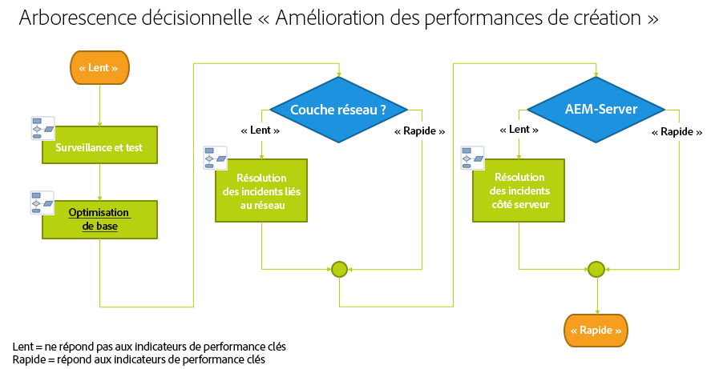
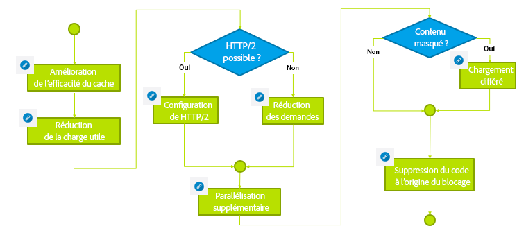

# Résolution des problèmes{#troubleshooting}

>[!CAUTION]
>
>AEM 6.4 a atteint la fin de la prise en charge étendue et cette documentation n’est plus mise à jour. Pour plus d’informations, voir notre [période de support technique](https://helpx.adobe.com/fr/support/programs/eol-matrix.html). Rechercher les versions prises en charge [here](https://experienceleague.adobe.com/docs/?lang=fr).

Cette section comprend des informations détaillées sur les journaux disponibles pour vous aider à résoudre les problèmes et inclut également des informations sur certains des problèmes que vous pouvez rencontrer avec AEM.

## Résolution des problèmes de performances de création {#troubleshoot-author-performance}

L’analyse des performances lentes sur l’instance de création peut devenir assez complexe. Dans un premier temps, il est nécessaire de déterminer à quel niveau de la pile technologique les performances diminuent.

L’arborescence décisionnelle suivante fournit les directives nécessaires pour réduire le goulet d’étranglement.

## Optimisation de base {#basic-optimization}

## Configuration des fichiers journaux et des journaux d’audit {#configuring-log-files-and-audit-logs}

AEM enregistre les journaux détaillés que vous pouvez configurer afin de résoudre les problèmes d’installation. Pour plus d’informations, consultez la section [Utilisation des enregistrements d’audit et des fichiers journaux](/help/sites-deploying/monitoring-and-maintaining.md#working-with-audit-records-and-log-files).

## Utilisation de l’option d’informations détaillées (Verbose) {#using-the-verbose-option}

Lorsque vous démarrez la gestion de contenu web AEM, vous pouvez ajouter l’option -v (verbose) à la ligne de commande, comme suit : java -jar cq-wcm-quickstart-&lt;version>.jar -v.

L’option verbose affiche une partie de la sortie du journal de démarrage rapide sur la console afin de pouvoir l’utiliser pour la résolution des problèmes.

## Problèmes d’installation courants {#common-installation-issues}

La section suivante décrit certains problèmes d’installation et leurs solutions.

### Lorsque vous double-cliquez sur le fichier Quickstart jar, rien ne se produit ou le fichier s’ouvre dans un autre programme (par exemple, le gestionnaire d’archives). {#double-clicking-the-quickstart-jar-does-not-have-any-effect-or-opens-the-jar-file-with-another-program-for-example-archive-manager}

Cette situation indique généralement qu’il existe un problème lié à la configuration de l’environnement de poste de travail de votre système d’exploitation pour l’ouverture des fichiers dotés de l’extension .jar. Il peut également indiquer que Java n’est pas installé sur votre ordinateur ou que vous utilisez une version de Java non prise en charge.

Comme les fichiers jar utilisent le format ZIP omniprésent, certains programmes d’archivage peuvent configurer automatiquement le bureau pour ouvrir les fichiers jar en tant que fichiers d’archive.

Pour résoudre le problème, procédez comme suit :

* Vérifiez que vous avez installé au moins Java version 1.6.
* Essayez un menu contextuel (généralement avec le bouton droit de la souris) dans le Quickstart de la gestion de contenu web AEM, puis sélectionnez &quot;Ouvrir avec....&quot;
* Vérifiez si Java ou Sun Java est répertorié et essayez d’exécuter AEM WCM avec celui-ci. Si plusieurs versions de Java sont installées, sélectionnez celle prise en charge.

   Si vous réussissez cette étape et que vos systèmes d’exploitation offrent la possibilité de toujours utiliser le programme sélectionné pour exécuter les fichiers .jar, sélectionnez-le. Le double-clic devrait désormais fonctionner.

* Parfois, la réinstallation de la version Java prise en charge permet de restaurer l’association correcte.
* Vous pouvez toujours exécuter CRX à l’aide de la ligne de commande ou des scripts start/stop comme décrit précédemment dans ce document.

### Mon application qui s’exécute sur CRX génère des erreurs de mémoire insuffisante. {#my-application-running-on-crx-throws-out-of-memory-errors}

>[!NOTE]
>
>Voir aussi [Analyse des problèmes de mémoire](https://helpx.adobe.com/experience-manager/kb/AnalyzeMemoryProblems.html).

Le CRX lui-même a une empreinte mémoire très faible. Si l’application s’exécutant dans CRX a des exigences de mémoire plus importantes ou requiert des opérations gourmandes en mémoire (par exemple, des transactions volumineuses), l’instance JVM où s’exécute CRX doit être démarrée avec les paramètres de mémoire appropriés.

Utilisez les options de commande Java pour définir les paramètres de mémoire de JVM (par exemple, java -Xmx512m -jar crx&amp;ast;.jar pour définir la taille des segments de mémoire sur 512 Mo).

Spécifiez l’option de paramètre de mémoire lors du démarrage AEM WCM à partir de la ligne de commande. Les scripts de démarrage/arrêt de la gestion de contenu web AEM ou les scripts personnalisés pour gérer AEM démarrage de la gestion de contenu web peuvent également être modifiés pour définir les paramètres de mémoire requis.

Si vous avez déjà défini les segments de mémoire sur 512 Mo, vous souhaiterez peut-être continuer à analyser l’erreur de mémoire en créant un vidage de segments de mémoire :

Pour créer automatiquement un vidage de segments de mémoire lorsque la mémoire est insuffisante, utilisez la commande suivante :

java -Xmx256m -XX:+HeapDumpOnOutOfMemoryError -jar &amp;ast;.jar

Cela génère un fichier de vidage de tas (**java_...hprof**) chaque fois que le processus manque de mémoire. Le processus peut continuer à s’exécuter une fois le vidage de tas généré. En règle générale, un fichier de vidage de tas suffit à analyser le problème.

### Après avoir double-cliqué sur AEM Quickstart, l’écran d’accueil d’AEM ne s’affiche pas dans le navigateur. {#the-aem-welcome-screen-does-not-display-in-the-browser-after-double-clicking-aem-quickstart}

Dans certains cas, les écrans de bienvenue de la gestion du contenu web AEM ne s’affichent pas automatiquement même si le référentiel s’exécute correctement. Cela peut dépendre de la configuration du système d’exploitation, de la configuration du navigateur ou de facteurs similaires.

Dans ce cas, la fenêtre Quickstart affiche le message suivant : « Démarrage de la gestion de contenu web AEM. En attente du démarrage du serveur... » Si ce message s’affiche pendant une période relativement longue, saisissez manuellement l’URL de gestion de contenu web AEM dans la fenêtre du navigateur, à l’aide du port 4502 par défaut, ou du port sur lequel l’instance est en cours d’exécution : http://localhost:4502/.

En outre, les journaux peuvent indiquer la raison pour laquelle le navigateur ne démarre pas.

Parfois, la fenêtre de démarrage rapide de la gestion de contenu web d’AEM comporte le message &quot;AEM WCM s’exécutant sur http://localhost:port/&quot; et le navigateur ne démarre pas automatiquement. Dans ce cas, cliquez sur l’URL dans la fenêtre de démarrage rapide AEM WCM (il s’agit d’un lien hypertexte) ou saisissez manuellement l’URL dans le navigateur.

Si tout le reste échoue, consultez les journaux pour savoir ce qui s’est passé.

## Dépannage des installations avec un serveur d’applications {#troubleshooting-installations-with-an-application-server}

### Page introuvable lors de la demande d’une page geometrixx-outdoor {#page-not-found-returned-when-requesting-a-geometrixx-outdoor-page}

**S’applique à WebLogic 10.3.5 et JBoss 5.1**

Lorsqu’une demande de page geometrixx-outdoors/en renvoie une erreur 404 (Page introuvable), vérifiez que vous avez défini la propriété sling supplémentaire dans le fichier sling.properties de ces serveurs d’applications.

Pour plus d’informations, reportez-vous à la procédure *Déployer une application web AEM*.

### La taille de l’en-tête de réponse peut être supérieure à 4 Ko {#response-header-size-can-be-greater-than-kb}

Les erreurs 502 peuvent indiquer que le serveur web ne peut pas gérer la taille de l’en-tête de réponse HTTP AEM. AEM peut générer des en-têtes de réponse HTTP qui incluent des cookies d’une taille supérieure à 4 Ko. Assurez-vous que votre conteneur de servlets est configuré de sorte que la taille maximale de l’en-tête de réponse puisse dépasser 4 Ko.

Par exemple, pour Tomcat 7.0, l’attribut maxHttpHeaderSize de [Connecteur HTTP](https://tomcat.apache.org/tomcat-7.0-doc/config/http.html) contrôle les limites de la taille de l’en-tête.

## Désinstallation d’Adobe Experience Manager {#uninstalling-adobe-experience-manager}

Comme AEM installe dans un seul répertoire, un utilitaire de désinstallation n’est pas nécessaire. La désinstallation peut être aussi simple que la suppression de l’intégralité du répertoire d’installation, bien que la désinstallation AEM dépend de ce que vous souhaitez réaliser et du stockage persistant que vous utilisez.

Si le stockage persistant est incorporé dans le répertoire d’installation, par exemple dans l’installation par défaut de TarPM, la suppression de dossiers supprime également les données.

>[!NOTE]
>
>Adobe recommande vivement de sauvegarder votre référentiel avant de supprimer AEM. Si vous supprimez l’intégralité de la variable &lt;cq-installation-directory>, vous supprimerez le référentiel. Pour conserver les données du référentiel avant de supprimer, déplacer ou copier la variable &lt;cq-installation-directory>dossier /crx-quickstart/repository ailleurs avant de supprimer les autres dossiers.

Si votre installation d’AEM utilise un stockage externe, par exemple un serveur de base de données, la suppression du dossier ne supprime pas automatiquement les données, mais supprime la configuration de stockage, ce qui rend difficile la restauration du contenu JCR.

### Les fichiers JSP ne sont pas compilés sur JBoss. {#jsp-files-are-not-compiled-on-jboss}

Si vous installez ou mettez à jour les fichiers JSP vers Experience Manager sur JBoss et que les servlets correspondants ne sont pas compilés, assurez-vous que le compilateur JSP de JBoss est correctement configuré. Pour plus d’informations, voir\
[Problèmes de compilation JSP dans JBoss](https://helpx.adobe.com/fr/experience-manager/kb/jsps-dont-compile-jboss.html) article.
