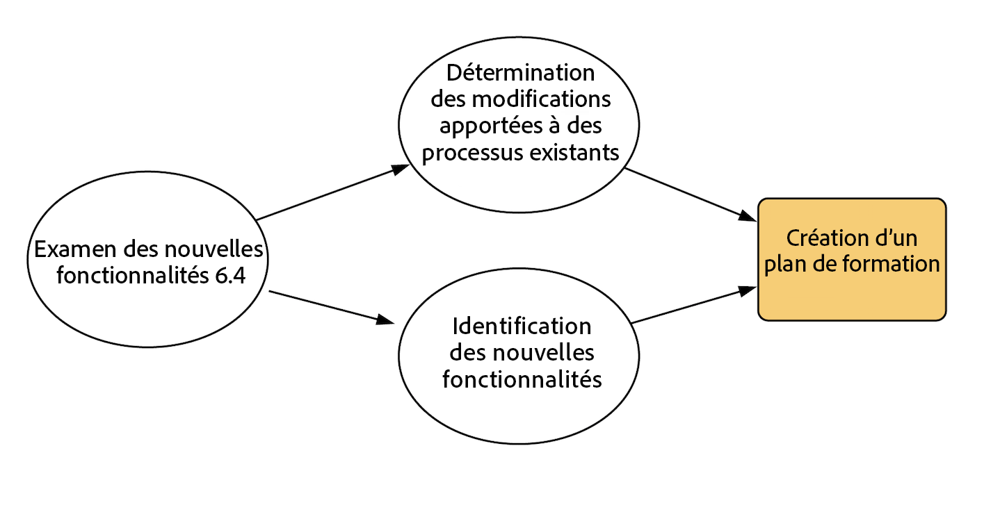
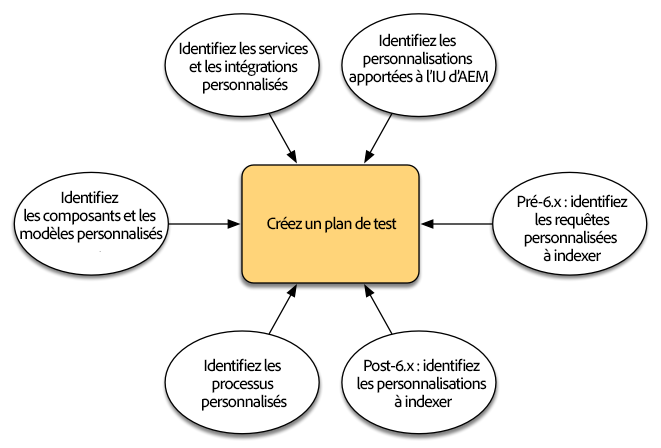
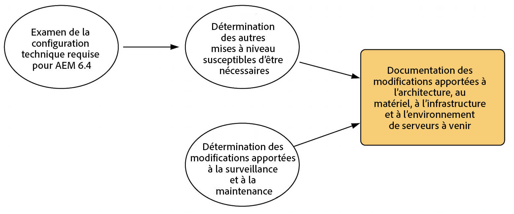
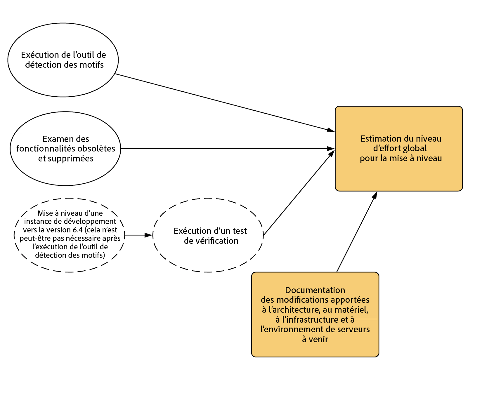
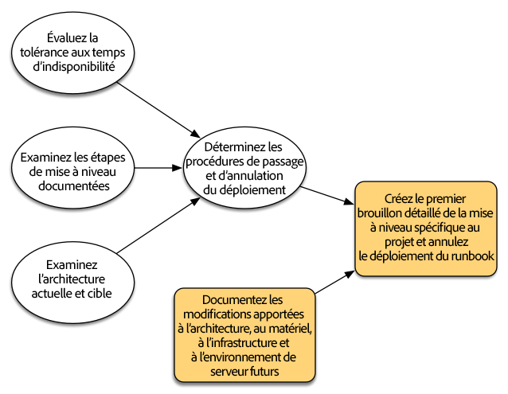
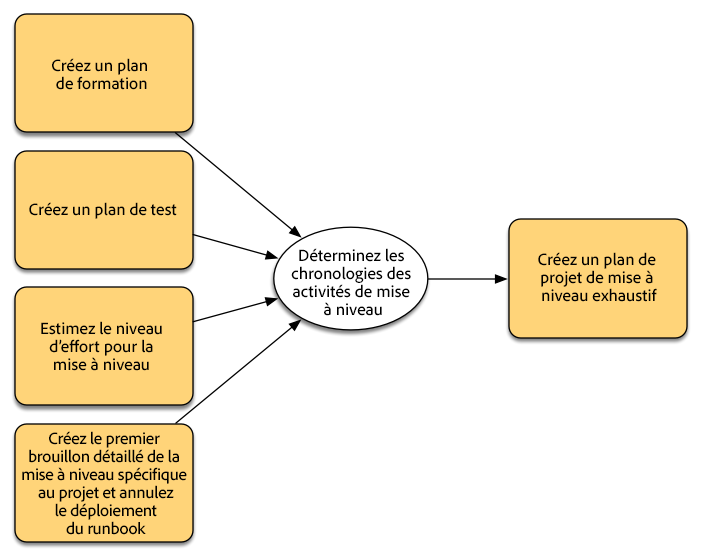
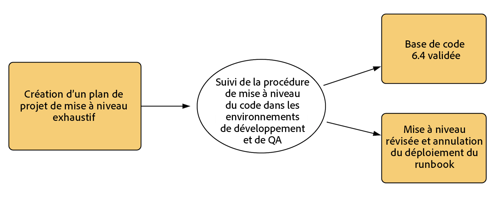
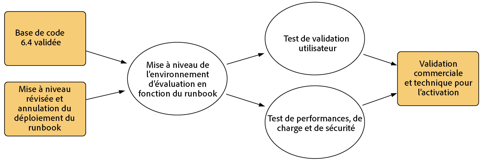

# Planification de la mise à niveau{#planning-your-upgrade}

>[!CAUTION]
>
>AEM 6.4 a atteint la fin de la prise en charge étendue et cette documentation n’est plus mise à jour. Pour plus d’informations, voir notre [période de support technique](https://helpx.adobe.com/fr/support/programs/eol-matrix.html). Rechercher les versions prises en charge [here](https://experienceleague.adobe.com/docs/?lang=fr).

## Présentation AEM projet {#aem-project-overview}

AEM est souvent utilisé dans des déploiements à fort impact qui peuvent servir des millions d’utilisateurs. Dans la plupart des cas, des applications personnalisées sont déployées sur les instances, ce qui ajoute à la complexité. Tout effort de mise à niveau d’un tel déploiement doit être géré méthodiquement.

Ce guide permet de définir des objectifs, des phases et des livrables clairs lors de la planification de la mise à niveau. Il se concentre sur l’exécution globale du projet et sur les directives. Bien qu’il donne un aperçu des étapes de mise à niveau, il se réfère aux ressources techniques disponibles le cas échéant. Il doit être utilisé conjointement avec les ressources techniques disponibles auxquelles il est fait référence dans le document.

Le processus de mise à niveau d’AEM nécessite une gestion attentive des phases de planification, d’analyse et d’exécution, avec des éléments livrables clés définis pour chaque phase.

Notez qu’il est possible d’effectuer directement la mise à niveau des versions AEM 6.0 et ultérieures vers la version 6.4. Les clients utilisant AEM 5.6.x ou une version antérieure doivent d’abord effectuer la mise à niveau vers AEM 6.0 ou une version ultérieure, la version 6.0 (SP3) étant celle recommandée. En outre, le nouveau format OAK Segment Tar est désormais utilisé pour le magasin de noeuds de segments depuis la version 6.3, et la migration du référentiel vers ce nouveau format est obligatoire, même pour les versions 6.0, 6.1 et 6.2.

>[!CAUTION]
>
>Si vous effectuez une mise à niveau d’AEM 6.2 vers AEM 6.3, vous devez effectuer la mise à niveau à partir des versions (**6.2-SP1-CFP1 - 6.2-SP1-CFP12.1**) ou des versions **6.2-SP1-CFP15** et ultérieures. Dans le cas contraire, si vous **effectuez une mise à niveau de 6.2-SP1-CFP13/6.2-SP1CFP14** vers AEM 6.3, vous devez également effectuer une mise à niveau vers la version **6.3.2.2**. Sinon, AEM Sites échouerait après la mise à niveau.

## Portée et exigences de la mise à niveau {#upgrade-scope-requirements}

Vous trouverez ci-dessous une liste des zones affectées par un projet de mise à niveau AEM type :

<table> 
 <tbody>
  <tr>
   <td><strong>Composant</strong></td> 
   <td><strong>Impact</strong></td> 
   <td><strong>Description</strong></td> 
  </tr>
  <tr>
   <td>Système d’exploitation</td> 
   <td>Effets incertains mais subtils</td> 
   <td>Au moment de la mise à niveau de l’AEM, il peut également être temps de mettre à niveau le système d’exploitation, ce qui peut avoir un impact.</td> 
  </tr>
  <tr>
   <td>Java Runtime</td> 
   <td>Impact modéré</td> 
   <td>AEM 6.3 requiert JRE 1.7.x (64 bits) ou une version ultérieure. JRE 1.8 est la seule version actuellement prise en charge par Oracle.</td> 
  </tr>
  <tr>
   <td>Matériel</td> 
   <td>Impact modéré</td> 
   <td>Le nettoyage des révisions en ligne est gratuit.  espace disque égal à 25 % de la taille du référentiel et 15 % de l’espace de tas libre  pour terminer correctement. Vous devrez peut-être mettre à niveau votre matériel vers  assurer des ressources suffisantes pour le nettoyage des révisions en ligne jusqu’à ce qu’elles soient entièrement  exécutez. En outre, si vous effectuez une mise à niveau à partir d’une version antérieure à AEM 6, la fonction  Il peut s’agir d’exigences de stockage supplémentaires.</td> 
  </tr>
  <tr>
   <td>Référentiel de contenu (CRX ou Oak)</td> 
   <td>Impact élevé</td> 
   <td>À partir de la version 6.1, AEM ne prend pas en charge CRX2. Par conséquent, une migration vers  Oak (CRX3) est requis si vous effectuez une mise à niveau à partir d’une ancienne version. AEM 6.3 a mis en place un nouvel entrepôt de nœuds de segments qui requiert également une migration.   Le  L’outil crx2oak est utilisé à cet effet.</td> 
  </tr>
  <tr>
   <td>AEM Composants/Contenu</td> 
   <td>Impact modéré</td> 
   <td><code>/libs</code> et <code>/apps</code> sont facilement gérés par la mise à niveau, mais <code>/etc</code> requiert généralement quelques interventions manuelles au niveau des personnalisations.</td> 
  </tr>
  <tr>
   <td>Services AEM</td> 
   <td>Impact faible</td> 
   <td>La plupart des services principaux AEM sont testés pour la mise à niveau. C'est une zone à faible impact.</td> 
  </tr>
  <tr>
   <td>Services d’application personnalisés</td> 
   <td>Impact faible à élevé</td> 
   <td>Selon l’application et la personnalisation, il peut y avoir  les dépendances sur JVM, les versions du système d’exploitation et certaines dépendances d’indexation ;  change, car les index ne sont pas générés automatiquement dans Oak.</td> 
  </tr>
  <tr>
   <td>Contenu d’application personnalisé</td> 
   <td>Impact faible à élevé</td> 
   <td>Le contenu qui ne sera pas géré par la mise à niveau peut être sauvegardé.  avant la mise à niveau, puis revenez dans le référentiel.  La plupart du contenu peut être géré à l’aide de l’outil de migration.</td> 
  </tr>
 </tbody>
</table>

Il est important de vous assurer que vous exécutez un système d’exploitation pris en charge, le runtime Java, httpd et la version de Dispatcher. Pour plus d’informations, voir la page [Exigences techniques d’AEM 6.4](/help/sites-deploying/technical-requirements.md). La mise à niveau de ces composants doit être prise en compte dans le plan de votre projet et doit avoir lieu avant la mise à niveau d’AEM.

## Phases du projet {#project-phases}

Beaucoup de travail est fait pour planifier et exécuter une mise à niveau d&#39;AEM. En vue de clarifier les différents efforts du processus, nous avons divisé les exercices de planification et d’exécution en des phases distinctes. Dans les sections ci-dessous, chaque phase génère un livrable souvent exploité par une phase ultérieure du projet.

### Planification de la formation des auteurs {#planning-for-author-training}

Dans toute nouvelle version, d’éventuelles modifications de l’interface utilisateur et des workflows utilisateur peuvent être introduites. En outre, les nouvelles versions introduisent de nouvelles fonctionnalités qui peuvent être utiles à l’entreprise. Nous vous recommandons de passer en revue les modifications fonctionnelles qui ont été introduites et d’organiser un plan pour former vos utilisateurs à les exploiter efficacement.

Les nouvelles fonctionnalités d’AEM 6.4 sont présentées dans [la section AEM d’adobe.com](/help/release-notes/release-notes.md). Veillez à noter toute modification apportée aux interfaces utilisateur ou aux fonctionnalités de produit couramment utilisées dans votre entreprise. Au fur et à mesure que vous examinez les nouvelles fonctionnalités, prenez également note de celles qui peuvent être utiles à votre organisation. Après avoir étudié les changements d’AEM 6.4, élaborez un plan de formation pour vos auteurs. Cela peut impliquer l’exploitation de ressources disponibles, telles que les vidéos du site d’aide ou la formation proposée via [les services d’apprentissage Adobe Digital](https://www.adobe.com/training.html).

### Création d’un plan de test {#creating-a-test-plan}

La mise en oeuvre de l’AEM par chaque client est unique et a été personnalisée pour répondre aux besoins de son entreprise. Par conséquent, il est important de déterminer toutes les personnalisations qui ont été apportées au système afin qu’elles puissent être incluses dans un plan de test. Ce plan de test alimente le processus d’assurance qualité que nous effectuons sur l’instance mise à niveau.

L’environnement de production exact doit être dupliqué et le test doit y être effectué après la mise à niveau pour s’assurer que toutes les applications et le code personnalisé s’exécutent toujours selon vos besoins. Vous devez régresser toute votre personnalisation et exécuter les tests de performances, de chargement et de sécurité. Lors de l’organisation de votre plan de test, veillez à couvrir toutes les personnalisations apportées au système en plus des interfaces utilisateur et des workflows prêts à l’emploi qui sont utilisés dans vos opérations quotidiennes. Il peut s’agir de services et servlets OSGI personnalisés, d’intégrations à Adobe Marketing Cloud, d’intégrations à des tiers par le biais de connecteurs d’AEM, d’intégrations tierces personnalisées, de composants et de modèles personnalisés, de superpositions d’interface utilisateur personnalisées dans AEM et de workflows personnalisés. Pour les clients effectuant la migration à partir d’une version antérieure à AEM 6, toutes les requêtes personnalisées doivent être analysées, car elles peuvent nécessiter une indexation. Pour les clients qui utilisent déjà une version 6.x d’AEM, ces requêtes doivent toujours être testées afin de s’assurer que leurs index continuent à fonctionner efficacement après la mise à niveau.

### Détermination des changements d’architecture et d’infrastructure nécessaires {#determining-architectural-and-infrastructure-changes-needed}

Lors de la mise à niveau, il est possible que vous deviez également mettre à niveau d’autres composants de votre pile technique, tels que le système d’exploitation ou la JVM. En outre, il est possible qu’en raison de modifications de la composition du référentiel, un matériel supplémentaire soit nécessaire. Cela concerne généralement uniquement les clients effectuant la migration à partir d’instances antérieures à la version 6.x, mais il est important de le prendre en compte. Enfin, il se peut que des modifications soient nécessaires à vos pratiques opérationnelles, notamment les processus de surveillance, de maintenance, de sauvegarde et de reprise sur sinistre.

Passez en revue les exigences techniques pour AEM 6.4 et vérifiez si votre logiciel et votre matériel actuels sont suffisants. Pour connaître les modifications possibles de vos processus opérationnels, consultez les documents suivants :

**Surveillance et maintenance :**

[Tableau de bord des opérations](/help/sites-administering/operations-dashboard.md)

[Bonnes pratiques en matière de surveillance des ressources](/help/assets/assets-monitoring-best-practices.md)

[Contrôle des ressources de serveur à l’aide de la console JMX](/help/sites-administering/jmx-console.md)

[Nettoyage de révision](/help/sites-deploying/revision-cleanup.md)

**Sauvegarde/restauration et reprise sur sinistre :**

[Sauvegarde et restauration](/help/sites-administering/backup-and-restore.md)

[Performance et évolutivité](/help/sites-deploying/performance.md)

[Exécution d’AEM avec TarMK Cold Standby](/help/sites-deploying/tarmk-cold-standby.md)

#### Observations relatives à la restructuration du contenu {#content-restructuring-considerations}

AEM version 6.4 a introduit des modifications à la structure du référentiel qui aideront à rendre les mises à niveau plus transparentes. Cela consiste notamment à déplacer le contenu du dossier /etc vers les dossiers /libs, /apps et /content, selon que le contenu appartient à Adobe ou à un client, ce qui limite les risques d’écrasement du contenu au cours des publications. La restructuration du référentiel a été effectuée de manière à ne pas nécessiter de modifications du code au moment de la mise à niveau vers la version 6.4, bien qu’il soit recommandé de consulter les détails à l’adresse [Restructuration des référentiels dans AEM 6.4](/help/sites-deploying/repository-restructuring.md) lors de la planification d’une mise à niveau.

### Évaluation de la complexité de la mise à niveau {#assessing-upgrade-complexity}

En raison de la grande variété de la quantité et de la nature des personnalisations que nos clients appliquent à leurs environnements AEM, il est important de passer un certain temps à déterminer le niveau d’effort global attendu dans votre mise à niveau.

Il existe deux approches pour évaluer la complexité de la mise à niveau. Une phase préliminaire peut simplement utiliser le nouvel outil de détection des motifs disponible pour être exécuté sur vos instances AEM 6.1, 6.2 et 6.3. Le détecteur de motifs est le moyen le plus simple d’évaluer la complexité globale de la mise à niveau à prévoir à l’aide des modèles signalés. Le rapport de l’outil de détection des motifs comprend des motifs permettant d’identifier les API indisponibles utilisées par le code base personnalisé (cela a été effectué à l’aide des vérifications de compatibilité avant la mise à niveau dans la version 6.3).

Une fois l’évaluation initiale terminée, une procédure plus approfondie consiste à effectuer une mise à niveau sur une instance de test et à réaliser quelques tests de vérification. Adobe en propose également quelques. En outre, la liste de [fonctionnalités obsolètes et supprimées](/help/release-notes/deprecated-removed-features.md) doit être passée en revue, non seulement pour la version vers laquelle la mise à niveau va être effectuée, mais aussi pour toutes versions entre vos versions source et cible. Par exemple, si vous passez d’AEM 6.2 à 6.4, il est important de passer en revue les fonctionnalités supprimées et obsolètes d’AEM 6.3 en plus de celles d’AEM 6.4.

L’outil de détection des motifs introduit dans la version 6.4 doit vous donner une estimation assez précise de ce à quoi vous vous attendez lors d’une mise à niveau dans la plupart des cas. Cependant, pour les personnalisations et déploiements plus complexes comportant des modifications incompatibles, vous pouvez mettre à niveau une instance vers AEM 6.4 conformément aux instructions de la section [Exécution d’une mise à niveau statique](/help/sites-deploying/in-place-upgrade.md). Une fois l’opération terminée, effectuez un test de vérification de haut niveau dans cet environnement. L’objectif de cet exercice n’est pas d’épuiser l’inventaire exhaustif des scénarios de tests et de développer un inventaire formel des éléments défectueux, mais de donner une estimation approximative de la quantité de travail requise pour mettre à niveau le code pour assurer la compatibilité avec la version 6.4. Lorsqu’elle est combinée avec la variable [Détection de motifs](/help/sites-deploying/pattern-detector.md) et les changements architecturaux déterminés dans la section précédente, une estimation approximative peut être fournie à l’équipe de gestion de projet pour la planification de l’upgrade.

### Création du runbook de mise à niveau et de restauration {#building-the-upgrade-and-rollback-runbook}

Bien qu’Adobe ait documenté le processus de mise à niveau d’une instance AEM, la mise en page du réseau, l’architecture de déploiement et les personnalisations de chaque client nécessiteront d’affiner et de personnaliser cette approche. C’est pourquoi nous vous encourageons à passer en revue toute la documentation que nous avons fournie et à l’utiliser pour informer un runbook spécifique au projet qui décrit les procédures de mise à niveau et de restauration spécifiques que vous allez suivre dans votre environnement. Si vous effectuez une mise à niveau à partir de CRX2, veillez à évaluer la durée de migration du contenu lors du passage de CRX2 à Oak. Pour les référentiels volumineux, cela peut être important.

Nous vous présentons les procédures de restauration et de mise à niveau dans la section [Procédure de mise à niveau](/help/sites-deploying/upgrade-procedure.md), ainsi que la marche à suivre pour appliquer la mise à niveau lorsque vous effectuez une [mise à niveau statique](/help/sites-deploying/in-place-upgrade.md). Ces instructions doivent être examinées et prises en compte avec l’architecture de votre système, les personnalisations et la tolérance aux temps d’arrêt afin de déterminer les procédures de basculement et de restauration appropriées que vous exécuterez lors de la mise à niveau. Toute modification de l’architecture ou des tailles de serveur doit être incluse lors de la rédaction de votre runbook personnalisé. Il est important de noter que ceci doit être traité comme une première version préliminaire. Pendant que votre équipe termine le contrôle qualité et les cycles de développement, et déploie la mise à niveau sur l’environnement d’évaluation, il est problable que vous ayez besoin de prendre des mesures supplémentaires. Idéalement, ce document doit contenir suffisamment d’informations pour que, s’il était transmis à un membre de votre personnel d’exploitation, celui-ci puisse effectuer entièrement l’upgrade à partir des informations contenues dans le document.

### Développement d’un plan de projet {#developing-a-project-plan}

Nous pouvons utiliser les résultats des exercices précédents pour créer un plan de projet qui couvre les calendriers prévus pour nos efforts de test ou de développement, la formation et l’exécution réelle de la mise à niveau.

Un plan de projet complet doit comprendre les éléments suivants :

* La finalisation du développement et des plans de tests

* La mise à niveau du développement et des environnements de contrôle qualité

* La mise à niveau de la base de code personnalisé pour AEM 6.4

* Un test de contrôle qualité et une période de mise au point

* Une mise à niveau de l’environnement d’évaluation

* Un test de l’intégration, de la performance et du chargement

* La certification de l’environnement

* Go live

### Exécution du développement et de l’assurance qualité {#performing-development-and-qa}

Nous proposons des procédures pour que la[ mise à niveau du code et des personnalisations](/help/sites-deploying/upgrading-code-and-customizations.md) soit compatible avec AEM 6.4. Pendant l’exécution de ce processus itératif, le runbook doit être modifié selon les besoins. Consultez également la section [Compatibilité descendante dans AEM 6.4](/help/sites-deploying/backward-compatibility.md) pour savoir comment conserver la rétrocompatibilité de vos personnalisations sans qu’il faille procéder, dans la plupart des cas, à un développement juste après la mise à niveau.

Le processus de développement et de test est généralement itératif. En raison des personnalisations, les modifications apportées pendant la mise à niveau peuvent rendre toute une section du produit inutilisable. Une fois que les développeurs ont traité la cause du problème et que l’équipe de test a accès à ces fonctionnalités, il est possible de découvrir d’autres problèmes. À mesure que des problèmes qui nécessitent des ajustements au processus de mise à niveau sont découverts, veillez à les ajouter à votre runbook de mise à niveau personnalisé. Après plusieurs itérations de test et de correction, la base de code doit être entièrement validée et prête à être déployée dans l’environnement d’évaluation.

### Test final {#final-testing}

Nous vous recommandons de passer un dernier cycle de tests une fois que le code base a été certifié par l’équipe d’assurance qualité de votre entreprise. Ce cycle de tests implique la validation de votre runbook dans un environnement d’évaluation suivi de séries de tests d’acceptation par l’utilisateur, de performances et de sécurité.

Cette étape est essentielle, car c’est la seule fois où vous pouvez valider les étapes du runbook par rapport à un environnement de type production. Une fois l’environnement mis à niveau, il est important de laisser aux utilisateurs finaux un certain temps pour se connecter et passer par les activités qu’ils effectuent lorsqu’ils utilisent le système dans leurs activités quotidiennes. Il n’est pas rare que les utilisateurs exploitent une partie du système qui n’était pas précédemment prise en compte. Trouver et corriger les problèmes dans ces zones avant la mise en service peut aider à éviter des pannes de production coûteuses. Comme une nouvelle version d’AEM contient des modifications importantes de la plateforme sous-jacente, il est également important d’effectuer des tests de performance, de charge et de sécurité sur le système comme si nous l’avions lancé pour la première fois.

### Exécution de la mise à niveau {#performing-the-upgrade}

Une fois que l’approbation finale a été reçue de toutes les parties prenantes, il est temps de l’exécuter sur les procédures du runbook qui ont été définies. Les étapes de mise à niveau et de restauration ont été présentées dans la section [Procédure de mise à niveau](/help/sites-deploying/upgrade-procedure.md) et les étapes d’installation lors de la réalisation d’une [mise à niveau statique](/help/sites-deploying/in-place-upgrade.md). Cela sert de point de référence.

Nous avons indiqué quelques étapes dans les instructions de mise à niveau pour la validation de l’environnement. Il s’agit notamment de vérifications de base, comme l’analyse des journaux de mise à niveau et la vérification que tous les lots OSGi ont correctement démarré. Nous vous recommandons également de procéder à la validation avec vos propres cas de test en fonction de vos processus d’entreprise. Nous vous recommandons également de vérifier le planning du nettoyage des révisions en ligne AEM et les routines associées afin de vous assurer qu’elles se produisent pendant une période calme pour votre entreprise. Ces routines sont essentielles à la performance à long terme de l&#39;AEM.
