# Procédure de mise à niveau{#upgrade-procedure}

>[!CAUTION]
>
>AEM 6.4 a atteint la fin de la prise en charge étendue et cette documentation n’est plus mise à jour. Pour plus d’informations, voir notre [période de support technique](https://helpx.adobe.com/fr/support/programs/eol-matrix.html). Rechercher les versions prises en charge [here](https://experienceleague.adobe.com/docs/?lang=fr).

>[!NOTE]
>
>La mise à niveau nécessite un temps d’arrêt pour le niveau Auteur, car la plupart des mises à niveau AEM sont effectuées sur place. En suivant ces bonnes pratiques, le temps d’arrêt du niveau Publication peut être réduit ou éliminé.

Lors de la mise à niveau de vos environnements AEM, vous devez tenir compte des différences d’approche entre la mise à niveau des environnements de création ou de publication afin de minimiser les temps d’arrêt pour vos auteurs et vos utilisateurs finaux. Cette page décrit la procédure de haut niveau pour mettre à niveau une topologie AEM en cours d’exécution sur une version d’AEM 6.x. Le processus étant différent entre les niveaux Auteur et Publication, ainsi que les déploiements basés sur Mongo et TarMK, chaque niveau et micro-noyau a été répertorié dans une section distincte. Lors de l’exécution de votre déploiement, nous vous recommandons d’abord de mettre à niveau votre environnement de création, de déterminer la réussite, puis de passer aux environnements de publication.

## Niveau de création TarMK {#tarmk-author-tier}

### Démarrage de la topologie {#starting-topology}

La topologie utilisée pour cette section consiste en un serveur d’auteur s’exécutant sur TarMK avec un Secondaire Cold. La réplication se produit du serveur d’auteur à la ferme de publication TarMK. Bien qu’elle ne soit pas illustrée ici, cette approche peut également être utilisée pour les déploiements qui utilisent le déchargement. Veillez à mettre à niveau ou à recréer l’instance de déchargement sur la nouvelle version après avoir désactivé les agents de réplication sur l’instance d’auteur et avant de les réactiver.

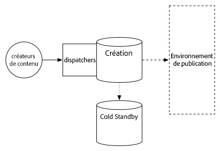

### Préparation de la mise à niveau {#upgrade-preparation}

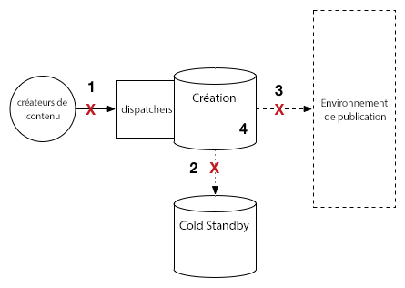

1. Arrêtez la création de contenu.
1. Arrêtez l’instance de secours.
1. Désactivez les agents de réplication sur l’auteur.
1. Exécutez la variable [tâches de maintenance préalables à la mise à niveau](/help/sites-deploying/pre-upgrade-maintenance-tasks.md).

### Exécution de la mise à niveau {#upgrade-execution-1}

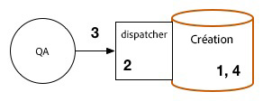

1. Exécutez la [mise à niveau sur place](/help/sites-deploying/in-place-upgrade.md).
1. Mettez à jour le module du Dispatcher *si nécessaire*.
1. Le contrôle qualité valide la mise à niveau.
1. Fermez l’instance d’auteur.

### En cas de réussite {#if-successful}

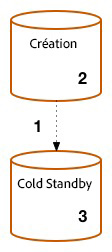

1. Copiez l’instance mise à niveau pour créer une nouvelle instance Cold Standby.
1. Lancez l’instance d’auteur.
1. Démarrez l’instance de secours.

### En cas d’échec (restauration) {#if-unsuccessful-rollback}

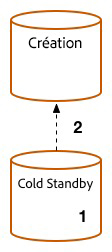

1. Démarrez l’instance Cold Standby en tant que nouvelle instance principale.
1. Recréez l’environnement de création depuis l’instance Cold Standby.

## Grappe d’auteurs MongoMK {#mongomk-author-cluster}

### Démarrage de la topologie {#starting}

La topologie supposée de cette section est constituée d’un cluster d’auteur MongoMK avec au moins deux instances d’auteur AEM, prises en charge par au moins deux bases de données MongoMK. Toutes les instances d’auteur partagent une banque de données. Ces étapes doivent s’appliquer aux entrepôts de données S3 et File. La réplication se produit des serveurs d’auteur à la ferme de publication TarMK.

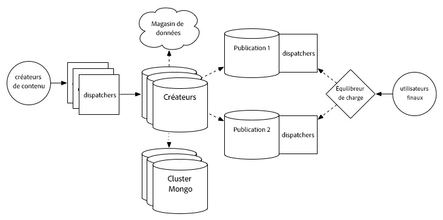

### Préparation de la mise à niveau {#preparation}

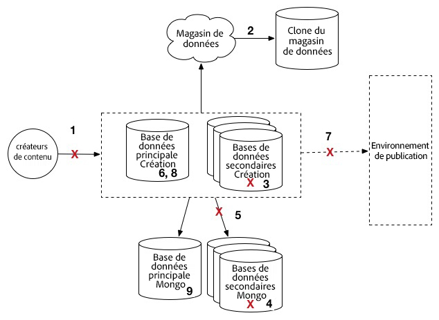

1. Arrêtez la création de contenu.
1. Clonez le magasin de données pour la sauvegarde.
1. Arrêtez toutes les instances d’auteur AEM sauf une, votre instance d’auteur principale.
1. Conservez uniquement un nœud MongoDB du jeu de réplication, votre instance Mongo principale.
1. Mettez à jour le fichier `DocumentNodeStoreService.cfg` sur l’auteur principal pour qu’il reflète votre jeu de réplication à un seul membre.
1. Redémarrez l’auteur principal pour vous assurer qu’il redémarre correctement.
1. Désactivez les agents de réplication sur l’auteur principal.
1. Exécutez les [tâches de maintenance avant la mise à niveau](/help/sites-deploying/pre-upgrade-maintenance-tasks.md) sur l’instance d’auteur principale.
1. Si nécessaire, mettez à niveau MongoDB vers la version 3.2 sur l’instance principale Mongo avec WiredTiger.

### Exécution de la mise à niveau {#execution}

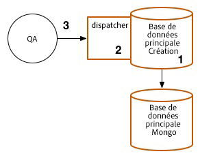

1. Exécutez une [mise à niveau sur place](/help/sites-deploying/in-place-upgrade.md) sur l’auteur principal.
1. Mettez à jour le Dispatcher ou le module web *si nécessaire*.
1. Le contrôle qualité valide la mise à niveau.

### En cas de réussite {#successful-1}

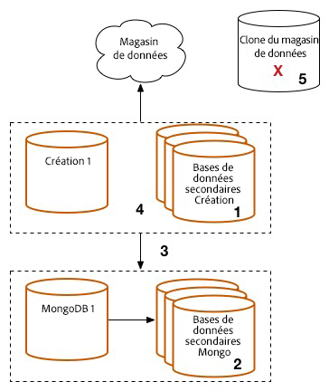

1. Créez de nouvelles instances d’auteur 6.3, connectées à votre instance de mise à niveau Mongo.
1. Recréez les nœuds MongoDB qui ont été supprimés du cluster.
1. Mettez à jour les fichiers `DocumentNodeStoreService.cfg` pour qu’ils reflètent le jeu de réplication complet.
1. Redémarrez les instances d’auteur, une par une.
1. Supprimez les magasin de données clonés.

### En cas d’échec (restauration)  {#if-unsuccessful}

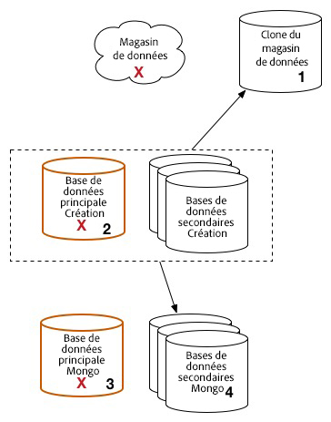

1. Reconfigurez les instances d’auteur secondaires pour établir la connexion au magasin de données cloné.
1. Désactivez l’instance d’auteur principale mise à niveau.
1. Désactivez l’instance principale Mongo mise à niveau.
1. Démarrez les instances secondaires Mongo, l’une d’entre elles faisant office d’instance principale.
1. Configurez les fichiers `DocumentNodeStoreService.cfg` sur les instances d’auteur secondaires pour indiquer l’ensemble de réplication des instances Mongo qui ne sont pas encore mises à niveau.
1. Démarrez les instances d’auteur secondaires.
1. Nettoyez les instances d’auteur mises à niveau, le noeud Mongo et l’entrepôt de données.

## Ferme de publication TarMK {#tarmk-publish-farm}

### Ferme de publication TarMK {#publish-farm}

La topologie supposée de cette section est composée de deux instances de publication TarMK, devant lesquelles les dispatchers sont eux-mêmes devancés par un équilibreur de charge. La réplication se produit du serveur de création à la ferme de publication TarMK.

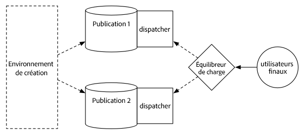

### Exécution de la mise à niveau {#execution-upgrade}

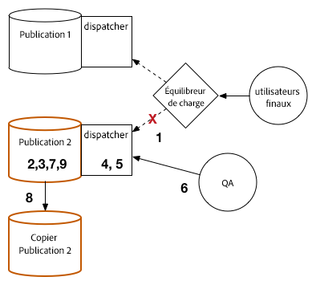

1. Arrêtez le trafic de l’instance de publication 2 à l’équilibreur de charge.
1. Exécutez la [maintenance d’avant mise à jour](/help/sites-deploying/pre-upgrade-maintenance-tasks.md) sur l’instance de publication 2.
1. Exécutez [la mise à jour sur place](/help/sites-deploying/in-place-upgrade.md) sur l’instance de publication 2.
1. Mettez à jour le Dispatcher ou le module web *si nécessaire*.
1. Videz le cache du Dispatcher.
1. Le contrôle qualité valide l’instance de publication 2 via le Dispatcher, derrière le pare-feu.
1. Désactivez l’instance de publication 2.
1. Copiez l’instance de publication 2.
1. Démarrez l’instance de publication 2.

### En cas de réussite {#successful-2}

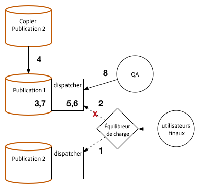

1. Activez le trafic vers l’instance de publication 2.
1. Arrêtez le trafic vers l’instance de publication 1.
1. Arrêtez l’instance de publication 1.
1. Remplacez l’instance de publication 1 avec une copie de l’instance de publication 2.
1. Mettez à jour le Dispatcher ou le module web *si nécessaire*.
1. Videz le cache du Dispatcher pour l’instance de publication 1.
1. Démarrez l’instance de publication 1.
1. Le contrôle qualité valide l’instance de publication 1 via le Dispatcher, derrière le pare-feu.

### En cas d’échec (restauration) {#rollback}

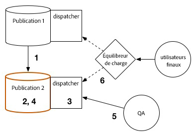

1. Créez une copie de l’instance de publication 1.
1. Remplacez l’instance de publication 2 avec une copie de l’instance de publication 1.
1. Videz le cache du Dispatcher pour l’instance de publication 2.
1. Démarrez l’instance de publication 2.
1. Le contrôle qualité valide l’instance de publication 2 via le Dispatcher, derrière le pare-feu.
1. Activez le trafic vers l’instance de publication 2.

## Dernières étapes de mise à niveau {#final-upgrade-steps}

1. Activez le trafic vers l’instance de publication 1.
1. Le contrôle qualité procède à la validation finale à partir d’une URL publique
1. Activez les agents de réplication de l’environnement de création.
1. Reprenez la création de contenu.
1. Effectuez les [vérifications d’après mise à niveau](/help/sites-deploying/post-upgrade-checks-and-troubleshooting.md).

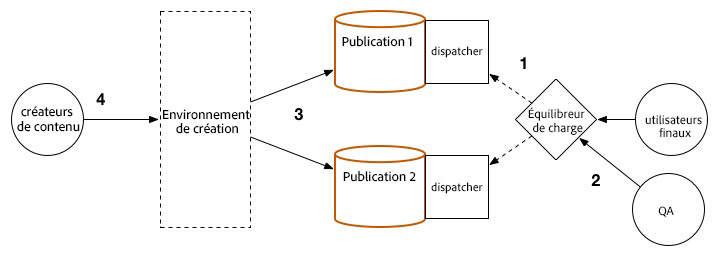
