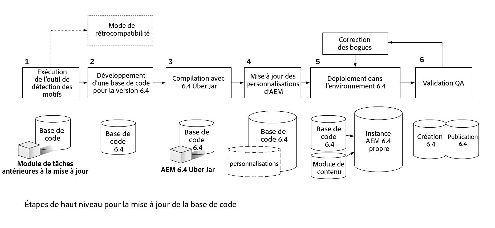

# Mettre à jour le code et les personnalisations{#upgrading-code-and-customizations}

>[!CAUTION]
>
>AEM 6.4 a atteint la fin de la prise en charge étendue et cette documentation n’est plus mise à jour. Pour plus d’informations, voir notre [période de support technique](https://helpx.adobe.com/fr/support/programs/eol-matrix.html). Rechercher les versions prises en charge [here](https://experienceleague.adobe.com/docs/?lang=fr).

Lors de la planification d’une mise à niveau, les aspects suivants d’une mise en oeuvre doivent être étudiés et résolus.

* [Mise à niveau de la base de code](#upgrade-code-base)
* [Alignement avec la structure de référentiel de la version 6.4](#align-repository-structure)
* [Personnalisations d’AEM](#aem-customizations)
* [Procédure de test](#testing-procedure)

## Présentation {#overview}

1. **Outil de détection des motifs** - Exécutez le détecteur de motifs comme décrit dans la planification de la mise à niveau et décrit en détail [cette page](/help/sites-deploying/pattern-detector.md) pour obtenir un rapport de détecteur de motifs qui contient plus de détails sur les zones qui doivent être traitées en plus des API/bundles indisponibles dans la version cible d’AEM. Le rapport Détection des motifs doit vous donner une indication des incompatibilités de votre code. S’il n’en existe aucune, votre déploiement est déjà compatible avec la version 6.4, vous pouvez tout de même choisir d’effectuer un nouveau développement pour utiliser la fonctionnalité 6.4, mais vous n’en avez pas besoin uniquement pour des raisons de compatibilité. S’il est fait état d’incompatibilités, vous pouvez soit a) Lancer l’exécution en mode de compatibilité et différer l’intégration des nouvelles fonctionnalités de la version 6.4 ou de sa compatibilité, soit b) Décider de procéder au développement après la mise à niveau, et passer à l’étape 2. Pour plus d’informations, consultez la section [Compatibilité descendante dans AEM 6.4.](/help/sites-deploying/backward-compatibility.md)

1. **Développement de la base de code pour la version 6.4** - Créez une branche ou un référentiel dédié à la base de code de la version cible. Utilisez les informations de la compatibilité avant la mise à niveau pour prévoir les zones de code à mettre à jour.
1. **Compilation avec du jar Uber 6.4** - Mettez à jour les POM de la base de code pour qu’ils pointent vers la version 6.4 uber jar et compilez le code à cet effet.
1. **Mise à jour AEM personnalisations** - Toutes les personnalisations ou extensions à AEM doivent être mises à jour/validées pour fonctionner dans la version 6.4 et ajoutées à la base de code 6.4. Comprend des formulaires de recherche d’interface utilisateur, des personnalisations de ressources, tout élément utilisant /mnt/overlay.

1. **Déploiement vers l’environnement 6.4** - Une instance AEM 6.4 nette (auteur + publication) doit être conservée dans un environnement Dev/QA. La base de code à jour et un échantillon représentatif de contenu (de l’exploitation actuelle) doivent être déployés.
1. **Validation du contrôle qualité et correction des bogues** - Le contrôle qualité doit valider l’application sur les instances d’auteur et de publication de la version 6.4. Tous les problèmes détectés doivent être corrigés et intégrés dans la base de code 6.4. Répétez Dev-Cycle si nécessaire jusqu’à ce que tous les bogues soient corrigés.

Avant de procéder à une mise à niveau, vous devez disposer d’une base de code d’application stable qui a été soigneusement testée par rapport à la version cible d’AEM. Sur la base des observations effectuées dans le test, il peut y avoir des moyens d’optimiser le code personnalisé. Cela peut inclure la refactorisation du code pour éviter de parcourir le référentiel, l’indexation personnalisée pour optimiser la recherche ou l’utilisation de noeuds non ordonnés dans JCR, entre autres.

Outre la possibilité de mettre à niveau votre base de code et vos personnalisations pour qu’elles fonctionnent avec la nouvelle version d’AEM, la version 6.4 permet de gérer plus efficacement vos personnalisations à l’aide de la fonctionnalité de compatibilité descendante, comme décrit dans la section [cette page](/help/sites-deploying/backward-compatibility.md).

Comme indiqué ci-dessus et dans le diagramme ci-dessous, le fait d’exécuter l’[outil de détection des motifs](/help/sites-deploying/pattern-detector.md) au cours de la première étape vous aide à évaluer la complexité globale de la mise à niveau et à déterminer si vous souhaitez exécuter le mode de compatibilité ou mettre à jour vos personnalisations afin d’utiliser toutes les nouvelles fonctionnalités d’AEM 6.4. Pour en savoir plus, consultez la page [Compatibilité descendante dans AEM 6.4.](/help/sites-deploying/backward-compatibility.md)
[ ](assets/upgrade-code-base-highlevel.png)

## Mise à niveau de la base de code {#upgrade-code-base}

### Création d’une branche spécifique pour la version 6.4 du code dans le contrôle de version  {#create-a-dedicated-branch-for-6-4-code-in-version-control}

Tous le code et toutes les configurations requis pour votre mise en oeuvre AEM doivent être gérés à l’aide d’une forme de contrôle de version. Une branche dédiée au contrôle de version doit être créée pour gérer les modifications nécessaires pour la base de code dans la version cible d’AEM. Les tests itératifs de la base de code par rapport à la version cible de AEM et les correctifs de bogues ultérieurs seront gérés dans cette branche.

### Mise à jour de la version AEM Uber Jar {#update-the-aem-uber-jar-version}

AEM Uber jar inclut toutes les API d’AEM en tant que dépendance unique dans le fichier `pom.xml` de votre projet Maven. Il est toujours recommandé d’inclure Uber Jar en tant que dépendance unique au lieu d’inclure les dépendances d’API d’AEM individuelles. Lors de la mise à niveau de la base de code, la version du fichier Uber Jar doit être modifiée pour pointer vers la version cible d’AEM. Si votre projet a été développé sur une version d’AEM antérieure à l’existence d’Uber Jar, toutes les dépendances d’API d’AEM individuelles doivent être supprimées et remplacées par une seule inclusion du fichier Uber Jar pour la version cible d’AEM. La base de code doit ensuite être recompilée par rapport à la nouvelle version du fichier Uber Jar. Toutes les API ou méthodes obsolètes doivent être mises à jour pour être compatibles avec la version cible d’AEM.

```
<dependency>
    <groupId>com.adobe.aem</groupId>
    <artifactId>uber-jar</artifactId>
    <version>6.4.0</version>
    <classifier>apis</classifier>
    <scope>provided</scope>
</dependency>
```

### Suppression de l’utilisation du résolveur de ressources d’administration {#phase-out-use-of-administrative-resource-resolver}

L’utilisation d’une session d’administration via `SlingRepository.loginAdministrative()` et `ResourceResolverFactory.getAdministrativeResourceResolver()` était très courante dans les bases de code avant AEM 6.0. Ces méthodes ont été déconseillées pour des raisons de sécurité, car elles offrent un niveau d’accès trop large. [Dans les versions futures de Sling, ces méthodes seront supprimées.](https://sling.apache.org/documentation/the-sling-engine/service-authentication.html#deprecation-of-administrative-authentication). Il est vivement recommandé de refactoriser tout code pour utiliser les utilisateurs du service à la place. Informations supplémentaires sur les utilisateurs de services et [Découvrez comment supprimer progressivement les sessions administratives ici](/help/sites-administering/security-service-users.md#how-to-phase-out-admin-sessions).

### Requêtes et index Oak {#queries-and-oak-indexes}

Toute utilisation de requêtes dans la base de code doit être minutieusement testée dans le cadre de la mise à niveau de la base de code. Pour les clients qui effectuent une mise à niveau à partir de Jackrabbit 2 (versions d’AEM antérieures à la version 6.0), cette opération est particulièrement importante, car Oak n’indexe pas le contenu automatiquement et des index personnalisés peuvent avoir besoin d’être créés. Si vous effectuez une mise à niveau à partir d’une version 6.x d’AEM, les définitions d’index Oak prêtes à l’emploi peuvent avoir changé et pourraient affecter les requêtes existantes.

Plusieurs outils d’analyse et d’inspection des performances des requêtes sont disponibles :

* [Outils d’index AEM](/help/sites-deploying/queries-and-indexing.md)

* [Outils de diagnostic des opérations - Performance des requêtes](/help/sites-administering/operations-dashboard.md#diagnosis-tools)

* [Oak Utils](https://oakutils.appspot.com/) Il s’agit d’un outil open source qui n’est pas géré par Adobe.

### Création d’interfaces utilisateur classiques {#classic-ui-authoring}

La création de l’IU classique est toujours disponible dans AEM 6.4, mais elle sera bientôt obsolète. Vous trouverez plus d’informations[ ici](/help/release-notes/deprecated-removed-features.md#pre-announcement-for-next-release). Si votre application s’exécute dans l’environnement de création de l’interface utilisateur classique, il est recommandé de la mettre à niveau vers AEM 6.4 et de continuer à utiliser l’interface utilisateur classique. La migration vers l’interface utilisateur optimisée pour les écrans tactiles peut ensuite être prévue en tant que projet distinct à effectuer sur plusieurs cycles de développement. Pour utiliser l’interface utilisateur classique dans la version 6.4, plusieurs configurations OSGi sont nécessaires pour être intégrées dans la base de code. Pour plus d’informations sur la façon de configurer cette fonction, cliquez [ici](/help/sites-administering/enable-classic-ui.md).

>[!NOTE]
>
>Pour vous aider à vous éloigner de l’interface utilisateur classique et à tirer parti des dernières technologies AEM, envisagez d’utiliser la variable [Outils de modernisation d’AEM](/help/sites-developing/modernization-tools.md) pour faciliter votre migration.

## Alignement avec la structure de référentiel de la version 6.4 {#align-repository-structure}

Pour faciliter les mises à niveau et s’assurer que les configurations ne soient pas remplacées au cours de celles-ci, le référentiel est restructuré dans la version 6.4 afin de séparer le contenu de la configuration.

Plusieurs paramètres doivent donc être déplacés afin de ne plus résider sous `/etc`, comme c’était le cas auparavant. Pour consulter l’ensemble des problèmes de restructuration de référentiel qui doivent être étudiés et résolus dans la mise à jour d’AEM 6.4, consultez la section [Restructuration de référentiel dans AEM 6.4](/help/sites-deploying/repository-restructuring.md).

## Personnalisations d’AEM  {#aem-customizations}

Toutes les personnalisations de l’environnement de création AEM dans la version source d’AEM doivent être identifiées. Une fois identifiées, il est recommandé de stocker chaque personnalisation dans le contrôle de version ou au minimum sauvegardée dans un package de contenu. Toutes les personnalisations doivent être déployées et validées dans le cadre d’un contrôle qualité ou un environnement d’évaluation exécutant la version cible d’AEM avant une mise à niveau d’exploitation.

### Superpositions en général {#overlays-in-general}

Il est courant d’étendre AEM fonctionnalité prête à l’emploi en superposant des noeuds et/ou des fichiers sous /libs avec des noeuds supplémentaires sous /apps. Ces recouvrements doivent être suivis dans le contrôle de version et testés par rapport à la version cible d’AEM. Si un fichier (qu’il s’agisse de JS, JSP ou HTL) est recouvert, il est recommandé de laisser un commentaire sur les fonctionnalités qui ont été améliorées pour simplifier les tests de régression sur la version cible d’AEM. Vous trouverez plus d’informations sur les superpositions en général [here](/help/sites-developing/overlays.md). Vous trouverez ci-dessous des instructions relatives à des incrustations d’AEM spécifiques.

### Mettre à niveau les formulaires de recherche personnalisés {#upgrading-custom-search-forms}

Les facettes de recherche personnalisées nécessitent quelques ajustements manuels après la mise à niveau pour fonctionner correctement. Pour en savoir plus, consultez la section [Mise à niveau des formulaires de recherche personnalisée](/help/sites-deploying/upgrading-custom-search-forms.md).

### Personnalisations de l’interface utilisateur d’Assets {#assets-ui-customizations}

>[!NOTE]
>
>Cette procédure n’est requise que pour les mises à niveau de versions antérieures à AEM 6.2.

Les instances qui ont des déploiements de ressources personnalisés doivent être préparées pour la mise à niveau. Cela est nécessaire pour garantir que tout le contenu personnalisé est compatible avec la nouvelle structure de noeuds de la version 6.4.

Vous pouvez préparer les personnalisations de l’interface utilisateur d’Assets en procédant comme suit :

1. Sur l’instance qui doit être mise à niveau, ouvrez le CRXDE Lite en accédant à `https://server:port/crx/de/index.jsp`

1. Accédez au nœud suivant :

   * `/apps/dam/content`

1. Renommez le nœud content en **content_backup**. Vous pouvez le faire en cliquant avec le bouton droit sur le volet d’exploration sur le côté gauche de la fenêtre, puis en sélectionnant **Renommer**.

1. Une fois que le nœud a été renommé, créez un nœud de contenu sous `/apps/dam` nommé **content** et définissez son type de nœud sur **Sling.Folder**.

1. Déplacez tous les nœuds enfants de **content_backup** vers le nœud content que vous venez de créer. Pour ce faire, cliquez avec le bouton droit de la souris sur chaque noeud enfant du volet d’exploration et sélectionnez **Déplacer**.

1. Supprimez la variable **content_backup** noeud .

1. Les nœuds mis à jour sous `/apps/dam` avec le type de nœud correct `sling:Folder` doivent idéalement être enregistrés dans le contrôle de version et déployés avec la base de code ou au moins être sauvegardés en tant que packages de contenu.

### Génération d’identifiants pour les ressources existantes {#generating-asset-ids-for-existing-assets}

Pour générer des identifiants pour les ressources existantes, mettez à jour les ressources en même temps que l’instance AEM pour exécuter la version 6.4. Cela nécessite d’activer la [fonctionnalité Assets Insights](/help/assets/touch-ui-asset-insights.md). Pour plus d’informations, voir [Ajout de code incorporé](/help/assets/touch-ui-using-page-tracker.md#adding-embed-code).

Pour mettre à niveau les ressources, configurez le package d’identifiants de ressources associé dans la console JMX. En fonction du nombre de ressources dans le référentiel, `migrateAllAssets` peut prendre beaucoup de temps. Selon nos tests internes, cela peut prendre environ une heure pour 125 000 ressources sur TarMK.


Si vous avez besoin de plusieurs identifiants de ressources pour un sous-ensemble de vos ressources totales, utilisez l’API `migrateAssetsAtPath`.

Pour tout autre objectif, utilisez l’API `migrateAllAssets()`

### Personnalisations de script InDesign {#indesign-script-customizations}

Adobe recommande de placer les scripts personnalisés à l’emplacement `/apps/settings/dam/indesign/scripts`. Vous trouverez plus d’informations sur les personnalisations des scripts d’InDesign [here](/help/assets/indesign.md#configuring-the-aem-assets-workflow).

### Récupération des configurations ContextHub {#recovering-contexthub-configurations}

Les configurations ContextHub sont effectuées par une mise à niveau. Des instructions sur la façon de récupérer les configurations ContextHub existantes sont disponibles [ici](/help/sites-administering/contexthub-config.md#recovering-contexthub-configurations-after-upgrading).

### Personnalisations des workflows {#workflow-customizations}

Il est courant de mettre à jour les workflows prêts à l’emploi pour ajouter ou supprimer des fonctionnalités inutiles. Un workflow qui est souvent personnalisé est le workflow Ressource de mise à jour de la gestion des ressources numériques. Tous les workflows nécessitant une implémentation personnalisée doivent être enregistrés et stockés dans le contrôle de version, car ils risquent d’être remplacés lors de la mise à niveau.

### Modèles modifiables {#editable-templates}

>[!NOTE]
>
>Cette procédure est requise uniquement pour les mises à niveau de Sites à l’aide de modèles modifiables à partir d’AEM 6.2.

La structure des modèles modifiables a changé entre AEM 6.2 et 6.3. Si vous effectuez une mise à niveau à partir de la version 6.2 ou antérieure et si le contenu de votre site est créé à l’aide de modèles modifiables, vous devez utiliser la variable [Outil de nettoyage des noeuds réactifs](https://github.com/Adobe-Marketing-Cloud/aem-sites-template-migration). L’outil est destiné à être exécuté. **_after_** une mise à niveau pour nettoyer le contenu. Il doit être exécuté sur les niveaux Auteur et Publication.

### Modifications de l’implémentation des CUG {#cug-implementation-changes}

L’implémentation des groupes d’utilisateurs fermés a considérablement changé pour répondre aux limites de performances et d’évolutivité des versions précédentes d’AEM. La version précédente du CUG a été abandonnée dans la version 6.3 et la nouvelle mise en oeuvre n’est prise en charge que dans l’interface utilisateur tactile. Si vous effectuez une mise à niveau à partir de la version 6.2 ou antérieure, vous trouverez les instructions de migration vers la nouvelle implémentation [ici](/help/sites-administering/closed-user-groups.md#upgrade-cug).

## Procédure de test {#testing-procedure}

Un plan de test complet doit être préparé pour tester les mises à niveau. Le test de la base de code et de l’application mise à niveau doit d’abord être effectué dans les environnements inférieurs. Tous les bogues détectés doivent être corrigés de manière itérative jusqu’à ce que la base de code soit stable. C’est seulement à cette condition que les environnements de niveau supérieur doivent être mis à niveau.

### Test de la procédure de mise à niveau {#testing-the-upgrade-procedure}

La procédure de mise à niveau décrite ici doit être testée sur les environnements de développement et d’assurance qualité, comme indiqué dans votre runbook personnalisé (voir [Planification de la mise à niveau](/help/sites-deploying/upgrade-planning.md)). La procédure de mise à niveau doit être répétée jusqu’à ce que toutes les étapes soient documentées dans le runbook de mise à niveau et que le processus de mise à niveau soit fluide.

### Zones de test d’implémentation  {#implementation-test-areas-}

Vous trouverez ci-dessous les zones critiques de toute implémentation d’AEM qui doit être couverte par votre plan de test une fois l’environnement mis à niveau et la base de code mise à niveau déployée.

<table> 
 <tbody> 
  <tr> 
   <td><strong>Zone de test fonctionnelle</strong></td> 
   <td><strong>Description</strong></td> 
  </tr> 
  <tr> 
   <td>Sites publiés</td> 
   <td>Test de l’implémentation AEM et du code associé au niveau de publication<br /> via le dispatcher. Doit inclure des critères pour les mises à jour de page et<br /> invalidation du cache.</td> 
  </tr> 
  <tr> 
   <td>Création</td> 
   <td>Test de l’implémentation AEM et du code associé sur le niveau Auteur. Doit inclure la page, la création de composants et les boîtes de dialogue.</td> 
  </tr> 
  <tr> 
   <td>Intégrations aux solutions de Marketing Cloud</td> 
   <td>Validation des intégrations avec des produits tels qu’Analytics, DTM et Target.</td> 
  </tr> 
  <tr> 
   <td>Intégrations avec des systèmes tiers</td> 
   <td>Toutes les intégrations tierces doivent être validées sur les niveaux Auteur et Publication.</td> 
  </tr> 
  <tr> 
   <td>Authentification, sécurité et autorisations</td> 
   <td>Tous les mécanismes d’authentification tels que LDAP/SAML doivent être validés.<br /> Les autorisations et les groupes doivent être testés sur les instances de création et de publication.<br /> niveaux.</td> 
  </tr> 
  <tr> 
   <td>Requêtes</td> 
   <td>Les index et requêtes personnalisés doivent être testés avec les performances des requêtes.</td> 
  </tr> 
  <tr> 
   <td>Personnalisations de l’interface utilisateur</td> 
   <td>Toutes les extensions ou personnalisations de l’interface utilisateur d’AEM dans l’environnement de création.</td> 
  </tr> 
  <tr> 
   <td>Workflows</td> 
   <td>Processus et fonctionnalités personnalisés et/ou prêts à l’emploi.</td> 
  </tr> 
  <tr> 
   <td>Test de performance</td> 
   <td>Les tests de chargement doivent être effectués sur les niveaux Auteur et Publication qui simulent des scénarios du monde réel.</td> 
  </tr> 
 </tbody> 
</table>

### Plan et résultats de test du document {#document-test-plan-and-results}

Vous devez créer un plan de tests qui couvre les zones de tests d’implémentation décrites ci-dessus. Dans de nombreux cas, il est logique de séparer le plan de test par les listes de tâches Auteur et Publier . Ce plan de test doit être exécuté sur les environnements de développement, d’assurance qualité et d’évaluation avant la mise à niveau des environnements de production. Les résultats de test et les mesures de performances doivent être capturés dans des environnements inférieurs afin de fournir une comparaison lors de la mise à niveau des environnements d’évaluation et de production.
