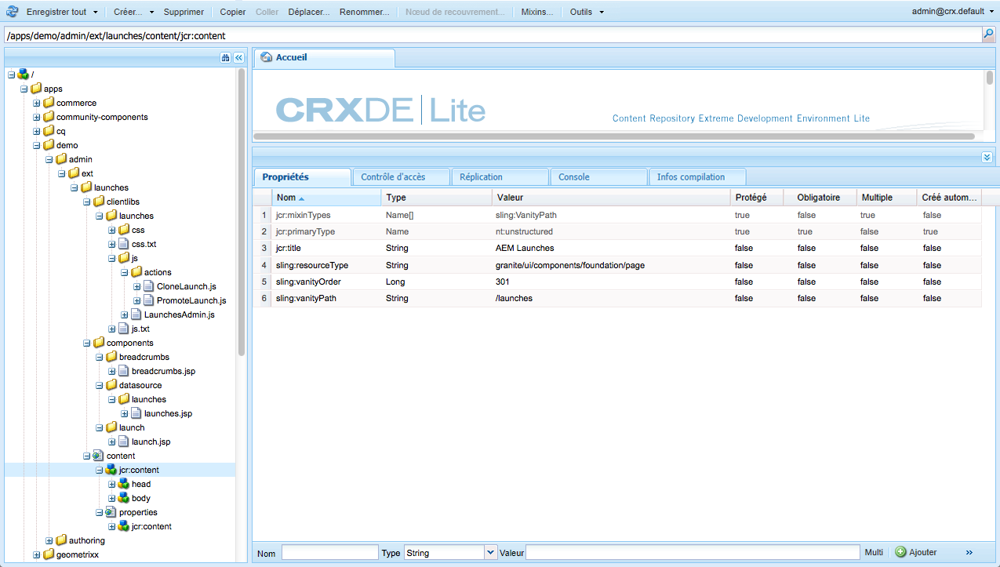
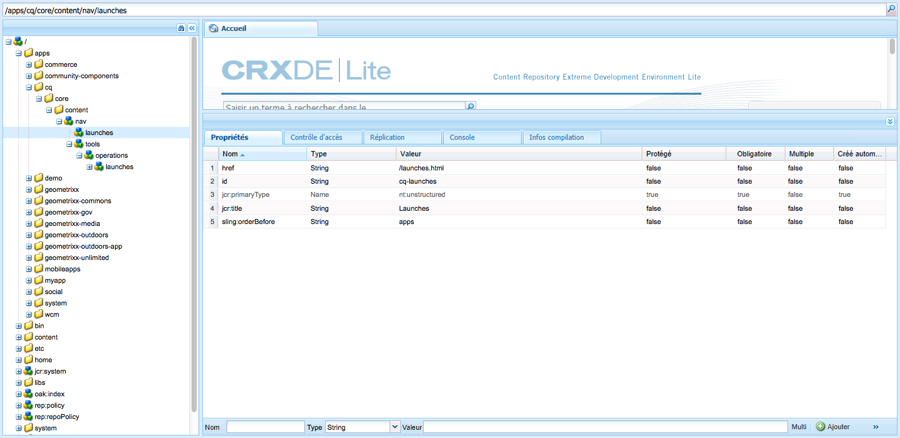

# Personnalisation des consoles{#customizing-the-consoles}

>[!CAUTION]
>
>Ce document décrit comment personnaliser les consoles de l’IU moderne et compatible avec les écrans tactiles, et ne s’applique pas à l’IU classique.

AEM comporte plusieurs mécanismes pour vous permettre de personnaliser les consoles (et la [fonctionnalité de création de pages](/help/sites-developing/customizing-page-authoring-touch.md)) de votre instance de création.

* Clientlibs

    Les bibliothèques clientes (clientlibs) vous permettent d’étendre l’implémentation par défaut afin d’obtenir la nouvelle fonctionnalité, tout en réutilisant les fonctions, objets et méthodes standard. Lors de la personnalisation, vous pouvez créer votre propre bibliothèque cliente sous `/apps.` Par exemple, elle peut contenir le code requis pour votre composant personnalisé.

* Recouvrements

   Overlays are based on node definitions and allow you to overlay the standard functionality (in `/libs`) with your own customized functionality (in `/apps`). Lors de la création d’un recouvrement, une copie 1:1 de l’original n’est pas nécessaire, car la fusion de ressources Sling prend en compte l’héritage.

Ils peuvent être utilisés de différentes manières pour étendre les consoles AEM. Une petite sélection est abordée ci-dessous (à un niveau élevé).

>[!NOTE]
>
>Pour plus d’informations, voir :
>
>* Utilisation et création de [bibliothèques clientes](/help/sites-developing/clientlibs.md).
>* Utilisation et création d’[incrustations](/help/sites-developing/overlays.md).
>* [Granite](https://helpx.adobe.com/fr/experience-manager/6-4/sites/developing/using/reference-materials/granite-ui/api/index.html)

>
>
Ce thème est également abordé dans la session [AEM Gems](https://docs.adobe.com/content/ddc/en/gems.html) – [Personnalisation de l’interface utilisateur pour AEM 6.0](https://docs.adobe.com/content/ddc/en/gems/user-interface-customization-for-aem-6.html).

>[!CAUTION]
>
>Vous ne devez ***rien*** modifier dans le chemin `/libs`.
>
>En effet, le contenu de `/libs` est remplacé dès que vous mettez à niveau votre instance (et risque de l’être si vous appliquez un correctif ou un Feature Pack).
>
>La méthode recommandée pour la configuration et d’autres modifications est la suivante :
>
>1. Recreate the required item (i.e. as it exists in `/libs`) under `/apps`
   >
   >
1. Apportez les modifications désirées dans `/apps`

>

For example, the following locations within the `/libs` structure can be overlaid:

* Consoles (toutes les consoles basées sur les pages de l’IU Granite), par exemple :

   * `/libs/wcm/core/content`

<!-- Needs a review by Engineering -->
<!--
* secondary (inner) rails; for example:

    * `/libs/wcm/core/content/search`

* toolbar(s) (dependent on console; for example sites):

    * default 

      `/libs/wcm/core/content/sites/jcr:content/body/content/header/items/default`

    * selection mode

      `/libs/wcm/core/content/sites/jcr:content/body/content/header/items/selection`

* help menu options (dependent on console; for example sites):

    * `/libs/wcm/core/content/sites/jcr:content/body/help`

* information shown on the card view (dependent on console; for example sites):

    * `/libs/wcm/core/content/sites/jcr:content/body/content/content/items/childpages`

-->
>[!NOTE]
>
>Voir l’article de la base de connaissances [Résolution des problèmes liés à l’IU tactile d’AEM](https://helpx.adobe.com/experience-manager/kb/troubleshooting-aem-touchui-issues.html) pour d’autres conseils et outils.

<!-- Needs a review by Engineering -->
<!--
## Code Samples {#code-samples}

Various packages have been made available on Github. These provide code samples related to the tasks covered on this page.

### aem-admin-extension-new-console {#aem-admin-extension-new-console}

`aem-admin-extension-new-console` is a sample package showing how to [create a new AEM 6 console](#create-a-custom-console). This package provides a UI for managing [Launches](/help/sites-authoring/launches.md) and adds a link in the navigation:

CODE ON GITHUB

You can find the code of this page on GitHub

* [Open aem-admin-extension-new-console project on GitHub](https://github.com/Adobe-Marketing-Cloud/aem-admin-extension-new-console)
* Download the project as [a ZIP file](https://github.com/Adobe-Marketing-Cloud/aem-admin-extension-new-console/archive/master.zip)

### aem-admin-extension-customize-sites {#aem-admin-extension-customize-sites}

`aem-admin-extension-customize-sites` is a sample package showing how to customize an existing AEM 6 admin console. This package provides updates to Sites administration:

CODE ON GITHUB

You can find the code of this page on GitHub

* [Open aem-admin-extension-customize-sites project on GitHub](https://github.com/Adobe-Marketing-Cloud/aem-admin-extension-customize-sites)
* Download the project as [a ZIP file](https://github.com/Adobe-Marketing-Cloud/aem-admin-extension-customize-sites/archive/master.zip)
-->

<!-- Needs a review by Engineering -->
<!--
## Create a Custom Console {#create-a-custom-console}

1. You can create a custom console with related actions; for example, Launches at the top level (below Sites):

   This involves:

    * creating the root space definition of your new console ``; for example:

        * `/apps/<yourProject>/admin/ext/launches`

    * this can contain (according to requirements):

        * the corresponding [clientlibs](/help/sites-developing/clientlibs.md) for custom actions and `less`/ `css` definitions

            * `/apps/<yourProject>/admin/ext/launches/clientlibs`

        * components that need to be redefined/adjusted; for example, the breadcrumbs, datasource and the launch

            * `/apps/<yourProject>/admin/ext/launches/components`

        * the Granite UI page resource:

            * `/apps/<yourProject>/admin/ext/launches/content/jcr:content`

              property: `sling:resourceType`

        * the page definition of the console

            * `/apps/<yourProject>/admin/ext/launches/content/jcr:content/head`
            * `/apps/<yourProject>/admin/ext/launches/content/jcr:content/body`

   

   To use the new console (for example in the [rail for navigation](#add-new-navigation-option-to-rail)) an ID is used, so that it can be explicitly referenced. The ID is used to connect the console and its navigation definition. The ID is defined in the `rail` node of the page; for example, for the Sites console:

    * the rail node is: 

      `/libs/wcm/core/content/sites/jcr:content/body/rail`

        * here the `currentId` property is defined: 

          `currentId` = `cq-sites`

   For the Launches console example:

    * the node is:

        * `/apps/<yourProject>/admin/ext/launches/content/jcr:content/body/rail`

    * with the following properties:

        * `currentId` = `cq-launches`
        * `sling:resourceType` = `granite/ui/components/endor/navcolumns`
        * `srcPath` = `cq/core/content/nav`
-->

## Personnalisation du mode par défaut pour une console {#customizing-the-default-view-for-a-console}

Vous pouvez personnaliser le mode par défaut (colonnes, carte ou liste) pour une console :

1. Vous pouvez réorganiser les modes en recouvrant l’entrée requise à partir de l’emplacement suivant :

   `/libs/wcm/core/content/sites/jcr:content/views`

   La première entrée est la valeur par défaut.

   Les noeuds disponibles correspondent aux options de vue disponibles :

   * `column`
   * `card`
   * `list`

1. Par exemple, dans un recouvrement du mode Liste :

   `/apps/wcm/core/content/sites/jcr:content/views/list`

   Définissez la propriété suivante :

   * **Nom** : `sling:orderBefore`
   * **Type** : `String`
   * **Valeur**: `column`

<!-- Needs a review by Engineering -->
<!--
`aem-admin-extension-customize-sites` is a sample package showing how to customize an existing AEM 6 admin console. This package provides updates to Sites administration:

CODE ON GITHUB

You can find the code of this page on GitHub

* [Open aem-admin-extension-customize-sites project on GitHub](https://github.com/Adobe-Marketing-Cloud/aem-admin-extension-customize-sites)
* Download the project as [a ZIP file](https://github.com/Adobe-Marketing-Cloud/aem-admin-extension-customize-sites/archive/master.zip)
-->

<!-- Needs a review by Engineering -->
<!--
### Add New Navigation Option to Rail {#add-new-navigation-option-to-rail}

1. You can add a navigation entry in the rail (for example, a [custom console](#create-a-custom-console) such as Launches).

   To do this, you create an overlay of:

   `/libs/cq/core/content/nav`

   In the `/apps` overlay:

   `/apps/cq/core/content/nav`

   Create the new nodes and properties:

   

    * Extend navigation:

        * `/apps/cq/core/content/nav/launches`

    * Specify location in the tree:

        * property: `sling:orderBefore`

    * To create the connection, the `id` property references (i.e. must be the same as) the `currentID` property [for the appropriate console](#create-a-custom-console):

        * property: `id`
        * value: same as for your console (e.g. `cq-launches`) 

          for example: the same value as the `currentId` property on:

          `/apps/<yourProject>/admin/ext/launches/content/jcr:content/body/rail`
-->

## Ajout d’une action à la barre d’outils {#add-new-action-to-the-toolbar}

1. Vous pouvez créer vos propres composants et inclure les bibliothèques clientes correspondantes pour des actions personnalisées. Par exemple, une action **Promouvoir sur Twitter** à l’emplacement :

   `/apps/wcm/core/clientlibs/sites/js/twitter.js`

   Elle peut ensuite être connectée à un élément de la barre d’outils sur la console :

   `/apps/<yourProject>/admin/ext/launches`

   Par exemple, en mode de sélection :

   `content/jcr:content/body/content/header/items/selection/items/twitter`

## Limitation d’une action de la barre d’outils à un groupe spécifique {#restrict-a-toolbar-action-to-a-specific-group}

1. Vous pouvez utiliser une condition de rendu personnalisé pour recouvrir l’action standard et imposer des conditions spécifiques qui doivent être remplies avant le rendu.

   Par exemple, créez un composant pour contrôler les conditions de rendu selon le groupe :

   `/apps/myapp/components/renderconditions/group`

1. Pour les appliquer à l’action Créer un site sur la console Sites :

   `/libs/wcm/core/content/sites`

   Créez le recouvrement :

   `/apps/wcm/core/content/sites`

1. Ajoutez ensuite la condition de rendu pour l’action :

   `jcr:content/body/content/header/items/default/items/create/items/createsite/rendercondition`

   Using properties on this node you can define the `groups` allowed to perform the specific action; for example, `administrators`

<!-- Needs a review by Engineering -->
<!--
## Remove Access to Navigation Option on Rail {#remove-access-to-navigation-option-on-rail}

1. You can rename a navigation entry in the rail by overlaying the required entry from under:

   `/libs/cq/core/content/nav`

   The nodes available correlate to the navigation options in the rail:

    * `projects`
    * `sites`
    * `assets`
    * `apps`
    * `forms`
    * `screens`
    * `personalization`
    * `commerce`
    * `tools`
    * `communities`

1. For example, on a overlay at:

   `/apps/cq/core/content/nav/sites`

   Define the following property:

    * **Name**: `sling:hideResource`
    * **Type**: `String` 
    * **Value**: `true`

`aem-admin-extension-customize-sites` is a sample package showing how to customize an existing AEM 6 admin console. This package provides updates to Sites administration:

CODE ON GITHUB

You can find the code of this page on GitHub

* [Open aem-admin-extension-new-console project on GitHub](https://github.com/Adobe-Marketing-Cloud/aem-admin-extension-new-console)
* Download the project as [a ZIP file](https://github.com/Adobe-Marketing-Cloud/aem-admin-extension-new-console/archive/master.zip)
-->

<!-- Needs a review by Engineering -->
<!--
## Restrict Access to Navigation Option on Rail {#restrict-access-to-navigation-option-on-rail}

You can restrict access to a navigation option using ACLs:

1. Open the [user and/or group management](/help/sites-administering/security.md) and select the user/group you want to restrict access for.

   >[!NOTE]
   >
   >Avoid assigning/restricting permissions on a user-by-user basis. It is [recommended to use groups](/help/sites-administering/security.md#best-practices).

1. Remove access [permissions](/help/sites-administering/security.md#permissions) to the appropriate node(s) under `/libs/cq/core/content/nav/sites`. These correlate to the navigation options in the rail:

    * `projects`
    * `sites`
    * `assets`
    * `apps`
    * `forms`
    * `screens`
    * `personalization`
    * `commerce`
    * `tools`
    * `communities`
-->

## Personnalisation des colonnes en mode Liste {#customizing-columns-in-the-list-view}

>[!NOTE]
>
>This feature is optimized for columns of text fields; for other data types it is possible to overlay `cq/gui/components/siteadmin/admin/listview/columns/analyticscolumnrenderer` in `/apps`.

<!-- Needs a review by Engineering -->
<!--
CODE ON GITHUB

You can find the code of this page on GitHub

* [Open aem-sites-extension-listview-columns project on GitHub](https://github.com/Adobe-Marketing-Cloud/aem-sites-extension-listview-columns)
* Download the project as [a ZIP file](https://github.com/Adobe-Marketing-Cloud/aem-sites-extension-listview-columns/archive/master.zip)
-->

Pour personnaliser les colonnes en mode Liste :

1. Recouvrez la liste des colonnes disponibles.

   * Sur le noeud :

      `/apps/wcm/core/content/common/availablecolumns`

   * Ajoutez des colonnes ou supprimez des colonnes existantes.
   Voir [Utilisation des recouvrements (et la fusion de ressources Sling) pour plus d’informations.](/help/sites-developing/overlays.md)

1. Si vous le souhaitez :

   * If you want to plug additional data, you need to write a ` [PageInforProvider](https://helpx.adobe.com/experience-manager/6-4/sites/developing/using/reference-materials/javadoc/com/day/cq/wcm/api/PageInfoProvider.html)` with a

      `pageInfoProviderType`.
   Par exemple, voir la classe/le lot (tiré de GitHub) ci-dessous.

1. Vous pouvez maintenant sélectionner la colonne dans le configurateur de colonnes du mode Liste.

## Filtrage des ressources {#filtering-resources}

Lorsqu’une console est utilisée, un cas d’utilisation fréquent est la nécessité pour l’utilisateur de choisir des ressources (par exemple, des pages, des composants, des ressources, etc.). Cela peut prendre la forme d’une liste dans laquelle l’auteur doit sélectionner un élément.

Pour que la liste garde une taille raisonnable et reste pertinente par rapport au cas d’utilisation, un filtre peut être mis en œuvre sous la forme d’un prédicat personnalisé. Voir [cet article](/help/sites-developing/customizing-page-authoring-touch.md#filtering-resources) pour en savoir plus.
