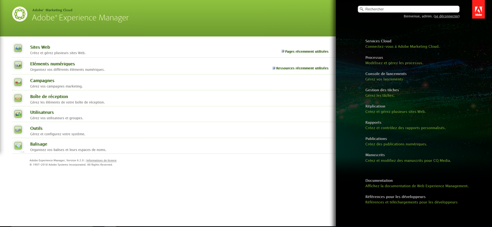

# Personnalisation de la console de bienvenue (IU classique){#customizing-the-welcome-console-classic-ui}

>[!CAUTION]
>
>Cette page traite de l’interface utilisateur classique.
>
>Pour plus d’informations sur l’IU tactile standard, voir [Personnalisation des consoles](/help/sites-developing/customizing-consoles-touch.md).

La console de bienvenue propose une liste de liens vers les différentes consoles et fonctionnalités au sein d’AEM.

Il est possible de configurer les liens qui sont visibles. Cela peut être défini pour des utilisateurs et/ou des groupes spécifiques. Les mesures à prendre dépendent du type de cible (qui est lié à la partie de la console dans laquelle il se situe) :

* [Consoles principales](#links-in-main-console-left-pane) : liens de la console principale (volet de gauche)
* [Ressources, documentation et ressources, fonctionnalités](#links-in-sidebar-right-pane) : liens de la barre latérale (volet de droite)

## Liens de la console principale (volet de gauche) {#links-in-main-console-left-pane}

Liste des consoles principales d’AEM.

### Définir si les liens de la console principale sont visibles ou non {#configuring-whether-main-console-links-are-visible}

Les autorisations au niveau du nœud déterminent si les liens sont visibles ou non. Les nœuds en question sont les suivants :

* **Sites Web :** `/libs/wcm/core/content/siteadmin`

* **Ressources numériques :** `/libs/wcm/core/content/damadmin`

* **Communauté :** `/libs/collab/core/content/admin`

* **Campagnes :** `/libs/mcm/content/admin`

* **Boîte de réception :** `/libs/cq/workflow/content/inbox`

* **Utilisateurs :** `/libs/cq/security/content/admin`

* **Outils :** `/libs/wcm/core/content/misc`

* **Balisage :** `/libs/cq/tagging/content/tagadmin`

Par exemple :

* Pour limiter l’accès à **Outils**, supprimez l’accès en lecture à partir de

   `/libs/wcm/core/content/misc`

Pour plus d’informations sur la définition des autorisations souhaitées, consultez la section [Sécurité](/help/sites-administering/security.md).

### Liens de la barre latérale (volet de droite) {#links-in-sidebar-right-pane}

Ces liens sont basés sur l’existence de nœuds à l’emplacement suivant *et* sur l’accès en lecture à ces mêmes nœuds :

`/libs/cq/core/content/welcome`

Trois sections sont proposées par défaut (elles sont légèrement espacées) :

<table> 
 <tbody> 
  <tr> 
   <td><strong>Ressources</strong></td> 
   <td> </td> 
  </tr> 
  <tr> 
   <td> Services cloud</td> 
   <td><code>/libs/cq/core/content/welcome/resources/cloudservices</code></td> 
  </tr> 
  <tr> 
   <td> Workflows</td> 
   <td><code>/libs/cq/core/content/welcome/resources/workflows</code></td> 
  </tr> 
  <tr> 
   <td> Gestion des tâches</td> 
   <td><code>/libs/cq/core/content/welcome/resources/taskmanager</code></td> 
  </tr> 
  <tr> 
   <td> Réplication</td> 
   <td><code>/libs/cq/core/content/welcome/resources/replication</code></td> 
  </tr> 
  <tr> 
   <td> Rapports</td> 
   <td><code>/libs/cq/core/content/welcome/resources/reports</code></td> 
  </tr> 
  <tr> 
   <td> Publications</td> 
   <td><code>/libs/cq/core/content/welcome/resources/publishingadmin</code></td> 
  </tr> 
  <tr> 
   <td> Manuscrits</td> 
   <td><code>/libs/cq/core/content/welcome/resources/manuscriptsadmin</code></td> 
  </tr> 
  <tr> 
   <td><strong>Documentation et référence</strong></td> 
   <td> </td> 
  </tr> 
  <tr> 
   <td> Documentation</td> 
   <td><code>/libs/cq/core/content/welcome/docs/docs</code></td> 
  </tr> 
  <tr> 
   <td> Références pour les développeurs</td> 
   <td><code>/libs/cq/core/content/welcome/docs/dev</code></td> 
  </tr> 
  <tr> 
   <td><strong>Fonctions</strong></td> 
   <td> </td> 
  </tr> 
  <tr> 
   <td> CRXDE Lite</td> 
   <td><code>/libs/cq/core/content/welcome/features/crxde</code></td> 
  </tr> 
  <tr> 
   <td> Modules</td> 
   <td><code>/libs/cq/core/content/welcome/features/packages</code></td> 
  </tr> 
  <tr> 
   <td> Partage de modules</td> 
   <td><code>/libs/cq/core/content/welcome/features/share</code></td> 
  </tr> 
  <tr> 
   <td> Mise en cluster</td> 
   <td><code>/libs/cq/core/content/welcome/features/cluster</code></td> 
  </tr> 
  <tr> 
   <td> Sauvegarde</td> 
   <td><code>/libs/cq/core/content/welcome/features/backup</code></td> 
  </tr> 
  <tr> 
   <td> Console Web  </td> 
   <td><code>/libs/cq/core/content/welcome/features/config</code></td> 
  </tr> 
  <tr> 
   <td> Image mémoire du statut de la console Web  </td> 
   <td><code>/libs/cq/core/content/welcome/features/statusdump</code></td> 
  </tr> 
 </tbody> 
</table>

#### Définir si les liens de la barre latérale sont visibles ou non {#configuring-whether-sidebar-links-are-visible}

Il est possible de masquer un lien pour des utilisateurs ou des groupes spécifiques en supprimant l’accès aux nœuds qui le représentent.

* Ressources : supprimez l’accès à :

   `/libs/cq/core/content/welcome/resources/<link-target>`

* Documents : supprimez l’accès à :

   `/libs/cq/core/content/welcome/docs/<link-target>`

* Fonctionnalités : supprimez l’accès à :

   `/libs/cq/core/content/welcome/features/<link-target>`

Par exemple :

* Pour supprimer le lien vers **Rapports**, supprimez l’accès en lecture à partir de

   `/libs/cq/core/content/welcome/resources/reports`

* Pour supprimer le lien vers **Modules**, supprimez l’accès en lecture à partir de

   `/libs/cq/core/content/welcome/features/packages`

Pour plus d’informations sur la définition des autorisations souhaitées, consultez la section [Sécurité](/help/sites-administering/security.md).

### Mécanisme de sélection de liens {#link-selection-mechanism}

L’outil `/libs/cq/core/components/welcome/welcome.jsp`ConsoleUtil[ est utilisé dans ](https://helpx.adobe.com/experience-manager/6-4/sites/developing/using/reference-materials/javadoc/com/day/cq/commons/ConsoleUtil.html). Il exécute une requête sur les nœuds qui possèdent la propriété :

* `jcr:mixinTypes` avec la valeur : `cq:Console`

>[!NOTE]
>
>Exécutez la requête suivante pour afficher la liste existante :
>
>* `select * from cq:Console`
>

Si un utilisateur ou un groupe ne possède pas l’autorisation de lecture sur un nœud avec le mixin `cq:Console`, ce nœud est récupéré par le biais d’une recherche `ConsoleUtil`. Par conséquent, il n’est pas répertorié dans la console.

### Ajout d’un élément personnalisé {#adding-a-custom-item}

Vous pouvez utiliser le [mécanisme de sélection de liens](#link-selection-mechanism) pour ajouter votre propre élément personnalisé à la liste des liens.

Ajoutez votre élément personnalisé à la liste en ajoutant le mixin `cq:Console` à votre widget ou ressource. Pour ce faire, vous devez définir la propriété suivante :

* `jcr:mixinTypes` avec la valeur : `cq:Console`
