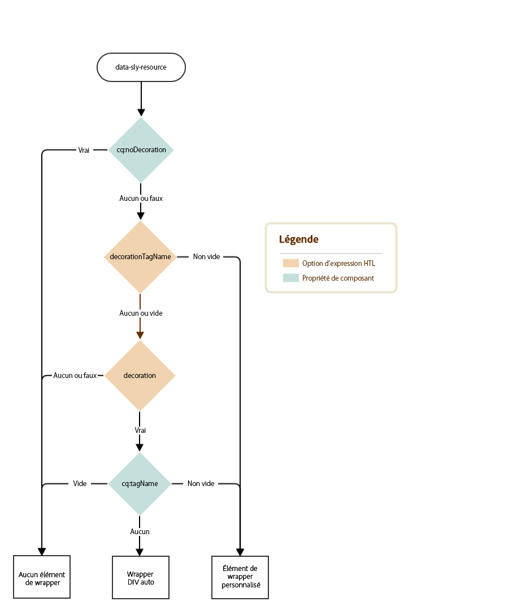
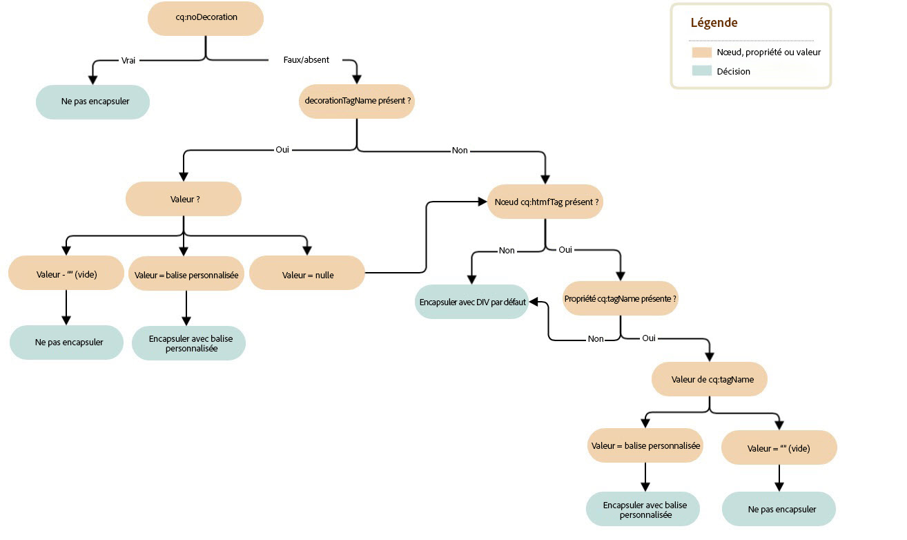

# Balise décorative {#decoration-tag}

Lors du rendu d’un composant d’une page web, un élément HTML peut être généré, en encapsulant le composant rendu sur lui-même. Dans ce cas, l’objectif est double :

* Un composant ne peut être modifié que lorsqu’il est enveloppé dans un élément HTML.
* L’élément d’encapsulage est utilisé pour appliquer des classes HTML qui fournissent :

   * des informations de mise en page,
   * des informations de style.

Pour les développeurs, AEM offre une logique simple et claire pour contrôler les balises décoratives qui englobent des éléments intégrés. Le rendu de la balise décorative et la méthode de rendu employée sont définis par la combinaison de deux facteurs, que cette page se propose de détailler :

* Le composant proprement dit peut configurer sa balise décorative avec un ensemble de propriétés.
* Les scripts qui contiennent des composants (HTL, JSP, dispatcher, etc.) peuvent définir les aspects de la balise décorative avec des paramètres d’inclusion.

## Recommandations {#recommendations}

Ces quelques recommandations générales vous indiquent à quel moment inclure l’élément wrapper afin d’éviter tout problème imprévu :

* La présence de l’élément wrapper ne doit pas être différente entre les modes WCM (mode d’aperçu ou d’édition), les instances (création ou publication) et l’environnement (intermédiaire ou production), de sorte que les fichiers CSS et JavaScript de la page fonctionnent de manière identique dans tous les cas.
* L’élément wrapper doit être ajouté à tous les composants qui sont modifiables, afin que l’éditeur de page puisse les initialiser et les mettre à jour correctement.
* Dans le cas des composants non modifiables, l’élément wrapper peut être omis s’il ne remplit pas de fonction particulière, de manière à éviter toute inflation inutile du balisage.

## Contrôles de composant {#component-controls}

Les propriétés et nœuds suivants peuvent être appliqués aux composants pour contrôler le comportement de leur balise décorative :

* **`cq:noDecoration {boolean}` :** cette propriété peut être ajoutée à un composant et une valeur « true » contraint AEM à ne pas générer d’éléments wrapper sur le composant.
* **`cq:htmlTag`Nœud :** ce nœud peut être ajouté sous un composant et contenir les propriétés suivantes :
   * **`cq:tagName {String}` :** cette propriété peut être utilisée pour spécifier une balise HTML personnalisée dans le but d’encapsuler les composants au lieu de l’élément DIV par défaut.
   * **`class {String}` :** cette propriété peut être utilisée pour spécifier des noms de classe CSS à ajouter à l’élément wrapper.
   * D’autres noms de propriété seront ajoutés comme attributs HTML avec la même valeur String que celle fournie.

## Contrôles de script  {#script-controls}

Le comportement de l’élément wrapper diffère toutefois selon que [HTL](/help/sites-developing/decoration-tag.md#htl) ou [JSP](/help/sites-developing/decoration-tag.md#jsp) est utilisé pour inclure l’élément.

### HTL {#htl}

En règle générale, le comportement de l’élément wrapper dans HTL peut être résumé comme suit :

* Aucun élément DIV wrapper n’est rendu par défaut (en exécutant simplement `data-sly-resource="foo"`).
* Tous les modes WCM (désactivé, aperçu, édition sur les instances de création et de publication) sont rendus de manière identique.

Le comportement de l’élément wrapper peut également faire l’objet d’un contrôle total.

* Le script HTL contrôle complètement le comportement de la balise wrapper.
* Les propriétés de composant (comme `cq:noDecoration` et `cq:tagName`) peuvent également définir la balise wrapper.

Il est possible de contrôler entièrement le comportement des balises wrapper à partir de scripts HTL et de la logique qui y est associée.

Pour plus d’informations sur le développement au format HTL, consultez la [documentation HTL](https://helpx.adobe.com/fr/experience-manager/htl/user-guide.html).

#### Arborescence de décision {#decision-tree}

Cette arborescence de décision résume la logique qui détermine le comportement des balises wrapper.



#### Cas d’utilisation {#use-cases}

Les trois scénarios d’utilisation présentent des exemples de gestion des balises wrapper. Ils montrent également à quel point il est facile de contrôler le comportement souhaité de ces balises.

La structure de contenu et les composants suivants sont utilisés dans les exemples ci-dessous :

```
/content/test/
  @resourceType = "test/components/one"
  child/
    @resourceType = "test/components/two"
```

```
/apps/test/components/
  one/
    one.html
  two/
    two.html
    cq:htmlTag/
      @cq:tagName = "article"
      @class = "component-two"
```

#### Cas d’utilisation 1 : Inclure un composant pour la réutilisation du code {#use-case-include-a-component-for-code-reuse}

Le scénario d’utilisation le plus courant se présente lorsqu’un composant en inclut un autre en vue de réutiliser le code. Dans ce cas, on ne souhaite pas que le composant puisse être modifié avec sa propre barre d’outils et sa propre boîte de dialogue. Aucun élément wrapper n’est donc nécessaire et le nœud `cq:htmlTag` du composant est ignoré. Cela peut être considéré comme le comportement par défaut.

`one.html: <sly data-sly-resource="child"></sly>`

`two.html: Hello World!`

Résultat obtenu pour `/content/test.html` :

**`Hello World!`**

Il peut s’agir, par exemple, d’un composant qui inclut un composant image principal pour afficher une image (en utilisant généralement une ressource synthétique). Cela consiste à inclure un composant enfant virtuel en transmettant à data-sly-resource un objet Map qui représente toutes les propriétés que ce composant doit posséder.

#### Cas d’utilisation 2 : Inclure un composant modifiable {#use-case-include-an-editable-component}

Un autre cas d’utilisation courant se présente lorsque des composants de conteneur incluent des composants enfants modifiables, comme un conteneur de mises en page. Dans ce cas, chaque enfant inclus a impérativement besoin d’un composant wrapper pour que l’éditeur puisse fonctionner (sauf s’il a été explicitement désactivé avec la propriété `cq:noDecoration`).

Étant donné que, dans ce cas, le composant inclus est indépendant, un élément wrapper est nécessaire pour que l’éditeur fonctionne, et pour définir la mise en page et le style à appliquer. Pour déclencher ce comportement, l’option `decoration=true` est disponible.

`one.html: <sly data-sly-resource="${'child' @ decoration=true}"></sly>`

`two.html: Hello World!`

Résultat obtenu pour `/content/test.html` :

**`<article class="component-two">Hello World!</article>`**

#### Cas d’utilisation 3 : Comportement personnalisé {#use-case-custom-behavior}

Il peut y avoir un nombre illimité de cas complexes, que l’on peut obtenir facilement selon que HTL est en mesure de fournir ou non les éléments suivants :

* **`decorationTagName='ELEMENT_NAME'`** Pour définir le nom d’élément du wrapper.
* **`cssClassName='CLASS_NAME'`** Pour définir les noms de classe CSS à définir.

`one.html: <sly data-sly-resource="${'child' @ decorationTagName='aside', cssClassName='child'}"></sly>`

`two.html: Hello World!`

Résultat obtenu `/content/test.html` :

**`<aside class="child">Hello World!</aside>`**

## JSP {#jsp}

Lors de l’inclusion d’un composant à l’aide de `cq:includ`e ou `sling:include`, le comportement par défaut dans AEM consiste à utiliser une balise DIV pour encapsuler l’élément. Toutefois, cet encapsulage peut être personnalisé de deux façons :

* Indiquer explicitement à AEM de ne pas encapsuler le composant à l’aide de `cq:noDecoration`.
* Utilisez une balise HTML personnalisée pour encapsuler le composant à l’aide de `cq:htmlTag`/ `cq:tagName` ou `decorationTagName`.

### Arborescence de décision {#decision-tree-1}

L’arborescence de décision suivante illustre la manière dont `cq:noDecoration`, `cq:htmlTag`, `cq:tagName` et `decorationTagName` affectent le comportement de l’élément wrapper.


