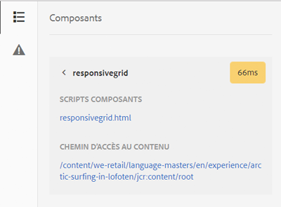

# Mode Développeur{#developer-mode}

>[!CAUTION]
>
>AEM 6.4 a atteint la fin de la prise en charge étendue et cette documentation n’est plus mise à jour. Pour plus d’informations, voir notre [période de support technique](https://helpx.adobe.com/fr/support/programs/eol-matrix.html). Rechercher les versions prises en charge [here](https://experienceleague.adobe.com/docs/?lang=fr).

Lors de la modification de pages dans AEM, plusieurs [modes](/help/sites-authoring/author-environment-tools.md#page-modes) sont disponibles, y compris le mode Développeur. Cela ouvre un panneau latéral avec plusieurs onglets qui fournissent aux développeurs des informations sur la page active. Les trois onglets sont les suivants :

* **[Composants](#components)** pour consulter des informations sur la structure et les performances.
* **[Tests](#tests)** pour exécuter des tests et analyser les résultats.
* **[Erreurs](#errors)** pour voir les problèmes qui se produisent.

Ils aident les développeurs à :

* Discover : de quelles pages sont composées.
* déboguer en vérifiant la nature des événements, ainsi que leur emplacement et le moment où ils surviennent, afin de résoudre des problèmes ;
* Test : L’application se comporte-t-elle comme prévu ?

>[!CAUTION]
>
>Le mode Développeur :
>
>* N’est disponible que dans l’interface utilisateur tactile (lors de la modification de pages).
>* n’est pas disponible sur les périphériques mobiles ou les petites fenêtres sur les ordinateurs de bureau (en raison de l’espace restreint),
   >   * ce qui se produit lorsque la largeur est inférieure à 1 024 px ;
>* n’est disponible que pour les utilisateurs qui sont membres du groupe `administrators`.

>[!CAUTION]
>
>Le mode Développeur n’est disponible que sur une instance de création standard qui n’utilise pas le mode d’exécution nosamplecontent.
>
>Si nécessaire, il peut être configuré pour une utilisation :
>
>* sur une instance de création à l’aide du mode d’exécution nosamplecontent ;
>* sur une instance de publication.
>
>Il doit être désactivé à nouveau après utilisation.

>[!NOTE]
>
>Voir :
>
>* Article de la base de connaissances, [Résolution des problèmes AEM TouchUI](https://helpx.adobe.com/experience-manager/kb/troubleshooting-aem-touchui-issues.html), pour d’autres conseils et outils.
>* Session AEM Gems à propos de [Mode développeur d’AEM 6.0](https://experienceleague.adobe.com/docs/experience-manager-gems-events/gems/gems2014/aem-developer-mode.html).

## Ouverture du mode Développeur {#opening-developer-mode}

Le mode Développeur est mis en oeuvre sous la forme d’un panneau latéral dans l’éditeur de page. Pour ouvrir le panneau, sélectionnez **Développeur** dans le sélecteur de mode au niveau de la barre d’outils de l’éditeur de page :

Le panneau est divisé en deux onglets :

* **[Composants](/help/sites-developing/developer-mode.md#components)** : il présente une arborescence de composants, similaire à l’[arborescence de contenu](/help/sites-authoring/author-environment-tools.md#content-tree) pour les auteurs.

* **[Erreurs](/help/sites-developing/developer-mode.md#errors)** : lorsque des problèmes se produisent, les détails sont affichés pour chaque composant.

### Composants {#components}

Il présente une arborescence de composants qui :

* décrit la chaîne de composants et de modèles rendus sur la page (SLY, JSP, etc.) ; L’arborescence peut être développée pour afficher le contexte dans la hiérarchie.
* Affiche le temps de calcul côté serveur nécessaire au rendu du composant.
* Permet de développer l’arborescence et de sélectionner des composants spécifiques dans l’arborescence. La sélection permet d’accéder aux détails du composant. par exemple :

   * Chemin du référentiel
   * Liens vers les scripts (accessibles en CRXDE Lite)

* Les composants sélectionnés (dans le flux de contenu, indiqués par une bordure bleue) sont mis en surbrillance dans l’arborescence de contenu (et vice versa).

Cela peut vous aider à :

* déterminer et comparer le temps de rendu par composant ;
* visualiser et comprendre la hiérarchie ;
* comprendre, puis améliorer, le temps de chargement de la page en recherchant les composants lents.

Chaque entrée de composant peut afficher (par exemple :

* **Afficher les détails**: un lien vers une liste qui affiche :

   * tous les scripts de composant utilisés pour effectuer le rendu du composant.
   * chemin d’accès au contenu du référentiel pour ce composant spécifique.

   

* **Modifier le script**: un lien qui :

   * ouvre le script de composant dans CRXDE Lite.

* Le développement d’une entrée de composant (en-tête de flèche) peut également afficher :

   * La hiérarchie au sein du composant sélectionné.
   * les temps de rendu pour le composant sélectionné de manière isolée, tous les composants individuels imbriqués qu’il contient, ainsi que le total combiné.

   

>[!CAUTION]
>
>Certains liens pointent sur des scripts sous `/libs`. Toutefois, ils servent uniquement de référence, vous **ne devez rien** modifier sous `/libs`, car toutes les modifications que vous apportez risquent d’être perdues. Cela est dû au fait que cette branche est exposée aux modifications à chaque mise à niveau ou application d’un correctif ou pack de fonctionnalités. Toutes les modifications désirées doivent être apportées sous `/apps`, consultez [Recouvrements et remplacements](/help/sites-developing/overlays.md).

### Erreurs {#errors}

L’onglet **Erreurs** devrait toujours rester vide (comme ci-dessus), mais lorsque des problèmes surviennent, les informations suivantes sont affichées pour chaque composant :

* Un avertissement s’affiche si le composant écrit une entrée dans le journal d’erreurs, avec les détails de l’erreur et des liens directs vers le code correspondant dans CRXDE Lite.
* Un avertissement s’affiche si le composant ouvre une session d’administrateur.

Par exemple, dans une situation où une méthode non définie est appelée, l’erreur résultante s’affiche dans la variable **Erreurs** tab :

L’entrée du composant dans l’arborescence de l’onglet Composants est également marquée avec un indicateur lorsqu’une erreur se produit.

### Tests {#tests}

>[!CAUTION]
>
>Dans AEM 6.2, les fonctionnalités de test du mode Développeur ont été réimplémentées en tant qu’application Outils autonome.
>
>Pour en savoir plus, consultez le [Test de l’IU](/help/sites-developing/hobbes.md).
