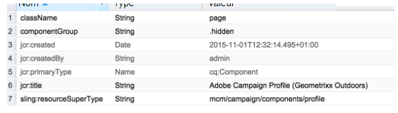
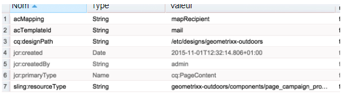

# Créer le modèle de page AEM personnalisé avec des composants de formulaire Adobe Campaign{#creating-custom-aem-page-template-with-adobe-campaign-form-components}

>[!CAUTION]
>
>AEM 6.4 a atteint la fin de la prise en charge étendue et cette documentation n’est plus mise à jour. Pour plus d’informations, voir notre [période de support technique](https://helpx.adobe.com/fr/support/programs/eol-matrix.html). Rechercher les versions prises en charge [here](https://experienceleague.adobe.com/docs/?lang=fr).

Cette page vous explique comment créer un modèle de page personnalisé qui utilise des composants [Formulaire Adobe Campaign](/help/sites-authoring/adobe-campaign-components.md) en examinant le mode d’implémentation du modèle Geometrixx-outdoors (`/apps/geometrixx-outdoors/components/page_campaign_profile`). Elle vous donne également des informations importantes dont vous pourriez avoir besoin lors de la création de votre propre modèle.

>[!NOTE]
>
>[Les exemples d’e-mail et de formulaire sont disponibles uniquement dans Geometrixx](/help/sites-developing/we-retail.md). Téléchargez un exemple de contenu Geometrixx à partir du partage de packages.

Pour créer un modèle de page d’AEM personnalisé à l’aide des composants de formulaire Adobe Campaign, assurez-vous que vous disposez des éléments suivants :

1. **Correct resourceSuperType**

   Assurez-vous que le composant de page hérite de `mcm/campaign/components/profile`.

   Cela est nécessaire pour que les servlets obtiennent et enregistrent des informations.

   * `com.day.cq.mcm.campaign.servlets.TemplateListServlet`
   * `com.day.cq.mcm.campaign.servlets.SaveProfileServlet`

   

1. **Paramètres de ClientContext**

   Lorsque vous observez les paramètres de ClientContext (`/etc/designs/geometrixx-outdoors/jcr:content/page_campaign_profile`), vous voyez ceci :

   * ClientContext pointe vers `/etc/clientcontext/campaign`.
   * Il existe également un nœud *config* supplémentaire.

   

1. **head.jsp (/apps/geometrixx-outdoors/components/page_campaign_profile/head.jsp)**

   Dans **head.jsp**, les lignes suivantes qui utilisent la variable **clientcontext-config** et le **cloudservice-hook**:

   ```
   <cq:include path="config" resourceType="cq/personalization/components/clientcontext_optimized/config"/>
   <sling:include path="contexthub" resourceType="granite/contexthub/components/contexthub"/>
   <cq:include script="/libs/cq/cloudserviceconfigs/components/servicelibs/servicelibs.jsp"/>
   ```

1. **body.jsp (/apps/geometrixx-outdoors/components/page_campaign_profile/body.jsp)**

   Dans le fichier **body.jsp**, les Cloud Services sont chargés au bas de la page :

   ```
   <cq:include path="cloudservices" resourceType="cq/cloudserviceconfigs/components/servicecomponents"/>
   ```

1. **Propriétés de la page Campaign**

   Pour pouvoir sélectionner un modèle Adobe Campaign, les propriétés de page sont étendues avec la propriété **Campagne** tab :

   `/apps/geometrixx-outdoors/components/page_campaign_profile/dialog/items/tabs/items/campaign`

   

1. **Paramètres de modèle**

   Les valeurs par défaut suivantes sont affichées dans le modèle (`/apps/geometrixx-outdoors/templates/campaign_profile/jcr:content`) :

   | **acMapping** | mapRecipient (pour Adobe Campaign 6.1), profile (pour Adobe Campaign Standard) |
   |---|---|
   | **acTemplateId** | courrier |

   
