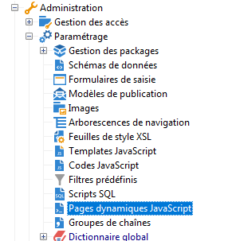
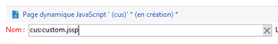
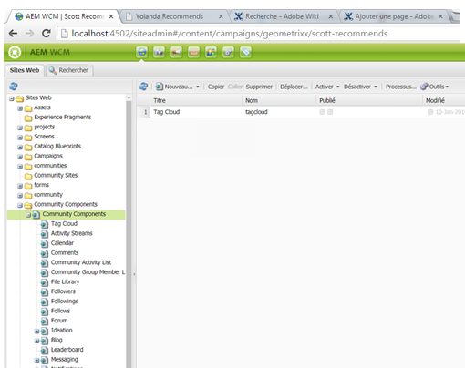

# Créer des extensions personnalisées{#creating-custom-extensions}

>[!CAUTION]
>
>AEM 6.4 a atteint la fin de la prise en charge étendue et cette documentation n’est plus mise à jour. Pour plus d’informations, voir notre [période de support technique](https://helpx.adobe.com/fr/support/programs/eol-matrix.html). Rechercher les versions prises en charge [here](https://experienceleague.adobe.com/docs/?lang=fr).

Généralement, lorsque vous implémentez un projet, vous disposez d’un code personnalisé dans AEM et Adobe Campaign. Grâce à l’API existante, vous pouvez appeler le code personnalisé dans Adobe Campaign à partir d’AEM ou depuis AEM vers Adobe Campaign. Ce document décrit la marche à suivre.

## Prérequis {#prerequisites}

Les éléments suivants doivent être installés :

* Adobe Experience Manager
* Adobe Campaign 6.1

Voir [Intégration d’AEM à Adobe Campaign 6.1](/help/sites-administering/campaignonpremise.md) pour plus d’informations.

## Exemple 1 : AEM à Adobe Campaign {#example-aem-to-adobe-campaign}

L’intégration standard entre AEM et Campaign est basée sur JSON et JSSP (JavaScript Server Page). Ces fichiers JSSP se trouvent dans la console Campaign et commencent tous par **amc** (Adobe Marketing Cloud).



>[!NOTE]
>
>[Pour cet exemple, consultez Geometrixx](/help/sites-developing/we-retail.md), disponible à partir du Partage de packages.

Dans cet exemple, nous créons un fichier JSSP personnalisé et l’appelons du côté AEM pour récupérer le résultat. Il peut être utilisé, par exemple, pour récupérer des données d’Adobe Campaign ou pour enregistrer des données dans Adobe Campaign.

1. Dans Adobe Campaign, pour créer un fichier JSSP, cliquez sur l’icône **Nouveau**.

   

1. Entrez le nom de ce fichier JSSP. Dans cet exemple, nous utilisons **cus:custom.jssp** (ce qui signifie qu’il est dans l’espace de noms **cus**).

   

1. Insérez le code suivant dans le fichier jssp-file :

   ```
   <%
   var origin = request.getParameter("origin");
   document.write("Hello from Adobe Campaign, origin : " + origin);
   %>
   ```

1. Enregistrez votre travail. Le travail restant est en AEM.
1. Créez un servlet simple du côté AEM pour appeler ce JSSP. Dans cet exemple, nous supposons que :

   * La connexion entre AEM et Campaign fonctionne
   * Le service cloud de campagne est configuré sur **/content/geometrixx-outdoors**

   L’objet le plus important de cet exemple est **GenericCampaignConnector**. Il permet d’appeler des fichiers jssp (get et post) du côté Adobe Campaign.

   Voici un petit extrait de code :

   ```
   @Reference
   private GenericCampaignConnector campaignConnector;
   ...
   Map<String, String> params = new HashMap<String, String>();
   params.put("origin", "AEM"); 
   CallResults results = campaignConnector.callGeneric("/jssp/cus/custom.jssp", params, credentials);
   return results.bodyAsString();
   ```

1. Comme vous le voyez dans cet exemple, vous devez transmettre les informations d’identification dans l’appel. Vous pouvez obtenir ce résultat via la méthode getCredentials() où vous transmettez une page sur laquelle le service cloud Campaign est configuré.

   ```xml
   // page containing the cloudservice for Adobe Campaign
   Configuration config = campaignConnector.getWebserviceConfig(page.getContentResource().getParent());
   CampaignCredentials credentials = campaignConnector.retrieveCredentials(config);
   ```

Le code complet est le suivant :

```java
import java.io.IOException;
import java.io.PrintWriter;
import java.util.HashMap;
import java.util.Map;

import javax.servlet.ServletException;

import org.apache.felix.scr.annotations.Reference;
import org.apache.felix.scr.annotations.sling.SlingServlet;
import org.apache.sling.api.SlingHttpServletRequest;
import org.apache.sling.api.SlingHttpServletResponse;
import org.apache.sling.api.servlets.SlingSafeMethodsServlet;
import org.slf4j.Logger;
import org.slf4j.LoggerFactory;

import com.day.cq.mcm.campaign.CallResults;
import com.day.cq.mcm.campaign.CampaignCredentials;
import com.day.cq.mcm.campaign.GenericCampaignConnector;
import com.day.cq.wcm.api.Page;
import com.day.cq.wcm.api.PageManager;
import com.day.cq.wcm.api.PageManagerFactory;
import com.day.cq.wcm.webservicesupport.Configuration;

@SlingServlet(paths="/bin/campaign", methods="GET")
public class CustomServlet extends SlingSafeMethodsServlet {

 private final Logger log = LoggerFactory.getLogger(this.getClass());
 
 @Reference
 private GenericCampaignConnector campaignConnector;
 
 @Reference
 private PageManagerFactory pageManagerFactory;

 @Override
 protected void doGet(SlingHttpServletRequest request,
   SlingHttpServletResponse response) throws ServletException,
   IOException {
  
  PageManager pm = pageManagerFactory.getPageManager(request.getResourceResolver());
  
  Page page = pm.getPage("/content/geometrixx-outdoors");
  
  String result = null;
  if ( page != null) {
   result = callCustomFunction(page);
  }
  if ( result != null ) {
   PrintWriter pw = response.getWriter();
   pw.print(result);
  }
 }
 
 private String callCustomFunction(Page page ) {
  try {
   Configuration config = campaignConnector.getWebserviceConfig(page.getContentResource().getParent());
   CampaignCredentials credentials = campaignConnector.retrieveCredentials(config);
   
   Map<String, String> params = new HashMap<String, String>();
   params.put("origin", "AEM");
   CallResults results = campaignConnector.callGeneric("/jssp/cus/custom.jssp", params, credentials);
   return results.bodyAsString();
  } catch (Exception e ) {
   log.error("Something went wrong during the connection", e);
  }
  return null;
  
 }

}
```

## Exemple 2 : Adobe Campaign vers AEM {#example-adobe-campaign-to-aem}

AEM propose des API prêtes à l’emploi pour récupérer les objets disponibles n’importe où dans la vue de l’explorateur siteadmin.



>[!NOTE]
>
>[Pour cet exemple, consultez Geometrixx](/help/sites-developing/we-retail.md), disponible à partir du Partage de packages.

Pour chaque nœud de l’explorateur, il existe une API qui lui est liée. Par exemple pour le nœud :

* [http://localhost:4502/siteadmin#/content/campaigns/geometrixx/scott-recommends](http://localhost:4502/siteadmin#/content/campaigns/geometrixx/scott-recommends)

l’API est la suivante :

* [http://localhost:4502/content/campaigns/geometrixx/scott-recommends.1.json](http://localhost:4502/content/campaigns/geometrixx/scott-recommends.2.json)

Fin de l’URL **.1.json** peut être remplacé par **.2.json**, **.3.json**, en fonction du nombre de sous-niveaux que vous souhaitez obtenir Pour obtenir tous les sous-niveaux, le mot-clé **infinity** peut être utilisé :

* [http://localhost:4502/content/campaigns/geometrixx/scott-recommends.infinity.json](http://localhost:4502/content/campaigns/geometrixx/scott-recommends.2.json)

Maintenant, pour utiliser l’API, nous devons savoir que AEM utilise par défaut l’authentification de base.

Une bibliothèque JS nommée **amcIntegration.js** est disponible dans la version 6.1.1 (version 8624 et ultérieure) qui implémente cette logique parmi plusieurs autres.

### AEM appel API {#aem-api-call}

```java
loadLibrary("nms:amcIntegration.js");
 
var cmsAccountId = sqlGetInt("select iExtAccountId from NmsExtAccount where sName=$(sz)","aemInstance")
var cmsAccount = nms.extAccount.load(String(cmsAccountId));
var cmsServer = cmsAccount.server;
 
var request = new HttpClientRequest(cmsServer+"/content/campaigns/geometrixx.infinity.json")
aemAddBasicAuthentication(cmsAccount, request);
request.method = "GET"
request.header["Content-Type"] = "application/json; charset=UTF-8";
request.execute();
var response = request.response;
```
