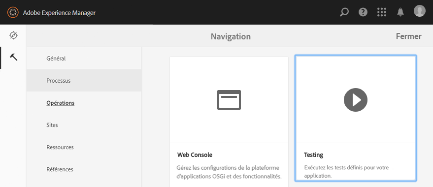
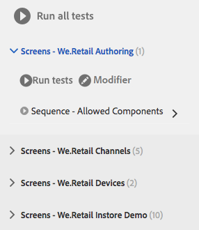
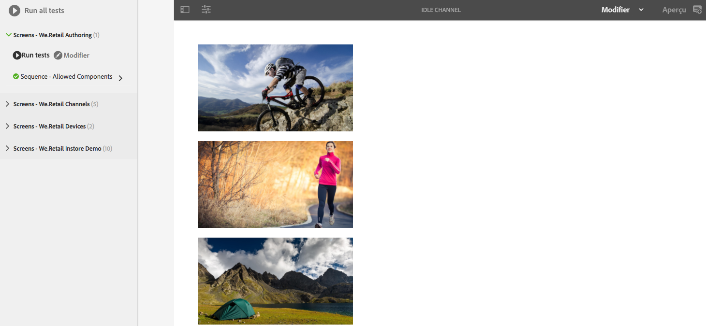
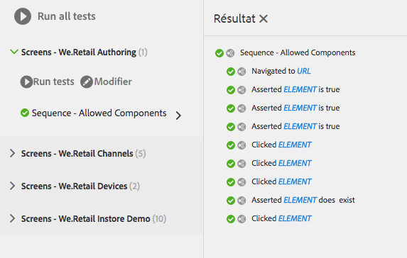
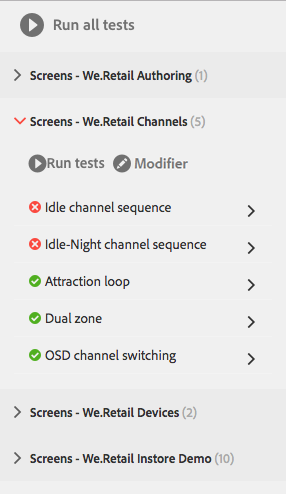
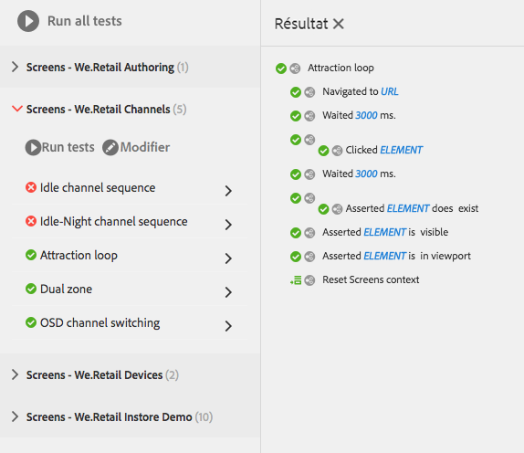

# Tester votre IU{#testing-your-ui}

AEM fournit un framework pour l’automatisation des tests pour votre IU AEM. Grâce au framework, vous développez et exécutez des tests d’IU directement dans un navigateur web. Ce framework fournit des API Javascript dédiés à la création de tests.

Le framework de test AEM utilise Hobbes.js, une bibliothèque de tests développée en Javascript. Le framework Hobbes.js a été développé pour tester AEM dans le cadre du processus de développement. Le framework est aujourd’hui disponible au public pour tester les applications AEM.

>[!NOTE]
>
>Reportez-vous à la [documentation](https://helpx.adobe.com/fr/experience-manager/6-4/sites/developing/using/reference-materials/test-api/index.html) Hobbes.js pour obtenir plus de détails sur l’API.

## Structure des tests {#structure-of-tests}

Lors de l’utilisation de tests automatisés dans AEM, il est important de comprendre les termes suivants :

|  |  |
|---|---|
| Action | Une **action** est une activité spécifique sur une page web, par exemple, un clic sur un lien ou un bouton. |
| Cas de test | Un **cas de test** est une situation spécifique qui peut être composée d’une ou de plusieurs **Actions**. |
| Suite de tests | Une **suite de tests** est un groupe de **cas de test** associés qui testent ensemble un cas d’utilisation spécifique. |

## Exécution de tests {#executing-tests}

### Affichage de suites de tests {#viewing-test-suites}

Ouvrez la console de test pour voir les suites de tests enregistrées. Le panneau Tests contient une liste de suites de tests et leurs cas de test.

Accédez à la console Outils via **Navigation globale -> Outils > Opérations -> Tests**.



Lors de l’ouverture de la console, les suites de tests sont répertoriées à gauche avec une option permettant de les exécuter en séquence. La partie à droite affichée avec un arrière-plan à damier est un espace réservé pour afficher le contenu de la page lors de l’exécution des tests.


### Exécution distincte d’une suite de tests {#running-a-single-test-suite}

Les suites de tests peuvent être exécutées séparément. Lorsque vous lancez une suite de tests, la page change au fur et à mesure que les cas de tests et leurs actions sont exécutés et une fois que les résultats apparaissent à la fin du test. Les icônes indiquent les résultats.

Une coche indique un test réussi :


Une icône « X » indique l’échec d’un test :


Pour exécuter une suite de tests :

1. Dans le panneau Tests, cliquez ou entrez sur le nom du cas de test que vous souhaitez exécuter pour développer les détails des actions.

   

1. Cliquez ou appuyez sur le bouton **Exécuter le test**.

   

1. L’espace réservé est remplacé par le contenu de la page lors de l’exécution du test.

   

1. Passez en revue les résultats du cas de test en cliquant ou en appuyant sur la description pour ouvrir le panneau **Résultat**. Appuyez ou cliquez sur le nom de votre cas de test dans le panneau **Résultat** pour afficher tous les détails.

   

### Exécution de plusieurs tests {#running-multiple-tests}

Les suites de tests s’exécutent séquentiellement dans l’ordre dans lequel elles sont visibles dans la console. Vous pouvez développer un test pour voir les résultats détaillés.



1. Dans le panneau Tests, appuyez ou cliquez sur le bouton **Exécuter tous les tests** ou sur le bouton **Exécuter les tests** sous le titre de la suite de tests que vous souhaitez exécuter.

   

1. Pour afficher les résultats de chaque cas de test, appuyez ou cliquez sur le titre du cas de test. Appuyez ou cliquez sur le nom de votre test dans le panneau **Résultat** pour afficher tous les détails.

   

## Création et utilisation d’une suite de tests simple {#creating-and-using-a-simple-test-suite}

La procédure suivante vous guide tout au long de la création et de l’exécution d’une suite de tests sur le [contenu We.Retail](/help/sites-developing/we-retail.md). Toutefois, vous pouvez facilement modifier le test pour utiliser une autre page web.

Pour plus d’informations sur la création de vos propres suites de tests, reportez-vous à la documentation de l’API [Hobbes.js](https://helpx.adobe.com/experience-manager/6-4/sites/developing/using/reference-materials/test-api/index.html).

1. Ouvrez CRXDE Lite. ([http://localhost:4502/crx/de](http://localhost:4502/crx/de))
1. Cliquez avec le bouton droit de la souris sur le dossier `/etc/clientlibs`, puis cliquez sur **Créer > Créer un dossier**. Entrez `myTests` comme nom et cliquez sur **OK**.
1. Cliquez avec le bouton droit sur le dossier `/etc/clientlibs/myTests` et cliquez sur **Créer > Créer un nœud**. Entrez les valeurs de propriété suivantes, puis cliquez sur **OK** :

   * Nom : `myFirstTest`
   * Type : `cq:ClientLibraryFolder`

1. Ajoutez les propriétés suivantes au nœud myFirstTest :

   | Nom | Type | Valeur |
   |---|---|---|
   | `categories` | `String[]` | `granite.testing.hobbes.tests` |
   | `dependencies` | `String[]` | `granite.testing.hobbes.testrunner` |

   >[!NOTE]
   >
   >**AEM Forms uniquement**
   >
   >Pour tester des formulaires adaptatifs, ajoutez les valeurs suivantes aux catégories et aux dépendances. Par exemple :
   >
   >**categories** : `granite.testing.hobbes.tests, granite.testing.hobbes.af.commons`
   >
   >**dependencies** : `granite.testing.hobbes.testrunner, granite.testing.hobbes.af`

1. Cliquez sur **Enregistrer tout**.
1. Cliquez avec le bouton droit sur le nœud `myFirstTest` et cliquez sur **Créer > Créer un fichier**. Nommez le fichier `js.txt` et cliquez sur **OK**.
1. Dans le fichier `js.txt`, entrez le texte suivant :

   ```
   #base=.
   myTestSuite.js
   ```

1. Cliquez sur **Enregistrer tout** et fermez le fichier `js.txt`
1. Cliquez avec le bouton droit sur le nœud `myFirstTest` et cliquez sur **Créer > Créer un fichier**. Nommez le fichier `myTestSuite.js` et cliquez sur **OK**.
1. Copiez le code suivant dans le fichier `myTestSuite.js`, puis enregistrez le fichier :

   ```
   new hobs.TestSuite("Experience Content Test Suite", {path:"/etc/clientlibs/myTests/myFirstTest/myTestSuite.js"})
      .addTestCase(new hobs.TestCase("Navigate to Experience Content")
         .navigateTo("/content/we-retail/us/en/experience/arctic-surfing-in-lofoten.html")
      )
      .addTestCase(new hobs.TestCase("Hover Over Topnav")
         .mouseover("li.visible-xs")
      )
      .addTestCase(new hobs.TestCase("Click Topnav Link")
         .click("li.active a")
   );
   ```

1. Accédez à la console **Tests** pour essayer votre suite de tests.
