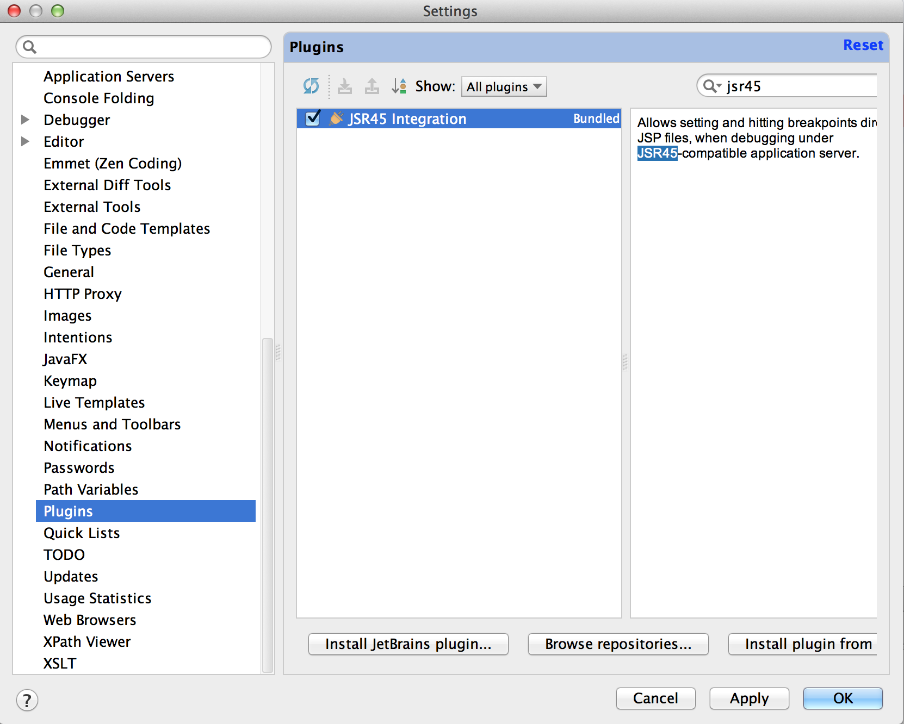

# Comment développer des projets AEM à l’aide d’IntelliJ IDEA{#how-to-develop-aem-projects-using-intellij-idea}

>[!CAUTION]
>
>AEM 6.4 a atteint la fin de la prise en charge étendue et cette documentation n’est plus mise à jour. Pour plus d’informations, voir notre [période de support technique](https://helpx.adobe.com/fr/support/programs/eol-matrix.html). Rechercher les versions prises en charge [here](https://experienceleague.adobe.com/docs/?lang=fr).

## Présentation {#overview}

Pour commencer AEM développement sur IntelliJ, les étapes suivantes sont nécessaires.

Chacune d’elles est expliquée plus en détail dans le reste de cette rubrique pratique.

* Installer IntelliJ
* Configuration de votre projet AEM basé sur Maven
* Préparation de la prise en charge JSP pour IntelliJ dans le fichier POM Maven
* Importation du projet Maven dans IntelliJ

>[!NOTE]
>
>Ce guide est basé sur IntelliJ IDEA Ultimate Edition 12.1.4 et AEM 5.6.1.

### Installation de IntelliJ IDEA {#install-intellij-idea}

Téléchargez IntelliJ IDEA à partir de [la page Téléchargements de JetBrains ;](https://www.jetbrains.com/idea/download/index.html).

Suivez ensuite les instructions d’installation de cette page.

### Configuration de votre projet AEM basé sur Maven {#set-up-your-aem-project-based-on-maven}

Ensuite, configurez le projet en utilisant Maven comme décrit à la rubrique [Création de projets AEM à l’aide d’Apache Maven](/help/sites-developing/ht-projects-maven.md).

Pour commencer à travailler sur des projets AEM dans IntelliJ IDEA, la configuration de base de la rubrique [Prise en main en 5 minutes](https://maven.apache.org/guides/getting-started/maven-in-five-minutes.html) est suffisante.

### Préparation de la prise en charge JSP pour IntelliJ IDEA {#prepare-jsp-support-for-intellij-idea}

IntelliJ IDEA peut également fournir une assistance pour travailler avec JSP, par exemple

* remplissage automatique des bibliothèques de balises
* la reconnaissance des objets définis par `<cq:defineObjects />` et `<sling:defineObjects />`.

Pour que cela fonctionne, suivez les instructions de la section [Comment travailler avec des JSP](/help/sites-developing/ht-projects-maven.md#how-to-work-with-jsps) de la rubrique [Création de projets AEM à l’aide d’Apache Maven](/help/sites-developing/ht-projects-maven.md).

### Importation du projet Maven {#import-the-maven-project}

1. Ouvrez la boîte de dialogue d’**importation** dans IntelliJ IDEA en

   * sélectionnant **Importer un projet** dans l’écran de bienvenue si aucun projet n’est ouvert ;
   * sélectionnant **Fichier -> Importer projet** dans le menu principal.

1. Dans la boîte d’importation, sélectionnez le fichier POM du projet.

   

1. Continuez avec les paramètres par défaut comme indiqué dans la boîte de dialogue ci-dessous.

   

1. Passez d’une boîte de dialogue à la suivante en cliquant sur **Suivant** et, dans la dernière, sur **Terminer**.
1. Vous êtes désormais prêt pour le développement d’AEM à l’aide d’IntelliJ IDEA.

   

### Débogage des JSP avec IntelliJ IDEA {#debugging-jsps-with-intellij-idea}

Les étapes suivantes sont nécessaires pour déboguer des JSP avec IntelliJ IDEA

* Configuration d’une facette Web dans le projet
* Installation du plugin de prise en charge de JSR45
* Configuration d’un profil de débogage
* Configuration d’AEM pour le mode de débogage

#### Configuration d’une facette Web dans le projet {#set-up-a-web-facet-in-the-project}

IntelliJ IDEA doit comprendre où trouver les JSP pour débogage. Comme IDEA ne peut pas interpréter les paramètres `content-package-maven-plugin`, ils doivent être configurés manuellement.

1. Accédez à **Fichier -> Structure du projet**.
1. Sélectionnez le module **Content**.
1. Cliquez sur **+** au-dessus de la liste des modules et sélectionnez **Web**.
1. Sélectionnez le `content/src/main/content/jcr_root subdirectory` de votre projet en tant que répertoire de ressources web, comme illustré dans la capture d’écran ci-dessous.


#### Installation du plugin de prise en charge de JSR45 {#install-the-jsr-support-plugin}

1. Accédez au volet **Plug-ins** des paramètres IntelliJ IDEA.
1. Accédez au plugin **Intégration de JSR45** et cochez la case à côté de lui.
1. Cliquez sur **Appliquer**.
1. Redémarrez IntelliJ IDEA lorsque vous y êtes invité.



#### Configuration d’un profil de débogage {#configure-a-debug-profile}

1. Accédez à **Exécuter -> Modifier les configurations**.
1. Appuyez sur **+** et sélectionnez **JSR45 à distance**.
1. Dans la boîte de configuration, sélectionnez **Configurer** en face de **Serveur d’applications** et configurez un serveur Générique.
1. Définissez la page de démarrage sur une URL appropriée si vous souhaitez ouvrir un navigateur lorsque vous commencez le débogage.
1. Supprimez toutes les tâches **Avant le lancement** si vous utilisez vlt autosync ou configurez les tâches Maven appropriées dans le cas contraire.
1. Dans le volet **Démarrage/Connexion**, modifiez le port, le cas échéant.
1. Copiez les arguments de ligne de commande proposés par IntelliJ IDEA.

 

#### Configuration d’AEM pour le mode de débogage {#configure-aem-for-debug-mode}

La dernière étape requise consiste à commencer AEM avec les options JVM proposées par IntelliJ IDEA.

Pour ce faire, démarrez directement le fichier jar AEM et ajoutez ces options, par exemple avec la ligne de commande suivante :

`java -Xdebug -Xrunjdwp:transport=dt_socket,address=58242,suspend=n,server=y -Xmx1024m -XX:MaxPermSize=256M -jar cq-quickstart-5.6.1.jar`

Vous pouvez également ajouter ces options au script de démarrage dans `crx-quickstart/bin/start` comme indiqué ci-dessous.

```shell
# ...

>[!CAUTION]
>
>AEM 6.4 has reached the end of extended support and this documentation is no longer updated. For further details, see our [technical support periods](https://helpx.adobe.com/support/programs/eol-matrix.html). Find the supported versions [here](https://experienceleague.adobe.com/docs/).

# default JVM options

>[!CAUTION]
>
>AEM 6.4 has reached the end of extended support and this documentation is no longer updated. For further details, see our [technical support periods](https://helpx.adobe.com/support/programs/eol-matrix.html). Find the supported versions [here](https://experienceleague.adobe.com/docs/).
if [ -z "$CQ_JVM_OPTS" ]; then
 CQ_JVM_OPTS='-server -Xmx1024m -XX:MaxPermSize=256M -Djava.awt.headless=true'
fi

CQ_JVM_OPTS="$CQ_JVM_OPTS -Xdebug -Xrunjdwp:transport=dt_socket,address=58242,suspend=n,server=y"

# ...

>[!CAUTION]
>
>AEM 6.4 has reached the end of extended support and this documentation is no longer updated. For further details, see our [technical support periods](https://helpx.adobe.com/support/programs/eol-matrix.html). Find the supported versions [here](https://experienceleague.adobe.com/docs/).
```

#### Démarrage du débogage {#start-debugging}

Vous êtes maintenant tous configuré pour le débogage de vos JSP dans AEM.

1. Sélectionnez **Exécuter -> Déboguer -> Votre profil de débogage**.
1. Définition des points d’arrêt dans votre code de composant
1. Accès à une page dans votre navigateur


### Débogage des lots avec IntelliJ IDEA {#debugging-bundles-with-intellij-idea}

Le code des lots peut être débogué à l’aide d’une connexion de débogage à distance générique standard. Vous pouvez suivre le [Documentation Jetbrain sur le débogage à distance](https://www.jetbrains.com/idea/Webhelp/run-debug-configuration-remote.html).
