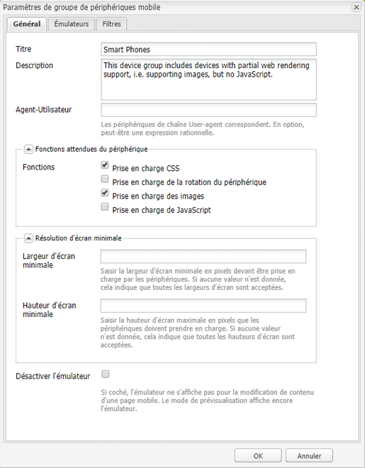
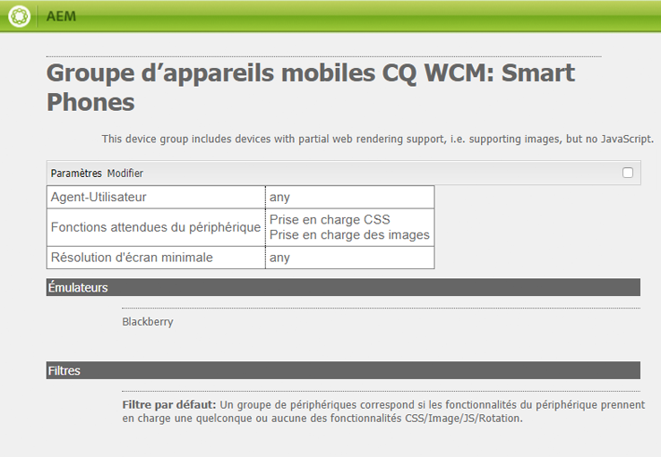
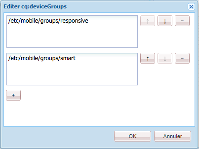
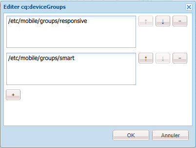
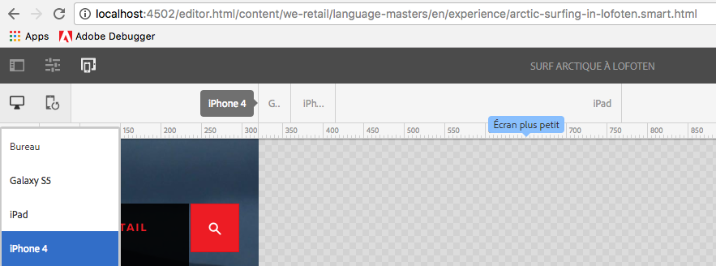

# Rendu de modèle adaptatif{#adaptive-template-rendering}

>[!CAUTION]
>
>AEM 6.4 a atteint la fin de la prise en charge étendue et cette documentation n’est plus mise à jour. Pour plus d’informations, voir notre [période de support technique](https://helpx.adobe.com/fr/support/programs/eol-matrix.html). Rechercher les versions prises en charge [here](https://experienceleague.adobe.com/docs/?lang=fr).

Le rendu de modèle adaptatif permet de gérer une page avec des variantes. Utile à l’origine pour fournir divers HTMLS de sortie pour les appareils mobiles (p. ex. téléphone polyvalent par rapport au smartphone), cette fonctionnalité est utile lorsque des expériences doivent être diffusées sur différents appareils qui ont besoin de balises différentes ou d’une sortie de HTML différente.

## Présentation {#overview}

Les modèles sont généralement créés autour d’une grille réactive. Les pages créées à partir de ces modèles sont entièrement réactives, s’adaptant automatiquement à la fenêtre de l’appareil du client. À l’aide de la barre d’outils de l’émulateur dans l’éditeur de pages, les auteurs peuvent cibler des dispositions sur des appareils spécifiques.

Il est également possible de configurer des modèles pour prendre en charge le rendu adaptatif. Lorsque les groupes d’appareils sont correctement configurés, la page est rendue avec un sélecteur différent dans l’URL lors de la sélection d’un appareil en mode émulateur. A l’aide d’un sélecteur, un rendu de page spécifique peut être appelé directement via l’URL.

N’oubliez pas de configurer vos groupes d’appareils :

* Chaque appareil doit appartenir à au moins un groupe d’appareils.
* Un appareil peut se trouver dans plusieurs groupes d’appareils.
* Les appareils pouvant appartenir à plusieurs groupes d’appareils, les sélecteurs peuvent être combinés.
* La combinaison de sélecteurs est évaluée de haut en bas, car ils sont conservés dans le référentiel.

>[!NOTE]
>
>Groupe d’appareils **Appareils réactifs** ne disposera jamais d’un sélecteur, car les appareils reconnus comme prenant en charge la conception réactive sont supposés n’avoir pas besoin d’une mise en page adaptative.

## Configuration {#configuration}

Les sélecteurs de rendu adaptatif peuvent être configurés pour les groupes d’appareils existants ou pour [des groupes que vous avez vous-même créés.](/help/sites-developing/mobile.md#device-groups)

Dans cet exemple, nous allons configurer le groupe d’appareils existant **Smart Phones** pour avoir un sélecteur de rendu adaptatif dans le **Page d’expérience** dans We.Retail.

1. Modifiez le groupe d’appareils qui nécessite un sélecteur adaptatif dans `http://localhost:4502/miscadmin#/etc/mobile/groups`.

   Définissez l’option **Désactiver l’émulateur** et enregistrez.

   

1. Le sélecteur est disponible pour **Blackberry** et **iPhone 4** si le groupe d’appareils **Smart Phone** est ajouté au modèle et aux structures de page dans les étapes suivantes.

   

1. Dans CRX DE Lite, autorisez l’utilisation du groupe d’appareils sur votre modèle en l’ajoutant à la propriété de chaîne à valeurs multiples `cq:deviceGroups` sur la structure de votre modèle.

   `/conf/<your-site>/settings/wcm/templates/<your-template>/structure/jcr:content`

   Par exemple, si nous souhaitons ajouter le groupe d’appareils Smart Phone :

   `/conf/we-retail/settings/wcm/templates/experience-page/structure/jcr:content`

   

1. Dans CRX DE Lite, autorisez l’utilisation du groupe d’appareils sur votre site en l’ajoutant à la propriété de chaîne à valeurs multiples `cq:deviceGroups` sur la structure de votre site.

   `/content/<your-site>/jcr:content`

   Par exemple, pour autoriser le groupe d’appareils **Smart Phone** :

   `/content/we-retail/jcr:content`

   

À présent, lorsque vous utilisez l’[émulateur](/help/sites-authoring/responsive-layout.md#layout-definitions-device-emulation-and-breakpoints) dans l’éditeur de pages (par exemple pour [modifier la mise en page ](/help/sites-authoring/responsive-layout.md)) et que vous choisissez un appareil du groupe d’appareils configuré, la page est rendue avec un sélecteur dans l’URL.

Dans notre exemple, lorsque vous modifiez une page basée sur le modèle **Page d’expérience** et que vous choisissez iPhone 4 dans l’émulateur, la page est rendue, y compris le sélecteur qui est alors `arctic-surfing-in-lofoten.smart.html` au lieu de `arctic-surfing-in-lofoten.html`.

La page peut également être appelée directement à l’aide de ce sélecteur.

