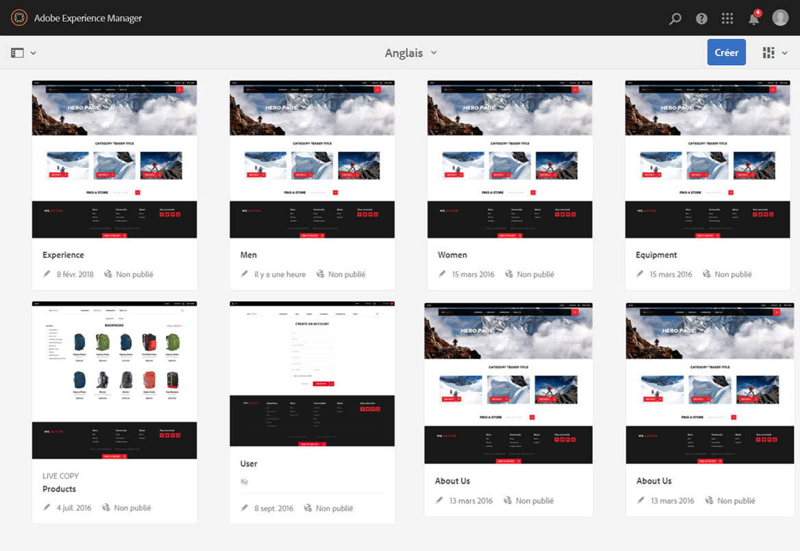
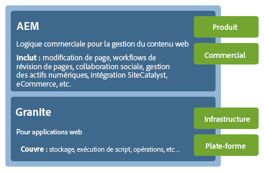
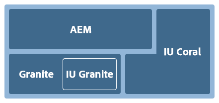
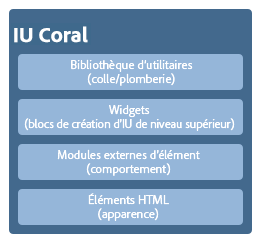

# Concepts de l’interface utilisateur (IU) tactile d’AEM{#concepts-of-the-aem-touch-enabled-ui}

Adobe a lancé, avec AEM 5.6, une nouvelle interface utilisateur tactile. Cette interface s’accompagne également de la technologie [responsive design](/help/sites-authoring/responsive-layout.md) pour l’environnement de création. Cette interface diffère sensiblement de l’IU classique d’origine, étant donné qu’elle est conçue pour fonctionner à la fois sur des appareils tactiles et des ordinateurs de bureau.

Cette interface utilisateur tactile remplace l’interface classique. Il s’agit désormais de l’interface standard pour AEM.

>[!NOTE]
>
>L’IU tactile est l’IU standard pour AEM, bien que l’IU classique soit toujours prise en charge.

L’interface utilisateur tactile se compose des éléments suivants :

* L’en-tête de la suite qui :

   * affiche le logo,
   * fournit un lien vers la navigation globale,
   * fournit le lien vers d’autres actions génériques, comme Rechercher, Aide, Solutions Marketing Cloud, Notifications et Paramètres utilisateur.

* Le rail de gauche (affiché lorsque cela s’avère nécessaire et pouvant être masqué) qui peut afficher les options suivantes :

   * Chronologie
   * Références
   * Filtres

* L’en-tête de navigation, qui dépend du contexte et peut afficher les éléments suivants :

   * Console en cours d’utilisation et/ou position au sein de cette console
   * Sélection pour le rail de gauche
   * Chemin de navigation
   * Accès aux actions **Créer** appropriées
   * Sélections de vues

* La zone de contenu qui :

   * répertorie les éléments de contenu (qu’il s’agisse de pages, de ressources, d’articles de forum, etc.),
   * peut être formatée suivant les besoins (colonne, carte ou liste, par exemple),
   * utilise la technologie responsive design (l’affichage est redimensionné automatiquement en fonction de la taille du terminal et/ou de la fenêtre),
   * utilise le défilement infini (plus de pagination, tous les éléments sont répertoriés sur une seule fenêtre).



>[!NOTE]
>
>Presque toutes les fonctionnalités d’AEM ont été adaptées à l’interface utilisateur tactile. Cependant, pour quelques fonctions, l’IU classique est rétablie. Pour plus d’informations, voir [État des fonctionnalités de l’interface utilisateur tactile](/help/release-notes/touch-ui-features-status.md).

L’interface utilisateur tactile a été conçue par Adobe pour garantir une expérience utilisateur homogène entre plusieurs produits. Elle repose sur les éléments suivants :

* **IU Coral** : implémentation du style vidéo d’Adobe pour l’interface utilisateur tactile. L’IU Coral fournit tous les éléments dont votre produit/projet/application web a besoin pour adopter le style visuel de l’interface utilisateur.
* Les composants de l’**IU Granite** sont créés avec l’IU Coral.

Les principes de base dans l’IU tactile sont les suivants :

* Le mobile d’abord (en gardant toutefois à l’esprit l’environnement bureautique)
* Responsive Design
* Affichage contextuel
* Possibilité de réutilisation
* Inclure la documentation de référence intégrée
* Inclure des tests intégrés
* Approche ascendante pour garantir l’application de ces principes à tous les éléments et composants

Pour un aperçu plus complet de la structure de l’IU tactile, consultez l’article [Structure de l’IU tactile AEM](/help/sites-developing/touch-ui-structure.md).

## Pile technologique AEM {#aem-technology-stack}

AEM utilise la plate-forme Granite qui inclut, entre autres, Java Content Repository.



## Granite {#granite}

Granite est la pile web ouverte d’Adobe. Elle fournit divers composants, parmi lesquels :

* Un lanceur d’applications
* Une structure OSGi dans laquelle tous les éléments sont déployés
* Plusieurs services du compendium OSGi pour la prise en charge de la création d’applications
* Une structure de journalisation complète fournissant diverses API de journalisation
* Une implémentation du référentiel CRX de la spécification d’API JCR
* La structure web Apache Sling
* Des parties supplémentaires du produit CRX actuel

>[!NOTE]
>
>Granite est exécuté en tant que projet de développement ouvert dans Adobe : les contributions au code, les discussions et la résolution des problèmes proviennent de l’ensemble de l’entreprise.
>
>Cependant, Granite n’est **pas** un projet Open Source. Il dépend très largement de plusieurs projets Open Source (Apache Sling, Felix, Jackrabbit et Lucene, en particulier), mais Adobe distingue clairement l’aspect public du contenu interne.

## IU Granite {#granite-ui}

La plate-forme engineering de Granite fournit également une structure d’IU de base. Les principaux objectifs de cette plate-forme sont les suivants :

* Fournir des widgets d’IU détaillés
* Mettre en œuvre les concepts d’IU et illustrer les meilleures pratiques (rendu de listes contenant de nombreux éléments, filtrage de listes, opérations CRUD sur les objets, assistants CUD, etc.)
* Fournir une interface d’administration extensible basée sur un module externe

Ces objectifs sont conformes aux exigences suivantes :

* Respecter le principe « Le mobile d’abord »
* Être extensible
* Être facile à remplacer



L’IU Granite :

* utilise l’architecture RESTful de Sling,
* implémente des bibliothèques de composants destinées à la création d’applications web axées sur le contenu,
* fournit des widgets d’IU détaillés,
* fournit une IU standardisée par défaut,
* est extensible,
* est conçue à la fois pour les appareils mobiles et les ordinateurs de bureau (respect du principe « Le mobile d’abord »),
* peut être utilisée dans n’importe quel produit/plate-forme/projet basé sur Granite ; AEM, par exemple.


* [Composants de base de l’IU Granite](#granite-ui-foundation-components)

   Cette bibliothèque de composants de base (Foundation) peut être utilisée ou étendue par d’autres bibliothèques.

* [Composants d’administration de l’IU Granite](#granite-ui-administration-components)

### Côté client / côté serveur {#client-side-vs-server-side}

La communication client-serveur au sein de l’IU Granite est constituée d’éléments hypertexte, et non d’objets. Il n’est donc pas nécessaire pour le client de comprendre la logique métier.

* Le serveur enrichit le code HTML avec des données sémantiques.
* Le client enrichit l’hypertexte avec des hypermédias (interaction).


#### Côté client {#client-side}

Dans ce cas, une extension du vocabulaire HTML est utilisée, de sorte que l’auteur puisse exprimer son intention de créer une application web interactive. Il s’agit d’une approche similaire à [WAI-ARIA](https://www.w3.org/TR/wai-aria/) et [microformats](http://microformats.org/).

Il est essentiellement constitué d’un ensemble de schémas d’interaction (envoi d’un formulaire de manière asynchrone, par exemple) qui sont interprétés par des codes JS et CSS, et exécutés du côté client. Le rôle du côté client consiste à améliorer le balisage (fourni en tant que capacité hypermédia par le serveur) pour garantir l’interactivité.

Le côté client est indépendant de toute technologie serveur. Tant que le serveur fournit le balisage approprié, le côté client peut remplir son rôle.

Actuellement, les codes JS et CSS sont fournis en tant que [clientlibs](/help/sites-developing/clientlibs.md) (bibliothèques clientes) Granite sous la catégorie suivante :

`granite.ui.foundation and granite.ui.foundation.admin`

Elles sont distribuées dans le cadre du module de contenu :

`granite.ui.content`

#### Côté serveur {#server-side}

Il est formé par un ensemble de composants sling qui permettent à l’auteur de *composer* rapidement une application web. Le développeur élabore les composants et l’auteur les assemble pour former une application web. Le rôle du côté serveur consiste à attribuer la capacité hypermédia (balisage) au client.

Actuellement, les composants résident dans le référentiel Granite à l’adresse :

`/libs/granite/ui/components/foundation`

Il est distribué dans le cadre du module de contenu :

`granite.ui.content`

### Différences avec l’IU classique {#differences-with-the-classic-ui}

Il est aussi intéressant d’examiner les différences entre l’IU Granite et ExtJS (utilisé pour l’IU classique) :

<table> 
 <tbody> 
  <tr> 
   <td><strong>ExtJS</strong></td> 
   <td><strong>IU Granite</strong></td> 
  </tr> 
  <tr> 
   <td>Appel de procédure à distance<br /> </td> 
   <td>Transmissions d’état</td> 
  </tr> 
  <tr> 
   <td>Objets de transfert de données</td> 
   <td>Hypermédia</td> 
  </tr> 
  <tr> 
   <td>Le client connaît les paramètres internes du serveur</td> 
   <td>Le client ne connaît pas les informations internes</td> 
  </tr> 
  <tr> 
   <td>"Client gros"</td> 
   <td>"Client léger"</td> 
  </tr> 
  <tr> 
   <td>Bibliothèques clientes spécialisées</td> 
   <td>Bibliothèques client universelles</td> 
  </tr> 
 </tbody> 
</table>

### Composants de base de l’IU Granite {#granite-ui-foundation-components}

Les [composants de base de l’IU Granite](https://helpx.adobe.com/fr/experience-manager/6-4/sites/developing/using/reference-materials/granite-ui/api/jcr_root/libs/granite/ui/index.html) fournissent les éléments nécessaires à la création d’une interface utilisateur. Ils comprennent, entre autres, les éléments suivants :

* Bouton
* Lien hypertexte
* Avatar de l’utilisateur

Les composants de base se trouvent à l’emplacement suivant :

`/libs/granite/ui/components/foundation`

Cette bibliothèque contient un composant IU Granite pour chaque élément Coral. Un composant est axé sur le contenu et sa configuration réside dans le référentiel. Cela permet de composer une application IU Granite sans écrire manuellement de balises HTML.

Objectif:

* Modèle de composant des éléments HTML
* Composition du composant
* Test automatique des unités et des fonctionnalités

Mise en œuvre:

* Composition et configuration basées sur un répertoire
* Utilisation des fonctionnalités de test fournies par la plate-forme Granite
* Création de modèles JSP

Cette bibliothèque de composants de base (Foundation) peut être utilisée ou étendue par d’autres bibliothèques.

### ExtJS et composants IU Granite correspondants {#extjs-and-corresponding-granite-ui-components}

Lors de la mise à niveau du code ExtJS afin d’utiliser l’IU Granite, la liste ci-dessous fournit un aperçu des types de nœud et xtypes ExtJS, accompagnés des types de ressources IU Granite équivalents.

| **ExtJS xtype** | **Type de ressource de l’IU Granite** |
|---|---|
| `button` | `granite/ui/components/foundation/form/button` |
| `checkbox` | `granite/ui/components/foundation/form/checkbox` |
| `componentstyles` | `cq/gui/components/authoring/dialog/componentstyles` |
| `cqinclude` | `granite/ui/components/foundation/include` |
| `datetime` | `granite/ui/components/foundation/form/datepicker` |
| `dialogfieldset` | `granite/ui/components/foundation/form/fieldset` |
| `hidden` | `granite/ui/components/foundation/form/hidden` |
| `html5smartfile, html5smartimage` | `granite/ui/components/foundation/form/fileupload` |
| `multifield` | `granite/ui/components/foundation/form/multifield` |
| `numberfield` | `granite/ui/components/foundation/form/numberfield` |
| `pathfield, paragraphreference` | `granite/ui/components/foundation/form/pathbrowser` |
| `selection` | `granite/ui/components/foundation/form/select` |
| `sizefield` | `cq/gui/components/authoring/dialog/sizefield` |
| `tags` | `granite/ui/components/foundation/form/autocomplete` `cq/gui/components/common/datasources/tags` |
| `textarea` | `granite/ui/components/foundation/form/textarea` |
| `textfield` | `granite/ui/components/foundation/form/textfield` |

| **Type de noeud** | **Type de ressource de l’IU Granite** |
|---|---|
| `cq:WidgetCollection` | `granite/ui/components/foundation/container` |
| `cq:TabPanel` | `granite/ui/components/foundation/container` `granite/ui/components/foundation/layouts/tabs` |
| `cq:panel` | `granite/ui/components/foundation/container` |

### Composants d’administration de l’IU Granite {#granite-ui-administration-components}

Les [composants d’administration de l’IU Granite](https://helpx.adobe.com/experience-manager/6-4/sites/developing/using/reference-materials/granite-ui/api/jcr_root/libs/granite/ui/index.html) dépendent des composants de base pour fournir les éléments génériques que toute application d’administration peut implémenter. Ils comprennent, entre autres, les éléments suivants :

* Barre de navigation globale
* Rail (squelette)
* Panneau de recherche

Objectif:

* Apparence unifiée pour les applications d’administration
* Développement accéléré (RAD) pour les applications d’administration

Mise en œuvre:

* Composants prédéfinis à l’aide des composants de base.
* Les composants peuvent être personnalisés.

## IU Coral {#coral-ui}

L’interface utilisateur (IU) Coral est une implémentation du style visuel d’Adobe pour l’interface utilisateur tactile. Elle a été conçue par Adobe pour garantir une expérience utilisateur homogène entre plusieurs produits. Elle comprend tout ce dont vous avez besoin pour adopter le style visuel utilisé dans l’environnement de création.

>[!CAUTION]
>
>L’IU Coral est une bibliothèque d’IU mise à la disposition des clients AEM pour créer des applications et des interfaces web dans les limites d’utilisation du produit définies par leur licence.
>
>L’utilisation de l’IU Coral est autorisée uniquement dans les cas suivants :
>
>* Lorsqu’elle a été distribuée et fournie avec AEM.
>* Lors de l’extension de l’IU existante de l’environnement de création.
>* Documents marketing, publicités et présentations Adobe.
>* Interface utilisateur des applications de marque Adobe (la police ne doit pas être facilement accessible à d’autres fins).
>* Personnalisations mineures.

>
>
Vous devez éviter d’utiliser l’IU Coral dans les cas suivants :
>
>* Documents et autres éléments non liés à Adobe.
>* Environnements de création de contenu (dans lesquels les éléments précédents peuvent être générés par des tiers).
>* Applications/composants/pages web qui ne sont pas clairement associés à Adobe.

>


L’IU Coral est un ensemble de composantes de base destinées au développement d’applications web.



Conçu dès le début dans une optique de modularité, chaque module forme une couche distincte en fonction de son rôle principal. Bien que les couches aient été conçues pour une prise en charge mutuelle, elles peuvent, au besoin, être utilisées de manière indépendante. Cela permet d’implémenter l’expérience utilisateur de Coral dans n’importe quel environnement compatible HTML.

L’IU Coral n’exige pas l’utilisation d’un modèle, ni d’une plate-forme de développement spécifique. L’objectif principal de Coral est de fournir un balisage HTML5 net et unifié, indépendant de la méthode utilisée pour émettre les balises. Ce balisage peut être utilisé pour le rendu côté client ou serveur, les modèles, JSP, PHP ou encore les applications RIA Adobe Flash, pour ne citer que quelques exemples.

### Éléments HTML – Calque de balisage  {#html-elements-the-markup-layer}

Les éléments HTML offrent une apparence commune pour tous les éléments d’interface de base (y compris la barre de navigation, les boutons, les menus, le rail, etc.).

Au niveau le plus bas, un élément HTML est une balise HTML avec un nom de classe dédié. Les éléments plus complexes peuvent être composés de plusieurs balises, imbriquées les unes dans les autres (d’une manière spécifique).

Le code CSS est utilisé pour définir l’apparence réelle. Pour qu’il soit possible de personnaliser facilement l’apparence (dans le cas d’une valorisation de marque, par exemple), les valeurs de style proprement dites sont déclarées en tant que variables qui sont étendues par le préprocesseur [LESS](https://lesscss.org/) lors de la phase d’exécution.

Objectif:

* Uniformiser l’apparence au niveau des éléments d’interface de base
* Fournir le système de grille par défaut

Mise en œuvre:

* Balises HTML dont les styles sont inspirés par [bootstrap](https://twitter.github.com/bootstrap/).
* Les classes sont définies dans des fichiers LESS.
* Les icônes sont définies sous la forme de sprites de police.

Par exemple, le balisage suivant :

```xml
<button class="btn btn-large btn-primary" type="button">Large button</button> 
<button class="btn btn-large" type="button">Large button</button>
```

S’affiche sous la forme :


L’apparence est définie dans un fichier LESS et liée à un élément par un nom de classe dédié (l’extrait suivant a été raccourci dans un souci de concision) :

```xml
.btn {
    font-size: @baseFontSize; 
    line-height: @baseLineHeight; 
    .buttonBackground(@btnBackground,
                                @btnBackgroundHighlight,
                                @grayDark, 0 1px 1px rgba(255,255,255,.75));
```

Les valeurs réelles sont définies dans un fichier de variables LESS (l’extrait suivant a été raccourci dans un souci de concision) :

```xml
@btnBackgroundHighlight: darken(@white, 10%); 
@btnPrimaryBackgroundHighlight: spin(@btnPrimaryBackground, 20%); 
@baseFontSize: 17px;
@baseFontFamily: @sansFontFamily;
```

### Modules externes d’éléments {#element-plugins}

Plusieurs des éléments HTML devront se comporter de façon dynamique ; en ouvrant et en fermant des menus contextuels, par exemple. Il s’agit du rôle des modules externes d’élément, qui exécutent ces tâches en manipulant le modèle DOM à l’aide de JavaScript.

Un module externe est soit :

* Conçu pour fonctionner sur un élément DOM spécifique. Par exemple, un module externe de boîte de dialogue s’attend à trouver `DIV class=dialog`
* Générique par nature. Par exemple, un gestionnaire de mises en page fournit la disposition pour toute liste d’éléments `DIV` ou `LI`.

Le comportement du module externe peut être personnalisé en utilisant l’une des méthodes suivantes :

* Transmission des paramètres via un appel JavaScript
* Utilisation d’attributs `data-*` dédiés liés aux balises HTML

Bien que le développeur puisse choisir la méthode la mieux adaptée à chaque module externe, le principe de base consiste à utiliser :

* `data-*` attributs pour les options liées à la mise en page HTML. pour indiquer le nombre de colonnes, par exemple.
* Des options/classes API pour les fonctionnalités liées aux données ; pour créer la liste des éléments à afficher, par exemple.

Le même concept est utilisé pour implémenter la validation de formulaire. Pour un élément que vous souhaitez valider, vous devez spécifier le formulaire de saisie requis sous la forme d’un attribut `data-*` personnalisé. Cet attribut est ensuite utilisé comme option pour un module externe de validation.

>[!NOTE]
>
>La validation de formulaire native au format HTML5 doit être utilisée lorsque cela s’avère possible et/ou s’il y a une volonté de l’enrichir.

Objectif:

* Indiquer le comportement dynamique pour les éléments HTML
* Fournir des dispositions personnalisées impossibles à obtenir avec du code PSS pur
* Effectuer la validation de formulaire
* Effectuer une manipulation DOM avancée

Mise en œuvre:

* Module externe jQuery, lié à un ou plusieurs éléments DOM spécifiques.
* Utilisation d’attributs `data-*` pour personnaliser le comportement

Extrait d’exemples de balisage (notez les options spécifiées en tant que data-&amp;ast; Attributs) :

```xml
<ul data-column-width="220" data-layout="card" class="cards">
  <li class="item">
    <div class="thumbnail">
       
      <div class="caption">
        <h4>Toolbar</h4>
          <p><small>toolbar</small><br></p>
      </div>
    </div>
  </li>
  <li class="item">
    <div class="thumbnail">
       
      <div class="caption">
        <h4>Toolbar</h4>
        <p><small>toolbar</small><br></p>
      </div>
    </div>
  </li>
```

Appel au module externe jQuery :

```
$(‘.cards’).cardlayout ();
```

Le résultat obtenu est le suivant :


Le module externe `cardLayout` dispose les éléments `UL` entre crochets sur leurs hauteurs respectives, en tenant également compte de la largeur du parent.

### Widgets d’éléments HTML {#html-elements-widgets}

Un widget combine un ou plusieurs éléments de base avec un module externe JavaScript afin de former des éléments d’interface de « niveau supérieur ». Ils peuvent implémenter un comportement plus complexe, ainsi qu’une apparence plus complexe que celle présentée par un seul élément. Le sélecteur de balises et les widgets de rail constituent deux bons exemples.

Un widget peut se déclencher et écouter des événements personnalisés pour coopérer avec d’autres widgets sur la page. Certains widgets sont, en fait, des widgets jQuery natifs qui utilisent les éléments HTML Coral.

Objectif:

* Implémenter des éléments d’IU de niveau supérieur présentant un comportement complexe
* Déclencher et gérer des événements

Mise en œuvre:

* Module externe jQuery + balises HTML
* Peut utiliser des modèles côté client/serveur

Voici un exemple de balisage :

```
<input type="text" name="tags" placeholder="Tags" class="tagManager"/>
```

Appel au module externe jQuery (avec options) :

```
$(".tagManager").tagsManager({
        prefilled: ["Pisa", "Rome"] })
```

Le module externe émet des balises HTML (ce balisage utilise des éléments de base, lesquels peuvent, à leur tour, utiliser d’autres modules externes en interne) :

```
<span>Pisa</span>
<a title="Removing tag" tagidtoremove="0"
   id="myRemover_0" class="myTagRemover" href="#">x</a></span>

<span id="myTag_1" class="myTag"><span>Rome</span>
<a title="Removing tag" tagidtoremove="1"
   id="myRemover_1" class="myTagRemover" href="#">x</a></span>

<input type="text" data-original-title="" class="input-medium tagManager"
       placeholder="Tags" name="tags" data-provide="typeahead" data-items="6"
       autocomplete="off">
```

Le résultat obtenu est le suivant :


### Bibliothèque Utility {#utility-library}

Cette bibliothèque rassemble des fonctions et/ou modules externes d’assistance JavaScript qui sont :

* indépendants de l’interface utilisateur,
* mais indispensables pour créer des applications web riches en fonctionnalités.

Il s’agit notamment de la gestion XSS et du bus d’événements.

Bien que les widgets et les modules externes d’éléments HTML puissent dépendre des fonctionnalités fournies par la bibliothèque Utility, cette dernière ne peut pas présenter de dépendance dure envers les éléments, ni envers les widgets proprement dits.

Objectif:

* Fourniture de fonctionnalités communes
* Implémentation du bus d’événements
* Modèles côté client
* XSS

Mise en œuvre:

* Modules externes jQuery ou modules JavaScript compatibles AMD
