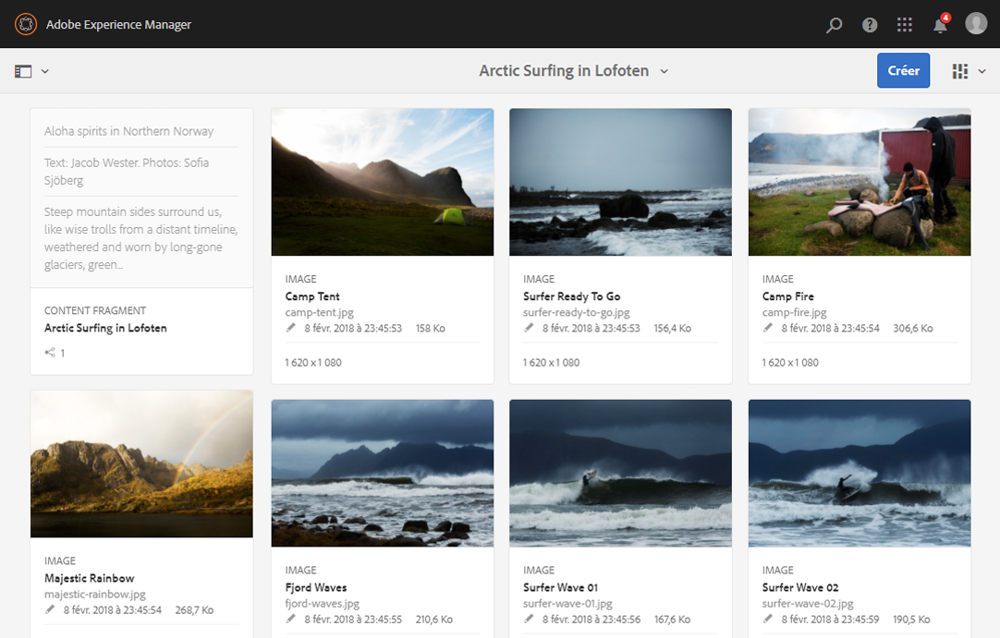
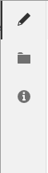
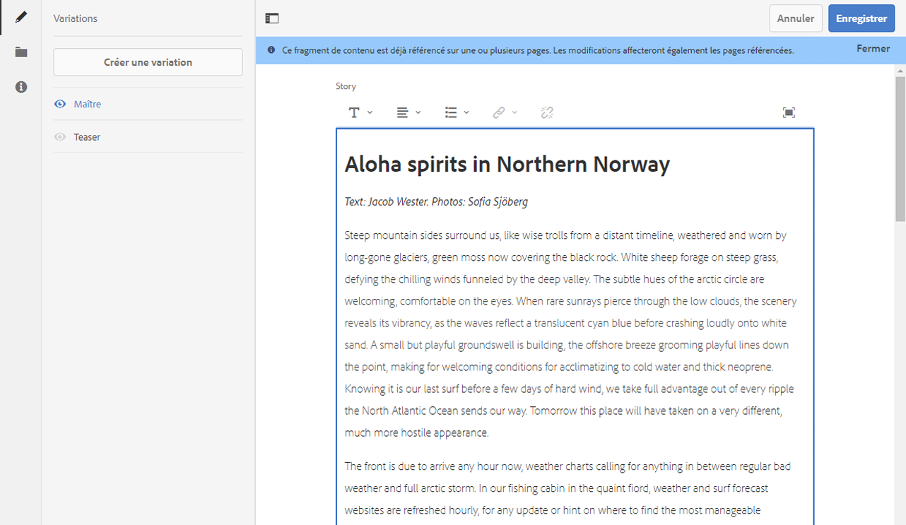
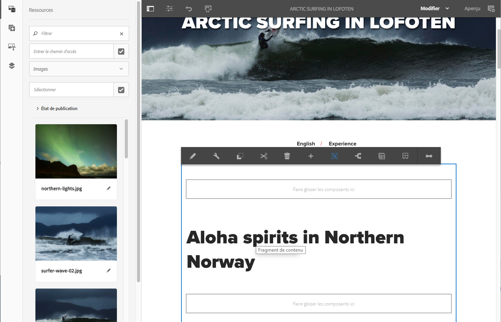

# Test des fragments de contenu dans We.Retail{#trying-out-content-fragments-in-we-retail}

>[!CAUTION]
>
>AEM 6.4 a atteint la fin de la prise en charge étendue et cette documentation n’est plus mise à jour. Pour plus d’informations, voir notre [période de support technique](https://helpx.adobe.com/fr/support/programs/eol-matrix.html). Rechercher les versions prises en charge [here](https://experienceleague.adobe.com/docs/?lang=fr).

Les fragments de contenu vous permettent de créer du contenu compatible avec tous les canaux, ainsi que des variantes (éventuellement spécifiques aux canaux). **We.Retail** (disponible en tant qu’instance prête à l’emploi d’AEM) fournit le fragment **Arctic Surfing in Lofoten** comme échantillon de base. Cela illustre que :

* Les fragments de contenu Adobe Experience Manager (AEM) sont [créés et gérés en tant que ressources indépendantes de la page](/help/assets/content-fragments.md). Ils vous permettent de créer du contenu compatible avec tous les canaux, ainsi que des variations (éventuellement spécifiques aux canaux).

   * Consultez la section [Emplacement des ressources de Fragment de contenu dans We.Retail](#where-to-find-content-fragments-in-we-retail).

* Vous pouvez ensuite [utiliser ces fragments et leurs variantes lors de la création](/help/sites-authoring/content-fragments.md) de vos pages de contenu.

   * Consultez la section [Où les fragments de contenu sont-ils utilisés dans We.Retail](#where-content-fragments-are-used-in-we-retail).

Pour consulter la documentation complète traitant de la création, de la gestion, de l’utilisation et du développement de fragments de contenu :

* Consultez la section [Informations supplémentaires](#further-information).

>[!NOTE]
>
>Les **fragments de contenu** et les **[fragments d’expérience](/help/sites-authoring/experience-fragments.md)** représentent deux fonctions distinctes d’AEM :
>
>* **Fragments de contenu** sont du contenu éditorial, principalement du texte et des images associées. Il s’agit de contenu pur, sans conception ni mise en page.
>* Les **fragments d’expérience** désignent un contenu parfaitement mis en page : un fragment de page web.
>
>Les fragments d’expérience peuvent être composés de contenu sous la forme de fragments de contenu, mais pas l’inverse.

## Emplacement des fragments de contenu dans We.Retail {#where-to-find-content-fragments-in-we-retail}

We.Retail comprend plusieurs échantillons de fragments de contenu ; accédez à **Ressources**, **Fichiers**, **We.Retail**, **Anglais**, **Expériences**.

Vous y trouverez notamment **Arctic Surfing in Lofoten**, un fragment avec des ressources visuelles associées :

* Accédez à **Ressources**, **Fichiers**, **We.Retail**, **Anglais**, **Expériences**, **Arctic Surfing in Lofoten** :

   * [http://localhost:4502/assets.html/content/dam/we-retail/en/experiences/arctic-surfing-in-lofoten](http://localhost:4502/assets.html/content/dam/we-retail/en/experiences/arctic-surfing-in-lofoten)

Vous pouvez sélectionner et modifier le fragment **Arctic Surfing in Lofoten** :

* [http://localhost:4502/editor.html/content/dam/we-retail/en/experiences/arctic-surfing-in-lofoten/arctic-surfing-in-lofoten](http://localhost:4502/editor.html/content/dam/we-retail/en/experiences/arctic-surfing-in-lofoten/arctic-surfing-in-lofoten)

Ici, vous pouvez [modification et gestion](/help/assets/content-fragments.md) votre fragment à l’aide des onglets (panneau de gauche) :

 

* **[Variations](/help/assets/content-fragments-variations.md)**, y compris [Markdown](/help/assets/content-fragments-markdown.md) 

* **[Contenu associé](/help/assets/content-fragments-assoc-content.md)**
* **[Métadonnées](/help/assets/content-fragments-metadata.md)**

## Emplacement d’utilisation des fragments de contenu dans We.Retail {#where-content-fragments-are-used-in-we-retail}

Illustration [création de page avec un fragment de contenu](/help/sites-authoring/content-fragments.md) plusieurs exemples de pages sont proposés sous, par exemple :

* [http://localhost:4502/sites.html/content/we-retail/language-masters/en/experience](http://localhost:4502/sites.html/content/we-retail/language-masters/en/experience)

Le fragment de contenu **Arctic Surfing in Lofoten**, par exemple, est référencé sur la page Sites :

* Accédez à **Sites**, **We.Retail**, **Gabarits de langue**, **Anglais**, **Expérience**. Ouvrez ensuite le fragment **Arctic Surfing in Lofoten** en vue de le modifier :

   * [http://localhost:4502/editor.html/content/we-retail/language-masters/en/experience/arctic-surfing-in-lofoten.html](http://localhost:4502/editor.html/content/we-retail/language-masters/en/experience/arctic-surfing-in-lofoten.html)

## Informations supplémentaires {#further-information}

Pour plus d’informations, consultez :

* [Utilisation de fragments de contenu](/help/assets/content-fragments.md)

   * Découvrez comment créer, modifier et gérer vos ressources Fragment de contenu.

* [Création de page à partir de fragments de contenu](/help/sites-authoring/content-fragments.md)

   * Utilisez votre fragment de contenu lors de la création d’une page.

* [Développement de composants AEM pour les fragments de contenu](/help/sites-developing/components-content-fragments.md)

   * Une présentation des composants pour les fragments de contenu.

* [Développement et extension de fragments de contenu](/help/sites-developing/customizing-content-fragments.md)

   * Les informations de cette section vous aident à développer et à étendre des fragments de contenu.
