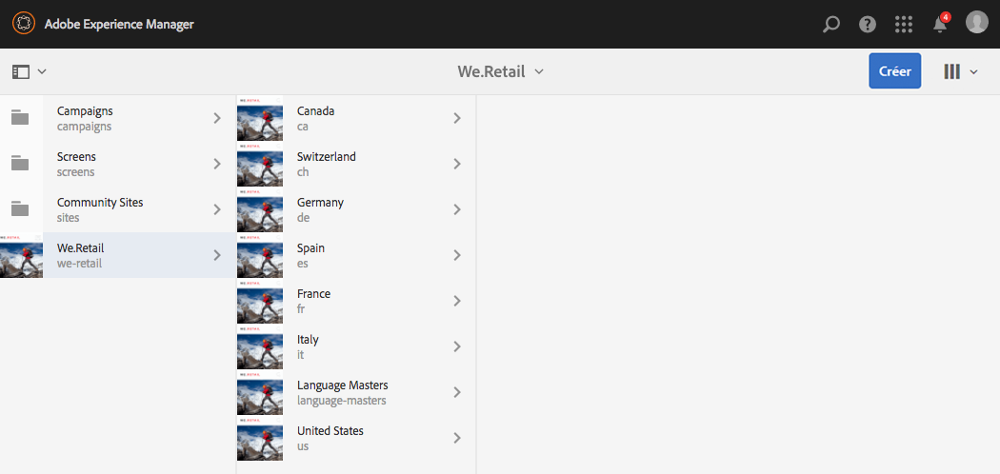
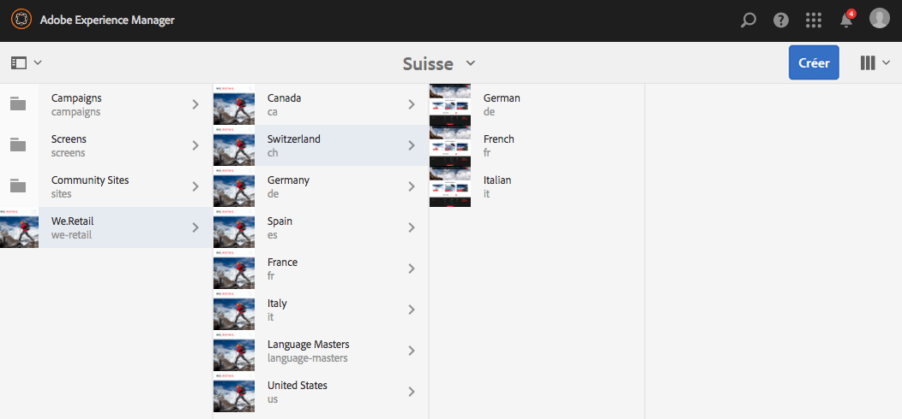
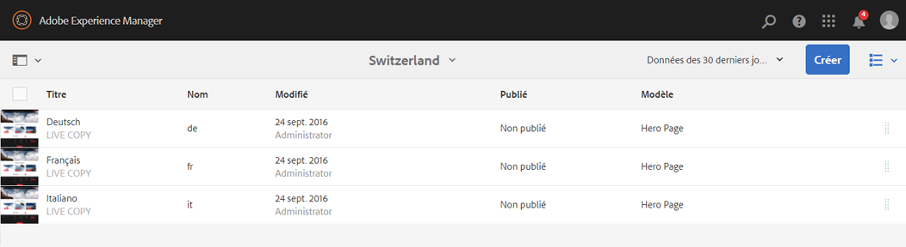
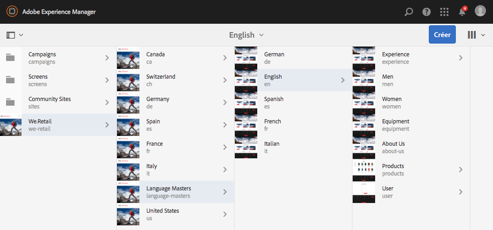
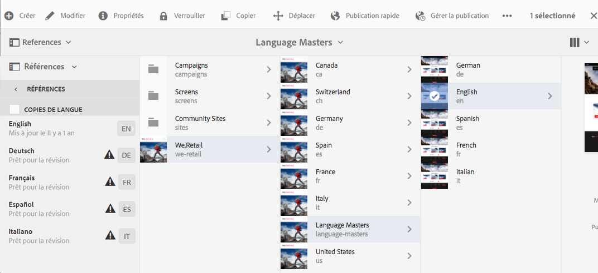
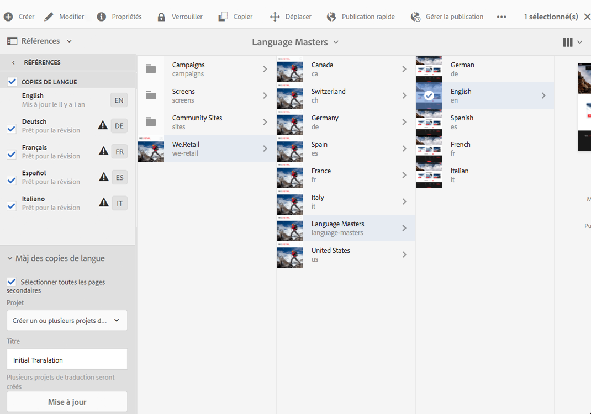
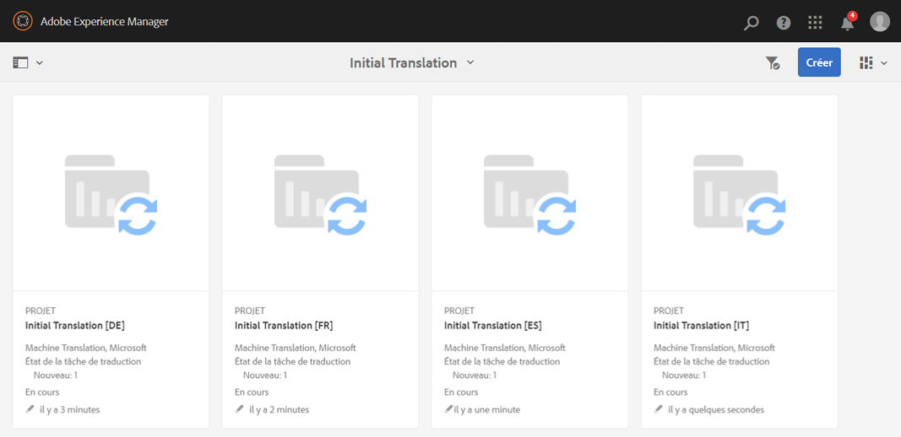
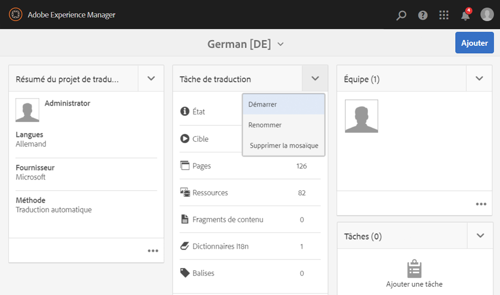
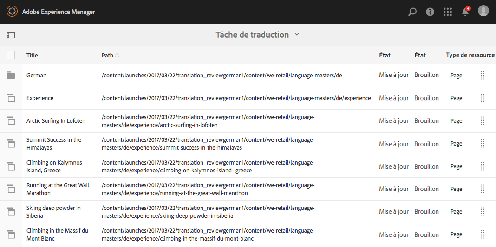
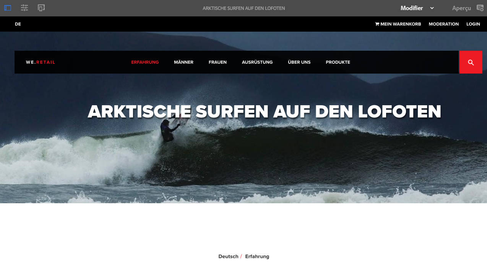

# Test de la structure de site globalisée dans We.Retail{#trying-out-the-globalized-site-structure-in-we-retail}

>[!CAUTION]
>
>AEM 6.4 a atteint la fin de la prise en charge étendue et cette documentation n’est plus mise à jour. Pour plus d’informations, voir notre [période de support technique](https://helpx.adobe.com/fr/support/programs/eol-matrix.html). Rechercher les versions prises en charge [here](https://experienceleague.adobe.com/docs/?lang=fr).

We.Retail a été créé avec une structure de site globalisée offrant des gabarits de langue qui peuvent être copiés en direct sur des sites web spécifiques à un pays. Tout est prêt à l’emploi pour vous permettre d’expérimenter cette structure et les fonctionnalités de traduction intégrées.

## Essayer de le faire {#trying-it-out}

1. Ouvrez la console Sites à partir de **Navigation globale -> Sites**.
1. Passez en mode Colonnes (s’il n’est pas déjà principal) et sélectionnez We.Retail. Notez l’exemple de structure pour la Suisse, les États-Unis, la France, etc. avec les gabarits de langue.

   

1. Sélectionnez Suisse et affichez les racines de la langue pour les langues de ce pays. Notez qu’il n’y a pas encore de contenu sous ces racines.

   

1. Basculez vers la vue Liste. Vous pouvez remarquer que les copies linguistiques pour les pays sont toutes des Live Copies.

   

1. Revenez au mode Colonnes et cliquez sur le Principal Langue pour afficher les racines principales de langue avec le contenu. Notez que seul l’anglais comporte du contenu.

   We.Retail ne contient aucun contenu traduit, mais la structure et la configuration sont en place pour vous permettre de démontrer les services de traduction.

   

1. Le gabarit de langue Anglais étant ouvert, ouvrez le rail **Références** dans la console Sites et sélectionnez ensuite **Copies de langue**.

   

1. Cochez la case en regard de l’option **Copies de langue** libellé pour sélectionner toutes les copies de langue. Dans le **Mise à jour des copies de langue** de la section , sélectionnez l’option pour **Création d’un projet de traduction**. Attribuez un nom au projet et cliquez sur **Mettre à jour**.

   

1. Un projet est créé pour chaque traduction de langue. Les afficher sous **Navigation -> Projets**.

   

1. Cliquez sur Allemand pour voir les détails du projet de traduction. Notez que l’état est dans **Version préliminaire**. Pour commencer la traduction avec le service de traduction Microsoft, cliquez sur le chevron en regard de l’option **Tâche de traduction** titre et sélectionner **Début**.

   

1. Le projet de traduction commence. Cliquez sur les points de suspension en bas de la carte Tâche de traduction pour afficher les détails. Pages avec l’état **Prêt pour la révision** ont déjà été traduits par le service de traduction.

   

1. Si vous sélectionnez l’une des pages dans la liste et ensuite **Aperçu dans Sites** dans la barre d’outils, la page traduite s’ouvre dans l’éditeur de page.

   

>[!NOTE]
>
>Cette procédure a démontré l’intégration intégrée à la traduction automatique de Microsoft. En utilisant la variable [AEM structure d’intégration de traduction](/help/sites-administering/translation.md), vous pouvez intégrer de nombreux services de traduction standard pour orchestrer la traduction d’AEM.

## Informations supplémentaires {#further-information}

Pour obtenir tous les détails techniques, reportez-vous au document de création [Traduction de contenu pour des sites multilingues](/help/sites-administering/translation.md).
