# Création de modèles de workflow{#creating-workflow-models}

>[!CAUTION]
>
>Pour utiliser l’interface utilisateur classique, consultez la [documentation AEM 6.3](https://helpx.adobe.com/experience-manager/6-3/sites-developing/workflows-models.html).

Vous créez un [modèle de workflow](/help/sites-developing/workflows.md#model) pour définir les étapes exécutées lorsqu’un utilisateur lance le workflow. Vous pouvez également définir des propriétés de modèle pour déterminer, par exemple, si le workflow est transitoire ou s’il utilise plusieurs ressources.

Lorsqu’un utilisateur lance un workflow, une instance est démarrée ; il s’agit du modèle d’exécution correspondant, créé lorsque vous [synchronisez](#sync-your-workflow-generate-a-runtime-model) vos modifications.

## Création d’un workflow  {#creating-a-new-workflow}

La première fois que vous créez un modèle de workflow, il se compose des éléments suivants :

* Les étapes, **[!UICONTROL Début de flux]** et **[!UICONTROL Fin de flux]**.

   Ces étapes représentent le début et la fin du workflow. Ces étapes sont obligatoires et ne peuvent pas être modifiées ou supprimées.

* Exemple d’étape **Participant** nommée **Étape 1**.

   Cette étape est configurée pour affecter un élément de travail à l’initiateur de workflow. Vous pouvez modifier ou supprimer cette étape et y ajouter d’autres étapes suivant les besoins.

Pour créer un workflow avec l’éditeur, procédez comme suit :

1. Ouvrez la console **[!UICONTROL Modèles de processus]**; par **[!UICONTROL Outils]**, **[!UICONTROL Workflow]**, **[!UICONTROL Modèles]** ou, par exemple :

   [http://localhost:4502/aem/workflow](http://localhost:4502/aem/workflow)

1. Sélectionnez **[!UICONTROL Create]** (Créer), puis **[!UICONTROL Creat Model]** (Créer un modèle). 
1. La boîte de dialogue **[!UICONTROL Ajouter le modèle de processus]** s&#39;affiche. Saisissez le **[!UICONTROL Titre]** et le **[!UICONTROL Nom]** (facultatif) avant de sélectionner **[!UICONTROL Terminé]**.
1. Le nouveau modèle est répertorié dans la console **[!UICONTROL Modèles de flux de travail]**.
1. Sélectionnez votre nouveau workflow, puis utilisez [**[!UICONTROL Modifier ]**pour l’ouvrir à des fins de configuration](#editing-a-workflow) :

   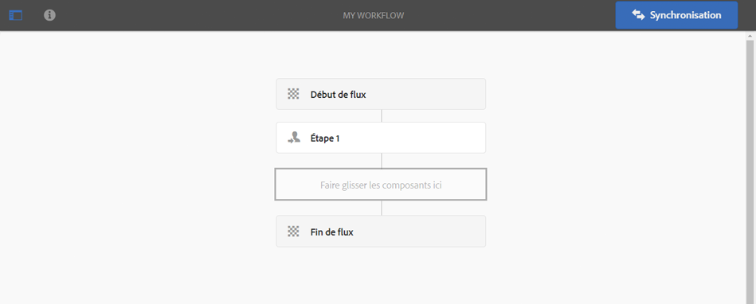

>[!NOTE]
>
>Si vous créez des modèles par programmation (à l’aide d’un module crx), vous pouvez également créer un sous-dossier à l’intérieur de ceux-ci :
>
>`/var/workflow/models`
>
>Par exemple, `/var/workflow/models/prototypes`
>
>Ce dossier peut ensuite être utilisé pour [gérer l’accès aux modèles qu’il contient](/help/sites-administering/workflows-managing.md#create-a-subfolder-in-var-workflow-models-and-apply-the-acl-to-that).

## Modification d’un workflow  {#editing-a-workflow}

Vous pouvez modifier un workflow existant pour effectuer les opérations suivantes :

* [Définir des étapes](#adding-a-step-to-a-model) et leurs [paramètres](#configuring-a-workflow-step)

* Configurer des propriétés de workflow, y compris des [phases](#configuring-workflow-stages-that-show-workflow-progress), [la nature transitoire du workflow](#creating-a-transient-workflow) et/ou [l’utilisation éventuelle de plusieurs ressources](#configuring-a-workflow-for-multi-resource-support)

La modification d’un workflow [**Par défaut ou hérité** (prêt à l’emploi)](#editing-a-default-or-legacy-workflow-for-the-first-time) comporte une étape supplémentaire, afin de vous assurer qu’une [copie sécurisée](/help/sites-developing/workflows-best-practices.md#locations-workflow-models) est effectuée avant que vos modifications ne soient effectuées.

Une fois les mises à jour apportées à votre workflow, vous devez utiliser l’option **[!UICONTROL Synchronisation]** pour **[!UICONTROL générer un modèle d’exécution]**. Pour plus d’informations, voir [Synchronisation de votre workflow](#sync-your-workflow-generate-a-runtime-model).

### Synchronisation de votre workflow – Générer un modèle d’exécution  {#sync-your-workflow-generate-a-runtime-model}

L’option **Synchronisation** (à droite dans la barre d’outils de l’éditeur) génère un [modèle d’exécution](/help/sites-developing/workflows.md#runtime-model). Il s’agit du modèle employé lorsqu’un utilisateur lance un flux. Si vous ne **[!UICONTROL synchronisez]** pas vos modifications, elles ne seront pas disponibles au moment de l’exécution.

Lorsque vous (ou un autre utilisateur) apportez des modifications au workflow, vous devez utiliser l’option **[!UICONTROL Synchronisation]** pour générer un modèle d’exécution ; même lorsque des boîtes de dialogue individuelles (pour les étapes, par exemple) comportent leurs propres options d’enregistrement.

Lorsque les modifications sont synchronisées avec le modèle d’exécution (enregistré), la mention **[!UICONTROL Synchronisé]** est affichée à la place.

Certaines étapes s’accompagnent de champs obligatoires et/ou d’une validation intégrée. Si ces conditions ne sont pas remplies, une erreur s’affiche lorsque vous essayez de **[!UICONTROL synchroniser]** le modèle. Par exemple, si aucun participant n’a été défini pour une étape **[!UICONTROL Participant]** :

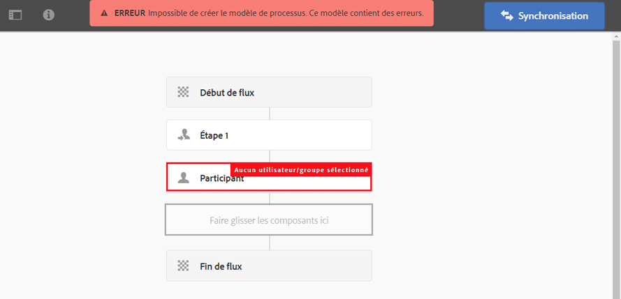

### Première modification d’un workflow par défaut ou hérité {#editing-a-default-or-legacy-workflow-for-the-first-time}

Lorsque vous ouvrez un [modèle par défaut et/ou hérité](/help/sites-developing/workflows.md#workflow-types) en vue de le modifier :

* Le navigateur **[!UICONTROL Steps]** n&#39;est pas disponible (côté gauche).
* Une action **[!UICONTROL Modifier]** est disponible dans la barre d’outils (côté droit).
* Au départ, le modèle et ses propriétés sont présentés en mode lecture seule comme suit :

   * Les workflows par défaut se trouvent dans `/libs`
   * Les workflows hérités se trouvent dans `/etc`

Lorsque vous sélectionnez **[!UICONTROL Modifier]** :

* prendre une copie du flux de travail dans `/conf`
* rendre le navigateur **[!UICONTROL Steps]** disponible
* Il est possible d’effectuer des modifications.

>[!NOTE]
>
>Pour plus d’informations, voir [Emplacements des modèles de workflow](/help/sites-developing/workflows-best-practices.md#locations-workflow-models).

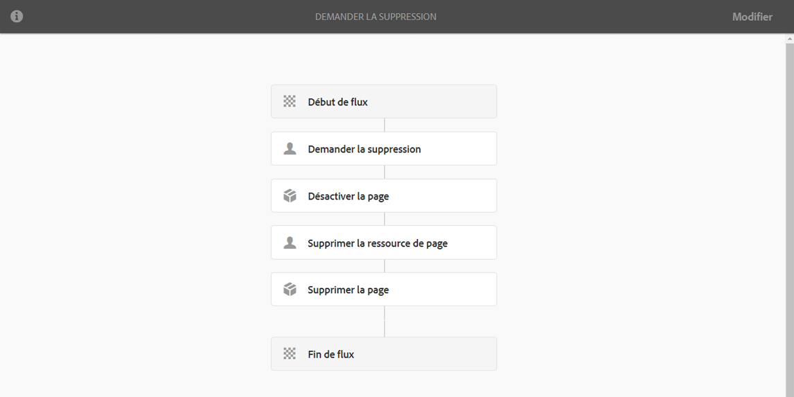

### Ajout d’une étape à un modèle {#adding-a-step-to-a-model}

Vous devez ajouter des étapes à votre modèle pour représenter l’activité à effectuer ; chaque étape exécute une activité bien précise. Une instance AEM standard propose une sélection de composants d’étape.

Lorsque vous modifiez un modèle, les étapes disponibles apparaissent dans les différents groupes du navigateur **[!UICONTROL Steps]**. Par exemple :

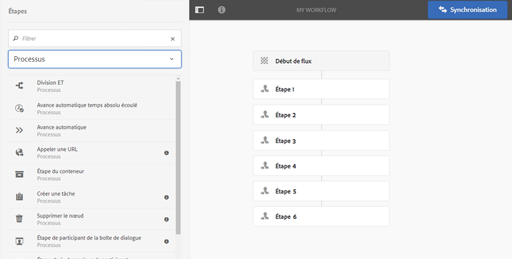

>[!NOTE]
>
>Pour plus d’informations sur les principaux composants d’étape qui sont installés avec AEM, voir [Référence des étapes du workflow](/help/sites-developing/workflows-step-ref.md).

**Pour ajouter une étape à un modèle** :

1. Ouvrez un modèle de workflow existant à modifier. Sélectionnez le modèle souhaité dans la console **[!UICONTROL Modèle de workflow]**, puis cliquez sur **[!UICONTROL Modifier]**.
1. Ouvrez le navigateur **[!UICONTROL Steps]**; à l’aide de **[!UICONTROL Activer/désactiver le panneau latéral]**, à l’extrémité gauche de la barre d’outils supérieure. Vous pouvez effectuer les opérations suivantes :

   * **[!UICONTROL Filtrer]** des étapes spécifiques.
   * Utiliser le menu déroulant pour limiter la sélection à un groupe d’étapes bien défini.
   * Sélectionnez l’icône Afficher la description  pour afficher plus de détails sur l’étape appropriée.

   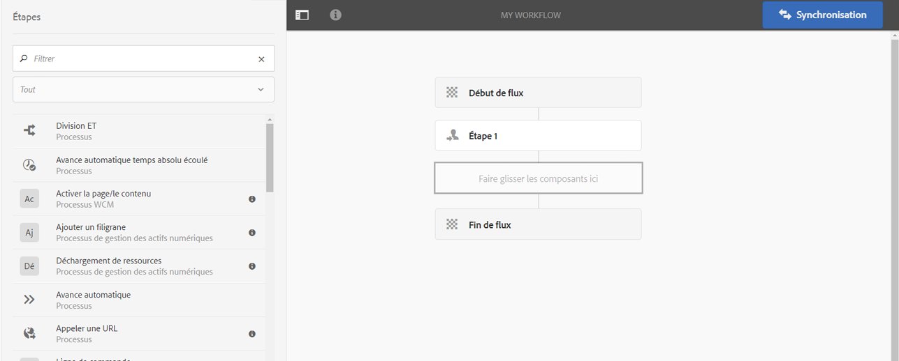

1. Faites glisser la ou les étapes appropriées vers l’emplacement souhaité dans le modèle.

   Par exemple, une **[!UICONTROL étape de participant]**.

   Une fois ajouté au flux, vous pouvez [configurer l’étape](#configuring-a-workflow-step).

   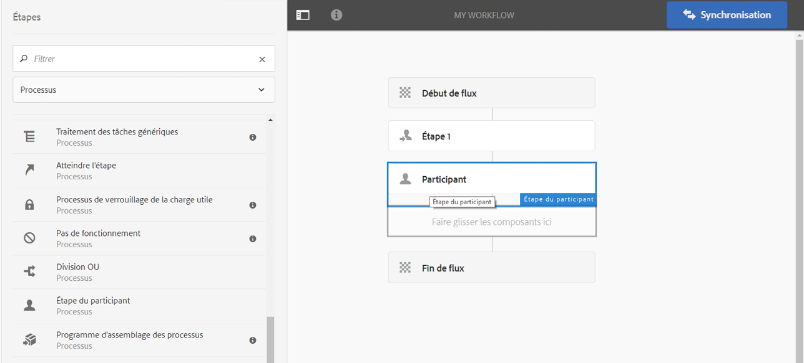

1. Ajoutez autant d’étapes, ou d’autres mises à jour, que nécessaire.

   Les étapes sont exécutées dans l’ordre dans lequel elles apparaissent dans le modèle. Après avoir ajouté des composants d’étape, vous pouvez les faire glisser vers un autre emplacement dans le modèle.

   Vous pouvez également copier, couper, coller, regrouper ou supprimer des étapes existantes, comme avec l’[éditeur de page](/help/sites-authoring/editing-content.md).

   Vous pouvez également réduire/développer les étapes fractionnées à l’aide de l’option de barre d’outils : 

1. Confirmez les modifications à l’aide de l’option **[!UICONTROL Synchronisation]** (barre d’outils de l’éditeur) afin de générer le modèle d’exécution.

   Pour plus d’informations, voir [Synchronisation de votre workflow](#sync-your-workflow-generate-a-runtime-model).

### Configuration d’une étape de workflow  {#configuring-a-workflow-step}

Vous pouvez **configurer** et personnaliser le comportement d’une étape du processus à l’aide des boîtes de dialogue **[!UICONTROL Propriétés de l’étape]**.

1. Pour ouvrir la boîte de dialogue **[!UICONTROL Propriétés de l’étape]** pour une étape :

   * Appuyez sur l’étape du modèle de processus et sélectionnez **[!UICONTROL Configurer]** dans la barre d’outils du composant.
   * Double-cliquez sur l’étape.

   >[!NOTE]
   >
   >Pour plus d’informations sur les principaux composants d’étape qui sont installés avec AEM, voir [Référence des étapes du workflow](/help/sites-developing/workflows-step-ref.md).

1. Configurez les **[!UICONTROL propriétés des étapes]** suivant vos besoins ; les propriétés disponibles dépendent du type d’étape. Plusieurs onglets peuvent également être disponibles. Par exemple, l’étape par défaut **[!UICONTROL Participant]**, présentée dans un nouveau flux de travail sous la forme `Step 1` :

   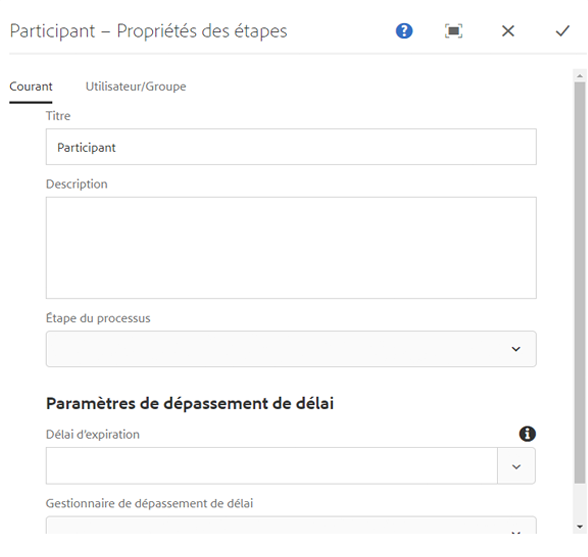

1. Appuyez sur la coche pour confirmer vos mises à jour.
1. Confirmez les modifications à l’aide de l’option **[!UICONTROL Synchronisation]** (barre d’outils de l’éditeur) afin de générer le modèle d’exécution.

   Pour plus d’informations, voir [Synchronisation de votre workflow](#sync-your-workflow-generate-a-runtime-model).

### Création d’un workflow transitoire  {#creating-a-transient-workflow}

Vous pouvez créer un modèle de workflow [Transitoire](/help/sites-developing/workflows.md#transient-workflows) lors de la phase de création proprement dite ou en modifiant un modèle existant :

1. Ouvrez le modèle de workflow à [modifier](#editing-a-workflow).
1. Sélectionnez **[!UICONTROL Propriétés du modèle de workflow]** dans la barre d’outils.
1. Dans la boîte de dialogue, activez **[!UICONTROL Processus transitoire]** (ou désactivez-le si nécessaire) :

   

1. Confirmez la modification à l’aide de l’option **[!UICONTROL Enregistrer et fermer]**, suivie de **[!UICONTROL Synchronisation]** (barre d’outils de l’éditeur) pour générer le modèle d’exécution.

   Pour plus d’informations, voir [Synchronisation de votre workflow](#sync-your-workflow-generate-a-runtime-model).

>[!NOTE]
>
>Lorsque vous exécutez un workflow en mode [transitoire](/help/sites-developing/workflows.md#transient-workflows), AEM ne stocke aucun historique de workflow. Par conséquent, [Chronologie](/help/sites-authoring/basic-handling.md#timeline) n’affiche aucune information relative au workflow. [](/help/sites-authoring/basic-handling.md#timeline)

### Mise à disposition des modèles de workflow dans l’interface utilisateur tactile {#make-workflow-models-available-in-touchui}

Si un modèle de processus est présent dans l’interface utilisateur classique, mais qu’il manque dans le menu contextuel de sélection du rail **[!UICONTROL Chronologie]** de l’interface utilisateur tactile, suivez la configuration pour le rendre disponible. Les étapes suivantes illustrent l’utilisation du modèle de flux de travaux intitulé **[!UICONTROL Demande d’Activation]**.

1. Vérifiez que le modèle n’est pas disponible dans l’interface utilisateur tactile. Accédez à un fichier à l&#39;aide du chemin `/assets.html/content/dam`. Sélectionnez un fichier. Ouvrez **[!UICONTROL Chronologie]** dans le rail gauche. Cliquez sur **[!UICONTROL Processus du Début]** et vérifiez que le modèle **[!UICONTROL Demande d&#39;Activation]** n&#39;est pas présent dans la liste contextuelle.

1. Accédez à **[!UICONTROL Outils > Général > Balisage]**. Sélectionnez **[!UICONTROL Workflow]**.

1. Sélectionnez **[!UICONTROL Créer > Créer une balise]**. Définissez **[!UICONTROL Titre]** comme `DAM` et **[!UICONTROL Nom]** comme `dam`. Sélectionnez **[!UICONTROL Envoyer]**.
   

1. Accédez à **[!UICONTROL Outils > Processus > Modèles]**. Sélectionnez **[!UICONTROL Demande d’Activation]**, puis **[!UICONTROL Modifier]**.

1. Sélectionnez **[!UICONTROL Modifier]**, puis ouvrez **[!UICONTROL Propriétés du modèle de processus]**. Accédez à l&#39;onglet **[!UICONTROL Basic]**.

1. Ajoutez le champ `Workflow : DAM` à **[!UICONTROL Balises]**. Confirmez la sélection à l’aide de la case à cocher (cochez).

1. Confirmez l’ajout de la balise avec **[!UICONTROL Enregistrer et fermer]**.
   

1. Terminez le processus avec **[!UICONTROL Sync]**. Le processus est désormais disponible dans l’interface utilisateur tactile.

### Configuration d’un workflow pour la prise en charge multi-ressource {#configuring-a-workflow-for-multi-resource-support}

Vous pouvez configurer un modèle de workflow pour la [Prise en charge multi-ressource](/help/sites-developing/workflows.md#multi-resource-support) lors de la création d’un modèle ou en modifiant un modèle existant :

1. Ouvrez le modèle de workflow à [modifier](#editing-a-workflow).
1. Sélectionnez **[!UICONTROL Propriétés du modèle de workflow]** dans la barre d’outils.

1. Dans la boîte de dialogue, activez **[!UICONTROL Prise en charge de ressources multiples]** (ou désactivez-la si nécessaire) :

   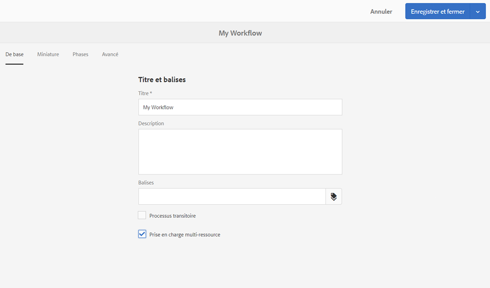

1. Confirmez la modification à l’aide de l’option **[!UICONTROL Enregistrer et fermer]**, suivie de **[!UICONTROL Synchronisation]** (barre d’outils de l’éditeur) pour générer le modèle d’exécution.

   Pour plus d’informations, voir [Synchronisation de votre workflow](#sync-your-workflow-generate-a-runtime-model).

### Configuration des phases de workflow (qui affichent la progression du workflow)  {#configuring-workflow-stages-that-show-workflow-progress}

Les [phases de workflow](/help/sites-developing/workflows.md#workflow-stages) vous aident à visualiser la progression d’un workflow lors de la gestion de tâches.

>[!CAUTION]
>
>Si les phases de workflow sont définies dans **[!UICONTROL Propriétés de la page]**, mais qu’elles ne sont utilisées pour aucune étape du workflow, aucune progression ne sera affichée dans la barre (quelle que soit l’étape actuelle du workflow).

Les phases qui doivent être disponibles sont définies dans les modèles de workflow ; les modèles de workflow existants peuvent être mis à jour afin d’inclure des définitions de phase. Vous pouvez définir un nombre illimité de phases pour le modèle de workflow.

Pour définir des **[!UICONTROL Phases]** pour votre workflow, procédez comme suit :

1. Ouvrez le modèle de workflow à modifier.
1. Sélectionnez **[!UICONTROL Propriétés du modèle de workflow]** dans la barre d’outils. Ouvrez ensuite l’onglet **[!UICONTROL Phases]**.
1. Ajoutez (et positionnez) les **[!UICONTROL Phases]** requises. Vous pouvez définir un nombre illimité de phases pour le modèle de workflow.

   Par exemple :

   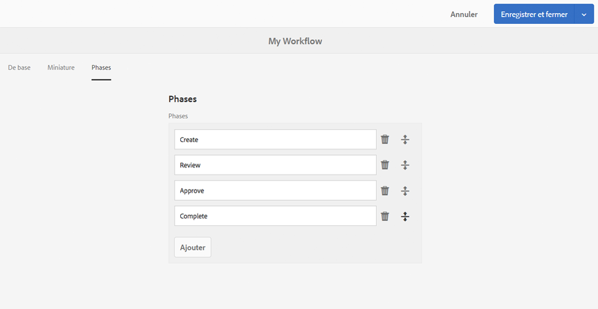

1. Cliquez sur **[!UICONTROL Enregistrer et fermer]** pour enregistrer les propriétés.
1. Affectez une phase à chacune des étapes du modèle de workflow. Par exemple :

   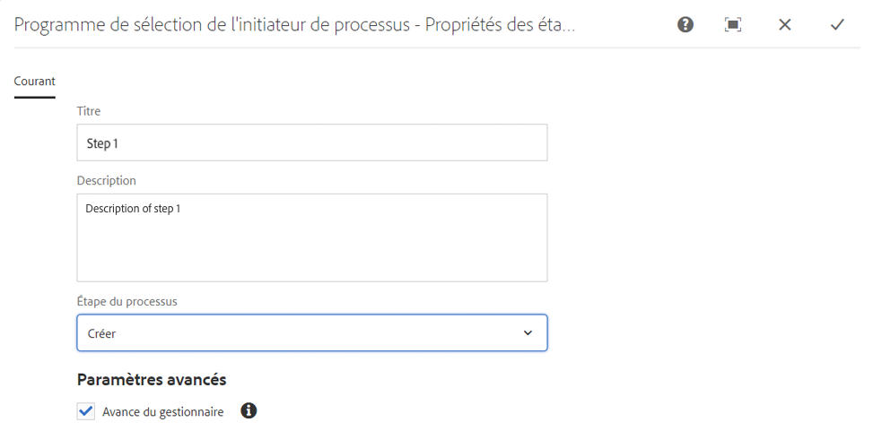

   Une phase peut être affectée à plusieurs étapes. Par exemple :

   | **Étape** | **Évaluation** |
   |---|---|
   | Étape 1 | Créer |
   | Étape 2 | Créer |
   | Étape 3 | Réviser |
   | Étape 4 | Approuver |
   | Étape 5 | Approuver |
   | Étape 6 | Terminer |

1. Confirmez les modifications à l’aide de l’option **[!UICONTROL Synchronisation]** (barre d’outils de l’éditeur) afin de générer le modèle d’exécution.

   Pour plus d’informations, voir [Synchronisation de votre workflow](#sync-your-workflow-generate-a-runtime-model).

## Exportation d’un modèle de workflow dans un module  {#exporting-a-workflow-model-in-a-package}

1. Créez un module à l’aide du [Gestionnaire de modules](/help/sites-administering/package-manager.md#package-manager) :

   1. Accédez à Package Manager au moyen de **[!UICONTROL Outils]**, **[!UICONTROL Déploiement]**, **[!UICONTROL Packages]**.
   1. Cliquez sur **[!UICONTROL Créer un package]**.
   1. Indiquez le **[!UICONTROL Nom du package]**, ainsi que d’autres détails suivant les besoins.
   1. Cliquez sur **[!UICONTROL OK]**.

1. Cliquez sur **[!UICONTROL Modifier]** dans la barre d’outils de votre nouveau module. 

1. Ouvrez l’onglet **[!UICONTROL Filtres]**.

1. Sélectionnez **[!UICONTROL Ajouter un filtre]** et indiquez le chemin d’accès de la *conception* de votre modèle de workflow :

   `/conf/global/settings/workflow/models/<*your-model-name*>`

   Cliquez sur **[!UICONTROL Terminé]**.

1. Sélectionnez **[!UICONTROL Ajouter un filtre]** et indiquez le chemin d’accès de votre modèle de workflow d’*exécution* :

   `/var/workflow/models/<*your-model-name*>`

   Cliquez sur **[!UICONTROL Terminé]**.

1. Ajoutez des filtres pour tout script personnalisé utilisé par votre modèle.
1. Cliquez sur **[!UICONTROL Enregistrer]** pour confirmer vos définitions de filtre.
1. Sélectionnez **[!UICONTROL Compilation]** dans la barre d’outils de votre définition de module.
1. Sélectionnez **[!UICONTROL Télécharger]** dans la barre d’outils du module.

## Utilisation de workflow pour traiter des envois du formulaire  {#using-workflows-to-process-form-submissions}

Vous pouvez configurer un formulaire pour qu’il soit traité par le workflow sélectionné. Lorsque des utilisateurs envoient le formulaire, une instance de workflow est créée avec les données de l’envoi en tant que charge utile.

Pour configurer le workflow afin qu’il soit utilisé avec votre formulaire, procédez comme suit :

1. Créez une page, puis ouvrez-la à des fins d’édition.
1. Ajoutez un composant **[!UICONTROL Formulaire]** à la page.
1. Configurez le composant **[!UICONTROL Début du formulaire]** qui s’est affiché dans la page.
1. Utilisez **[!UICONTROL Processus du Début]** pour sélectionner le processus souhaité parmi ceux disponibles :

   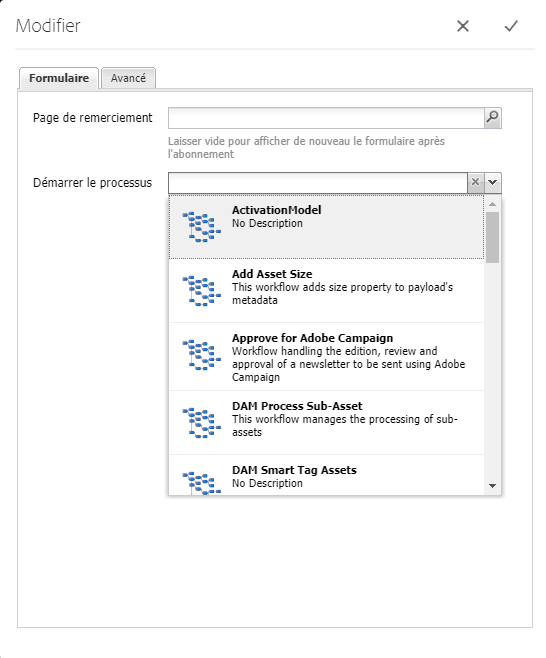

1. Appuyez sur la coche pour confirmer la nouvelle configuration du formulaire.

## Test de workflow {#testing-workflows}

Lorsque vous testez un workflow, il est conseillé d’utiliser divers types de charge utile, y compris des types différents de ceux pour lesquels il a été développé. Par exemple, s’il est prévu que votre workflow traite des ressources, testez-le en définissant une page comme charge utile et assurez-vous qu’il ne génère pas d’erreurs.

Vous pouvez, par exemple, tester votre nouveau workflow comme suit :

1. [Début du ](/help/sites-administering/workflows-starting.md) modèle de processus à partir de la console.
1. Définissez la **[!UICONTROL Charge utile]** et confirmez-la.

1. Prenez les mesures nécessaires au bon déroulement du workflow.
1. Surveillez les fichiers journaux pendant l’exécution du workflow.

Vous pouvez également configurer AEM pour qu’il affiche des messages **[!UICONTROL DEBUG]** dans les fichiers journaux. Voir [Journalisation](/help/sites-deploying/configure-logging.md) pour plus d&#39;informations et une fois le développement terminé, redéfinissez le **[!UICONTROL Niveau de journal]** sur **[!UICONTROL Info]**.

## Exemples {#examples}

### Exemple : création d’un workflow (simple) pour accepter ou rejeter une demande de publication {#example-creating-a-simple-workflow-to-accept-or-reject-a-request-for-publication}

Pour illustrer certaines des possibilités de création d&#39;un flux de travail, l&#39;exemple suivant crée une variante du flux de travail `Publish Example`.

1. [Créez un modèle de workflow](#creating-a-new-workflow).

   Le nouveau workflow sera composé des éléments suivants :

   * **[!UICONTROL Début de flux]**
   * `Step 1`
   * **[!UICONTROL Fin de flux]**

1. Supprimez `Step 1` (car le type d’étape est incorrect pour cet exemple) :

   * Cliquez sur l&#39;étape et sélectionnez **[!UICONTROL Supprimer]** dans la barre d&#39;outils du composant. Confirmez l’action.

1. Dans la sélection **[!UICONTROL Workflow]** du navigateur des étapes, faites glisser une **[!UICONTROL Étape du participant]** sur le workflow et placez-la entre **[!UICONTROL Début de flux]** et **[!UICONTROL Fin de flux*]*.
1. Pour ouvrir la boîte de dialogue des propriétés :

   * Cliquez sur l&#39;étape du participant et sélectionnez **[!UICONTROL Configurer]** dans la barre d&#39;outils du composant.
   * Double-cliquez sur l’étape de participant.

1. Dans l&#39;onglet **[!UICONTROL Common]**, saisissez `Validate Content` pour les champs **[!UICONTROL Titre]** et **[!UICONTROL Description]**.
1. Ouvrez l’onglet **[!UICONTROL Utilisateur/Groupe]** :

   * Activez **[!UICONTROL Avertir l’utilisateur par courrier électronique]**.
   * Sélectionnez `Administrator` ( `admin`) pour le champ **[!UICONTROL Utilisateur/Groupe]**.

   >[!NOTE]
   >
   >Pour que les courriers électroniques soient envoyés, [les informations relatives au service de messagerie et au compte utilisateur doivent être configurées](/help/sites-administering/notification.md).

1. Appuyez sur la coche pour confirmer les mises à jour.

   Vous serez redirigé vers l&#39;aperçu du modèle de flux de travail, où l&#39;étape du participant aura été renommée `Validate Content`.

1. Faites glisser un **[!UICONTROL Ou fractionner]** sur le workflow et placez-le entre `Validate Content` et **[!UICONTROL Fin de flux]**.
1. Ouvrez la **[!UICONTROL Division OU]** en vue de la configuration.
1. Configurer :

   * **[!UICONTROL Commun]** : sélectionner  **[!UICONTROL 2 branches]**
   * **[!UICONTROL Branche 1]** : sélectionnez **[!UICONTROL Itinéraire par défaut]**.
   * **[!UICONTROL Branche 2]** : assurez-vous que l’option **[!UICONTROL Itinéraire par défaut]** n’est pas sélectionnée.

1. Confirmez les mises à jour apportées à la **[!UICONTROL Division OU]**.
1. Faites glisser une **[!UICONTROL Étape de participant]** sur la branche de gauche, ouvrez les propriétés, spécifiez les valeurs suivantes, puis confirmez les modifications :

   * **[!UICONTROL Titre]**: `Reject Publish Request`
   * **[!UICONTROL Utilisateur/Groupe]** : par exemple, `projects-administrators`
   * **[!UICONTROL Notifier l&#39;utilisateur par courriel]** : Activez cette option pour que l’utilisateur soit averti par courrier électronique.

1. Faites glisser une **[!UICONTROL Étape du processus]** sur la branche de droite, ouvrez les propriétés, spécifiez les valeurs suivantes, puis confirmez les modifications :

   * **[!UICONTROL Titre]**: `Publish Page as Requested`
   * **[!UICONTROL Processus]** : sélectionnez  `Activate Page`. Ce processus publie la page sélectionnée sur les instances de l’éditeur.

1. Cliquez sur **[!UICONTROL Synchronisation]** (barre d’outils de l’éditeur) afin de générer le modèle d’exécution.

   Pour plus d’informations, voir [Synchronisation de votre workflow](#sync-your-workflow-generate-a-runtime-model).

   Votre nouveau modèle de workflow va se présenter comme suit :

   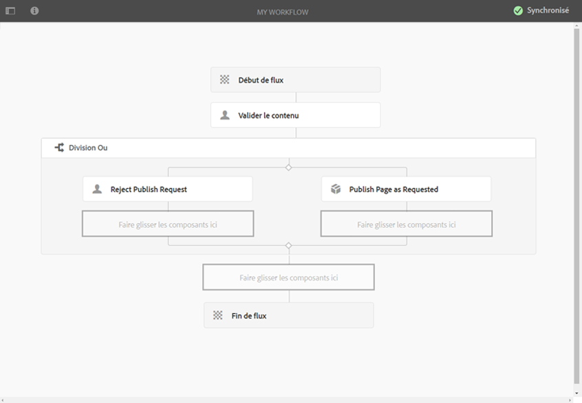

1. Appliquez ce workflow à votre page, de sorte que lorsque l’utilisateur définit l’étape **[!UICONTROL Valider le contenu]** sur **[!UICONTROL Terminé]**, il peut choisir s’il souhaite **[!UICONTROL Publier la page comme demandé]** ou **[!UICONTROL Rejeter la demande de publication]**.

   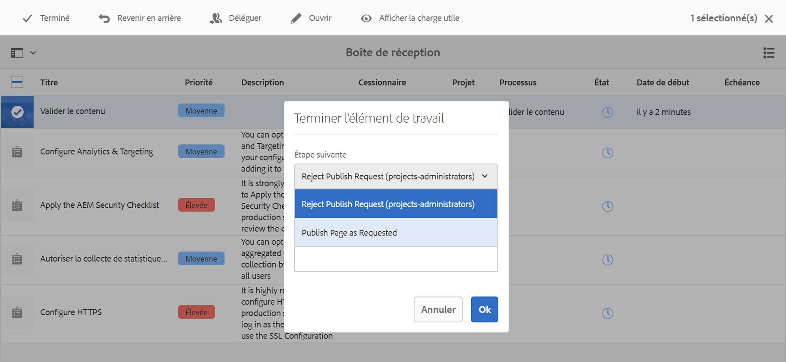

### Exemple : définition d’une règle pour une division OU  {#example-defining-a-rule-for-an-or-split}

Les étapes **[!UICONTROL Division OU]** vous permettent d’introduire de nouveaux chemins de traitement dans votre workflow.

Pour définir une règle OU :

1. Créez deux scripts et enregistrez-les dans le référentiel, par exemple sous :

   `/apps/myapp/workflow/scripts`

   >[!NOTE]
   >
   >Les scripts doivent avoir une fonction [`check()`](#function-check) qui renvoie une valeur booléenne.

1. Modifiez le workflow et ajoutez la **[!UICONTROL Division OU]** au modèle.
1. Modifiez les propriétés de la **[!UICONTROL Branche 1]** de la **[!UICONTROL Division OU]** :

   * Définissez ce paramètre comme l&#39;itinéraire **[!UICONTROL par défaut]** en définissant **[!UICONTROL Valeur]** sur `true`.
   * En tant que **[!UICONTROL Règle]**, définissez le chemin d’accès au script. Par exemple :

      `/apps/myapp/workflow/scripts/myscript1.ecma`
   >[!NOTE]
   >
   >Vous pouvez changer l&#39;ordre de la branche si nécessaire.

1. Modifiez les propriétés de la **[!UICONTROL Branche 2]** de la **[!UICONTROL Division OU]**.

   * En tant que **[!UICONTROL Règle]**, définissez le chemin d’accès à l’autre script. Par exemple :

      `/apps/myapp/workflow/scripts/myscript2.ecma`

1. Définissez les propriétés des différentes étapes de chaque branche. Assurez-vous que **[!UICONTROL Utilisateur/Groupe]** est défini.
1. Cliquez sur **Synchronisation** (barre d’outils de l’éditeur) pour conserver vos modifications dans le modèle d’exécution.

   Pour plus d’informations, voir [Synchronisation de votre workflow](#sync-your-workflow-generate-a-runtime-model).

#### Fonction Check() {#function-check}

>[!NOTE]
>
>Voir [Utilisation d’ECMAScript](/help/sites-developing/workflows-customizing-extending.md#using-ecmascript).

L’exemple de script suivant renvoie `true` si le noeud est un `JCR_PATH` situé sous `/content/we-retail/us/en` :

```
function check() {
    if (workflowData.getPayloadType() == "JCR_PATH") {
      var path = workflowData.getPayload().toString();
      var node = jcrSession.getItem(path);

      if (node.getPath().indexOf("/content/we-retail/us/en") >= 0) {
       return true;
      } else {
       return false;
      } 
     } else {
      return false;
     }
}
```

### Exemple : demande d’activation personnalisée {#example-customized-request-for-activation}

Vous pouvez personnaliser n’importe lequel des workflows personnalisés. Pour bénéficier d’un comportement personnalisé, superposez les détails du workflow approprié.

Par exemple, **[!UICONTROL Demande d’activation]**. Ce workflow est utilisé pour publier des pages dans **[!UICONTROL Sites]**. Il se déclenche automatiquement lorsqu’un auteur de contenu ne dispose pas des droits de réplication appropriés. Voir [Personnalisation de la création de page - Personnalisation du processus de demande d’Activation](/help/sites-developing/customizing-page-authoring-touch.md#customizing-the-request-for-activation-workflow) pour plus d’informations.
