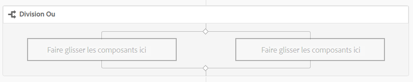

# Référence sur les étapes de workflow{#workflow-step-reference}

>[!CAUTION]
>
>AEM 6.4 a atteint la fin de la prise en charge étendue et cette documentation n’est plus mise à jour. Pour plus d’informations, voir notre [période de support technique](https://helpx.adobe.com/fr/support/programs/eol-matrix.html). Rechercher les versions prises en charge [here](https://experienceleague.adobe.com/docs/?lang=fr).

Les modèles de workflow se composent d’une série d’étapes de différents types. En fonction du type, ces étapes peuvent être configurées et étendues avec des paramètres et des scripts afin de fournir les fonctionnalités et le contrôle dont vous avez besoin.

>[!NOTE]
>
>Cette section décrit les étapes standard du workflow.
>
>Pour les étapes spécifiques aux modules, voir aussi :
>
>* [Référence sur les étapes du processus AEM Forms](/help/forms/using/aem-forms-workflow-step-reference.md)
>* [Traitement des ressources à l’aide des workflows et des gestionnaires de médias](/help/assets/media-handlers.md)
>


## Propriétés des étapes {#step-properties}

Chaque composant d’étape comporte une **[!UICONTROL Propriétés de l’étape]** qui vous permet de définir et de modifier les propriétés requises.

### Propriétés des étapes - Onglet Courant {#step-properties-common-tab}

Une combinaison des propriétés suivantes est disponible pour la plupart des composants d’étape de workflow, sur la page **[!UICONTROL Courant]** de la boîte de dialogue des propriétés :

* **[!UICONTROL Titre]**

   Titre de l’étape.

* **[!UICONTROL Description]**

   Description de l’étape.

* **[!UICONTROL Étape du workflow]**

   Sélecteur de liste déroulante auquel appliquer une [Évaluation](/help/sites-developing/workflows.md#workflow-stages) à l’étape .

* **[!UICONTROL Délai dépassé]**

   Délai au bout duquel l’étape expire.


   Vous avez le choix entre : **[!UICONTROL Désactivé]**, **[!UICONTROL Immédiat]**, **[!UICONTROL 1 h]**, **[!UICONTROL 6 h]**, **[!UICONTROL 12 h]** et **[!UICONTROL 24 h]**.

* **[!UICONTROL Gestionnaire de dépassement de délai]**

   Gestionnaire qui contrôle le workflow lorsque l’étape expire, par exemple :

   `Auto Advancer`

* **[!UICONTROL Avance du gestionnaire]**

   Sélectionnez cette option pour avancer automatiquement le workflow à l’étape suivante après l’exécution. Si cette option n’est pas sélectionnée, le script de mise en œuvre doit gérer l’avancement du workflow.

#### Propriétés des étapes - onglet Utilisateur/Groupe {#step-properties-user-group-tab}

Les propriétés suivantes sont disponibles pour de nombreux composants d’étape de processus, sur la page **[!UICONTROL Utilisateur/Groupe]** de la boîte de dialogue des propriétés :

* **[!UICONTROL Avertir l&#39;utilisateur par courrier électronique]**

   * Vous pouvez notifier le ou les participants en leur envoyant un email lorsque le workflow atteint l’étape.
   * Si cette option est activée, un courrier électronique est envoyé à l’utilisateur défini par la propriété . **[!UICONTROL Utilisateur/Groupe]** ou à chaque membre du groupe si un groupe est défini.

* **[!UICONTROL Utilisateur/Groupe]**

   * Une boîte de sélection déroulante vous permet de localiser et de sélectionner une personne ou un groupe.
   * Si vous attribuez l’étape à une personne spécifique, seule cette personne peut agir sur l’étape.
   * Si vous attribuez l’étape à un groupe entier, alors lorsque le workflow atteint cette étape tous les utilisateurs de ce groupe disposeront de l’action dans leur **[!UICONTROL boîte de réception des workflows]**.
   * Voir [Participation aux workflows](/help/sites-authoring/workflows-participating.md) pour plus d’informations.

## Division ET {#and-split}

La **[!UICONTROL division ET]** crée une division dans le workflow, après quoi les deux branches sont actives. Vous ajoutez des étapes de workflow à chaque branche selon vos besoins. Cette étape vous permet d’ajouter plusieurs chemins de traitement dans le workflow. Par exemple, vous pouvez autoriser certaines étapes de révision à se produire en parallèle, ce qui vous permet de gagner du temps.


### Division ET - Configuration {#and-split-configuration}

* Modifiez la variable **[!UICONTROL Division ET]** properties:

   * **[!UICONTROL Nom de la division]**: attribuer un nom à des fins d’explication.
   * Sélectionnez le nombre de branches requis ; 2, 3, 4 ou 5.

* Ajoutez des étapes de workflow aux branches selon les besoins.

   

## Étape du conteneur {#container-step}

A **[!UICONTROL Conteneur]** Cette étape lance un autre modèle de workflow qui s’exécute en tant que workflow enfant.

Ceci **[!UICONTROL Conteneur]** permet de réutiliser des modèles de workflow pour implémenter des séquences d’étapes courantes. Par exemple, un modèle de processus de traduction peut être utilisé dans plusieurs processus de modification.


### Étape du conteneur - Configuration {#container-step-configuration}

Pour configurer l’étape, modifiez et utilisez les onglets suivants :

* [**[!UICONTROL Commun]**](#step-properties-common-tab)
* **[!UICONTROL Conteneur]**

   * **[!UICONTROL Processus secondaire]**: Sélectionnez le workflow à démarrer.

## Atteindre l&#39;étape {#goto-step}

Le **[!UICONTROL Atteindre l’étape]** permet de spécifier l’étape suivante du modèle de workflow à exécuter, en fonction du résultat d’un ECMAScript :

* `true`: Le **[!UICONTROL Atteindre l’étape]** se termine et le moteur de workflow exécute l’étape spécifiée.

* `false`: Le **[!UICONTROL Atteindre l’étape]** se termine et la logique de routage normale détermine l’étape suivante à exécuter.

L’**[!UICONTROL Étape Goto]** vous permet de mettre en œuvre des structures de routage avancées dans vos modèles de workflow. Par exemple, pour mettre en oeuvre une boucle, l’événement **[!UICONTROL Atteindre l’étape]** peut être défini pour exécuter une étape précédente du workflow, avec le script évaluant une condition de boucle.

### Atteindre l’étape - Configuration {#goto-step-configuration}

Pour configurer l’étape, modifiez et utilisez les onglets suivants :

* [**[!UICONTROL Commun]**](#step-properties-common-tab)
* **[!UICONTROL Processus]**

   * **[!UICONTROL Étape à suivre]**: Sélectionnez l’étape à exécuter.
   * **[!UICONTROL Chemin du script]**: Le chemin d’accès à ECMAScript qui détermine s’il faut exécuter la variable **[!UICONTROL Atteindre l’étape]**.
   * **[!UICONTROL Script]**: ECMAScript qui détermine s’il faut exécuter la variable **[!UICONTROL Atteindre l’étape]**.

>[!CAUTION]
>
>Spécifiez la variable **[!UICONTROL Chemin du script]** ou **[!UICONTROL Script]**. Les deux options ne peuvent pas être utilisées en même temps. Si vous spécifiez des valeurs pour les deux propriétés, l’étape utilise la variable **[!UICONTROL Chemin du script]**.

#### Simulation d’une boucle for {#simulating-a-for-loop}

Pour simuler une boucle for, vous devez conserver un nombre d’itérations de boucle qui se sont produites :

* Le nombre représente généralement un index des éléments qui sont traités dans le workflow.
* Le nombre est évalué comme critère de sortie de la boucle.

Par exemple, pour implémenter un workflow qui exécute une action sur plusieurs noeuds JCR, vous pouvez utiliser un compteur de boucle comme index pour les noeuds. Pour rendre le compte persistant, stockez une valeur `integer` dans le mappage de données de l’instance de workflow. Utilisez le script de l’**[!UICONTROL Étape Goto]** pour incrémenter le nombre, ainsi que pour comparer le nombre au critère de sortie.

```
function check(){
   var count=0;
   var keyname="loopcount"
   try{
      if (workflowData.getMetaDataMap().containsKey(keyname)){ 
        log.info("goto script: found loopcount key");
        count= parseInt(workflowData.getMetaDataMap().get(keyname))+1;
      } 
 
     workflowData.getMetaDataMap().put(keyname,count);
 
     }catch(err) {
         log.info(err.message);
         return false;
    }
   if (parseInt(count) <7){
       return true;
   } else {
      return false;
   }
}
```

## Division OU {#or-split}

La **[!UICONTROL division OU]** crée une division dans le workflow, après quoi seule une branche est active. Cette étape permet d’ajouter des chemins de traitement conditionnels dans le processus. Vous ajoutez des étapes de processus à chaque branche selon vos besoins.

>[!NOTE]
>
>Pour plus d’informations sur la création d’une Division OU, consultez : [https://helpx.adobe.com/experience-manager/using/aem64_workflow_servlet.html](https://helpx.adobe.com/experience-manager/using/aem64_workflow_servlet.html).



### Division OU - Configuration {#or-split-configuration}

* Modifiez la variable **[!UICONTROL Division OU]** properties:

   * **[!UICONTROL Commun]**

      * Sélectionnez le nombre de branches requis ; 2, 3, 4 ou 5.
   * **[!UICONTROL Branche : *x*>]**

      * **[!UICONTROL Chemin du script]**: Chemin d’accès à un fichier contenant le script.
      * **[!UICONTROL Script]**: Ajoutez le script dans la zone.
      * **[!UICONTROL Itinéraire par défaut]**: La branche par défaut est suivie lorsque plusieurs branches donnent la valeur true. Vous ne pouvez spécifier qu’une seule branche par défaut.

   >[!NOTE]
   >
   >Il existe un onglet distinct pour chaque branche :
   >
   >* Le script de chaque branche est évalué un par un.
   >* Les branches sont évaluées de gauche à droite.
   >* Le premier script qui renvoie la valeur true est exécuté.
   >* Si aucune branche ne renvoie la valeur true, le workflow ne progresse pas.


   >[!CAUTION]
   >
   >Spécifiez la variable **[!UICONTROL Chemin du script]** ou **[!UICONTROL Script]**. Les deux options ne peuvent pas être utilisées en même temps. Si vous spécifiez des valeurs pour les deux propriétés, l’étape utilise la variable **[!UICONTROL Chemin du script]**.

   >[!NOTE]
   >
   >Voir [Définition d’une règle pour une division OU](/help/sites-developing/workflows-models.md#example-defining-a-rule-for-an-or-split).

* Ajoutez des étapes de workflow aux branches selon les besoins.

## Étapes et sélecteurs de participant {#participant-steps-and-choosers}

### Étape du participant {#participant-step}

A **[!UICONTROL Étape du participant]** vous permet d’attribuer la propriété d’une action spécifique. Le workflow ne se poursuit que lorsque l’utilisateur a manuellement reconnu l’étape. Cette fonction est utile lorsque vous souhaitez que quelqu’un d’autre agisse sur le workflow, par exemple, lors d’une étape de révision.

Bien qu’elle ne soit pas directement liée, l’autorisation de l’utilisateur doit être prise en compte lors de l’attribution d’une action. l’utilisateur doit avoir accès à la page qui est la charge utile du workflow.

#### Étape du participant - Configuration {#participant-step-configuration}

Pour configurer l’étape, modifiez et utilisez les onglets suivants :

* [**[!UICONTROL Commun]**](#step-properties-common-tab)
* [**[!UICONTROL Utilisateur/Groupe]**](#step-properties-user-group-tab)

>[!NOTE]
>
>L’initiateur du workflow est toujours averti lorsque :
>
>* Le workflow est terminé (terminé).
>* Le workflow est abandonné (arrêté).
>


>[!NOTE]
>
>Certaines propriétés doivent être configurées pour activer les notifications électroniques. Vous pouvez également personnaliser le modèle d’email ou ajouter un modèle d’email pour une nouvelle langue. Pour configurer des notifications par e-mail dans AEM, consultez la section [Configuration des notifications par e-mail](/help/sites-administering/notification.md).

### Étape de participant de la boîte de dialogue {#dialog-participant-step}

Utilisez une **[!UICONTROL Étape de participant de la boîte de dialogue]** pour collecter des informations auprès de l’utilisateur auquel l’élément de travail est affecté. Cette étape est utile pour collecter de petites quantités de données utilisées ultérieurement dans le workflow.

Une fois l’étape terminée, la variable **[!UICONTROL Terminer l’élément de travail]** La boîte de dialogue contient les champs que vous définissez dans votre boîte de dialogue. Les données collectées dans les champs sont stockées dans les nœuds de la charge utile du workflow. Les étapes suivantes du workflow peuvent alors lire la valeur du référentiel.

Pour configurer l’étape, vous spécifiez le groupe ou l’utilisateur auquel affecter l’élément de travail, ainsi que le chemin d’accès à la boîte de dialogue.

#### Étape de participant de la boîte de dialogue - Configuration {#dialog-participant-step-configuration}

Pour configurer l’étape, modifiez et utilisez les onglets suivants :

* [**[!UICONTROL Commun]**](#step-properties-common-tab)
* [**[!UICONTROL Utilisateur/Groupe]**](#step-properties-user-group-tab)
* **[!UICONTROL Boîte de dialogue]**

   * **[!UICONTROL Chemin de la boîte de dialogue**]: Chemin d’accès au noeud de boîte de dialogue de la propriété [boîte de dialogue que vous créez](#dialog-participant-step-creating-a-dialog).

#### Étape de participant de boîte de dialogue - Création d’une boîte de dialogue{#dialog-participant-step-creating-a-dialog}

Pour créer une boîte de dialogue :

* Détermination de l’emplacement des données résultantes [stocké dans la payload](#dialog-participant-step-storing-data-in-the-payload).
* [Définir la boîte de dialogue ; notamment les champs utilisés pour collecter (et enregistrer) les données](#dialog-participant-step-dialog-definition).

#### Étape de participant de la boîte de dialogue - Stockage des données dans la charge utile {#dialog-participant-step-storing-data-in-the-payload}

Vous pouvez stocker des données de widget dans la charge utile du workflow ou dans les métadonnées de l’élément de travail. Le format de la propriété `name` du nœud de widget détermine l’endroit où les données sont stockées.

* **[!UICONTROL Stockage des données avec le payload]**

   * Pour stocker des données de widget en tant que propriété du payload de workflow, utilisez le format suivant pour la propriété de nom du nœud de widget :

      `./jcr:content/nodename`

   * Les données sont stockées dans la propriété `nodename` du nœud de payload. Si le noeud ne contient pas cette propriété, la propriété est créée.
   * Lorsqu’elles sont stockées avec la payload, les utilisations suivantes de la boîte de dialogue avec la même payload remplacent la valeur de la propriété .

* **[!UICONTROL Stockage des données avec l’élément de travail]**

   * Pour stocker des données de widget en tant que propriété de métadonnées d’élément de travail, utilisez le format suivant pour la valeur de la propriété de nom :

      `nodename`

   * Les données sont stockées dans la propriété `nodename` des `metadata` de l’élément de travail. Les données sont conservées si la boîte de dialogue est ensuite utilisée avec la même charge utile.

#### Étape de participant de boîte de dialogue - Définition de boîte de dialogue {#dialog-participant-step-dialog-definition}

1. **[!UICONTROL Structure de boîte de dialogue]**

   Les boîtes de dialogue des étapes de participant de boîte de dialogue sont similaires aux boîtes de dialogue que vous créez pour la création de composants. Ils sont stockés sous :

   `/apps/myapp/workflow/dialogs`

   Les boîtes de dialogue de l’IU tactile standard présentent la structure de noeud suivante :

   ```xml
   newComponent (cq:Component)
     |- cq:dialog (nt:unstructured)
       |- content 
         |- layout 
           |- items 
             |- column 
               |- items 
                 |- component0
                 |- component1
                 |- ...
   ```

   >[!NOTE]
   >
   >Pour plus d’informations, voir [Création et configuration d’une boîte de dialogue](/help/sites-developing/developing-components.md#creating-and-configuring-a-dialog).

1. **[!UICONTROL Propriété Chemin de la boîte de dialogue]**

   L’**[!UICONTROL étape de participant de la boîte de dialogue]** possède la propriété **[!UICONTROL Chemin de la boîte de dialogue]** (ainsi que les propriétés d’une [étape de participant](#participant-step)). La valeur de la propriété **[!UICONTROL Chemin de la boîte de dialogue]** est le chemin du nœud `dialog` de la boîte de dialogue.

   Par exemple, la boîte de dialogue se trouve dans un composant nommé `EmailWatch` qui est stocké dans le nœud :

   `/apps/myapp/workflows/dialogs`

   Pour l’IU compatible avec les écrans tactiles, la valeur suivante est utilisée pour la propriété **[!UICONTROL Chemin de la boîte de dialogue]** :

   `/apps/myapp/workflow/dialogs/EmailWatch/cq:dialog`

   

1. **Exemple de définition de boîte de dialogue**

   Le fragment de code XML ci-après représente une boîte de dialogue qui stocke une valeur de `String`chaîne dans le nœud `watchEmail` du contenu du payload. Le noeud title représente la propriété [TextField](https://helpx.adobe.com/experience-manager/6-4/sites/developing/using/reference-materials/granite-ui/api/jcr_root/libs/granite/ui/components/coral/foundation/form/textfield/index.html) component :

   ```xml
   jcr:primaryType="nt:unstructured" 
       jcr:title="Watcher Email Address Dialog" 
       sling:resourceType="cq/gui/components/authoring/dialog">
       <content jcr:primaryType="nt:unstructured"
           sling:resourceType="granite/ui/components/foundation/container">
           <layout jcr:primaryType="nt:unstructured" 
               margin="false" 
               sling:resourceType="granite/ui/components/foundation/layouts/fixedcolumns"
           />
           <items jcr:primaryType="nt:unstructured">
               <column jcr:primaryType="nt:unstructured"
                   sling:resourceType="granite/ui/components/foundation/container">
                   <items jcr:primaryType="nt:unstructured">
                       <title jcr:primaryType="nt:unstructured" 
                           fieldLabel="Notification Email Address" 
                           name="./jcr:content/watchEmails"
                           sling:resourceType="granite/ui/components/foundation/form/textfield"
                       />
                   </items>
               </column>
           </items>
       </content>
   </cq:dialog>
   ```

   Dans le cas de l’interface utilisateur tactile, cet exemple génère une boîte de dialogue telle que :

   

### Étape choix dynamique de participant {#dynamic-participant-step}

Le **[!UICONTROL Étape choix dynamique de participant]** est similaire à **[!UICONTROL Étape du participant]** à la différence que le participant est automatiquement sélectionné au moment de l’exécution.

Pour configurer l’étape, sélectionnez une **[!UICONTROL Programme de sélection des participants]** qui identifie le participant auquel affecter l’élément de travail, ainsi qu’une boîte de dialogue.

#### Étape choix dynamique de participant - Configuration {#dynamic-participant-step-configuration}

Pour configurer l’étape, modifiez et utilisez les onglets suivants :

* [**[!UICONTROL Commun]**](#step-properties-common-tab)
* **[!UICONTROL Programme de sélection des participants]**

   * **[!UICONTROL Programme de sélection des participants]**: Nom de la variable [programme de sélection des participants que vous créez](#dynamic-participant-step-developing-the-participant-chooser).
   * **[!UICONTROL Arguments]**: Tous les arguments requis.
   * **[!UICONTROL Email]**: Indique si une notification électronique doit être envoyée à l’utilisateur.

* **[!UICONTROL Boîte de dialogue]**

   * **[!UICONTROL Chemin de la boîte de dialogue]**: Chemin d’accès au noeud de boîte de dialogue de la propriété [de la boîte de dialogue que vous créez (comme avec **Étape de participant de la boîte de dialogue**)](#dialog-participant-step-creating-a-dialog).

#### Étape choix dynamique de participant - Développement du programme de sélection des participants {#dynamic-participant-step-developing-the-participant-chooser}

Vous créez le programme de sélection des participants. Par conséquent, vous pouvez utiliser n’importe quel critère ou logique de sélection. Par exemple, votre programme de sélection des participants peut sélectionner l’utilisateur (au sein d’un groupe) qui a le moins d’éléments de travail. Vous pouvez créer un nombre illimité de programmes de sélection des participants à utiliser avec différentes instances du **Étape choix dynamique de participant** dans vos modèles de workflow.

Créez un service OSGi ou un ECMAScript qui sélectionne un utilisateur auquel affecter l’élément de travail.

* **[!UICONTROL ECMAscript]**

   Les scripts doivent intégrer une fonction nommée getParticipant qui renvoie un ID utilisateur comme valeur de `String`. Stockez vos scripts personnalisés, par exemple, dans le dossier `/apps/myapp/workflow/scripts` ou dans un sous-dossier.

   Un exemple de script est inclus dans une instance AEM standard :

   `/libs/workflow/scripts/initiator-participant-chooser.ecma`

   >[!CAUTION]
   >
   >Vous ne devez *rien* modifier dans le chemin `/libs`.
   >
   >
   >Cela est dû au fait que le contenu de `/libs` sera écrasé la prochaine fois que vous mettrez à niveau votre instance (et éventuellement lors de l’application d’un correctif logiciel ou d’un pack de fonctionnalités).

   Ce script choisit l’initiateur de workflow en tant que participant :

   ```
   function getParticipant() {
       return workItem.getWorkflow().getInitiator();
   }
   ```

   >[!NOTE]
   >
   >Le composant **[!UICONTROL Programme de sélection des participants de l’initiateur de workflow]** étend l’**[!UICONTROL étape de participant dynamique]** et utilise ce script comme mise en œuvre de l’étape.

* **[!UICONTROL Service OSGi]**

   Les services doivent mettre en œuvre l’interface [com.day.cq.workflow.exec.ParticipantStepChooser](https://helpx.adobe.com/experience-manager/6-4/sites/developing/using/reference-materials/javadoc/com/day/cq/workflow/exec/ParticipantStepChooser.html). L’interface définit les membres suivants :

   * Le champ `SERVICE_PROPERTY_LABEL` : utilisez-le pour spécifier le nom du programme de sélection des participants. Le nom s’affiche dans la liste des programmes de sélection des participants disponibles dans les propriétés d’**[!UICONTROL Étape de participant dynamique]**.
   * La méthode `getParticipant` renvoie l’ID du principal de sécurité résolu dynamiquement en tant que valeur de `String`.

   >[!CAUTION]
   >
   >La méthode `getParticipant` renvoie l’ID de principal de sécurité résolu dynamiquement. Il peut s’agir d’un identifiant de groupe ou d’un identifiant utilisateur.
   >
   >
   >Cependant, un ID de groupe ne peut être utilisé que pour un **[!UICONTROL Étape du participant]**, lorsqu’une liste de participants est renvoyée. Pour une **[!UICONTROL étape de participant dynamique]**, une liste vide est renvoyée et elle ne peut pas être utilisée pour la délégation.

   Pour rendre votre mise en œuvre disponible pour les composants d’**[!UICONTROL Étape de participant dynamique]**, ajoutez votre classe Java à un lot OSGi qui exporte le service et déployez le lot vers le serveur AEM.

   >[!NOTE]
   >
   >Le **[!UICONTROL programme de sélection aléatoire des participants]** est un exemple de service qui sélectionne un utilisateur aléatoire (`com.day.cq.workflow.impl.process.RandomParticipantChooser`). Le **[!UICONTROL Programme de sélection aléatoire des participants]** exemple de composant d’étape étend **[!UICONTROL Étape choix dynamique de participant]** et utilise ce service comme implémentation de l’étape.

#### Étape choix dynamique de participant - Exemple de service de sélection de participant {#dynamic-participant-step-example-participant-chooser-service}

La classe Java suivante met en œuvre l’interface `ParticipantStepChooser`. La classe renvoie le nom du participant qui a initié le workflow. Le code utilise la même logique que l’exemple de script (`initator-participant-chooser.ecma`).

L’annotation `@Property` définit la valeur du champ `SERVICE_PROPERTY_LABEL` sur `Workflow Initiator Participant Chooser`.

```java
package com.adobe.example;

import org.apache.felix.scr.annotations.Component;
import org.apache.felix.scr.annotations.Properties;
import org.apache.felix.scr.annotations.Property;
import org.apache.felix.scr.annotations.Service;
import org.osgi.framework.Constants;
import org.slf4j.Logger;
import org.slf4j.LoggerFactory;

import com.adobe.granite.workflow.WorkflowException;
import com.adobe.granite.workflow.WorkflowSession;
import com.adobe.granite.workflow.exec.ParticipantStepChooser;
import com.adobe.granite.workflow.exec.WorkItem;
import com.adobe.granite.workflow.metadata.MetaDataMap;

@Component
@Service
@Properties({
        @Property(name = Constants.SERVICE_DESCRIPTION, value = "An example implementation of a dynamic participant chooser."),
        @Property(name = ParticipantStepChooser.SERVICE_PROPERTY_LABEL, value = "Workflow Initiator Participant Chooser (service)") })
public class InitiatorParticipantChooser implements ParticipantStepChooser {

 private Logger logger = LoggerFactory.getLogger(this.getClass());

 public String getParticipant(WorkItem arg0, WorkflowSession arg1,
   MetaDataMap arg2) throws WorkflowException {

  String initiator = arg0.getWorkflow().getInitiator();
  logger.info("Assigning Dynamic Participant Step work item to {}",initiator);

  return initiator;
 }
}
```

Dans la boîte de dialogue des propriétés d’**[!UICONTROL Étape de participant dynamique]**, la liste **[!UICONTROL Programme de sélection des participants]** inclut l’élément `Workflow Initiator Participant Chooser (script)`, qui représente ce service.

``Lorsque le modèle de workflow est démarré, le journal indique l’ID de l’utilisateur qui a initié le workflow et qui se voit attribuer l’élément de travail. Dans cet exemple, l’utilisateur `admin` a lancé le workflow.

`13.09.2015 15:48:53.037 *INFO* [10.176.129.223 [1347565733037] POST /etc/workflow/instances HTTP/1.1] com.adobe.example.InitiatorParticipantChooser Assigning Dynamic Participant Step work item to admin`

### Étape de participant du formulaire {#form-participant-step}

L’**[!UICONTROL étape de participant du formulaire]** présente un formulaire lorsque l’élément de travail est ouvert. Lorsque l’utilisateur remplit et envoie le formulaire, les données de champ sont stockées dans les noeuds de la payload du workflow.

Pour configurer l’étape, vous spécifiez le groupe ou l’utilisateur auquel affecter l’élément de travail et le chemin d’accès au formulaire.

>[!CAUTION]
>
>Cette section traite de la [section Formulaires des composants de base pour la création de pages](/help/sites-authoring/default-components-foundation.md#form).

#### Étape de participant du formulaire - Configuration {#form-participant-step-configuration}

Pour configurer l’étape, modifiez et utilisez les onglets suivants :

* [**[!UICONTROL Commun]**](#step-properties-common-tab)
* [**[!UICONTROL Utilisateur/Groupe]**](#step-properties-user-group-tab)
* **[!UICONTROL Formulaire]**

   * **[!UICONTROL Chemin du formulaire]** : chemin du [formulaire que vous créez](#form-participant-step-creating-the-form).

#### Étape de participant du formulaire - Création du formulaire {#form-participant-step-creating-the-form}

Créez un formulaire à utiliser avec une **[!UICONTROL étape de participant du formulaire]** de façon normale. Toutefois, les formulaires d’une étape de participant de formulaire doivent présenter les configurations suivantes :

* Le composant **[!UICONTROL Début de formulaire]** doit avoir la propriété **[!UICONTROL Type d’action]** définie sur `Edit Workflow Controlled Resource(s)`.

* Le composant **[!UICONTROL Début de formulaire]** doit présenter une valeur pour la propriété `Form Identifier`.

* Les composants de formulaire doivent présenter la propriété **Nom de l’élément** définie sur le chemin du nœud dans lequel les données de champs sont stockées. Le chemin doit pouvoir localiser un nœud dans le contenu de la charge utile du workflow. La valeur utilise le format suivant :

   `./jcr:content/path_to_node`

* Le formulaire doit inclure un composant **[!UICONTROL Bouton(s) d’envoi du workflow]**. Vous ne configurez aucune propriété du composant.

Les exigences de votre workflow déterminent où stocker les données de champ. Par exemple, les données de champ peuvent être utilisées pour configurer les propriétés du contenu de la page. La valeur suivante d’une propriété **[!UICONTROL Nom de l’élément]** stocke les données de champs comme valeur de la propriété `redirectTarget` du nœud `jcr:content` :

`./jcr:content/redirectTarget`

Dans l’exemple suivant, les données de champs sont utilisées en tant que contenu d’un composant **[!UICONTROL Texte]** sur la page du payload :

`./jcr:content/par/text_3/text`

&quot;Le premier exemple peut être utilisé pour n’importe quelle page qui `cq:Page` effectue le rendu du composant. Le second exemple peut uniquement être utilisé lorsque la page du payload inclut un composant **Texte** possédant l’ID `text_3`.

Le formulaire peut se trouver n’importe où dans le référentiel, mais les utilisateurs du workflow doivent être autorisés à lire le formulaire.

### Programme de sélection aléatoire des participants {#random-participant-chooser}

L’étape **[!UICONTROL Programme de sélection aléatoire des participants]** est un programme de sélection des participants qui attribue l’élément de travail généré à un utilisateur qui est choisi de manière aléatoire à partir d’une liste.


#### Programme de sélection aléatoire des participants - Configuration {#random-participant-chooser-configuration}

Pour configurer l’étape, modifiez et utilisez les onglets suivants :

* [**[!UICONTROL Commun]**](#step-properties-common-tab)
* **[!UICONTROL Arguments]**

   * **[!UICONTROL Participants]**: Indique la liste des utilisateurs pouvant être sélectionnés. Pour ajouter un utilisateur à la liste, cliquez sur **[!UICONTROL Ajouter un élément]** et saisissez le chemin d’accès racine du noeud utilisateur ou l’identifiant utilisateur. L’ordre des utilisateurs n’affecte pas la probabilité d’être affecté à une tâche.

### Programme de sélection des participants de l&#39;initiateur de processus {#workflow-initiator-participant-chooser}

Le **[!UICONTROL Programme de sélection des participants de l’initiateur de workflow]** step est un programme de sélection des participants qui affecte l’élément de travail généré à l’utilisateur qui a démarré le workflow. Il n’existe aucune propriété à configurer autre que la propriété **[!UICONTROL Courant]** propriétés.

#### Programme de sélection des participants de l’initiateur de workflow - Configuration {#workflow-initiator-participant-chooser-configuration}

Pour configurer l’étape, modifiez-la à l’aide des onglets suivants :

* [**[!UICONTROL Commun]**](#step-properties-common-tab)

## Étape du processus {#process-step}

A **[!UICONTROL Étape du processus]** exécute un ECMAScript ou appelle un service OSGi pour effectuer un traitement automatique.


### Étape du processus - Configuration {#process-step-configuration}

Pour configurer l’étape, modifiez et utilisez les onglets suivants :

* [**[!UICONTROL Commun]**](#step-properties-common-tab)
* **[!UICONTROL Processus]**

   * **[!UICONTROL Processus]**: Implémentation du processus à exécuter. Utilisez le menu déroulant pour sélectionner ECMAScript ou Service OSGi. Pour obtenir des informations sur :

      * Les ECMAScripts standard et les services OSGi, voir [Processus intégrés pour les étapes du processus](/help/sites-developing/workflows-process-ref.md).
      * Création de ECMAScripts pour un **[!UICONTROL Processus]** étape, voir [Mise en oeuvre d’une étape de processus avec un ECMAScript](/help/sites-developing/workflows-customizing-extending.md#using-ecmascript).
      * Création de services OSGi pour un **[!UICONTROL Processus]** étape, voir [Mise en oeuvre d’une étape de processus avec une classe Java](/help/sites-developing/workflows-customizing-extending.md#implementing-a-process-step-with-a-java-class).
   * **[!UICONTROL Avance du gestionnaire]** : sélectionnez cette option pour avancer automatiquement le workflow à l’étape suivante après l’exécution. Si cette option n’est pas sélectionnée, le script de mise en œuvre doit gérer l’avancement du workflow.
   * **[!UICONTROL Arguments]**: Arguments à transmettre au processus.
